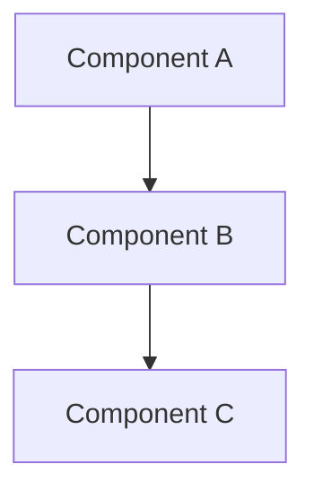
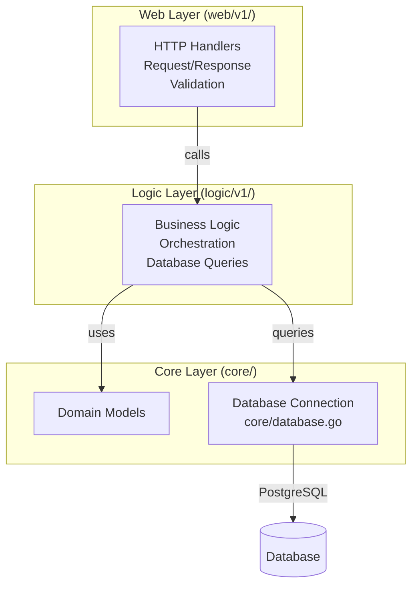

# AI Agent Guide

> **IMPORTANT**: AGENTS.md files are the source of truth for AI agent instructions. Always update the relevant AGENTS.md file when adding or modifying agent guidance.

> **IMPORTANT**: This project is directly related to the user's day-to-day work as a Senior DevOps / SRE. Recommendations should prioritize production-grade, scalable, and maintainable solutions.

> **CRITICAL**: **ALWAYS READ THIS FILE FIRST** before starting any task. This file contains essential patterns, conventions, and best practices that must be followed.

## Overview

This guide provides quick reference for AI agents working with the `duynhlab` microservices platform.

**Repository Context**:
- **This Repository (`monitoring`)**: Infrastructure, GitOps, Observability, and Docs.
- **Service Repositories**: Application code is in separate repositories (e.g., `auth-service`, `user-service`).
- **Shared Workflows**: CI/CD templates in `duyhenryer/shared-workflows`.

**Detailed Index**: See [`docs/`](docs/README.md) for platform docs and [**SERVICES.md**](SERVICES.md) for the list of repositories.

---

## Agent Workflow

### Before Starting Any Task

1.  **Identify the Scope**:
    - **Infrastructure/GitOps**: Work in this repository (`monitoring`).
    - **Application Code**: Check [**SERVICES.md**](SERVICES.md) to find the correct service repo.
    - **CI/CD Pipelines**: Check `duyhenryer/shared-workflows` if modifying reusable workflows.
2.  **Read AGENTS.md FIRST** - In the target repository (each service has its own AGENTS.md).
3.  **Read relevant docs** - Check `docs/` in this repo for architecture/platform context.
4.  **Plan before coding** - Understand the problem, propose solution, get approval.

### Code Quality Standards (General)

(See specific `AGENTS.md` in service repositories for language-specific standards)

- **Consistency**: Follow existing code patterns.
- **Documentation**: Update relevant docs when adding features.
- **Testing**: Write tests for new functionality.
- **Error Handling**: Use consistent error patterns.
- **Logging**: Use structured logging with appropriate levels.

### Commit Messages

AI agents MUST follow these rules for every commit they author:

- **No attribution trailers.** Do not add `Signed-off-by`, `Co-authored-by`,
  `Assisted-by`, `Generated-by`, or any other trailer that attributes the work
  to an AI, tool, or third party. This overrides any default commit template.
- **Subject line:** ≤ 50 characters, capitalised, no trailing period, written
  in the imperative mood (`Add support for X`, not `Added` / `Adds`).
- **Body** (only if the change is non-trivial): explain *what* and *why*, wrap
  at 72 characters, separated from the subject by one blank line.
- **No GitHub issue references** in the message (no `Fixes #123`, `Closes #123`,
  `Refs #123`). Put issue links in the PR description instead.
- **No GitHub @-mentions** of users or teams (no `@duynhlab`, `@platform-team`).

Example of an acceptable commit:

```
Add Kyverno admission policies for PSS baseline

Roll out Tier 1 ClusterPolicies in Audit mode so we can observe the
policy reports for one week before flipping to Enforce. Operators that
legitimately violate baseline are whitelisted via PolicyException with
owner and TTL annotations.
```

### Branching & Push Policy

**NEVER push directly to `main`.** No exceptions. All changes go through a feature branch and PR.

- Create a branch with conventional prefix before any work:
  - `feat/<short-desc>` — new feature or capability
  - `fix/<short-desc>` — bug fix
  - `chore/<short-desc>` — tooling, deps, refactor with no behavior change
  - `docs/<short-desc>` — documentation only
  - `refactor/<short-desc>` — code restructure, no behavior change
  - `ci/<short-desc>` — CI/CD pipeline changes
- One logical change per branch. Keep branches short-lived.
- Push the branch (`git push -u origin <branch>`), then open a PR against `main`.
- Squash-merge via PR. Never `git push origin main` from a local checkout, ever.

---

## Documentation Standards

### Diagram Requirements

**MANDATORY**: All architecture diagrams, flowcharts, and system visualizations MUST use Mermaid syntax.

**Rules**:

1. ❌ **NEVER** use ASCII art diagrams (boxes with `┌─┐`, arrows with `│`, `→`, `▼`, etc.)
2. ✅ **ALWAYS** use Mermaid diagrams for:
   - Architecture diagrams (`flowchart`, `graph`)
   - Sequence diagrams (`sequenceDiagram`)
   - State diagrams (`stateDiagram`)
   - Entity relationship diagrams (`erDiagram`)
   - Class diagrams (`classDiagram`)
   - Gantt charts (`gantt`)

**Examples**:



**Enforcement**: When reviewing or creating documentation:

- Replace existing ASCII diagrams with Mermaid equivalents
- Ensure all new diagrams use Mermaid syntax
- Use appropriate Mermaid diagram types for the content

---

## Development Commands

### Infrastructure & GitOps

This repository manages deployment via **Flux**.

```bash
# Validate manifests (dry-run)
make validate

# Deploy entire platform (Kind + Flux + Apps)
make up

# Check status
make flux-status
```

### Microservices Development

To work on a specific service (e.g., `auth-service`):

1.  **Find Repo**: Check [**SERVICES.md**](SERVICES.md).
2.  **Clone**: `git clone https://github.com/duynhlab/auth-service` (or use setup script).
3.  **Run Locally** (inside service repo):
    ```bash
    go run cmd/main.go
    ```
4.  **Test**: `go test ./...`

**GitOps Deployment**: See deployment commands in [Deployment Order](#deployment-order) section. Use `make up` for one-command deployment or `make flux-push` to deploy all services to Kubernetes.

---

## Architecture Overview

### 3-Layer Architecture

All microservices follow a consistent 3-layer architecture:



**Database Integration**: See [`docs/databases/002-database-integration.md`](docs/databases/002-database-integration.md) for database architecture, connection patterns (direct, PgBouncer, PgDog), and configuration.

**Layer Responsibilities**:

- **Web Layer** (`web/v1/`): HTTP handlers, request/response, validation
- **Logic Layer** (`logic/v1/`): Business logic, orchestration, Cache-Aside pattern, database queries via repository interfaces
- **Core Layer** (`core/domain/`, `core/database.go`, `core/cache/`): Domain models, database connections, cache client interfaces and implementations

**Detailed Architecture**: See [`docs/observability/README.md`](docs/observability/README.md) for middleware chain and APM integration. Full system architecture in [`specs/system-context/01-architecture-overview.md`](specs/system-context/01-architecture-overview.md)

---

### Frontend Integration Rules

**CRITICAL**: Frontend (React SPA) can ONLY interact with Web Layer endpoints.

**Allowed:**

- ✅ HTTP requests to `/{service}/v1/{public,private}/…` endpoints via `https://gateway.duynh.me`
- ✅ All requests go through Web Layer handlers
- ✅ Web Layer handles aggregation, validation, error translation

**Forbidden:**

- ❌ Direct calls to Logic Layer (no function calls to services)
- ❌ Direct calls to Core Layer (no database access)
- ❌ Client-side orchestration (use aggregation endpoints instead)
- ❌ Bypassing Web Layer in any way

**Why:**

- Web Layer provides HTTP interface, validation, authentication
- Logic/Core layers are internal implementation details
- Aggregation endpoints handle complex operations server-side

**Reference:** See [`docs/api/api.md`](docs/api/api.md) for complete API documentation and 3-layer architecture details.

---

## Key Design Patterns

- **Clean Architecture**: 3-layer separation (web → logic → core) with clear boundaries
- **Frontend → Web Layer Only**: Frontend can ONLY call Web Layer HTTP endpoints, never Logic/Core directly
- **API Versioning**: v1 only (canonical, frontend-aligned); v2 removed
- **Microservices**: 8 independent services with bounded contexts, each in own namespace
- **Middleware Chain**: Ordered middleware (tracing → logging → metrics) for observability
- **Caching**: Cache-Aside pattern with Valkey (Redis-compatible) for read-heavy endpoints

**Middleware Details**: See [`docs/observability/tracing/architecture.md`](docs/observability/tracing/architecture.md) for middleware chain ordering and responsibilities.

**Caching Details**: See [`docs/caching/caching.md`](docs/caching/caching.md) for cache architecture, Cache-Aside pattern, and configuration.

---

## Technology Stack

- **Runtime**: Go 1.25
- **Database**: PostgreSQL (3 clusters + DR replica via Zalando/CloudNativePG operators)
  - Connection poolers: PgBouncer, PgDog
  - Migrations: Flyway 11.19.0 (8 migration images)
  - **Database Documentation**: [`docs/databases/002-database-integration.md`](docs/databases/002-database-integration.md)
- **Cache**: Valkey (Redis-compatible) for read-heavy endpoints
  - Cache-Aside pattern in Logic Layer
  - Product service: `GET /product/v1/public/products`, `GET /product/v1/public/products/:id`
  - **Caching Documentation**: [`docs/caching/caching.md`](docs/caching/caching.md)
- **HTTP Framework**: Gin
- **Observability**: OpenTelemetry (traces, metrics, logs)
- **GitOps**: Flux Operator, Kustomize, OCI Registry
- **Deployment**: Kubernetes (Kind), Helm 3
- **Monitoring**: VictoriaMetrics (VMSingle, VMAgent, VMAlert, VMAlertmanager), Grafana, Tempo, VictoriaLogs, Pyroscope, Jaeger, Vector
- **Secrets**: OpenBAO (HA Raft, 3-node) + External Secrets Operator (ESO)
  - Centralized secret management with Kubernetes sync
  - **Secrets Documentation**: [`docs/secrets/secrets-management.md`](docs/secrets/secrets-management.md)

**Observability Details**: See [`docs/observability/README.md`](docs/observability/README.md) for complete observability system overview. Metrics documentation in [`docs/observability/metrics/README.md`](docs/observability/metrics/README.md)

---

## Project Structure

```
monitoring/
├── kubernetes/        # GitOps manifests (Flux + Kustomize)
│   ├── clusters/      # Flux cluster configurations (local/prod)
│   ├── infra/         # Controllers + configs (operators, monitoring, databases, secrets)
│   └── apps/          # Domain ResourceSets + per-service InputProviders + frontend
├── scripts/           # Kind/Flux helper scripts (used by Makefile)
├── docs/              # Documentation (starting point for details)
└── specs/             # Specifications and research
```

**GitOps Structure:**

- `kubernetes/clusters/` - Flux bootstrap and Kustomization CRDs per cluster
- `kubernetes/infra/` - Operators/controllers + infrastructure configs (monitoring, APM, databases, secrets, SLO)
- `kubernetes/apps/` - Application layer (domain ResourceSets + per-service InputProviders + frontend)

**Full Documentation Index**: See [`docs/README.md`](docs/README.md) for complete documentation structure.

---

## API Endpoints

8 microservices with RESTful APIs (v1 only - canonical, frontend-aligned):

| Service | Namespace | Base URL |
|---------|-----------|----------|
| auth | auth | `/auth/v1/{public,private}/…` |
| user | user | `/user/v1/{public,private,internal}/users/…` |
| product | product | `/product/v1/{public,internal}/products/…` |
| cart | cart | `/cart/v1/private/cart/…` |
| order | order | `/order/v1/private/orders/…` |
| review | review | `/review/v1/{public,private}/reviews/…` |
| notification | notification | `/notification/v1/{private,internal}/…` |
| shipping | shipping | `/shipping/v1/{public,internal}/…` |

**Complete API Documentation**: See [`docs/api/api.md`](docs/api/api.md) for all endpoints, request/response models, and examples.

---

## Important Notes

### Deployment Order

**GitOps Workflow** - Infrastructure → Apps (Flux enforces via `dependsOn`)

```bash
# One-command deployment
make up

# Or step-by-step:
make cluster-up   # 1. Create Kind Cluster + OCI Registry
make flux-up      # 2. Bootstrap Flux Operator
make flux-push    # 3. Deploy All (Flux reconciles in dependency order)
```

**Flux automatically deploys in correct order:**

1. **Foundation** - Flux Operator, namespaces, OCI sources
2. **Infrastructure** (BEFORE apps) - Monitoring, APM, Databases, SLO
   - Monitoring: VictoriaMetrics (VMSingle, VMAgent, VMAlert), Grafana, Metrics Server
   - APM: Tempo, VictoriaLogs, Vector, OTel Collector, Pyroscope, Jaeger
   - MCP Servers: victoria-metrics-mcp, victoria-logs-mcp, flux-operator-mcp
   - Databases: PostgreSQL operators, 3 clusters + DR replica, connection poolers
   - SLO: Sloth Operator + 8 PrometheusServiceLevel CRDs
3. **Applications** - 8 microservices + frontend + k6 load testing

**Dependency Chain:**

```
flux-system (bootstrap)
  ├── controllers-local (operators, CRDs, cert-manager, Kong CRDs, secrets managers)
  ├── cert-manager-local (depends: controllers) — issues kong-proxy-tls Secret
  ├── kong-local (depends: cert-manager) — Kong HelmRelease (mounts kong-proxy-tls)
  ├── kong-config-local (depends: kong + cert-manager) — Ingress resources
  ├── secrets-local (depends: controllers)
  ├── cnpg-barman-plugin-local (depends: controllers + cert-manager) — Barman Cloud Plugin + ObjectStore CRD
  ├── databases-local (depends: secrets + monitoring + cnpg-barman-plugin)
  ├── databases-cnpg-dr-local (depends: databases + secrets) — DR replica
  ├── monitoring-local (depends: controllers) — VMSingle, VLSingle, Grafana, alerting
  ├── kyverno-policies-local (depends: controllers + monitoring) — admission policies
  ├── mcp-local (depends: monitoring, wait: false) — 3 MCP HelmReleases
  └── apps-local (depends: databases + monitoring) — 8 microservices via ResourceSets
```

- Apps **will NOT start** until infrastructure is ready
- Flux enforces this automatically via Kustomization CRDs

**Verification:**

```bash
# Check Flux reconciliation status
make flux-status
# Or: flux get kustomizations

# Check all resources
kubectl get pods --all-namespaces
kubectl get helmreleases --all-namespaces

# Trigger manual reconciliation (if needed)
make flux-sync
# Or: flux reconcile kustomization infrastructure-local --with-source
```

**Detailed Deployment Guide**: See [`docs/platform/setup.md`](docs/platform/setup.md)

### Key Infrastructure

- **3 PostgreSQL Clusters + DR**: auth-db (Zalando), supporting-shared-db (Zalando), cnpg-db (CNPG, hosts product/cart/order), cnpg-db-replica (CNPG DR)
- **Connection Poolers**: PgBouncer (Auth, Shared), PgDog (cnpg-db)
- **Migrations**: Flyway 11.19.0 with 8 migration images
- **Operators**: Zalando Postgres Operator (v1.15.1), CloudNativePG Operator (v1.29.0)
- **SLO**: Managed via Sloth Operator (PrometheusServiceLevel CRDs)
- **CI/CD**: GitHub Actions workflows (build-images, build-init-images, build-k6-images, helm-release)

---

## Quick Navigation

### Detailed Guides

- **Command Reference**: See [`docs/platform/setup.md`](docs/platform/setup.md#command-reference) - Deployment scripts, Helm, kubectl commands
- **Conventions**: [`docs/api/api.md`](docs/api/api.md#conventions-and-standards) - Naming conventions, code standards, build verification
- **API Reference**: [`docs/api/api.md`](docs/api/api.md) - Complete API documentation
- **Setup Guide**: [`docs/platform/setup.md`](docs/platform/setup.md) - Deployment instructions
- **Configuration**: [`docs/api/api.md`](docs/api/api.md) - Environment variables and config
- **Database**: [`docs/databases/002-database-integration.md`](docs/databases/002-database-integration.md) - Database architecture and patterns; [`docs/databases/010-drp.md`](docs/databases/010-drp.md) - PostgreSQL DRP, RTO/RPO, PITR; [`docs/databases/011-documents.md`](docs/databases/011-documents.md) - further reading

### Find Files by Purpose

**Add a new service:**

- Service code: separate repo (e.g., `duynhlab/{service}-service`)
- Create `kubernetes/apps/services/{name}.yaml` (ResourceSetInputProvider with `platform.duynhlab.dev/domain: <domain>` label)
- The domain ResourceSet in `kubernetes/apps/domains/` auto-discovers the new InputProvider via label selector
- SLO: `slo.enabled: true` is set in the shared domain template (automatic for all backend services)
- Migration image: built in the service repo, referenced automatically by the template
- Deploy: `make validate && make sync`
- See [`docs/platform/application-delivery.md`](docs/platform/application-delivery.md) for full onboarding guide

**Update monitoring:**

- Dashboard JSON: `kubernetes/infra/configs/monitoring/grafana/dashboards/*.json`
- ServiceMonitors: `kubernetes/infra/configs/monitoring/servicemonitors/`
- PodMonitors: `kubernetes/infra/configs/monitoring/podmonitors/`

**Modify SLOs:**

- Edit CRDs: `kubernetes/infra/configs/monitoring/slo/*.yaml` (PrometheusServiceLevel CRDs)
- Push changes: `make flux-push` (updates OCI registry)
- Apply: Flux reconciles automatically, or `make flux-sync`

**Modify infrastructure:**

- Databases: `kubernetes/infra/configs/databases/`
- Controllers: `kubernetes/infra/controllers/` (metrics, logging, tracing, profiling, databases, secrets)
- Configs: `kubernetes/infra/configs/` (monitoring, databases, secrets)
- MCP servers: `kubernetes/infra/controllers/mcp/` (decoupled from controllers chain)
- Kong Ingress: `kubernetes/infra/configs/kong/` (ingress resources for all services)
- Cluster Kustomizations: `kubernetes/clusters/local/` (dependency chain)

**Add/modify secrets:**

- OpenBAO bootstrap: `kubernetes/infra/configs/secrets/openbao-bootstrap/configmap.yaml` (add `bao kv put` command)
- ClusterExternalSecret (shared): `kubernetes/infra/configs/secrets/cluster-external-secrets/{name}.yaml`
- ExternalSecret (per-cluster): `kubernetes/infra/configs/databases/clusters/{cluster}/secrets/{name}.yaml`
- ClusterSecretStore: `kubernetes/infra/configs/secrets/cluster-secret-store.yaml`
- OpenBAO HelmRelease: `kubernetes/infra/controllers/secrets/openbao/helmrelease.yaml`
- ESO HelmRelease: `kubernetes/infra/controllers/secrets/external-secrets/helmrelease.yaml`

**Access services via domain names:**

- All services are routed through Kong Ingress Controller with `/etc/hosts` mapping
- Domain pattern: `*.duynh.me` (e.g., `grafana.duynh.me`, `vmui.duynh.me`)
- Kong runs as NodePort (30080/30443), Kind maps host ports 80/443
- Fallback: `make flux-ui` for port-forwarding
- See `README.md` for full domain list and `/etc/hosts` setup

### API URL shape (Variant A — adopted)

Every HTTP path in the platform uses:

```
/{service}/v1/{audience}/{resource…}
```

Services mount these paths **directly** on their Gin router; Kong is pure pass-through (no rewriting). Same path, two hosts:

- **Browser** → `https://gateway.duynh.me/…`
- **Service-to-service (in-cluster)** → `http://{svc}.{ns}.svc.cluster.local:8080/…`

Segments:

- `{service}` ∈ `auth`, `user`, `product`, `cart`, `order`, `review`, `notification`, `shipping`.
- `{audience}` ∈ `public` (anonymous), `private` (JWT required), `internal` (service-to-service — **never** on the gateway), `protected` (reserved for webhooks).
- `{resource…}` — collection or verb owned by the service.

**Sample endpoints:**

| Method | Path | Audience |
|--------|------|----------|
| `POST` | `/auth/v1/public/login` | public |
| `GET` | `/auth/v1/private/me` | private (called by every service's JWT middleware too) |
| `GET` | `/product/v1/public/products/:id/details` | public (aggregates reviews) |
| `GET` / `POST` / `DELETE` | `/cart/v1/private/cart` | private |
| `GET` | `/order/v1/private/orders/:id/details` | private (aggregates shipment) |
| `POST` | `/notification/v1/internal/notify/email` | internal (not on gateway) |
| `GET` | `/shipping/v1/internal/orders/:orderId` | internal (not on gateway) |

**Rules for AI agents:**

1. **Never** add `internal` audiences to `ingress-api.yaml`. Internal routes are reachable only via in-cluster service DNS (NetworkPolicy is the fence, not the absence of an Ingress rule).
2. When adding a new browser-facing route: mount it in the service at `/{service}/v1/{public|private}/…`, add the path to the service's Ingress in `ingress-api.yaml`, update the mapping in `docs/api/api-naming-convention.md`. No rewrite plugin, no translation.
3. When the frontend needs a new call, use the same path the service exposes. Frontend base URL is `VITE_API_BASE_URL` (defaults to `http://gateway.duynh.me`).
4. JWT middleware lives in each service, not Kong. It calls `http://auth.auth.svc.cluster.local:8080/auth/v1/private/me` to validate tokens.

**Authoritative docs:**

- [`docs/api/api-naming-convention.md`](docs/api/api-naming-convention.md) — sole URL surface; complete route inventory + service-to-service call table.
- [`docs/api/api.md`](docs/api/api.md) — per-endpoint request/response shapes and validation rules.
- [`docs/platform/kong-gateway.md`](docs/platform/kong-gateway.md) — Kong setup, CORS, rate limiting, verification runbook.

### Kyverno admission policies

Manifests applied to the cluster pass through Kyverno admission. Any new manifest
generated by AI agents MUST satisfy:

- Explicit namespace, never `default`.
- Image: `ghcr.io/duynhlab/<service>:<sha>` or `:vX.Y.Z`. **Never `:latest`**.
- `resources.requests.{cpu,memory}` and `resources.limits.memory` on every container.
- `livenessProbe` + `readinessProbe` on the main container.
- PSS baseline: no `privileged`, no `hostNetwork`/`hostPID`/`hostIPC`, no `hostPath`.
- App namespaces also satisfy PSS restricted: `runAsNonRoot`, `allowPrivilegeEscalation: false`,
  `capabilities.drop: [ALL]`, `seccompProfile.type: RuntimeDefault`.

Full catalog: [`docs/security/policy-catalog.md`](docs/security/policy-catalog.md).
Need an exception? Open PR under `kubernetes/infra/configs/kyverno/exceptions/`
with `platform.duynhlab.dev/owner` + `expires-at` annotations and update
[`docs/security/policy-exceptions.md`](docs/security/policy-exceptions.md). Do **not** loosen the policy itself.

### Demo / Test Credentials

Default seeded user (Flyway migration on `auth-db`) — use for login testing:

- **Username**: `alice`
- **Password**: `password123`
- **Email**: `alice@example.com`

Hardcoded as initial form values in `frontend/src/pages/LoginPage/LoginPage.jsx`.

**API usage:**

```bash
# Login via API (use username, NOT email)
curl -H "Host: gateway.duynh.me" -X POST http://localhost/auth/v1/public/login \
  -H "Content-Type: application/json" \
  -d '{"username":"alice","password":"password123"}'
# → {"token":"jwt-token-...","user":{"id":"1","username":"alice","email":"alice@example.com"}}
```

Token stored in `localStorage.authToken`, sent as `Authorization: Bearer <token>` on subsequent requests.

### Find Documentation by Topic

- **Getting Started**: [`docs/platform/setup.md`](docs/platform/setup.md), [`docs/api/api.md`](docs/api/api.md)
- **Development**: [`docs/api/api.md`](docs/api/api.md), [`docs/api/api.md#error-handling`](docs/api/api.md#error-handling), [`docs/observability/tracing/architecture.md`](docs/observability/tracing/architecture.md)
- **Monitoring**: [`docs/observability/metrics/README.md`](docs/observability/metrics/README.md), [`docs/observability/metrics/postgresql/monitoring.md`](docs/observability/metrics/postgresql/monitoring.md) (PostgreSQL exporters, VMAgent/VMSingle, alerts)
- **Observability**: [`docs/observability/README.md`](docs/observability/README.md), [`docs/observability/tracing/README.md`](docs/observability/tracing/README.md), [`docs/observability/logging/README.md`](docs/observability/logging/README.md), [`docs/observability/profiling/README.md`](docs/observability/profiling/README.md)
- **SLO**: [`docs/observability/slo/README.md`](docs/observability/slo/README.md), [`docs/observability/slo/getting_started.md`](docs/observability/slo/getting_started.md)
- **Secrets**: [`docs/secrets/secrets-management.md`](docs/secrets/secrets-management.md), [`docs/secrets/README.md`](docs/secrets/README.md) (OpenBAO architecture + Flux/sealed runbook in §13)
- **Trust Distribution**: [`docs/secrets/trust-distribution.md`](docs/secrets/trust-distribution.md) — namespaces opt into the homelab CA bundle by setting label `platform.duynhlab.dev/needs-trust=true`. trust-manager creates `ConfigMap/homelab-ca-bundle` with key `ca-bundle.pem`. Mount and set `SSL_CERT_FILE=/etc/ssl/certs/ca-bundle.pem`.
- **k6**: [`docs/testing/k6.md`](docs/testing/k6.md)
- **Docs Index**: [`docs/README.md`](docs/README.md)

---

## Changelog

See [`CHANGELOG.md`](CHANGELOG.md) for complete version history.

**Important for AI Agents**: Do NOT modify existing entries in [`CHANGELOG.md`](CHANGELOG.md). ONLY add new entries at the top. Never edit or remove historical changelog entries.

---

# CLAUDE.md

Behavioral guidelines to reduce common LLM coding mistakes. Merge with project-specific instructions as needed.

**Tradeoff:** These guidelines bias toward caution over speed. For trivial tasks, use judgment.

## 1. Think Before Coding

**Don't assume. Don't hide confusion. Surface tradeoffs.**

Before implementing:
- State your assumptions explicitly. If uncertain, ask.
- If multiple interpretations exist, present them - don't pick silently.
- If a simpler approach exists, say so. Push back when warranted.
- If something is unclear, stop. Name what's confusing. Ask.

## 2. Simplicity First

**Minimum code that solves the problem. Nothing speculative.**

- No features beyond what was asked.
- No abstractions for single-use code.
- No "flexibility" or "configurability" that wasn't requested.
- No error handling for impossible scenarios.
- If you write 200 lines and it could be 50, rewrite it.

Ask yourself: "Would a senior engineer say this is overcomplicated?" If yes, simplify.

## 3. Surgical Changes

**Touch only what you must. Clean up only your own mess.**

When editing existing code:
- Don't "improve" adjacent code, comments, or formatting.
- Don't refactor things that aren't broken.
- Match existing style, even if you'd do it differently.
- If you notice unrelated dead code, mention it - don't delete it.

When your changes create orphans:
- Remove imports/variables/functions that YOUR changes made unused.
- Don't remove pre-existing dead code unless asked.

The test: Every changed line should trace directly to the user's request.

## 4. Goal-Driven Execution

**Define success criteria. Loop until verified.**

Transform tasks into verifiable goals:
- "Add validation" → "Write tests for invalid inputs, then make them pass"
- "Fix the bug" → "Write a test that reproduces it, then make it pass"
- "Refactor X" → "Ensure tests pass before and after"

For multi-step tasks, state a brief plan:
```
1. [Step] → verify: [check]
2. [Step] → verify: [check]
3. [Step] → verify: [check]
```

Strong success criteria let you loop independently. Weak criteria ("make it work") require constant clarification.

---

**These guidelines are working if:** fewer unnecessary changes in diffs, fewer rewrites due to overcomplication, and clarifying questions come before implementation rather than after mistakes.
