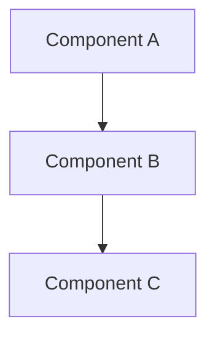
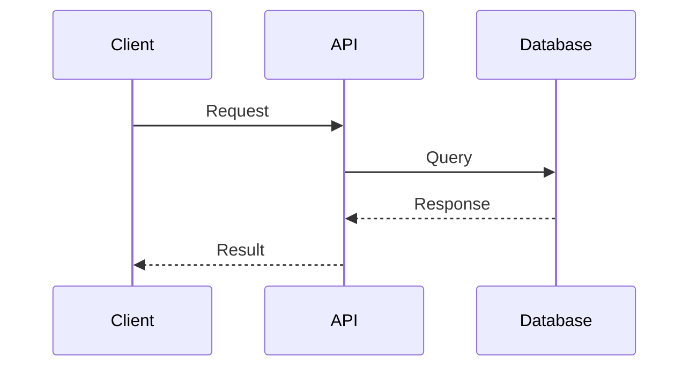
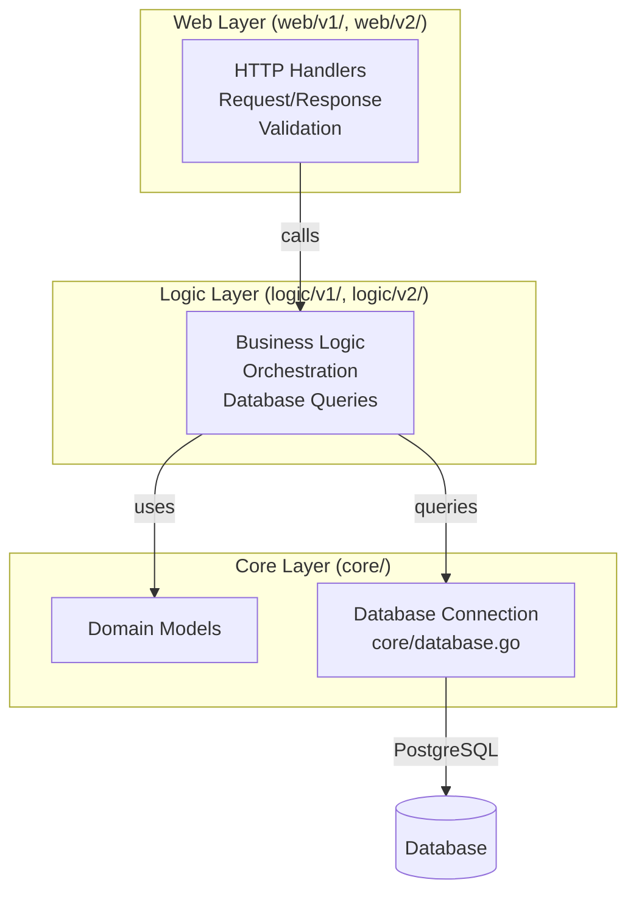

# AI Agent Guide

> **IMPORTANT**: AGENTS.md files are the source of truth for AI agent instructions. Always update the relevant AGENTS.md file when adding or modifying agent guidance.

## Overview

This guide provides quick reference for AI agents working with this codebase. For detailed documentation, see [`docs/`](docs/README.md) - start with [`docs/development/`](docs/development/) for development workflows.

## Documentation Standards

### Diagram Requirements

**MANDATORY**: All architecture diagrams, flowcharts, and system visualizations MUST use Mermaid syntax.

**Rules**:
1. ❌ **NEVER** use ASCII art diagrams (boxes with `┌─┐`, arrows with `│`, `→`, `▼`, etc.)
2. ✅ **ALWAYS** use Mermaid diagrams for:
   - Architecture diagrams (`flowchart`, `graph`)
   - Sequence diagrams (`sequenceDiagram`)
   - State diagrams (`stateDiagram`)
   - Entity relationship diagrams (`erDiagram`)
   - Class diagrams (`classDiagram`)
   - Gantt charts (`gantt`)

**Examples**:





**Enforcement**: When reviewing or creating documentation:
- Replace existing ASCII diagrams with Mermaid equivalents
- Ensure all new diagrams use Mermaid syntax
- Use appropriate Mermaid diagram types for the content

---

## Development Commands

Quick Go commands for local development (no Docker/Kubernetes needed):

```bash
# Run service locally
cd services
go run cmd/{service}/main.go

# Run tests
go test ./...
go test ./internal/{service}/...

# Build binary (no Docker needed for dev)
go build -o bin/{service} cmd/{service}/main.go
```

**Detailed Configuration**: See [`docs/development/CONFIG_GUIDE.md`](docs/development/CONFIG_GUIDE.md) for environment variables, `.env` files, and local setup.

**Deployment**: Docker/Kubernetes deployment details in [`docs/getting-started/SETUP.md`](docs/getting-started/SETUP.md)

---

## Architecture Overview

### 3-Layer Architecture

All microservices follow a consistent 3-layer architecture:



**Layer Responsibilities**:
- **Web Layer** (`web/v1/`, `web/v2/`): HTTP handlers, request/response, validation
- **Logic Layer** (`logic/v1/`, `logic/v2/`): Business logic, orchestration, database queries
- **Core Layer** (`core/domain/`, `core/database.go`): Domain models, database connections

**Detailed Architecture**: See [`docs/apm/ARCHITECTURE.md`](docs/apm/ARCHITECTURE.md) for middleware chain and APM integration. Full system architecture in [`specs/system-context/01-architecture-overview.md`](specs/system-context/01-architecture-overview.md)

---

## Key Design Patterns

- **Clean Architecture**: 3-layer separation (web → logic → core) with clear boundaries
- **API Versioning**: Parallel v1/v2 endpoints, no breaking changes, gradual migration path
- **Microservices**: 9 independent services with bounded contexts, each in own namespace
- **Middleware Chain**: Ordered middleware (tracing → logging → metrics) for observability

**Middleware Details**: See [`docs/development/TRACING_ARCHITECTURE.md`](docs/development/TRACING_ARCHITECTURE.md) for middleware chain ordering and responsibilities.

---

## Technology Stack

- **Runtime**: Go 1.25
- **Database**: PostgreSQL (5 clusters via Zalando/CrunchyData operators)
  - Connection poolers: PgBouncer, PgCat
  - Migrations: Flyway 11.19.0 (8 migration images)
- **HTTP Framework**: Gin
- **Observability**: OpenTelemetry (traces, metrics, logs)
- **Deployment**: Kubernetes (Kind), Helm 3
- **Monitoring**: Prometheus, Grafana, Tempo, Loki, Pyroscope, Jaeger

**Observability Details**: See [`docs/apm/README.md`](docs/apm/README.md) for complete APM system overview. Metrics documentation in [`docs/monitoring/METRICS.md`](docs/monitoring/METRICS.md)

---

## Observability with OpenTelemetry

The application includes comprehensive observability using OpenTelemetry:

- **Traces**: OTLP → OpenTelemetry Collector → Tempo + Jaeger (distributed tracing)
- **Metrics**: Prometheus (custom business + infrastructure metrics)
- **Logs**: Structured logging with zap, correlated via trace_id/span_id
- **Configuration**: Environment variables (`OTEL_COLLECTOR_ENDPOINT`, `OTEL_SAMPLE_RATE`)
- **Logging**: Automatic trace context injection, log levels: debug, info, warn, error, fatal, panic

**Detailed Guides**:
- Tracing: [`docs/apm/TRACING.md`](docs/apm/TRACING.md)
- Logging: [`docs/apm/LOGGING.md`](docs/apm/LOGGING.md)
- Metrics: [`docs/monitoring/METRICS.md`](docs/monitoring/METRICS.md)

---

## Project Structure

```
monitoring/
├── services/          # Go application code (9 microservices)
├── charts/            # Helm chart for microservices
├── k8s/               # Kubernetes manifests
├── scripts/           # Deployment scripts (01-12)
├── docs/              # Documentation (starting point for details)
├── k6/                # K6 load testing
└── specs/             # Specifications and research
```

**Full Documentation Index**: See [`docs/README.md`](docs/README.md) for complete documentation structure.

---

## API Endpoints

9 microservices with RESTful APIs:

| Service | Namespace | Base URLs |
|---------|-----------|-----------|
| auth | auth | `/api/v1/*`, `/api/v2/*` |
| user | user | `/api/v1/*`, `/api/v2/*` |
| product | product | `/api/v1/*`, `/api/v2/*` |
| cart | cart | `/api/v1/*`, `/api/v2/*` |
| order | order | `/api/v1/*`, `/api/v2/*` |
| review | review | `/api/v1/*`, `/api/v2/*` |
| notification | notification | `/api/v1/*`, `/api/v2/*` |
| shipping | shipping | `/api/v1/*` (v1 only) |
| shipping-v2 | shipping | `/api/v2/*` (v2 only) |

**Complete API Documentation**: See [`docs/api/API_REFERENCE.md`](docs/api/API_REFERENCE.md) for all endpoints, request/response models, and examples.

---

## Important Notes

### Deployment Order

Infrastructure → Monitoring → APM → **Databases** → Apps → Load Testing → SLO → Access

1. Infrastructure (01) - Kind cluster
2. Monitoring (02) - Prometheus, Grafana, metrics (BEFORE apps)
3. APM (03) - Tempo, Pyroscope, Loki, Vector (BEFORE apps)
4. **Databases (04)** - PostgreSQL operators, clusters, poolers (BEFORE apps)
5. Build & Deploy Apps (05-06) - Build images, deploy services
6. Load Testing (07) - K6 load generators (AFTER apps)
7. SLO (08) - Sloth Operator and SLO CRDs
8. Access Setup (09) - Port-forwarding

### Scripts

Numbered scripts (01-12) execute in order. See [`docs/getting-started/SETUP.md`](docs/getting-started/SETUP.md) for deployment guide.

### Namespaces

- `monitoring` - Monitoring components (Prometheus, Grafana, Tempo, Jaeger, Pyroscope, Loki) and SLO system
- Service namespaces - Each microservice has own namespace: `auth`, `user`, `product`, `cart`, `order`, `review`, `notification`, `shipping`
- `k6` - K6 load testing
- `kube-system` - Vector (log collection)

### Database

- **5 PostgreSQL Clusters**: review-db, auth-db, supporting-db (shared: user + notification + shipping-v2), product-db, transaction-db
- **Connection Poolers**: PgBouncer (Auth), PgCat (Product, Cart+Order)
- **Migrations**: Flyway 11.19.0 with 8 migration images (auth, user, product, cart, order, review, notification, shipping-v2)
- **Operators**: Zalando Postgres Operator (v1.15.0), CrunchyData Postgres Operator (v5.7.0)

### SLO

Managed via Sloth Operator (PrometheusServiceLevel CRDs). See [`docs/slo/README.md`](docs/slo/README.md) for SLO system overview.

### CI/CD

GitHub Actions workflows:
- `.github/workflows/build-images.yml` - Build microservice images
- `.github/workflows/build-init-images.yml` - Build Flyway init images
- `.github/workflows/build-k6-images.yml` - Build k6 images
- `.github/workflows/helm-release.yml` - Helm chart release

---

## Command Reference

### Deployment Scripts

| Script | Command | Purpose | Order |
|--------|---------|---------|-------|
| Create cluster | `./scripts/01-create-kind-cluster.sh` | Create Kind Kubernetes cluster | 1 |
| Deploy monitoring | `./scripts/02-deploy-monitoring.sh` | Deploy Prometheus, Grafana, metrics | 2 |
| Deploy APM | `./scripts/03-deploy-apm.sh` | Deploy all APM components (BEFORE apps) | 3 |
| Deploy databases | `./scripts/04-deploy-databases.sh` | Deploy PostgreSQL operators, clusters, poolers | 4 |
| Build images | `./scripts/05-build-microservices.sh` | Build all 9 service Docker images + 8 migration images | 5 |
| Deploy services (local) | `./scripts/06-deploy-microservices.sh --local` | Deploy using local Helm chart | 6 |
| Deploy services (registry) | `./scripts/06-deploy-microservices.sh --registry` | Deploy from OCI registry | 6 |
| Deploy k6 | `./scripts/07-deploy-k6.sh` | Deploy k6 load generators (AFTER apps) | 7 |
| Deploy SLO | `./scripts/08-deploy-slo.sh` | Deploy Sloth Operator and SLO CRDs | 8 |
| Setup access | `./scripts/09-setup-access.sh` | Setup port-forwarding | 9 |
| Reload dashboard | `./scripts/10-reload-dashboard.sh` | Reapply Grafana dashboards | - |
| Diagnose latency | `./scripts/11-diagnose-latency.sh` | Analyze latency issues | - |
| Error budget alert | `./scripts/12-error-budget-alert.sh` | Respond to error budget alerts | - |

**Detailed Deployment Guide**: See [`docs/getting-started/SETUP.md`](docs/getting-started/SETUP.md)

### Helm Commands

| Command | Purpose |
|---------|---------|
| `helm list -A` | List all Helm releases |
| `helm upgrade --install <name> charts/ -f charts/values/<service>.yaml -n <ns>` | Install/upgrade service |
| `helm uninstall <name> -n <namespace>` | Uninstall a service |
| `helm pull oci://ghcr.io/duynhne/charts/microservice` | Pull chart from OCI registry |

### kubectl Shortcuts

| Command | Purpose |
|---------|---------|
| `kubectl get pods -n {namespace}` | List pods in namespace |
| `kubectl logs -l app={service-name} -n {namespace}` | View service logs |
| `kubectl port-forward -n monitoring svc/grafana-service 3000:3000` | Port-forward Grafana |
| `kubectl port-forward -n monitoring svc/kube-prometheus-stack-prometheus 9090:9090` | Port-forward Prometheus |
| `kubectl port-forward -n monitoring svc/jaeger-all-in-one 16686:16686` | Port-forward Jaeger UI |
| `kubectl rollout restart deployment/{name} -n {namespace}` | Restart deployment |

### Access Points

| Service | URL | Credentials |
|---------|-----|-------------|
| Grafana | http://localhost:3000 | admin/admin |
| Prometheus | http://localhost:9090 | - |
| Jaeger UI | http://localhost:16686 | - |
| Tempo | http://localhost:3200 | - |
| API (via port-forward) | http://localhost:8080 | - |

---

## Quick Navigation

### Find Files by Purpose

**Add a new service:**
- Service code: `services/cmd/{service}/`, `services/internal/{service}/`
- Helm values: `charts/values/{service}.yaml`
- SLO CRD: `k8s/sloth/crds/{service}-slo.yaml`
- Migration: `services/migrations/{service}/Dockerfile` + `sql/V1__Initial_schema.sql`

**Update monitoring:**
- Dashboard JSON: `k8s/grafana-operator/dashboards/microservices-dashboard.json`
- Prometheus Operator values: `k8s/prometheus/values.yaml`
- ServiceMonitor: `k8s/prometheus/servicemonitor-microservices.yaml`
- Grafana Operator resources: `k8s/grafana-operator/`

**Modify SLOs:**
- Edit CRDs: `k8s/sloth/crds/*.yaml` (PrometheusServiceLevel CRDs)
- Apply: `kubectl apply -f k8s/sloth/crds/`

**Load testing:**
- K6 script: `k6/load-test-multiple-scenarios.js`
- K6 Dockerfile: `k6/Dockerfile`
- K6 Helm values: `charts/values/k6-scenarios.yaml`

### Find Scripts by Task

- **Setup cluster**: `01-create-kind-cluster.sh`
- **Deploy monitoring**: `02-deploy-monitoring.sh` (BEFORE apps)
- **Deploy APM**: `03-deploy-apm.sh` (BEFORE apps)
- **Deploy databases**: `04-deploy-databases.sh` (BEFORE apps)
- **Build & deploy apps**: `05-build-microservices.sh`, `06-deploy-microservices.sh`
- **Load testing**: `07-deploy-k6.sh` (AFTER apps)
- **SLO system**: `08-deploy-slo.sh`
- **Access setup**: `09-setup-access.sh`
- **Utilities**: `10-reload-dashboard.sh`, `11-diagnose-latency.sh`, `12-error-budget-alert.sh`

### Find Documentation by Topic

- **Getting Started**: [`docs/getting-started/SETUP.md`](docs/getting-started/SETUP.md), [`docs/getting-started/ADDING_SERVICES.md`](docs/getting-started/ADDING_SERVICES.md)
- **Development**: [`docs/development/CONFIG_GUIDE.md`](docs/development/CONFIG_GUIDE.md), [`docs/development/ERROR_HANDLING.md`](docs/development/ERROR_HANDLING.md), [`docs/development/TRACING_ARCHITECTURE.md`](docs/development/TRACING_ARCHITECTURE.md)
- **Monitoring**: [`docs/monitoring/METRICS.md`](docs/monitoring/METRICS.md), [`docs/monitoring/TROUBLESHOOTING.md`](docs/monitoring/TROUBLESHOOTING.md)
- **APM**: [`docs/apm/README.md`](docs/apm/README.md), [`docs/apm/TRACING.md`](docs/apm/TRACING.md), [`docs/apm/LOGGING.md`](docs/apm/LOGGING.md), [`docs/apm/PROFILING.md`](docs/apm/PROFILING.md)
- **SLO**: [`docs/slo/README.md`](docs/slo/README.md), [`docs/slo/GETTING_STARTED.md`](docs/slo/GETTING_STARTED.md)
- **API**: [`docs/api/API_REFERENCE.md`](docs/api/API_REFERENCE.md)
- **k6**: [`docs/k6/K6_LOAD_TESTING.md`](docs/k6/K6_LOAD_TESTING.md)
- **Docs Index**: [`docs/README.md`](docs/README.md)

---

## Conventions and Standards

### Namespace Conventions

- **`monitoring`** - Monitoring components and SLO system
- **Service namespaces** - Each microservice has own namespace: `auth`, `user`, `product`, `cart`, `order`, `review`, `notification`, `shipping`
- **`k6`** - K6 load testing
- **`kube-system`** - Vector (log collection)

### Script Naming

- **Numbered prefixes (01-12)** - Execution order
- **Format**: `{number}-{purpose}.sh`
- **Categories**: Infrastructure (01-02), Monitoring (02), APM (03), Databases (04), Apps (05-06), Load Testing (07), SLO (08), Access (09), Utilities (10-12)

### File Organization Patterns

- **Services**: `services/cmd/{service}/main.go` + `services/internal/{service}/{v1,v2,core}/`
- **Kubernetes**: `k8s/{component}/`
- **Scripts**: `scripts/{number}-{purpose}.sh`
- **SLO**: `k8s/sloth/crds/*.yaml` (PrometheusServiceLevel CRDs)
- **Migrations**: `services/migrations/{service}/Dockerfile` + `sql/V1__Initial_schema.sql`

### Metric Naming Conventions

- **Pattern**: `{domain}_{metric}_{unit}`
- **Examples**: `request_duration_seconds` (histogram), `requests_total` (counter), `requests_in_flight` (gauge)

### Label Requirements

**Required labels for metrics (after Prometheus scrape):**
- `job` - Set to `"microservices"` via ServiceMonitor relabeling
- `app` - Service name (from service label)
- `namespace` - Kubernetes namespace (from pod metadata)
- `instance` - Pod IP:port (automatic)

**Application-level labels (emitted by app):**
- `method` - HTTP method (GET, POST, PUT, DELETE)
- `path` - Request path (e.g., `/api/v1/users`)
- `code` - HTTP status code (200, 404, 500)

**Note**: Applications DO NOT emit `app`, `namespace`, or `job` labels. All service identification labels are injected by Prometheus during scrape via ServiceMonitor `relabelings`.

### Go Code Conventions

- **Middleware**: `services/pkg/middleware/` - Centralized observability middleware
- **Handlers**: Separate `v1/` and `v2/` directories for API versioning
- **Domain models**: `core/domain/` directory for data structures
- **Database**: `core/database.go` for database connections
- **Memory leak prevention**: Always use `defer cancel()`, close channels, set timeouts

### Dashboard Conventions

- **UID**: `microservices-monitoring-001`
- **Variables**: `$app`, `$namespace`, `$rate`
- **Query filters**: Always include `job=~"microservices"` and `namespace=~"$namespace"`

**Dashboard Details**: See [`docs/development/DASHBOARD_PANELS_GUIDE.md`](docs/development/DASHBOARD_PANELS_GUIDE.md) for complete dashboard reference (34 panels).

---

### Local Build Verification

**Before pushing code, run:**
```bash
./scripts/00-verify-build.sh
```

**What it checks:**
1. Go module synchronization (`go.mod`/`go.sum`)
2. Code formatting (`gofmt`)
3. Static analysis (`go vet`)
4. Build all 9 services
5. Tests (optional - use `--skip-tests` to skip)

**Usage:**
```bash
# Run all checks including tests
./scripts/00-verify-build.sh

# Skip tests (faster, for quick verification)
./scripts/00-verify-build.sh --skip-tests
```

**If script fails:**
- Fix the reported error
- Re-run the script
- Commit changes only after all checks pass

**Optional: Git Hook Setup**

To automatically run verification before each commit:

```bash
# Install git hook
cp .githooks/pre-commit .git/hooks/pre-commit
chmod +x .git/hooks/pre-commit
```

**Note:** Git hook is optional. You can skip it with `git commit --no-verify` if needed.

**Troubleshooting:**
- **"go.mod or go.sum changed"**: Run `go mod tidy` and commit the changes
- **"Code not formatted"**: Run `gofmt -w .` to auto-format
- **"Failed to build [service]"**: Check compilation errors in that service
- **"go vet found issues"**: Review and fix the reported issues

---
## Troubleshooting

Common issues and quick fixes. For detailed troubleshooting, see [`docs/monitoring/TROUBLESHOOTING.md`](docs/monitoring/TROUBLESHOOTING.md).

**Dashboard not updating:**
- Re-apply: `kubectl apply -k k8s/grafana-operator/dashboards/`
- Check status: `kubectl get grafanadashboards -n monitoring`

**Prometheus not scraping:**
- Check ServiceMonitor: `kubectl get servicemonitor -n monitoring`
- Check targets: http://localhost:9090/targets

**SLO rules not loading:**
- Check CRDs: `kubectl get prometheusservicelevels -n monitoring`
- Check rules: `kubectl get prometheusrules -n monitoring`

**Metrics not appearing:**
- Verify `/metrics` endpoint exists
- Check ServiceMonitor configuration
- Verify labels match (app, namespace, job)

---

## Changelog

See [`CHANGELOG.md`](CHANGELOG.md) for complete version history.

**Important for AI Agents**: Do NOT modify existing entries in [`CHANGELOG.md`](CHANGELOG.md). ONLY add new entries at the top. Never edit or remove historical changelog entries.

---