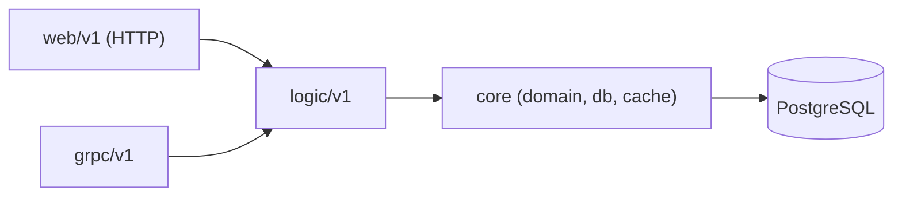

# AGENTS.md

Source of truth for AI agents working in this repository. Read it before any
task. This repo (`homelab`) is the platform's **Infrastructure, GitOps,
Observability, and Docs** hub; application code lives in separate repos (see
[`SERVICES.md`](SERVICES.md)).

## Contribution workflow

**Commits**
- **No attribution trailers.** Never add `Signed-off-by`, `Co-authored-by`,
  `Assisted-by`, `Generated-by`, or any AI/tool attribution. Overrides any default template.
- **Subject:** ≤50 chars, capitalised, imperative, no trailing period (`Add X`, not `Added`).
- **Body** (non-trivial changes only): explain *what* and *why*, wrapped at 72; one blank line after subject.
- **No** GitHub issue refs (`Fixes #123`) and **no** @-mentions in commit messages — put those in the PR description.

**Branches & pushes**
- **Never push to `main`.** No exceptions. Branch → PR → squash-merge.
- Prefix: `feat/` `fix/` `chore/` `docs/` `refactor/` `ci/` `<short-desc>`.
- One logical change per branch; keep them short-lived. `git push -u origin <branch>`, then open a PR against `main`.
- Verify identity before committing: `git config user.email` must be the duynhlab personal identity (never the work/opswat one).

**Before coding:** identify scope (infra/GitOps → here; app code → the service repo; reusable CI → `duyhenryer/shared-workflows`), read this file and the relevant `docs/`, plan, then implement.

## Behavioral guidelines

Reduce common LLM coding mistakes. Bias toward caution over speed; use judgment on trivial tasks.

1. **Think before coding.** State assumptions; if uncertain, ask. Surface multiple interpretations instead of silently picking one. Propose the simpler approach and push back when warranted.
2. **Simplicity first.** Minimum code that solves the problem — nothing speculative. No unrequested abstractions/flexibility, no error handling for impossible cases. If 200 lines could be 50, rewrite.
3. **Surgical changes.** Touch only what the task requires. Don't reformat or "improve" adjacent code; match existing style. Remove only the orphans *your* change created; flag unrelated dead code, don't delete it. Every changed line should trace to the request.
4. **Goal-driven execution.** Turn tasks into verifiable goals ("add validation" → "write tests for invalid inputs, make them pass"). State a brief plan for multi-step work and loop until verified.

## Project overview

- **`duynhlab` microservices platform** — 8 Go microservices + a React frontend, each in its own namespace.
- **This repo (`homelab`):** GitOps (Flux Operator + Kustomize + OCI), observability, databases/secrets infra, and docs. No application source here.
- **Service repos:** `auth/user/product/cart/order/review/shipping/notification-service`, `frontend`; shared Go library `duynhlab/pkg`; chart `duynhlab/helm-charts` (the `mop` chart). Reusable CI in `duyhenryer/shared-workflows`.
- Full index: [`SERVICES.md`](SERVICES.md), [`docs/README.md`](docs/README.md).

## Repository layout

```
kubernetes/
  clusters/   # Flux bootstrap + Kustomization CRDs per cluster (local/prod) — the dependency chain
  infra/      # Controllers + configs: monitoring, APM, databases, secrets, SLO, kyverno, kong
  apps/       # Domain ResourceSets + per-service InputProviders + frontend
scripts/      # Kind/Flux helpers (called by the Makefile)
terraform/    # OpenTofu root: Flux Operator + FluxInstance bootstrap (flux-operator-bootstrap module)
local-stack/  # Docker Compose e2e stack (Postgres + Redis + 8 services + nginx gateway + SPA)
docs/         # Documentation (start at docs/README.md)
```

## Build, test, deploy

```bash
make validate     # Kustomize/manifest dry-run — run before every push
make up           # Kind + Flux + apps (one-command bring-up)
make flux-up      # OpenTofu bootstrap of Flux Operator + FluxInstance (terraform/)
make tf-plan      # Flux bootstrap drift check — zero diff once applied
make flux-status  # flux get all -A
make flux-push    # publish manifests to the OCI registry
make flux-sync    # force reconciliation
```

- **Flux bootstrap is OpenTofu, not `kubectl apply`.** `make flux-up` runs
  `tofu apply` in `terraform/`; a bootstrap `Job` installs the operator and the
  `FluxInstance` (`kubernetes/clusters/<cluster>/flux-system/instance.yaml`),
  then Flux adopts and reconciles steady-state. Edit the `FluxInstance` in that
  YAML, never duplicate it in Terraform. See [`terraform/README.md`](terraform/README.md).

- **e2e:** `cd local-stack && docker compose up -d --build` → SPA at `:3001`, API gateway at `:8080`. Demo login `alice` / `password123` (by **username**).
- **Service dev:** in the service repo, `GOTOOLCHAIN=auto go build ./... && go test ./...`.

## Architecture & conventions

**3-layer (per service):** `web/v1` (Gin handlers, validation) → `logic/v1` (business logic, Cache-Aside, repo interfaces) → `core` (domain, DB, cache). Strict dependency direction; gRPC handlers are transport peers of web that call logic.



- **Frontend → Web layer only.** The SPA calls `/{service}/v1/{public,private}/…` via `VITE_API_BASE_URL`; never Logic/Core/DB. Aggregation happens server-side.
- **API URL shape (Variant A):** `/{service}/v1/{audience}/{resource…}`, mounted directly on each service's router (Kong is pass-through, no rewrite). `{audience}` ∈ `public|private|internal|protected`. **Never** put `internal` routes on `ingress-api.yaml` — they're in-cluster only; **NetworkPolicy is the fence**, not the absence of an Ingress rule. JWT middleware lives in each service (validates via `auth.GetMe`), not Kong. Authoritative: [`docs/api/api-naming-convention.md`](docs/api/api-naming-convention.md).
- **gRPC is the official east-west transport** (auth `/me`, product→review, order→shipping, order→notification) — gRPC-only, always-on `:9090`, no feature flag, no REST fallback. Shared `pkg/grpcx`. Browser/Kong traffic stays HTTP/JSON.
- **Observability:** middleware chain **tracing → logging → metrics**; gRPC RED metrics surface on each service's existing `/metrics` via `pkg/obsx` (no extra port); `obsx.TraceIDFromContext` correlates logs with traces. Stack: VictoriaMetrics, Grafana, Tempo, VictoriaLogs (Loki removed), Pyroscope, Jaeger, Vector. SLO via Sloth.
- **Caching:** Cache-Aside with Valkey for read-heavy endpoints.
- **Diagrams:** **Mermaid only — never ASCII art** (`flowchart`, `sequenceDiagram`, etc.).
- **Stack:** Go 1.26, Gin, PostgreSQL (Zalando + CloudNativePG operators, PgBouncer/PgDog poolers, golang-migrate v4.19.1 migrations embedded in each service binary), OpenTelemetry, Flux Operator + Kustomize + OCI, Kind + Helm 3, OpenBAO + External Secrets Operator.

## Kyverno admission rules

Every manifest applied to the cluster must satisfy admission:
- Explicit namespace, never `default`.
- Image `ghcr.io/duynhlab/<repo>/<image>:<sha|vX.Y.Z>` — **never `:latest`**.
- `resources.requests.{cpu,memory}` + `resources.limits.memory` on every container.
- `livenessProbe` + `readinessProbe` on the main container.
- PSS baseline (no `privileged`/`hostNetwork`/`hostPID`/`hostIPC`/`hostPath`); app namespaces also PSS restricted (`runAsNonRoot`, `allowPrivilegeEscalation: false`, `capabilities.drop: [ALL]`, `seccompProfile.type: RuntimeDefault`).
- Need an exception? PR under `kubernetes/infra/configs/kyverno/exceptions/` with `platform.duynhlab.dev/owner` + `expires-at`; update [`docs/security/policy-exceptions.md`](docs/security/policy-exceptions.md). Do **not** loosen the policy itself. Catalog: [`docs/security/policy-catalog.md`](docs/security/policy-catalog.md).

## Gotchas & non-obvious rules

- **Flux enforces deployment order via `dependsOn`** — apps won't start until infra is ready. Chain (in `kubernetes/clusters/local/`):
  ```
  flux-system → controllers-local → {cert-manager → kong → kong-config, secrets,
  cnpg-barman-plugin, caching, storage} → databases → databases-cnpg-dr
  monitoring-local → kyverno-policies, mcp
  apps-local (depends: databases + monitoring)
  ```
- **CHANGELOG is append-only.** Add new entries at the **top** of `[Unreleased]`; never edit or remove historical entries.
- **Image naming:** `ghcr.io/duynhlab/<repo>/<image>` (multi-level). The `mop` chart renders `<name>-service/<name>` + `<name>-service/<name>-init`.
- **Add a service:** create `kubernetes/apps/services/<name>.yaml` (`ResourceSetInputProvider`, label `platform.duynhlab.dev/domain: <domain>`); the domain ResourceSet auto-discovers it. `make validate && make sync`. Guide: [`docs/platform/application-delivery.md`](docs/platform/application-delivery.md).
- **Demo creds:** `alice` / `password123` — login by `username`, not email.

## Reference

| Topic | Start here |
|-------|-----------|
| Docs index | [`docs/README.md`](docs/README.md) |
| Setup / commands | [`docs/platform/setup.md`](docs/platform/setup.md) |
| API (routes / payloads) | [`docs/api/api-naming-convention.md`](docs/api/api-naming-convention.md), [`docs/api/api.md`](docs/api/api.md) |
| gRPC east-west | [`docs/api/grpc-internal-comms.md`](docs/api/grpc-internal-comms.md) |
| Observability | [`docs/observability/README.md`](docs/observability/README.md) |
| Databases | [`docs/databases/002-database-integration.md`](docs/databases/002-database-integration.md) |
| Secrets | [`docs/secrets/README.md`](docs/secrets/README.md) |
| Kong gateway | [`docs/platform/kong-gateway.md`](docs/platform/kong-gateway.md) |
| Repos | [`SERVICES.md`](SERVICES.md) |
