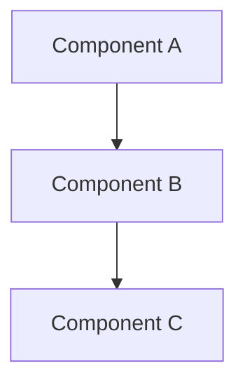
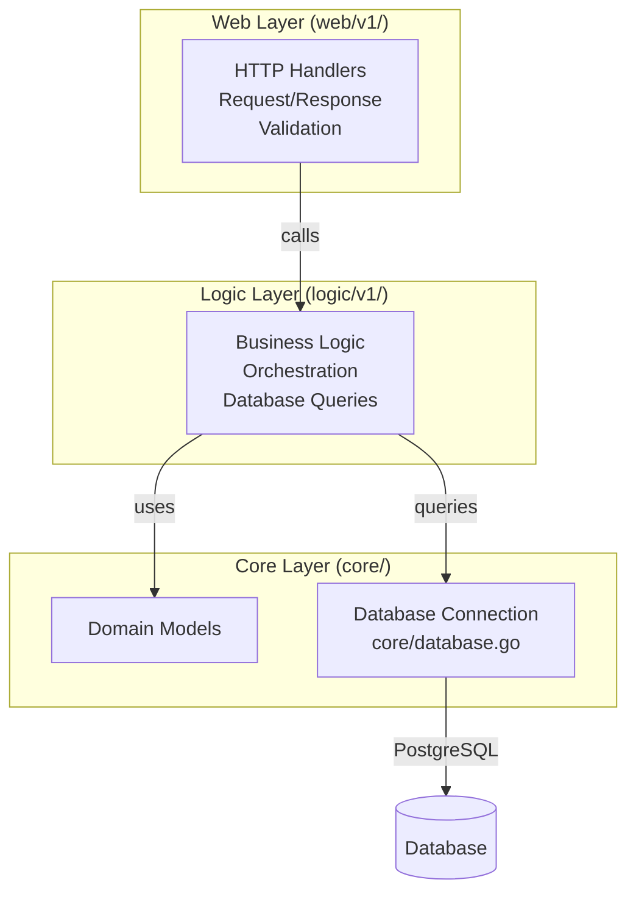

# AI Agent Guide

> **IMPORTANT**: AGENTS.md files are the source of truth for AI agent instructions. Always update the relevant AGENTS.md file when adding or modifying agent guidance.

> **IMPORTANT**: This project is directly related to the user's day-to-day work as a Senior DevOps / SRE. Recommendations should prioritize production-grade, scalable, and maintainable solutions.

> **CRITICAL**: **ALWAYS READ THIS FILE FIRST** before starting any task. This file contains essential patterns, conventions, and best practices that must be followed.

## Overview

This guide provides quick reference for AI agents working with the `duynhne` microservices platform.

**Repository Context**:
- **This Repository (`monitoring`)**: Infrastructure, GitOps, Observability, and Docs.
- **Service Repositories**: Application code is in separate repositories (e.g., `auth-service`, `user-service`).
- **Shared Workflows**: CI/CD templates in `duyhenryer/shared-workflows`.

**Detailed Index**: See [`docs/`](docs/README.md) for platform docs and [**SERVICES.md**](SERVICES.md) for the list of repositories.

---

## Agent Workflow

### Before Starting Any Task

1.  **Identify the Scope**:
    - **Infrastructure/GitOps**: Work in this repository (`monitoring`).
    - **Application Code**: Check [**SERVICES.md**](SERVICES.md) to find the correct service repo.
    - **CI/CD Pipelines**: Check `duyhenryer/shared-workflows` if modifying reusable workflows.
2.  **Read AGENTS.md FIRST** - In the target repository (each service has its own AGENTS.md).
3.  **Read relevant docs** - Check `docs/` in this repo for architecture/platform context.
4.  **Plan before coding** - Understand the problem, propose solution, get approval.

### Code Quality Standards (General)

(See specific `AGENTS.md` in service repositories for language-specific standards)

- **Consistency**: Follow existing code patterns.
- **Documentation**: Update relevant docs when adding features.
- **Testing**: Write tests for new functionality.
- **Error Handling**: Use consistent error patterns.
- **Logging**: Use structured logging with appropriate levels.

---

## Documentation Standards

### Diagram Requirements

**MANDATORY**: All architecture diagrams, flowcharts, and system visualizations MUST use Mermaid syntax.

**Rules**:

1. ❌ **NEVER** use ASCII art diagrams (boxes with `┌─┐`, arrows with `│`, `→`, `▼`, etc.)
2. ✅ **ALWAYS** use Mermaid diagrams for:
   - Architecture diagrams (`flowchart`, `graph`)
   - Sequence diagrams (`sequenceDiagram`)
   - State diagrams (`stateDiagram`)
   - Entity relationship diagrams (`erDiagram`)
   - Class diagrams (`classDiagram`)
   - Gantt charts (`gantt`)

**Examples**:



**Enforcement**: When reviewing or creating documentation:

- Replace existing ASCII diagrams with Mermaid equivalents
- Ensure all new diagrams use Mermaid syntax
- Use appropriate Mermaid diagram types for the content

---

## Development Commands

### Infrastructure & GitOps

This repository manages deployment via **Flux**.

```bash
# Validate manifests (dry-run)
make validate

# Deploy entire platform (Kind + Flux + Apps)
make up

# Check status
make flux-status
```

### Microservices Development

To work on a specific service (e.g., `auth-service`):

1.  **Find Repo**: Check [**SERVICES.md**](SERVICES.md).
2.  **Clone**: `git clone https://github.com/duynhne/auth-service` (or use setup script).
3.  **Run Locally** (inside service repo):
    ```bash
    go run cmd/main.go
    ```
4.  **Test**: `go test ./...`

**GitOps Deployment**: See deployment commands in [Deployment Order](#deployment-order) section. Use `make up` for one-command deployment or `make flux-push` to deploy all services to Kubernetes.

---

## Architecture Overview

### 3-Layer Architecture

All microservices follow a consistent 3-layer architecture:



**Database Integration**: See [`docs/databases/database.md`](docs/databases/database.md) for database architecture, connection patterns (direct, PgBouncer, PgCat), and configuration.

**Layer Responsibilities**:

- **Web Layer** (`web/v1/`): HTTP handlers, request/response, validation
- **Logic Layer** (`logic/v1/`): Business logic, orchestration, Cache-Aside pattern, database queries via repository interfaces
- **Core Layer** (`core/domain/`, `core/database.go`, `core/cache/`): Domain models, database connections, cache client interfaces and implementations

**Detailed Architecture**: See [`docs/observability/apm/architecture.md`](docs/observability/apm/architecture.md) for middleware chain and APM integration. Full system architecture in [`specs/system-context/01-architecture-overview.md`](specs/system-context/01-architecture-overview.md)

---

### Frontend Integration Rules

**CRITICAL**: Frontend (React SPA) can ONLY interact with Web Layer endpoints.

**Allowed:**

- ✅ HTTP requests to `/api/v1/*` endpoints (canonical API)
- ✅ All requests go through Web Layer handlers
- ✅ Web Layer handles aggregation, validation, error translation

**Forbidden:**

- ❌ Direct calls to Logic Layer (no function calls to services)
- ❌ Direct calls to Core Layer (no database access)
- ❌ Client-side orchestration (use aggregation endpoints instead)
- ❌ Bypassing Web Layer in any way

**Why:**

- Web Layer provides HTTP interface, validation, authentication
- Logic/Core layers are internal implementation details
- Aggregation endpoints handle complex operations server-side

**Reference:** See [`docs/api/api.md`](docs/api/api.md) for complete API documentation and 3-layer architecture details.

---

## Key Design Patterns

- **Clean Architecture**: 3-layer separation (web → logic → core) with clear boundaries
- **Frontend → Web Layer Only**: Frontend can ONLY call Web Layer HTTP endpoints, never Logic/Core directly
- **API Versioning**: v1 only (canonical, frontend-aligned); v2 removed
- **Microservices**: 8 independent services with bounded contexts, each in own namespace
- **Middleware Chain**: Ordered middleware (tracing → logging → metrics) for observability
- **Caching**: Cache-Aside pattern with Valkey (Redis-compatible) for read-heavy endpoints

**Middleware Details**: See [`docs/observability/apm/tracing_architecture.md`](docs/observability/apm/tracing_architecture.md) for middleware chain ordering and responsibilities.

**Caching Details**: See [`docs/caching/caching.md`](docs/caching/caching.md) for cache architecture, Cache-Aside pattern, and configuration.

---

## Technology Stack

- **Runtime**: Go 1.25
- **Database**: PostgreSQL (5 clusters via Zalando/CloudNativePG operators)
  - Connection poolers: PgBouncer, PgCat
  - Migrations: Flyway 11.19.0 (8 migration images)
  - **Database Documentation**: [`docs/databases/database.md`](docs/databases/database.md)
- **Cache**: Valkey (Redis-compatible) for read-heavy endpoints
  - Cache-Aside pattern in Logic Layer
  - Product service: `GET /api/v1/products`, `GET /api/v1/products/:id`
  - **Caching Documentation**: [`docs/caching/caching.md`](docs/caching/caching.md)
- **HTTP Framework**: Gin
- **Observability**: OpenTelemetry (traces, metrics, logs)
- **GitOps**: Flux Operator, Kustomize, OCI Registry
- **Deployment**: Kubernetes (Kind), Helm 3
- **Monitoring**: Prometheus, Grafana, Tempo, Loki, Pyroscope, Jaeger
- **Secrets**: HashiCorp Vault (dev mode) + External Secrets Operator (ESO)
  - Centralized secret management with Kubernetes sync
  - **Secrets Documentation**: [`docs/secrets/secrets-management.md`](docs/secrets/secrets-management.md)

**Observability Details**: See [`docs/observability/apm/README.md`](docs/observability/apm/README.md) for complete APM system overview. Metrics documentation in [`docs/observability/metrics/metrics.md`](docs/observability/metrics/metrics.md)

---

## Project Structure

```
monitoring/
├── charts/            # Helm charts (apps + dashboards)
├── kubernetes/        # GitOps manifests (Flux + Kustomize)
│   ├── clusters/      # Flux cluster configurations (local/prod)
│   ├── infra/         # Controllers + configs (operators, monitoring, databases, secrets)
│   └── apps/          # Application HelmReleases + ResourceSets (frontend, k6, services)
├── scripts/           # Kind/Flux helper scripts (used by Makefile)
├── docs/              # Documentation (starting point for details)
└── specs/             # Specifications and research
```

**GitOps Structure:**

- `kubernetes/clusters/` - Flux bootstrap and Kustomization CRDs per cluster
- `kubernetes/infra/` - Operators/controllers + infrastructure configs (monitoring, APM, databases, secrets, SLO)
- `kubernetes/apps/` - Application layer (HelmReleases/ResourceSets for services, frontend, k6)

**Full Documentation Index**: See [`docs/README.md`](docs/README.md) for complete documentation structure.

---

## API Endpoints

8 microservices with RESTful APIs (v1 only - canonical, frontend-aligned):

| Service | Namespace | Base URL |
|---------|-----------|----------|
| auth | auth | `/api/v1/*` |
| user | user | `/api/v1/*` |
| product | product | `/api/v1/*` |
| cart | cart | `/api/v1/*` |
| order | order | `/api/v1/*` |
| review | review | `/api/v1/*` |
| notification | notification | `/api/v1/*` |
| shipping | shipping | `/api/v1/*` |

**Complete API Documentation**: See [`docs/api/api.md`](docs/api/api.md) for all endpoints, request/response models, and examples.

---

## Important Notes

### Deployment Order

**GitOps Workflow** - Infrastructure → Apps (Flux enforces via `dependsOn`)

```bash
# One-command deployment
make up

# Or step-by-step:
make cluster-up   # 1. Create Kind Cluster + OCI Registry
make flux-up      # 2. Bootstrap Flux Operator
make flux-push    # 3. Deploy All (Flux reconciles in dependency order)
```

**Flux automatically deploys in correct order:**

1. **Foundation** - Flux Operator, namespaces, OCI sources
2. **Infrastructure** (BEFORE apps) - Monitoring, APM, Databases, SLO
   - Monitoring: Prometheus, Grafana, Metrics Server
   - APM: Tempo, Loki, Vector, OTel Collector, Pyroscope, Jaeger
   - Databases: PostgreSQL operators, 5 clusters, connection poolers
   - SLO: Sloth Operator + 8 PrometheusServiceLevel CRDs
3. **Applications** - 8 microservices + frontend + k6 load testing

**Dependency Chain:**

- `apps-local` has `dependsOn: [infrastructure-local]`
- Apps **will NOT start** until infrastructure is ready
- Flux enforces this automatically via Kustomization CRDs

**Verification:**

```bash
# Check Flux reconciliation status
make flux-status
# Or: flux get kustomizations

# Check all resources
kubectl get pods --all-namespaces
kubectl get helmreleases --all-namespaces

# Trigger manual reconciliation (if needed)
make flux-sync
# Or: flux reconcile kustomization infrastructure-local --with-source
```

**Detailed Deployment Guide**: See [`docs/platform/setup.md`](docs/platform/setup.md)

### Key Infrastructure

- **5 PostgreSQL Clusters**: review-db, auth-db, supporting-db, product-db, transaction-db
- **Connection Poolers**: PgBouncer (Auth), PgCat (Product, Cart+Order)
- **Migrations**: Flyway 11.19.0 with 8 migration images
- **Operators**: Zalando Postgres Operator (v1.15.1), CloudNativePG Operator (v1.28.0)
- **SLO**: Managed via Sloth Operator (PrometheusServiceLevel CRDs)
- **CI/CD**: GitHub Actions workflows (build-images, build-init-images, build-k6-images, helm-release)

---

## Quick Navigation

### Detailed Guides

- **Command Reference**: See [`docs/platform/setup.md`](docs/platform/setup.md#command-reference) - Deployment scripts, Helm, kubectl commands
- **Conventions**: [`docs/api/api.md`](docs/api/api.md#conventions-and-standards) - Naming conventions, code standards, build verification
- **API Reference**: [`docs/api/api.md`](docs/api/api.md) - Complete API documentation
- **Setup Guide**: [`docs/platform/setup.md`](docs/platform/setup.md) - Deployment instructions
- **Configuration**: [`docs/api/api.md`](docs/api/api.md) - Environment variables and config
- **Database**: [`docs/databases/database.md`](docs/databases/database.md) - Database architecture and patterns

### Find Files by Purpose

**Add a new service:**

- Service code: `services/cmd/{service}/`, `services/internal/{service}/`
- Helm values: `charts/mop/values/{service}.yaml`
- HelmRelease: `kubernetes/apps/{service}.yaml`
- SLO CRD: `kubernetes/infra/configs/monitoring/slo/{service}.yaml`
- Migration: `services/{service}/db/migrations/Dockerfile` + `sql/V*__*.sql`
- Push to OCI: `make flux-push` (updates OCI registry)

**Update monitoring:**

- Dashboard JSON: `kubernetes/infra/configs/monitoring/grafana/dashboards/*.json`
- ServiceMonitors: `kubernetes/infra/configs/monitoring/servicemonitors/`
- PodMonitors: `kubernetes/infra/configs/monitoring/podmonitors/`

**Modify SLOs:**

- Edit CRDs: `kubernetes/infra/configs/monitoring/slo/*.yaml` (PrometheusServiceLevel CRDs)
- Push changes: `make flux-push` (updates OCI registry)
- Apply: Flux reconciles automatically, or `make flux-sync`

**Modify infrastructure:**

- Databases: `kubernetes/infra/configs/databases/`
- Controllers: `kubernetes/infra/controllers/` (metrics, logging, tracing, profiling, databases, secrets)
- Configs: `kubernetes/infra/configs/` (monitoring, databases, secrets)

**Add/modify secrets:**

- Vault bootstrap: `kubernetes/infra/configs/secrets/vault-bootstrap/configmap.yaml` (add `vault kv put` command)
- ExternalSecret: `kubernetes/infra/configs/secrets/external-secrets/{name}.yaml`
- ClusterSecretStore: `kubernetes/infra/configs/secrets/cluster-secret-store.yaml`
- Vault HelmRelease: `kubernetes/infra/controllers/secrets/vault/helmrelease.yaml`
- ESO HelmRelease: `kubernetes/infra/controllers/secrets/external-secrets/helmrelease.yaml`

### Find Documentation by Topic

- **Getting Started**: [`docs/platform/setup.md`](docs/platform/setup.md), [`docs/api/api.md`](docs/api/api.md)
- **Development**: [`docs/api/api.md`](docs/api/api.md), [`docs/api/api.md#error-handling`](docs/api/api.md#error-handling), [`docs/observability/apm/tracing_architecture.md`](docs/observability/apm/tracing_architecture.md)
- **Monitoring**: [`docs/observability/metrics/metrics.md`](docs/observability/metrics/metrics.md)
- **APM**: [`docs/observability/apm/README.md`](docs/observability/apm/README.md), [`docs/observability/apm/tracing.md`](docs/observability/apm/tracing.md), [`docs/observability/apm/logging.md`](docs/observability/apm/logging.md), [`docs/observability/apm/profiling.md`](docs/observability/apm/profiling.md)
- **SLO**: [`docs/observability/slo/README.md`](docs/observability/slo/README.md), [`docs/observability/slo/getting_started.md`](docs/observability/slo/getting_started.md)
- **Secrets**: [`docs/secrets/secrets-management.md`](docs/secrets/secrets-management.md)
- **k6**: [`docs/testing/k6.md`](docs/testing/k6.md)
- **Docs Index**: [`docs/README.md`](docs/README.md)

---

## Changelog

See [`CHANGELOG.md`](CHANGELOG.md) for complete version history.

**Important for AI Agents**: Do NOT modify existing entries in [`CHANGELOG.md`](CHANGELOG.md). ONLY add new entries at the top. Never edit or remove historical changelog entries.

---
