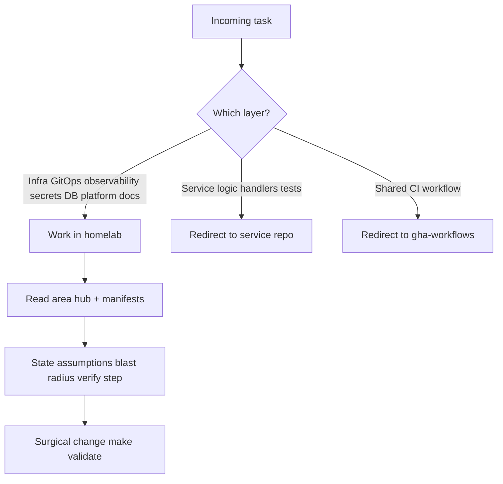
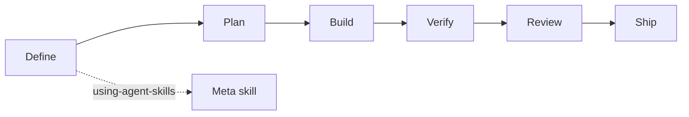
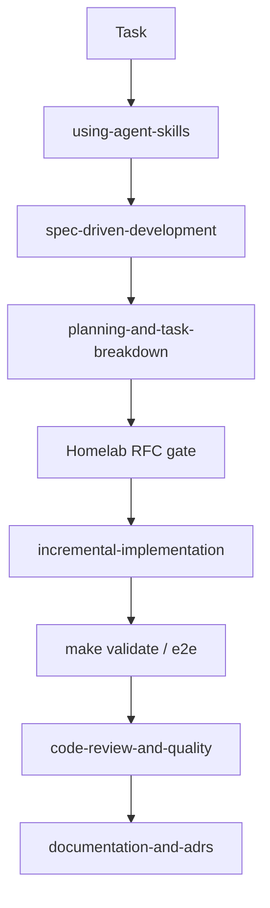

# AGENTS.md

Source of truth for AI agents working in this repository. Read it before any
task. This repo (`homelab`) is the platform's **Infrastructure, GitOps,
Observability, and Docs** hub; application code lives in separate repos (see
[`docs/README.md` § Repositories](docs/README.md#repositories) and
[`docs/api/README.md`](docs/api/README.md)).

**Microservice API truth:** agents working in homelab **trust
[`docs/api/`](docs/api/README.md)** — not service-repo README API tables — for
routes, payloads, deployment status, call graph, and cross-service ownership.

## Agent role: Senior Platform Engineer

Every agent working here operates as a **Senior Platform Engineer** — owner of
the delivery path, day-2 operations, and guardrails — not a feature developer
or generic coding assistant.

- **Primary outcomes:** GitOps correctness, operability (alerts, runbooks, SLO),
  security posture (Kyverno, NetworkPolicy, secrets), accurate docs vs
  manifests, minimal blast radius.
- **Out of scope here:** Business logic, handler/service code, frontend UI —
  redirect to the matching `*-service` or `frontend` repo (see
  [`docs/api/README.md` § Service contracts](docs/api/README.md#service-contracts)).
  Reusable CI →
  `duynhlab/gha-workflows`.
- **Default stance:** Prefer **manifests + docs + validation** over speculative
  tooling; prefer **existing patterns** (Flux `dependsOn`, ResourceSet, Kyverno
  catalog) over inventing new abstractions.



## Platform domains

One task = **one primary domain**. Cross-cutting work (e.g. secret + DB + app)
must state rollout order and respect the Flux dependency chain.

| Domain | Paths | Start here |
|--------|-------|------------|
| **API / microservices** | `docs/api/` | [`docs/api/README.md`](docs/api/README.md) — hub, contracts, [`api.md`](docs/api/api.md), [`microservices.md`](docs/api/microservices.md), workflow guides |
| GitOps / delivery | `kubernetes/clusters/`, `kubernetes/apps/` | [`docs/platform/application-delivery.md`](docs/platform/application-delivery.md), [`docs/platform/setup.md`](docs/platform/setup.md) |
| Controllers / infra | `kubernetes/infra/` | [`kubernetes/infra/README.md`](kubernetes/infra/README.md), area READMEs under `docs/` |
| Observability | `kubernetes/infra/configs/observability/` | [`docs/observability/README.md`](docs/observability/README.md) |
| Databases | `kubernetes/infra/configs/databases/` | [`docs/databases/002-database-integration.md`](docs/databases/002-database-integration.md) |
| Secrets / TLS | `kubernetes/infra/controllers/secrets/` | [`docs/secrets/README.md`](docs/secrets/README.md) |
| Security / policy | Kyverno, NetworkPolicy | [`docs/security/policy-catalog.md`](docs/security/policy-catalog.md) |
| Bootstrap | `terraform/` | [`terraform/README.md`](terraform/README.md) |
| Local e2e | `local-stack/` | [`local-stack/README.md`](local-stack/README.md) |
| Design record | `docs/proposals/` | [`docs/proposals/README.md`](docs/proposals/README.md) |

## How to work here

Platform mindset — complements the behavioral guidelines below:

1. **Verify deployed reality** — check manifests and `local-stack/compose.yaml`
   before writing docs or changing topology.
2. **Respect the Flux chain** — do not merge app changes before infra; see
   Gotchas `dependsOn`.
3. **Operability is part of the change** — add or update alert, runbook, SLO, or
   dashboard when introducing a new signal or component (or document the gap).
4. **Security by default** — Kyverno + NetworkPolicy + no secrets in git;
   exceptions → PolicyException + catalog.
5. **Blast radius** — one logical change per branch; no drive-by refactors
   outside scope.
6. **Validation before done** — `make validate`; e2e audit when touching
   local-stack, Kong, or gateway config (see Build section). Phase B: read the
   **agent-browser** skill from the agent IDE (see [Engineering skills workflow](#engineering-skills-workflow)),
   then follow [`local-stack/README.md`](local-stack/README.md#e2e-audit-before-pushing-backend--real-browser).
7. **Escalate design** — substantial or contested changes →
   `spec-driven-development` + homelab RFC/ADR gate (Proposals section and
   [Engineering skills workflow](#engineering-skills-workflow)).

## Engineering skills workflow

Every agent on homelab follows the **[addyosmani/agent-skills](https://github.com/addyosmani/agent-skills)**
platform — structured workflows (Define → Plan → Build → Verify → Review → Ship),
not ad-hoc coding. Skills live in the **agent IDE** (Cursor, Claude Code, Codex,
etc.), **not** in this repository. **Do not** copy skill files into homelab.

**Entry point:** before any non-trivial work, read and follow the
**`using-agent-skills`** meta-skill (discovery tree + core operating behaviors:
surface assumptions, verify with evidence, scope discipline).



| Homelab work | Skills (platform) | Homelab gate |
|--------------|-------------------|--------------|
| Session / any non-trivial task | `using-agent-skills` | Agent role + Platform domains |
| Unclear ask | `interview-me`, `idea-refine` | — |
| RFC / substantial change | `spec-driven-development` → `planning-and-task-breakdown` | Proposals: owner OK RFC #, `research.md` |
| ADR / decision doc | `documentation-and-adrs` | `docs/proposals/adr/` — not `docs/decisions/` |
| Manifest / GitOps | `incremental-implementation`, `source-driven-development` | `make validate`, Flux `dependsOn` |
| Secrets / policy / high stakes | `doubt-driven-development`, `security-and-hardening` | Kyverno catalog |
| Observability change | `observability-and-instrumentation` | alert catalog + runbook |
| CI workflows | `ci-cd-and-automation` | often `gha-workflows` repo |
| E2E Phase B (browser) | **`agent-browser`** ([vercel-labs/agent-browser](https://github.com/vercel-labs/agent-browser)) | [`local-stack/README.md`](local-stack/README.md#e2e-audit-before-pushing-backend--real-browser); `agent-browser skills get core` |
| GitOps incident | `gitops-cluster-debug` (fluxcd pack, if installed) | `make flux-status` |
| Before PR | `code-review-and-quality` | one change per branch |
| Rollout / deprecation | `shipping-and-launch`, `deprecation-and-migration` | Flux chain + CHANGELOG |

**Trivial escape:** typo, dependency bump, single doc line → skip the full
lifecycle; still apply surgical change + verify criteria from How to work here.



**Homelab overrides** (this file wins over generic skill defaults):

- RFC/ADR paths, templates, owner gates → **Proposals** +
  [`docs/proposals/README.md`](docs/proposals/README.md)
- Commits, branches → **Contribution workflow**
- Kyverno, NetworkPolicy, secrets → this file
- Microservice API truth → **`docs/api/`** (whole tree); repo index →
  [`docs/README.md` § Repositories](docs/README.md#repositories)

**E2E Phase B:** read the **agent-browser** skill from the agent IDE, run
`agent-browser skills get core`, then execute Phase B commands in
[`local-stack/README.md`](local-stack/README.md#e2e-audit-before-pushing-backend--real-browser).
Complements `browser-testing-with-devtools` in the Verify phase where applicable.

## Contribution workflow

**Commits**
- **No attribution trailers.** Never add `Signed-off-by`, `Co-authored-by`,
  `Assisted-by`, `Generated-by`, or any AI/tool attribution. Overrides any default template.
- **Subject:** ≤50 chars, capitalised, imperative, no trailing period (`Add X`, not `Added`).
- **Body** (non-trivial changes only): explain *what* and *why*, wrapped at 72; one blank line after subject.
- **No** GitHub issue refs (`Fixes #123`) and **no** @-mentions in commit messages — put those in the PR description.

**Branches & pushes**
- **Never push to `main`.** No exceptions. Branch → PR → squash-merge.
- Prefix: `feat/` `fix/` `chore/` `docs/` `refactor/` `ci/` `<short-desc>`.
- One logical change per branch; keep them short-lived. `git push -u origin <branch>`, then open a PR against `main`.
- Verify identity before committing: `git config user.email` must be the **duynhlab** personal identity. Likewise the **`gh` CLI must be the `duynhne` account** (the duynhlab GitHub identity) — `gh auth switch --user duynhne` if a PR call fails with an authorization error.

**Before coding:**
0. **Skills** — read **`using-agent-skills`**, pick the matching row from
   [Engineering skills workflow](#engineering-skills-workflow), follow that
   skill's steps in order.
1. **Role + repo scope** — confirm the work belongs in homelab (see Agent role);
   if not, redirect via [`docs/api/README.md`](docs/api/README.md) and
   [`docs/README.md` § Repositories](docs/README.md#repositories).
1b. **API-facing homelab work** — if the task touches routes, Kong,
   NetworkPolicy, or service manifests, read the relevant
   `docs/api/{service}.md` and hub rollup before editing.
2. **Domain** — pick the primary row from Platform domains; read that hub and
   the relevant manifests.
3. **Plan + verify** — state assumptions, blast radius, and success criteria;
   then implement surgically.

**Proposals & decisions** — substantial/contested changes are designed *before* building:
- **Research** (`docs/proposals/rfc/RFC-NNNN/research.md`) — plain-language deep dive +
  Context7 audit; frame a **real-world problem** (on-call, design review, incident,
  scale) then map what homelab practice proves. **Owner must approve the next RFC number**
  before creating the folder. Status **`researching`** in the index until the review gate passes.
- **RFC** (`RFC-NNNN/README.md`) — decision + target architecture + rollout; copy [`RFC-0000/README.md`](docs/proposals/rfc/RFC-0000/README.md) only after research gate + owner **ready for RFC**. Link `./research.md`; do not repeat the full tutorial.
- **ADR** (`docs/proposals/adr/ADR-NNN-slug/`) records a decision already made (Nygard). Link **Related research** for background; ADR is the why, not the textbook.
- **Optional domain doc** (`docs/<area>/<topic>/README.md`) — owner picks the area; distill from research using the house doc shape; link RFC research + README both ways.
- Small bugs/cleanups and dependency bumps need no RFC — ship in a focused PR.
  Substantial themes → RFC backlog ([`docs/proposals/rfc/README.md`](docs/proposals/rfc/README.md)).
  Not everything needs an RFC number.
- Templates: [`RFC-0000/`](docs/proposals/rfc/RFC-0000/) (`research.md` + `README.md`), [`ADR-0000-template/`](docs/proposals/adr/ADR-0000-template/). Hub: [`docs/proposals/`](docs/proposals/).

## Behavioral guidelines

Reduce common LLM coding mistakes. Bias toward caution over speed; use judgment on trivial tasks.

1. **Think before coding.** State assumptions; if uncertain, ask. Surface multiple interpretations instead of silently picking one. Propose the simpler approach and push back when warranted.
2. **Simplicity first.** Minimum code that solves the problem — nothing speculative. No unrequested abstractions/flexibility, no error handling for impossible cases. If 200 lines could be 50, rewrite.
3. **Surgical changes.** Touch only what the task requires. Don't reformat or "improve" adjacent code; match existing style. Remove only the orphans *your* change created; flag unrelated dead code, don't delete it. Every changed line should trace to the request.
4. **Goal-driven execution.** Turn tasks into verifiable goals ("add validation" → "write tests for invalid inputs, make them pass"). State a brief plan for multi-step work and loop until verified.

## Project overview

- **`duynhlab` microservices platform** — 10 Go microservice repositories + a React frontend. All ten services run in local-stack and the cluster; checkout P5 shipped (API + checkout-worker).
- **This repo (`homelab`):** GitOps (Flux Operator + Kustomize + OCI), observability, databases/secrets infra, and docs. No application source here.
- **Service repos:** `auth-service`, `user-service`, `product-service`, `cart-service`, `order-service`, `review-service`, `shipping-service`, `notification-service`, `payment-service`, `checkout-service`, and `frontend`; shared Go library `duynhlab/pkg`; chart `duynhlab/helm-charts` (the `mop` chart). Reusable CI in `duynhlab/gha-workflows`.
- Full index: [`docs/README.md` § Repositories](docs/README.md#repositories), [`docs/api/README.md`](docs/api/README.md).

## Repository layout

```
kubernetes/
  clusters/   # Flux bootstrap + Kustomization CRDs per cluster (local/prod) — the dependency chain
  infra/      # Controllers + configs: monitoring, APM, databases, secrets, SLO, kyverno, kong
  apps/       # Domain ResourceSets + per-service InputProviders + frontend
scripts/      # Kind/Flux helpers (called by the Makefile)
terraform/    # OpenTofu root: Flux Operator + FluxInstance bootstrap (flux-operator-bootstrap module)
local-stack/  # Docker Compose e2e stack (Postgres + Valkey + 10 services + mockpay + Kong DB-less gateway + SPA)
docs/         # Documentation (start at docs/README.md)
```

## Build, test, deploy

```bash
make validate     # Kustomize/manifest dry-run — run before every push
make up           # Kind + Flux + apps (one-command bring-up)
make flux-up      # OpenTofu bootstrap of Flux Operator + FluxInstance (terraform/)
make tf-plan      # Flux bootstrap drift check — zero diff once applied
make flux-status  # flux get all -A
make flux-push    # publish manifests to the OCI registry
make flux-sync    # force reconciliation
```

- **Flux bootstrap is OpenTofu, not `kubectl apply`.** `make flux-up` runs
  `tofu apply` in `terraform/`; a bootstrap `Job` installs the operator and the
  `FluxInstance` (`kubernetes/clusters/<cluster>/flux-system/instance.yaml`),
  then Flux adopts and reconciles steady-state. Edit the `FluxInstance` in that
  YAML, never duplicate it in Terraform. See [`terraform/README.md`](terraform/README.md).

- **e2e:** `cd local-stack && docker compose up -d --build` → SPA at `:3001`, API gateway at `:8080`. Demo login `alice` / `password123` (by **username**).
  **Mandatory before pushing** any change touching a service repo, `pkg`, Kong/gateway
  config, `compose.yaml`, or the SPA: run the **E2E audit** (API contract + real
  browser + telemetry sanity) in [`local-stack/README.md`](local-stack/README.md#e2e-audit-before-pushing-backend--real-browser)
  — scope the phases to the change, paste the pass/fail table into the PR; a failed row blocks the push.
  **Phase B (browser):** read the **agent-browser** skill from the agent IDE and run
  `agent-browser skills get core` (see [Engineering skills workflow](#engineering-skills-workflow)),
  then the Phase B commands in the local-stack README.
- **Service dev:** in the service repo, `GOTOOLCHAIN=auto go build ./... && go test ./...`.

## Platform architecture & conventions

- **Observability (platform stack):** VictoriaMetrics, Grafana, Tempo (+ VictoriaTraces pilot), VictoriaLogs (Loki removed), Pyroscope, Jaeger, Vector. SLO via Sloth. Kong emits edge spans (opentelemetry `inject:[w3c]`). Application instrumentation policy (otel middleware chain, OTLP export, trace/log correlation) lives in service repos via `pkg/obsx` — see Cross-repo app context when editing ingress, NetworkPolicy, or observability docs.
- **Diagrams:** **Mermaid only — never ASCII art** (`flowchart`, `sequenceDiagram`, etc.). Palette and workflow in Docs conventions below.
- **Stack:** Go 1.26 (services, not authored here), PostgreSQL (CloudNativePG operator, PgDog pooler, Barman backups), OpenTelemetry, Flux Operator + Kustomize + OCI, Kind + Helm 3, OpenBAO + External Secrets Operator.

## Cross-repo app context

When a task touches applications or services, use this section to decide **where**
to work and **what** you need to know. Do not implement app code in homelab.

### Trusted API documentation (`docs/api/`)

Homelab agents **trust `docs/api/`** as the canonical source for all ten
microservice API contracts and shared platform API behavior. Service-repo
README/AGENTS files are implementation hints only — when they disagree with
homelab, **`docs/api/` wins** (file a drift fix in homelab or the service repo).

| Question | Owner in `docs/api/` |
|----------|----------------------|
| Shared URL, auth, gRPC, call graph, user journeys | [`api.md`](docs/api/api.md) |
| Per-service routes, RPCs, payloads, deployment | [`{service}.md`](docs/api/README.md#service-contracts) |
| Deployment rollup + status vocabulary + CI column | [`README.md` § Service contracts](docs/api/README.md#service-contracts) |
| Feature ownership + known gaps | [`microservices.md`](docs/api/microservices.md) |
| Temporal workflows + saga deep dive | [`workflows.md`](docs/api/workflows.md), [`temporal-order-fulfillment.md`](docs/api/temporal-order-fulfillment.md) |
| Full ownership map | [`README.md` § Document Ownership](docs/api/README.md#document-ownership) |

**Not in `docs/api/`:** repo URLs, GHCR images, CI badges →
[`docs/README.md` § Repositories](docs/README.md#repositories). GitOps domain
labels → [`application-delivery.md`](docs/platform/application-delivery.md) +
manifests. **Frontend** has no contract file — gateway-facing behavior is in
platform/Kong docs + the service repo.

**Routing:**

| Change | Repository |
|--------|------------|
| Handlers, business logic, unit/integration tests | Matching `*-service` or `frontend` (each has its own `AGENTS.md`) |
| Shared Go libraries | `duynhlab/pkg` |
| `mop` chart / Helm templates | `duynhlab/helm-charts` |
| Reusable CI workflows | `duynhlab/gha-workflows` |
| Cluster manifest, GitOps pin, ingress, NetworkPolicy, observability for a service | **homelab** — `kubernetes/apps/services/<name>.yaml`, `ingress-api.yaml`, etc. |

**Platform-facing app facts (reference only):**

- Read [`docs/api/README.md` learning path](docs/api/README.md#recommended-learning-path) before API-facing homelab edits.
- Kong/NetworkPolicy/ingress changes → verify against the owning [`docs/api/{service}.md`](docs/api/README.md#service-contracts) + [`api.md` edge exposure](docs/api/api.md#edge-exposure).
- Cross-service topology → [`api.md` call graph](docs/api/api.md#current-east-west-call-graph) only (not duplicated in `microservices.md` for graph ownership).
- Caching → [`docs/caching/caching.md`](docs/caching/caching.md) (platform area, not an API contract).

**Domain labels in homelab:** ResourceSet domains are `identity`, `catalog`,
`checkout`, and `comms` (`platform.duynhlab.dev/domain` on
`kubernetes/apps/services/*.yaml`). Map services to domains via
[`docs/platform/application-delivery.md`](docs/platform/application-delivery.md)
and those manifests — do not duplicate that table here.

## Kyverno admission rules

Every manifest applied to the cluster must satisfy admission:
- Explicit namespace, never `default`.
- Image `ghcr.io/duynhlab/<repo>/<image>:<sha|vX.Y.Z>` — **never `:latest`**.
- `resources.requests.{cpu,memory}` + `resources.limits.memory` on every container.
- `livenessProbe` + `readinessProbe` on the main container.
- PSS baseline (no `privileged`/`hostNetwork`/`hostPID`/`hostIPC`/`hostPath`); app namespaces also PSS restricted (`runAsNonRoot`, `allowPrivilegeEscalation: false`, `capabilities.drop: [ALL]`, `seccompProfile.type: RuntimeDefault`).
- Need an exception? PR under `kubernetes/infra/configs/kyverno/exceptions/` with `platform.duynhlab.dev/owner` + `expires-at`; update [`docs/security/policy-exceptions.md`](docs/security/policy-exceptions.md). Do **not** loosen the policy itself. Catalog: [`docs/security/policy-catalog.md`](docs/security/policy-catalog.md).

## Gotchas & non-obvious rules

- **Flux enforces deployment order via `dependsOn`** — apps won't start until infra is ready. Chain (in `kubernetes/clusters/local/`):
  ```
  flux-system → controllers-local → {cert-manager → kong → kong-config, secrets,
  cnpg-barman-plugin, caching, storage} → databases → databases-cnpg-dr
  monitoring-local → kyverno-policies, mcp
  apps-local (depends: databases + monitoring + temporal-local)
  ```
- **CHANGELOG.** Add **concise, grouped** entries (`Added`/`Changed`/`Removed`, one line per change) at the **top** of `[Unreleased]`. **Released sections are append-only** — never edit or remove `[X.Y.Z]` history. Cutting a release = rename `[Unreleased]` → `[X.Y.Z] - YYYY-MM-DD` (condensing the entries then is fine) and add a fresh empty `[Unreleased]` on top.
- **Image naming:** `ghcr.io/duynhlab/<repo>/<image>` (multi-level). The `mop` chart renders `<name>-service/<name>` + `<name>-service/<name>-init`.
- **Add a service:** create `kubernetes/apps/services/<name>.yaml` (`ResourceSetInputProvider`, label `platform.duynhlab.dev/domain: <domain>`); the domain ResourceSet auto-discovers it. `make validate && make sync`. Guide: [`docs/platform/application-delivery.md`](docs/platform/application-delivery.md).
- **Demo creds:** `alice` / `password123` — login by `username`, not email.

## Docs conventions

Docs are a first-class deliverable in this repo. When writing or refactoring them:
- **English only**; **Mermaid only** for diagrams (never ASCII art — see Platform architecture).
- Follow the house shape (model: [`docs/observability/profiling/README.md`](docs/observability/profiling/README.md)): one-line hook → status/quick-facts table → overview/concept → architecture (Mermaid) → how-it-works-in-this-platform → operations → references → a `_Last updated: …_` footer.
- **Be accurate to the deployed reality.** Mark designed-but-not-yet-deployed things as **planned** (don't describe targets as current); cross-check claims against the manifests.
- **Synthesize external material in-house** — learn from articles/newsletters, then write it in our own words + Mermaid; **don't embed third-party links** (official product docs already in a References section are fine).
- One hub per area; link every new doc from [`docs/README.md`](docs/README.md) and the area index.
- **RFC domain spin-off:** when an owner promotes research to `docs/<area>/<topic>/README.md`, use the house shape above, English only, link `RFC-NNNN/research.md` + `RFC-NNNN/README.md`. Diagrams may repeat research — keep labels accurate to deployed vs **planned** reality.

### Diagram workflow

Treat every architecture diagram as an executable summary of the repository,
not decoration. [`docs/api/api.md`](docs/api/api.md#platform-api-topology) is the
reference style.

1. **Choose one question.** State whether the diagram explains topology, a
   request path, ownership, lifecycle, or a historical migration. Split a
   diagram that tries to answer more than one of these.
2. **Verify current reality.** Check service code, `docs/api/{service}.md`,
   `local-stack/compose.yaml`, and the relevant Kubernetes manifests. A current
   topology must include every relevant deployed service, worker, backend, and
   protocol. Historical diagrams must say **historical** in the surrounding
   text. Committed targets use **planned**; non-committed teaching examples use
   **reference** and **not deployed** in their labels.
3. **Use semantic structure.** Prefer domain/layer subgraphs, stable node IDs,
   quoted labels, `<br/>` for intentional line breaks, and database shapes for
   persistent stores. Label edges with protocols or ports only when that detail
   helps answer the diagram's question.
4. **Use semantic colors.** Architecture flowcharts use the shared palette
   below. Signal-specific observability diagrams may additionally use the
   metric/log/trace/profile classes. Do not invent decorative per-node colors
   or rely on color alone to communicate state.

   ```text
   classDef edge fill:#2563eb,color:#fff,stroke:#1e3a8a;
   classDef service fill:#06b6d4,color:#082f49,stroke:#0e7490;
   classDef worker fill:#f59e0b,color:#451a03,stroke:#b45309;
   classDef platform fill:#7c3aed,color:#fff,stroke:#5b21b6;
   classDef data fill:#22c55e,color:#052e16,stroke:#15803d;
   classDef external fill:#64748b,color:#fff,stroke:#334155;
   classDef metric fill:#ffe8cc,color:#111,stroke:#e8590c;
   classDef log fill:#d3f9d8,color:#111,stroke:#2f9e44;
   classDef trace fill:#c5f6fa,color:#111,stroke:#0c8599;
   classDef profile fill:#f3d9fa,color:#111,stroke:#9c36b5;
   classDef collector fill:#a5d8ff,color:#111,stroke:#1971c2;
   classDef planned fill:#fff,color:#475569,stroke:#64748b,stroke-dasharray:5 5;
   ```

5. **Make state explicit.** Solid arrows are current paths. Dotted arrows mean
   optional, indirect, reference, or documented exceptions and must have a
   label. Planned nodes and edges must also contain the word `planned`; a dashed
   border is supplementary, not the only signal.
6. **Provide a legend at the right level.** A platform-wide architecture with
   four or more semantic classes needs a compact legend. Area-level and smaller
   diagrams may rely on the nearest area legend when they use exactly the same
   palette. Sequence diagrams and data charts do not need class
   definitions.
7. **Render before review.** Render every changed Mermaid block with `mmdc` or
   Kroki, inspect the output for clipping and ambiguous crossings, then run
   link/fence checks. For an area-wide refactor, render every Mermaid block in
   that area, including unchanged diagrams, to catch shared-reader regressions.

## Reference

| Topic | Start here |
|-------|-----------|
| Agent role / platform domains | [Agent role](#agent-role-senior-platform-engineer), [Platform domains](#platform-domains) |
| Engineering skills workflow | [Engineering skills workflow](#engineering-skills-workflow), [addyosmani/agent-skills](https://github.com/addyosmani/agent-skills) |
| Cross-repo app context / repo index | [Cross-repo app context](#cross-repo-app-context), [`docs/api/README.md`](docs/api/README.md), [`docs/README.md` § Repositories](docs/README.md#repositories) |
| Microservice API truth | [`docs/api/README.md`](docs/api/README.md) — trust over service-repo READMEs; see [Trusted API documentation](#trusted-api-documentation-docsapi) |
| Docs index | [`docs/README.md`](docs/README.md) |
| Setup / commands | [`docs/platform/setup.md`](docs/platform/setup.md) |
| API (shared rules and service contracts) | [`docs/api/api.md`](docs/api/api.md), [`docs/api/README.md`](docs/api/README.md#service-contracts) |
| Observability | [`docs/observability/README.md`](docs/observability/README.md) |
| Databases | [`docs/databases/002-database-integration.md`](docs/databases/002-database-integration.md) |
| Secrets | [`docs/secrets/README.md`](docs/secrets/README.md), [`docs/secrets/openbao.md`](docs/secrets/openbao.md) |
| Kong gateway | [`docs/platform/kong-gateway.md`](docs/platform/kong-gateway.md) |
| Caching | [`docs/caching/caching.md`](docs/caching/caching.md) |
| Alerts catalog | [`docs/observability/alerting/alert-catalog.md`](docs/observability/alerting/alert-catalog.md) |
| Proposals (RFC/ADR) | [`docs/proposals/`](docs/proposals/) |
| Repos | [`docs/README.md` § Repositories](docs/README.md#repositories) |
