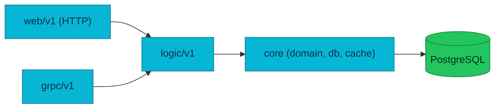

# AGENTS.md

Source of truth for AI agents working in this repository. Read it before any
task. This repo (`homelab`) is the platform's **Infrastructure, GitOps,
Observability, and Docs** hub; application code lives in separate repos (see
[`SERVICES.md`](SERVICES.md)).

## Contribution workflow

**Commits**
- **No attribution trailers.** Never add `Signed-off-by`, `Co-authored-by`,
  `Assisted-by`, `Generated-by`, or any AI/tool attribution. Overrides any default template.
- **Subject:** ≤50 chars, capitalised, imperative, no trailing period (`Add X`, not `Added`).
- **Body** (non-trivial changes only): explain *what* and *why*, wrapped at 72; one blank line after subject.
- **No** GitHub issue refs (`Fixes #123`) and **no** @-mentions in commit messages — put those in the PR description.

**Branches & pushes**
- **Never push to `main`.** No exceptions. Branch → PR → squash-merge.
- Prefix: `feat/` `fix/` `chore/` `docs/` `refactor/` `ci/` `<short-desc>`.
- One logical change per branch; keep them short-lived. `git push -u origin <branch>`, then open a PR against `main`.
- Verify identity before committing: `git config user.email` must be the **duynhlab** personal identity. Likewise the **`gh` CLI must be the `duynhne` account** (the duynhlab GitHub identity) — `gh auth switch --user duynhne` if a PR call fails with an authorization error.

**Before coding:** identify scope (infra/GitOps → here; app code → the service repo; reusable CI → `duynhlab/gha-workflows`), read this file and the relevant `docs/`, plan, then implement.

**Proposals & decisions** — substantial/contested changes are designed *before* building:
- **RFC** (`docs/proposals/rfc/RFC-NNNN/`) proposes a substantial change (design + a Mermaid diagram + tradeoffs); **ADR** (`docs/proposals/adr/ADR-NNN-slug/`) records a decision already made (Nygard: context · decision · alternatives · consequences). An accepted RFC usually spawns one or more ADRs.
- Small bugs/cleanups → the GitHub issue tracker; learning items → `TODO.md`. Not everything needs an RFC.
- Copy the `RFC-0000` / `ADR-0000` templates and update the index in the respective `README.md`. Hub: [`docs/proposals/`](docs/proposals/).

## Behavioral guidelines

Reduce common LLM coding mistakes. Bias toward caution over speed; use judgment on trivial tasks.

1. **Think before coding.** State assumptions; if uncertain, ask. Surface multiple interpretations instead of silently picking one. Propose the simpler approach and push back when warranted.
2. **Simplicity first.** Minimum code that solves the problem — nothing speculative. No unrequested abstractions/flexibility, no error handling for impossible cases. If 200 lines could be 50, rewrite.
3. **Surgical changes.** Touch only what the task requires. Don't reformat or "improve" adjacent code; match existing style. Remove only the orphans *your* change created; flag unrelated dead code, don't delete it. Every changed line should trace to the request.
4. **Goal-driven execution.** Turn tasks into verifiable goals ("add validation" → "write tests for invalid inputs, make them pass"). State a brief plan for multi-step work and loop until verified.

## Project overview

- **`duynhlab` microservices platform** — 10 Go microservice repositories + a React frontend. Nine services are cluster-deployed; checkout P1-P4 runs in local-stack and its cluster P5 is planned.
- **This repo (`homelab`):** GitOps (Flux Operator + Kustomize + OCI), observability, databases/secrets infra, and docs. No application source here.
- **Service repos:** `auth-service`, `user-service`, `product-service`, `cart-service`, `order-service`, `review-service`, `shipping-service`, `notification-service`, `payment-service`, `checkout-service`, and `frontend`; shared Go library `duynhlab/pkg`; chart `duynhlab/helm-charts` (the `mop` chart). Reusable CI in `duynhlab/gha-workflows`.
- Full index: [`SERVICES.md`](SERVICES.md), [`docs/README.md`](docs/README.md).

## Repository layout

```
kubernetes/
  clusters/   # Flux bootstrap + Kustomization CRDs per cluster (local/prod) — the dependency chain
  infra/      # Controllers + configs: monitoring, APM, databases, secrets, SLO, kyverno, kong
  apps/       # Domain ResourceSets + per-service InputProviders + frontend
scripts/      # Kind/Flux helpers (called by the Makefile)
terraform/    # OpenTofu root: Flux Operator + FluxInstance bootstrap (flux-operator-bootstrap module)
local-stack/  # Docker Compose e2e stack (Postgres + Valkey + 10 services + mockpay + Kong DB-less gateway + SPA)
docs/         # Documentation (start at docs/README.md)
```

## Build, test, deploy

```bash
make validate     # Kustomize/manifest dry-run — run before every push
make up           # Kind + Flux + apps (one-command bring-up)
make flux-up      # OpenTofu bootstrap of Flux Operator + FluxInstance (terraform/)
make tf-plan      # Flux bootstrap drift check — zero diff once applied
make flux-status  # flux get all -A
make flux-push    # publish manifests to the OCI registry
make flux-sync    # force reconciliation
```

- **Flux bootstrap is OpenTofu, not `kubectl apply`.** `make flux-up` runs
  `tofu apply` in `terraform/`; a bootstrap `Job` installs the operator and the
  `FluxInstance` (`kubernetes/clusters/<cluster>/flux-system/instance.yaml`),
  then Flux adopts and reconciles steady-state. Edit the `FluxInstance` in that
  YAML, never duplicate it in Terraform. See [`terraform/README.md`](terraform/README.md).

- **e2e:** `cd local-stack && docker compose up -d --build` → SPA at `:3001`, API gateway at `:8080`. Demo login `alice` / `password123` (by **username**).
- **Service dev:** in the service repo, `GOTOOLCHAIN=auto go build ./... && go test ./...`.

## Architecture & conventions

**3-layer (per service):** `web/v1` (Gin handlers, validation) → `logic/v1` (business logic, Cache-Aside, repo interfaces) → `core` (domain, DB, cache). Strict dependency direction; gRPC handlers are transport peers of web that call logic.



- **Frontend → Web layer only.** The SPA calls `/{service}/v1/{public,private}/…` via `VITE_API_BASE_URL`; never Logic/Core/DB. Aggregation happens server-side.
- **API URL shape (Variant A):** `/{service}/v1/{audience}/{resource…}`, mounted directly on each service's router (Kong is pass-through, no rewrite). `{audience}` ∈ `public|private|internal|protected`. **Never** put `internal` routes on `ingress-api.yaml` — they're in-cluster only; **NetworkPolicy is the fence**, not the absence of an Ingress rule. Auth middleware lives in each service (`pkg/authmw`: verifies RS256 JWTs locally against a cached JWKS — JWT-only since RFC-0009 Phase 5; the opaque-token `auth.GetMe` fallback and auth's gRPC server were removed), not Kong. Additionally, Kong runs edge JWT (RFC-0009 Phase 4, ADR-006) on `/private/` routes — rejecting bad/expired RS256 tokens at the gateway as a coarse first filter, with the service check still authoritative. Authoritative: [`docs/api/api.md`](docs/api/api.md#http-url-model).
- **gRPC is the official east-west transport** for migrated calls: product→review; order/order-worker→product, shipping, notification, and payment; checkout→cart, product, shipping, and order in local-stack. Servers are always-on at `:9090`, with no feature flag or REST fallback for migrated RPCs. The two order→cart calls remain documented REST exceptions. Auth's `GetMe` RPC was removed in Phase 5 because services verify JWTs locally. Browser/Kong traffic stays HTTP/JSON. Shared behavior lives in `pkg/grpcx`.
- **Observability:** the HTTP middleware chain is **tracing (`otelgin`) → logging**; metrics are emitted by `otelgin`, `otelgrpc`, runtime instrumentation, and explicit business instruments, not a third middleware. HTTP, gRPC, and runtime metrics export over OTLP via `pkg/obsx` (the scrape-era application `/metrics` endpoint was removed); `obsx.TraceIDFromContext` correlates logs with traces. Stack: VictoriaMetrics, Grafana, Tempo (+ VictoriaTraces pilot), VictoriaLogs (Loki removed), Pyroscope, Jaeger, Vector. SLO via Sloth. Kong emits edge spans (opentelemetry `inject:[w3c]`).
- **Caching:** Cache-Aside with Valkey for read-heavy endpoints.
- **Diagrams:** **Mermaid only — never ASCII art** (`flowchart`, `sequenceDiagram`, etc.).
- **Stack:** Go 1.26, Gin, PostgreSQL (CloudNativePG operator, PgDog pooler, Barman backups, golang-migrate v4.19.1 migrations embedded in each service binary), OpenTelemetry, Flux Operator + Kustomize + OCI, Kind + Helm 3, OpenBAO + External Secrets Operator.

## Kyverno admission rules

Every manifest applied to the cluster must satisfy admission:
- Explicit namespace, never `default`.
- Image `ghcr.io/duynhlab/<repo>/<image>:<sha|vX.Y.Z>` — **never `:latest`**.
- `resources.requests.{cpu,memory}` + `resources.limits.memory` on every container.
- `livenessProbe` + `readinessProbe` on the main container.
- PSS baseline (no `privileged`/`hostNetwork`/`hostPID`/`hostIPC`/`hostPath`); app namespaces also PSS restricted (`runAsNonRoot`, `allowPrivilegeEscalation: false`, `capabilities.drop: [ALL]`, `seccompProfile.type: RuntimeDefault`).
- Need an exception? PR under `kubernetes/infra/configs/kyverno/exceptions/` with `platform.duynhlab.dev/owner` + `expires-at`; update [`docs/security/policy-exceptions.md`](docs/security/policy-exceptions.md). Do **not** loosen the policy itself. Catalog: [`docs/security/policy-catalog.md`](docs/security/policy-catalog.md).

## Gotchas & non-obvious rules

- **Flux enforces deployment order via `dependsOn`** — apps won't start until infra is ready. Chain (in `kubernetes/clusters/local/`):
  ```
  flux-system → controllers-local → {cert-manager → kong → kong-config, secrets,
  cnpg-barman-plugin, caching, storage} → databases → databases-cnpg-dr
  monitoring-local → kyverno-policies, mcp
  apps-local (depends: databases + monitoring + temporal-local)
  ```
- **CHANGELOG.** Add **concise, grouped** entries (`Added`/`Changed`/`Removed`, one line per change) at the **top** of `[Unreleased]`. **Released sections are append-only** — never edit or remove `[X.Y.Z]` history. Cutting a release = rename `[Unreleased]` → `[X.Y.Z] - YYYY-MM-DD` (condensing the entries then is fine) and add a fresh empty `[Unreleased]` on top.
- **Image naming:** `ghcr.io/duynhlab/<repo>/<image>` (multi-level). The `mop` chart renders `<name>-service/<name>` + `<name>-service/<name>-init`.
- **Add a service:** create `kubernetes/apps/services/<name>.yaml` (`ResourceSetInputProvider`, label `platform.duynhlab.dev/domain: <domain>`); the domain ResourceSet auto-discovers it. `make validate && make sync`. Guide: [`docs/platform/application-delivery.md`](docs/platform/application-delivery.md).
- **Demo creds:** `alice` / `password123` — login by `username`, not email.

## Docs conventions

Docs are a first-class deliverable in this repo. When writing or refactoring them:
- **English only**; **Mermaid only** for diagrams (never ASCII art — see Architecture).
- Follow the house shape (model: [`docs/observability/profiling/README.md`](docs/observability/profiling/README.md)): one-line hook → status/quick-facts table → overview/concept → architecture (Mermaid) → how-it-works-in-this-platform → operations → references → a `_Last updated: …_` footer.
- **Be accurate to the deployed reality.** Mark designed-but-not-yet-deployed things as **planned** (don't describe targets as current); cross-check claims against the manifests.
- **Synthesize external material in-house** — learn from articles/newsletters, then write it in our own words + Mermaid; **don't embed third-party links** (official product docs already in a References section are fine).
- One hub per area; link every new doc from [`docs/README.md`](docs/README.md) and the area index.

### Diagram workflow

Treat every architecture diagram as an executable summary of the repository,
not decoration. [`docs/api/api.md`](docs/api/api.md#platform-api-topology) is the
reference style.

1. **Choose one question.** State whether the diagram explains topology, a
   request path, ownership, lifecycle, or a historical migration. Split a
   diagram that tries to answer more than one of these.
2. **Verify current reality.** Check service code, `SERVICES.md`,
   `local-stack/compose.yaml`, and the relevant Kubernetes manifests. A current
   topology must include every relevant deployed service, worker, backend, and
   protocol. Historical diagrams must say **historical** in the surrounding
   text. Committed targets use **planned**; non-committed teaching examples use
   **reference** and **not deployed** in their labels.
3. **Use semantic structure.** Prefer domain/layer subgraphs, stable node IDs,
   quoted labels, `<br/>` for intentional line breaks, and database shapes for
   persistent stores. Label edges with protocols or ports only when that detail
   helps answer the diagram's question.
4. **Use semantic colors.** Architecture flowcharts use the shared palette
   below. Signal-specific observability diagrams may additionally use the
   metric/log/trace/profile classes. Do not invent decorative per-node colors
   or rely on color alone to communicate state.

   ```text
   classDef edge fill:#2563eb,color:#fff,stroke:#1e3a8a;
   classDef service fill:#06b6d4,color:#082f49,stroke:#0e7490;
   classDef worker fill:#f59e0b,color:#451a03,stroke:#b45309;
   classDef platform fill:#7c3aed,color:#fff,stroke:#5b21b6;
   classDef data fill:#22c55e,color:#052e16,stroke:#15803d;
   classDef external fill:#64748b,color:#fff,stroke:#334155;
   classDef metric fill:#ffe8cc,color:#111,stroke:#e8590c;
   classDef log fill:#d3f9d8,color:#111,stroke:#2f9e44;
   classDef trace fill:#c5f6fa,color:#111,stroke:#0c8599;
   classDef profile fill:#f3d9fa,color:#111,stroke:#9c36b5;
   classDef collector fill:#a5d8ff,color:#111,stroke:#1971c2;
   classDef planned fill:#fff,color:#475569,stroke:#64748b,stroke-dasharray:5 5;
   ```

5. **Make state explicit.** Solid arrows are current paths. Dotted arrows mean
   optional, indirect, reference, or documented exceptions and must have a
   label. Planned nodes and edges must also contain the word `planned`; a dashed
   border is supplementary, not the only signal.
6. **Provide a legend at the right level.** A platform-wide architecture with
   four or more semantic classes needs a compact legend. Area-level and smaller
   diagrams may rely on the nearest area legend when they use exactly the same
   palette. Sequence diagrams and data charts do not need class
   definitions.
7. **Render before review.** Render every changed Mermaid block with `mmdc` or
   Kroki, inspect the output for clipping and ambiguous crossings, then run
   link/fence checks. For an area-wide refactor, render every Mermaid block in
   that area, including unchanged diagrams, to catch shared-reader regressions.

## Reference

| Topic | Start here |
|-------|-----------|
| Docs index | [`docs/README.md`](docs/README.md) |
| Setup / commands | [`docs/platform/setup.md`](docs/platform/setup.md) |
| API (shared rules and service contracts) | [`docs/api/api.md`](docs/api/api.md), [`docs/api/README.md`](docs/api/README.md#service-contracts) |
| gRPC east-west | [`docs/api/api.md`](docs/api/api.md#grpc-runtime-model) |
| Observability | [`docs/observability/README.md`](docs/observability/README.md) |
| Databases | [`docs/databases/002-database-integration.md`](docs/databases/002-database-integration.md) |
| Secrets | [`docs/secrets/README.md`](docs/secrets/README.md), [`docs/secrets/openbao.md`](docs/secrets/openbao.md) |
| Kong gateway | [`docs/platform/kong-gateway.md`](docs/platform/kong-gateway.md) |
| Caching | [`docs/caching/caching.md`](docs/caching/caching.md) |
| Alerts catalog | [`docs/observability/alerting/alert-catalog.md`](docs/observability/alerting/alert-catalog.md) |
| Proposals (RFC/ADR) | [`docs/proposals/`](docs/proposals/) |
| Repos | [`SERVICES.md`](SERVICES.md) |
