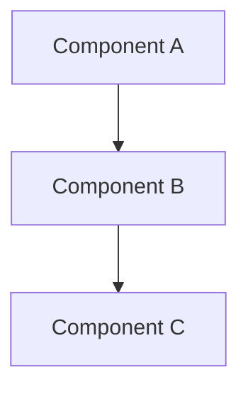
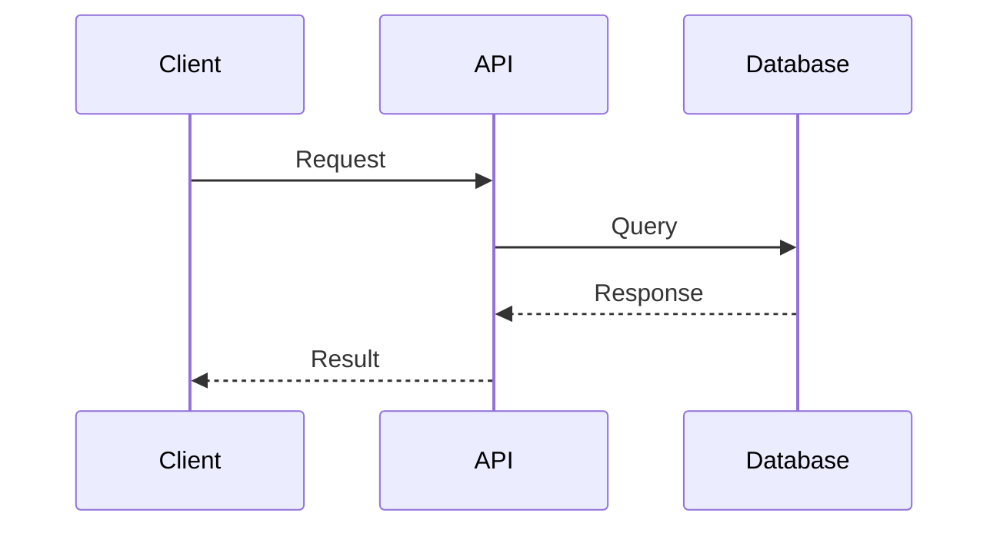
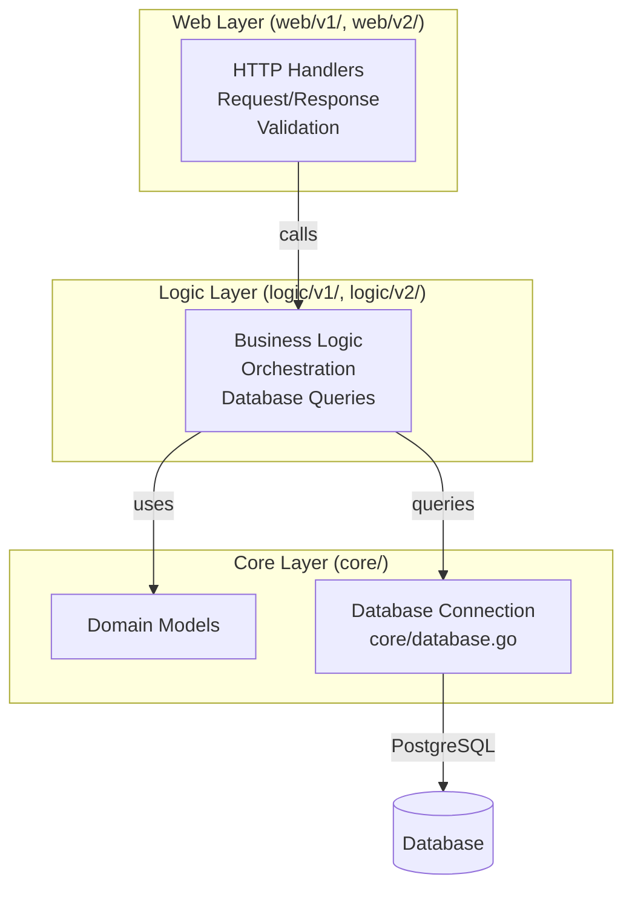

# AI Agent Guide

> **IMPORTANT**: AGENTS.md files are the source of truth for AI agent instructions. Always update the relevant AGENTS.md file when adding or modifying agent guidance.

> **IMPORTANT**: This project is directly related to the user's day-to-day work as a Senior DevOps / SRE. Recommendations should prioritize production-grade, scalable, and maintainable solutions.

> **CRITICAL**: **ALWAYS READ THIS FILE FIRST** before starting any task. This file contains essential patterns, conventions, and best practices that must be followed.

## Overview

This guide provides quick reference for AI agents working with this codebase. For detailed documentation, see [`docs/`](docs/README.md) - start with [`docs/guides/`](docs/guides/) for development workflows.

---

## Agent Workflow

### Before Starting Any Task

1. **Read AGENTS.md FIRST** - This file contains essential patterns, conventions, and best practices
2. **Read relevant docs** - Check `docs/guides/` for existing documentation
3. **Research if needed** - For API/architecture work, research industry patterns (see [`docs/guides/RESEARCH_PATTERNS.md`](docs/guides/RESEARCH_PATTERNS.md))
4. **Plan before coding** - Understand the problem, propose solution, get approval
5. **Follow conventions** - Use existing patterns, don't reinvent

### Code Quality Standards

- **Consistency**: Follow existing code patterns (see [`docs/guides/API.md`](docs/guides/API.md#conventions-and-standards))
- **Documentation**: Update relevant docs when adding features
- **Testing**: Write tests for new functionality
- **Error Handling**: Use consistent error patterns
- **Logging**: Use structured logging with appropriate levels (see [`docs/apm/LOGGING.md`](docs/apm/LOGGING.md))
- **API Patterns**: Research industry best practices before implementing (see [`docs/guides/RESEARCH_PATTERNS.md`](docs/guides/RESEARCH_PATTERNS.md))
- **APM Patterns**: Follow established observability patterns (see [`docs/apm/`](docs/apm/))
- **Database Patterns**: Research database patterns, reference [`docs/guides/DATABASE.md`](docs/guides/DATABASE.md)

---

## Documentation Standards

### Diagram Requirements

**MANDATORY**: All architecture diagrams, flowcharts, and system visualizations MUST use Mermaid syntax.

**Rules**:

1. ❌ **NEVER** use ASCII art diagrams (boxes with `┌─┐`, arrows with `│`, `→`, `▼`, etc.)
2. ✅ **ALWAYS** use Mermaid diagrams for:
   - Architecture diagrams (`flowchart`, `graph`)
   - Sequence diagrams (`sequenceDiagram`)
   - State diagrams (`stateDiagram`)
   - Entity relationship diagrams (`erDiagram`)
   - Class diagrams (`classDiagram`)
   - Gantt charts (`gantt`)

**Examples**:





**Enforcement**: When reviewing or creating documentation:

- Replace existing ASCII diagrams with Mermaid equivalents
- Ensure all new diagrams use Mermaid syntax
- Use appropriate Mermaid diagram types for the content

---

## Development Commands

Quick Go commands for local development (no Docker/Kubernetes needed):

```bash
# Run service locally
cd services
go run cmd/{service}/main.go

# Run tests
go test ./...
go test ./internal/{service}/...

# Build binary (no Docker needed for dev)
go build -o bin/{service} cmd/{service}/main.go
```

**Detailed Configuration**: See [`docs/guides/API.md`](docs/guides/API.md) for environment variables, `.env` files, and local setup.

**GitOps Deployment**: See deployment commands in [Deployment Order](#deployment-order) section. Use `make up` for one-command deployment or `make flux-push` to deploy all services to Kubernetes.

---

## Architecture Overview

### 3-Layer Architecture

All microservices follow a consistent 3-layer architecture:



**Database Integration**: See [`docs/guides/DATABASE.md`](docs/guides/DATABASE.md) for database architecture, connection patterns (direct, PgBouncer, PgCat), and configuration.

**Layer Responsibilities**:

- **Web Layer** (`web/v1/`, `web/v2/`): HTTP handlers, request/response, validation
- **Logic Layer** (`logic/v1/`, `logic/v2/`): Business logic, orchestration, database queries
- **Core Layer** (`core/domain/`, `core/database.go`): Domain models, database connections

**Detailed Architecture**: See [`docs/apm/ARCHITECTURE.md`](docs/apm/ARCHITECTURE.md) for middleware chain and APM integration. Full system architecture in [`specs/system-context/01-architecture-overview.md`](specs/system-context/01-architecture-overview.md)

---

### Frontend Integration Rules

**CRITICAL**: Frontend (React SPA) can ONLY interact with Web Layer endpoints.

**Allowed:**

- ✅ HTTP requests to `/api/v1/*` and `/api/v2/*` endpoints
- ✅ All requests go through Web Layer handlers
- ✅ Web Layer handles aggregation, validation, error translation

**Forbidden:**

- ❌ Direct calls to Logic Layer (no function calls to services)
- ❌ Direct calls to Core Layer (no database access)
- ❌ Client-side orchestration (use aggregation endpoints instead)
- ❌ Bypassing Web Layer in any way

**Why:**

- Web Layer provides HTTP interface, validation, authentication
- Logic/Core layers are internal implementation details
- Aggregation endpoints handle complex operations server-side

**Reference:** See [`docs/guides/API.md`](docs/guides/API.md) for complete API documentation and 3-layer architecture details.

---

## Key Design Patterns

- **Clean Architecture**: 3-layer separation (web → logic → core) with clear boundaries
- **Frontend → Web Layer Only**: Frontend can ONLY call Web Layer HTTP endpoints, never Logic/Core directly
- **API Versioning**: Parallel v1/v2 endpoints, no breaking changes, gradual migration path
- **Microservices**: 9 independent services with bounded contexts, each in own namespace
- **Middleware Chain**: Ordered middleware (tracing → logging → metrics) for observability

**Middleware Details**: See [`docs/guides/TRACING_ARCHITECTURE.md`](docs/guides/TRACING_ARCHITECTURE.md) for middleware chain ordering and responsibilities.

---

## Technology Stack

- **Runtime**: Go 1.25
- **Database**: PostgreSQL (5 clusters via Zalando/CloudNativePG operators)
  - Connection poolers: PgBouncer, PgCat
  - Migrations: Flyway 11.19.0 (8 migration images)
  - **Database Documentation**: [`docs/guides/DATABASE.md`](docs/guides/DATABASE.md)
- **HTTP Framework**: Gin
- **Observability**: OpenTelemetry (traces, metrics, logs)
- **GitOps**: Flux Operator, Kustomize, OCI Registry
- **Deployment**: Kubernetes (Kind), Helm 3
- **Monitoring**: Prometheus, Grafana, Tempo, Loki, Pyroscope, Jaeger

**Observability Details**: See [`docs/apm/README.md`](docs/apm/README.md) for complete APM system overview. Metrics documentation in [`docs/monitoring/METRICS.md`](docs/monitoring/METRICS.md)

---

## Project Structure

```
monitoring/
├── services/          # Go application code (9 microservices)
├── charts/            # Helm chart for microservices
├── kubernetes/        # GitOps manifests (Flux + Kustomize)
│   ├── base/          # Shared manifests (apps + infrastructure)
│   ├── overlays/      # Environment patches (local/staging/production)
│   └── clusters/      # Flux system config per cluster
├── k8s/               # Legacy manifests (reference only)
├── scripts/           # Deployment scripts (Flux + legacy)
├── docs/              # Documentation (starting point for details)
├── services/
│   ├── k6/            # K6 load testing
└── specs/             # Specifications and research
```

**GitOps Structure:**

- `kubernetes/base/` - Environment-agnostic manifests (HelmReleases, infrastructure)
- `kubernetes/overlays/` - Environment-specific patches (local: 1 replica, prod: 5 replicas)
- `kubernetes/clusters/` - Flux Operator bootstrap and Kustomization CRDs

**Full Documentation Index**: See [`docs/README.md`](docs/README.md) for complete documentation structure.

---

## API Endpoints

9 microservices with RESTful APIs:

| Service | Namespace | Base URLs |
|---------|-----------|-----------|
| auth | auth | `/api/v1/*`, `/api/v2/*` |
| user | user | `/api/v1/*`, `/api/v2/*` |
| product | product | `/api/v1/*`, `/api/v2/*` |
| cart | cart | `/api/v1/*`, `/api/v2/*` |
| order | order | `/api/v1/*`, `/api/v2/*` |
| review | review | `/api/v1/*`, `/api/v2/*` |
| notification | notification | `/api/v1/*`, `/api/v2/*` |
| shipping | shipping | `/api/v1/*` (v1 only) |
| shipping-v2 | shipping | `/api/v2/*` (v2 only) |

**Complete API Documentation**: See [`docs/guides/API.md`](docs/guides/API.md) for all endpoints, request/response models, and examples.

---

## Important Notes

### Deployment Order

**GitOps Workflow** - Infrastructure → Apps (Flux enforces via `dependsOn`)

```bash
# One-command deployment
make up

# Or step-by-step:
make cluster-up   # 1. Create Kind Cluster + OCI Registry
make flux-up      # 2. Bootstrap Flux Operator
make flux-push    # 3. Deploy All (Flux reconciles in dependency order)
```

**Flux automatically deploys in correct order:**

1. **Foundation** - Flux Operator, namespaces, OCI sources
2. **Infrastructure** (BEFORE apps) - Monitoring, APM, Databases, SLO
   - Monitoring: Prometheus, Grafana, Metrics Server
   - APM: Tempo, Loki, Vector, OTel Collector, Pyroscope, Jaeger
   - Databases: PostgreSQL operators, 5 clusters, connection poolers
   - SLO: Sloth Operator + 9 PrometheusServiceLevel CRDs
3. **Applications** - 9 microservices + frontend + k6 load testing

**Dependency Chain:**

- `apps-local` has `dependsOn: [infrastructure-local]`
- Apps **will NOT start** until infrastructure is ready
- Flux enforces this automatically via Kustomization CRDs

**Verification:**

```bash
# Check Flux reconciliation status
make flux-status
# Or: flux get kustomizations

# Check all resources
kubectl get pods --all-namespaces
kubectl get helmreleases --all-namespaces

# Trigger manual reconciliation (if needed)
make flux-sync
# Or: flux reconcile kustomization infrastructure-local --with-source
```

**Detailed Deployment Guide**: See [`docs/guides/SETUP.md`](docs/guides/SETUP.md)

### Key Infrastructure

- **5 PostgreSQL Clusters**: review-db, auth-db, supporting-db, product-db, transaction-db
- **Connection Poolers**: PgBouncer (Auth), PgCat (Product, Cart+Order)
- **Migrations**: Flyway 11.19.0 with 8 migration images
- **Operators**: Zalando Postgres Operator (v1.15.1), CloudNativePG Operator (v1.28.0)
- **SLO**: Managed via Sloth Operator (PrometheusServiceLevel CRDs)
- **CI/CD**: GitHub Actions workflows (build-images, build-init-images, build-k6-images, helm-release)

---

## Quick Navigation

### Detailed Guides

- **Research Patterns**: [`docs/guides/RESEARCH_PATTERNS.md`](docs/guides/RESEARCH_PATTERNS.md) - API, APM, Database research patterns
- **Command Reference**: See [`docs/guides/SETUP.md`](docs/guides/SETUP.md#command-reference) - Deployment scripts, Helm, kubectl commands
- **Conventions**: [`docs/guides/API.md`](docs/guides/API.md#conventions-and-standards) - Naming conventions, code standards, build verification
- **API Reference**: [`docs/guides/API.md`](docs/guides/API.md) - Complete API documentation
- **Setup Guide**: [`docs/guides/SETUP.md`](docs/guides/SETUP.md) - Deployment instructions
- **Configuration**: [`docs/guides/API.md`](docs/guides/API.md) - Environment variables and config
- **Database**: [`docs/guides/DATABASE.md`](docs/guides/DATABASE.md) - Database architecture and patterns

### Find Files by Purpose

**Add a new service:**

- Service code: `services/cmd/{service}/`, `services/internal/{service}/`
- Helm values: `charts/mop/values/{service}.yaml`
- HelmRelease: `kubernetes/apps/{service}.yaml`
- SLO CRD: `kubernetes/infra/configs/monitoring/slo/{service}.yaml`
- Migration: `services/{service}/db/migrations/Dockerfile` + `sql/V*__*.sql`
- Push to OCI: `make flux-push` (updates OCI registry)

**Update monitoring:**

- Dashboard JSON: `kubernetes/infra/configs/monitoring/grafana/dashboards/*.json`
- ServiceMonitors: `kubernetes/infra/configs/monitoring/servicemonitors/`
- PodMonitors: `kubernetes/infra/configs/monitoring/podmonitors/`

**Modify SLOs:**

- Edit CRDs: `kubernetes/infra/configs/monitoring/slo/*.yaml` (PrometheusServiceLevel CRDs)
- Push changes: `make flux-push` (updates OCI registry)
- Apply: Flux reconciles automatically, or `make flux-sync`

**Modify infrastructure:**

- Databases: `kubernetes/infra/configs/databases/`
- Controllers: `kubernetes/infra/controllers/` (metrics, logging, tracing, profiling, databases)
- Configs: `kubernetes/infra/configs/` (monitoring, databases)

### Find Documentation by Topic

- **Getting Started**: [`docs/guides/SETUP.md`](docs/guides/SETUP.md), [`docs/guides/API.md`](docs/guides/API.md)
- **Development**: [`docs/guides/API.md`](docs/guides/API.md), [`docs/guides/API.md#error-handling`](docs/guides/API.md#error-handling), [`docs/guides/TRACING_ARCHITECTURE.md`](docs/guides/TRACING_ARCHITECTURE.md)
- **Monitoring**: [`docs/monitoring/METRICS.md`](docs/monitoring/METRICS.md)
- **APM**: [`docs/apm/README.md`](docs/apm/README.md), [`docs/apm/TRACING.md`](docs/apm/TRACING.md), [`docs/apm/LOGGING.md`](docs/apm/LOGGING.md), [`docs/apm/PROFILING.md`](docs/apm/PROFILING.md)
- **SLO**: [`docs/slo/README.md`](docs/slo/README.md), [`docs/slo/GETTING_STARTED.md`](docs/slo/GETTING_STARTED.md)
- **k6**: [`docs/guides/K6.md`](docs/guides/K6.md)
- **Docs Index**: [`docs/README.md`](docs/README.md)

---

## Changelog

See [`CHANGELOG.md`](CHANGELOG.md) for complete version history.

**Important for AI Agents**: Do NOT modify existing entries in [`CHANGELOG.md`](CHANGELOG.md). ONLY add new entries at the top. Never edit or remove historical changelog entries.

---
