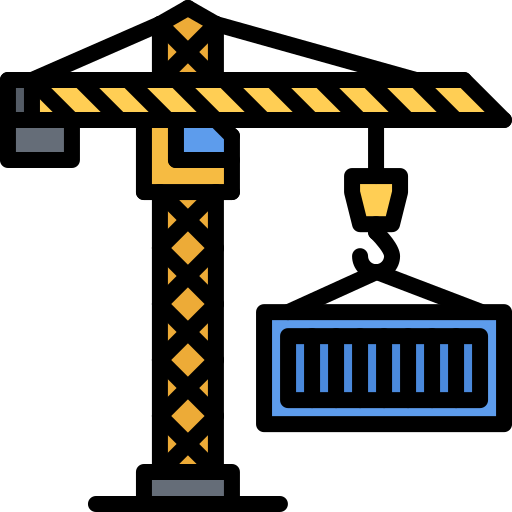
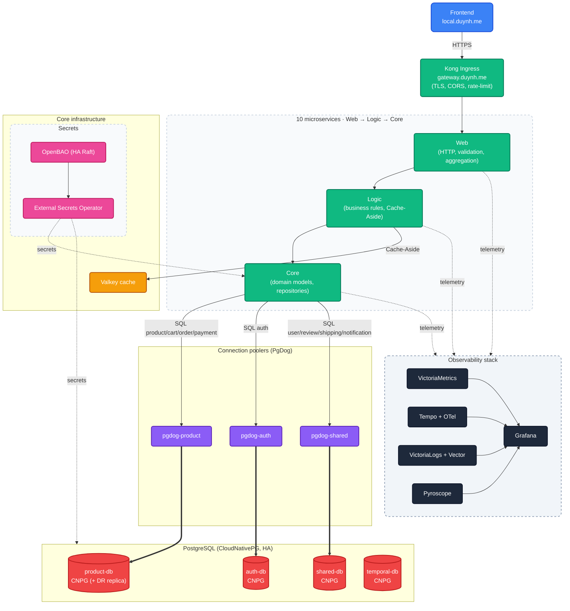
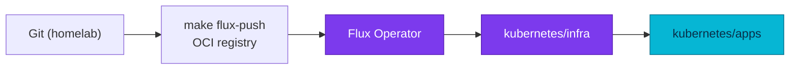

<div align="center">

<a name="readme-top"></a>



<h1>duynhlab homelab</h1>

<p><em>Infrastructure, GitOps, and observability for the duynhlab microservices platform.</em></p>

<p>
  <a href="kubernetes/">Kubernetes</a>
  &middot;
  <a href="terraform/">OpenTofu</a>
  &middot;
  <a href="local-stack/">Local Stack</a>
</p>

<p>
  <a href="https://kind.sigs.k8s.io/"></a>&nbsp;
  <a href="https://fluxcd.io/"></a>&nbsp;
  <a href="https://opentofu.org/"></a>&nbsp;
  <a href="https://github.com/duynhlab/homelab/actions/workflows/ci.yml"></a>&nbsp;
  <a href="https://github.com/duynhlab/homelab/actions/workflows/renovate.yml"></a>
</p>

</div>

---

## Overview

Platform delivery hub: Kubernetes manifests (Flux + Kustomize + OCI), observability
stack, database and secrets infra, and Kyverno policies. Deploys **10 Go microservices**
and a React frontend on **Kind** locally. Application source lives in separate
repositories.

---

## Topology



---

## Repository layout

| Path | Role |
|------|------|
| `kubernetes/clusters/` | Flux bootstrap + per-cluster `Kustomization` dependency chain |
| `kubernetes/infra/` | Controllers and configs — monitoring, databases, secrets, Kong, Kyverno |
| `kubernetes/apps/` | Domain ResourceSets and per-service InputProviders |
| `terraform/` | OpenTofu bootstrap of Flux Operator + `FluxInstance` |
| `local-stack/` | Docker Compose e2e stack (no cluster required) |
| `docs/` | Platform documentation |
| `scripts/` | Kind, Flux, and validation helpers (Makefile targets) |

---

## GitOps delivery

Manifests are built with Kustomize, published as OCI artifacts, and reconciled by
the Flux Operator. Infra must reconcile before apps (`dependsOn` in
`kubernetes/clusters/local/`).



---

## Quick start

```bash
make prereqs                  # check kind, kubectl, flux, helm, docker, tofu
sudo scripts/setup-hosts.sh   # *.duynh.me → 127.0.0.1
make up                       # Kind + OCI push + Flux bootstrap
make flux-status              # watch reconciliation (~5–10 min first time)
```

Other targets: `make validate`, `make sync`, `make down`, `make help`.

---

## Local access

Kind maps host `80`/`443` to Kong. TLS is a wildcard `*.duynh.me` cert — self-signed
`homelab-ca` on local Kind (browser warning); Let's Encrypt on prod.

| URL | Purpose |
|-----|---------|
| https://local.duynh.me | Frontend SPA |
| https://gateway.duynh.me | API gateway |
| https://grafana.duynh.me | Dashboards |
| https://ui.duynh.me | Flux UI |

Demo login: `alice` / `password123` (by username).

---

## Local stack

Without Kubernetes:

```bash
cd local-stack && docker compose up -d --build
```

SPA at http://localhost:3001, gateway at http://localhost:8080.

---

**Built with ❤️.**
