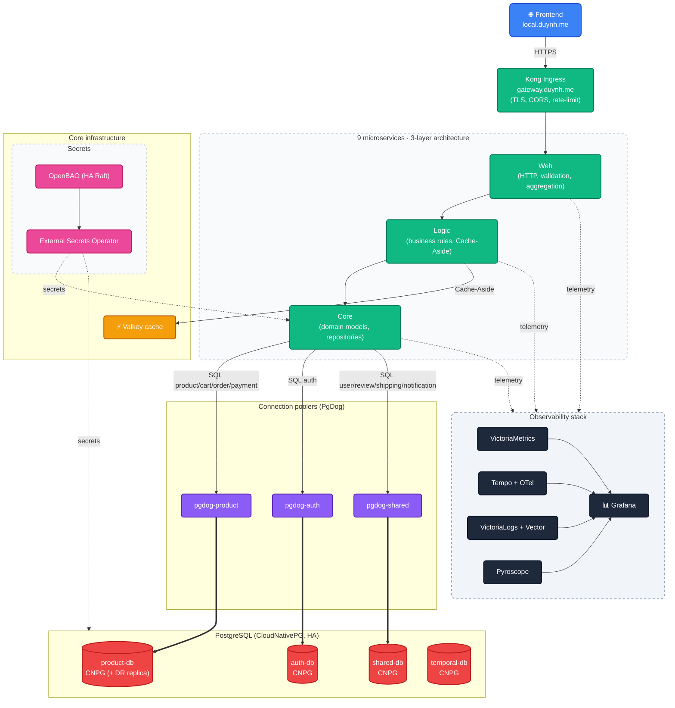

# Microservices Observability Platform

A GitOps-managed Kubernetes homelab cluster running on Kind.

---

## Overview

Production-grade microservices platform built to practise day-2 SRE work end-to-end:
9 Go services, full observability (metrics / traces / logs / profiles), HA PostgreSQL,
SLOs with burn-rate alerts, and a single source of truth in Git delivered via Flux.

**Key features:**

- 9 microservices behind a single Kong API gateway with a **Unified Routing Convention**. All endpoints follow a strict `/{service}/v1/{audience}/…` URL shape, allowing browser and in-cluster callers to use the exact same paths. Kong acts as a pure pass-through proxy without any URL rewrites.
- **gRPC for east-west** service-to-service calls (product→review, order→shipping/notification, order→payment) — gRPC-only on `:9090` via the shared `pkg/grpcx`; browser/edge traffic stays HTTP/JSON. gRPC RED metrics surface on each service's `/metrics` via `pkg/obsx`.
- Frontend on `https://local.duynh.me`, API gateway on `https://gateway.duynh.me`.
  TLS terminated by Kong — on local Kind with a self-signed `homelab-ca` wildcard
  (expect a browser warning); prod uses a publicly-trusted Let's Encrypt wildcard.
- Full observability: VictoriaMetrics, Tempo + Jaeger, VictoriaLogs + Vector, Pyroscope,
  15 Grafana dashboards.
- 3 application PostgreSQL clusters + `temporal-db` + 1 DR replica (all CloudNativePG),
  fronted by PgDog. Schema migrations via golang-migrate, embedded in each service binary.
- Valkey (Redis-compatible) cache with Cache-Aside pattern in the Logic layer.
- SLOs managed declaratively by Sloth Operator.
- GitOps with Flux Operator, ResourceSets, OCI artifacts, and Kustomize.
- Secrets in OpenBAO (HA Raft), synced into the cluster by External Secrets Operator.

> This repository contains **infrastructure, GitOps, observability, and docs**.
> Application code lives in separate repositories — see [`SERVICES.md`](SERVICES.md).

For deep documentation, start at [`docs/README.md`](docs/README.md).

---

## Architecture Overview



**At a glance:**

- **Edge** — Kong terminates TLS with a wildcard cert (`*.duynh.me`) — self-signed
  `homelab-ca` on local Kind (browser warning), Let's Encrypt on prod —
  enforces CORS, rate-limit, and request-size-limit. Force HTTP → HTTPS via Kong
  annotations. Auth is **not** done at the gateway — every service validates JWTs
  in its own middleware (defence-in-depth).
- **Microservices** — 4 bounded-context domains: identity, catalog, checkout, comms.
  Each service is its own repo, its own namespace, its own database role. East-west
  calls run over gRPC (`pkg/grpcx`); the edge stays HTTP/JSON.
- **Data** — 3 application PostgreSQL clusters + `temporal-db` on CloudNativePG,
  behind PgDog poolers, with golang-migrate migrations. product-db has a
  continuously-recovering DR replica.
- **Observability** — OpenTelemetry-first across metrics, traces, logs, and profiles.
  All four pillars converge in Grafana via shared exemplars.
- **Delivery** — Flux Operator pulls OCI artifacts from a registry. Domain ResourceSets
  template per-service InputProviders so onboarding a service is one PR.

Detailed architecture: [`docs/observability/README.md`](docs/observability/README.md)
and [`docs/api/api.md`](docs/api/api.md).

---

## Technology Stack

### Application

| Concern | Choice |
|---|---|
| Language / runtime | Go 1.26 |
| HTTP framework | Gin |
| API shape | Unified URL — `/{service}/v1/{audience}/…` |
| Architecture | Web → Logic → Core (per service) |
| East-west transport | gRPC (`pkg/grpcx`) — gRPC-only on `:9090` |
| Cache | Valkey (Redis-compatible), Cache-Aside in Logic layer |

### Data

| Concern | Choice |
|---|---|
| RDBMS | PostgreSQL (CloudNativePG operator) — 3 application clusters + `temporal-db` + 1 DR replica |
| Connection poolers | PgDog (`pgdog-product` / `pgdog-auth` / `pgdog-shared`) |
| Migrations | golang-migrate v4.19.1 (embedded in each service binary, run via the `migrate` subcommand) |

### Platform

| Concern | Choice |
|---|---|
| Kubernetes | Kind (local) — planned graduation to a dedicated server (persistent PVCs for OpenBAO) |
| Packaging | Helm 3 + Kustomize |
| GitOps | Flux Operator, ResourceSets, OCI artifacts |
| API gateway / Ingress | Kong Ingress Controller |
| TLS | cert-manager — self-signed `homelab-ca` on local Kind, Let's Encrypt (DNS-01 via Cloudflare) on prod |
| Secrets | OpenBAO (HA Raft, 3-node) + External Secrets Operator |
| Admission policies | Kyverno (PSS baseline + restricted) |

### Observability

| Pillar | Stack |
|---|---|
| Metrics | VictoriaMetrics (VMSingle, VMAgent, VMAlert, VMAlertmanager) |
| Tracing | OpenTelemetry Collector → Tempo + Jaeger |
| Logs | Vector → VictoriaLogs |
| Profiles | Pyroscope |
| Dashboards | Grafana (15 curated dashboards) |
| SLOs | Sloth Operator (PrometheusServiceLevel CRDs) |

---

## Access Points

All hostnames resolve to `127.0.0.1` and are routed by Kong. TLS is terminated at
Kong with a wildcard `*.duynh.me` cert. On local Kind this is the self-signed
`homelab-ca` cert (expect a browser warning unless `homelab-ca` is trusted); prod
uses a publicly-trusted Let's Encrypt wildcard.

### Set up `/etc/hosts`

Run the helper (idempotent, marker-managed block):

```bash
sudo scripts/setup-hosts.sh
```

Or add the entries manually:

```
127.0.0.1 local.duynh.me
127.0.0.1 gateway.duynh.me
127.0.0.1 grafana.duynh.me
127.0.0.1 vmui.duynh.me
127.0.0.1 vmalert.duynh.me
127.0.0.1 karma.duynh.me
127.0.0.1 jaeger.duynh.me
127.0.0.1 tempo.duynh.me
127.0.0.1 pyroscope.duynh.me
127.0.0.1 logs.duynh.me
127.0.0.1 slo.duynh.me
127.0.0.1 ui.duynh.me
127.0.0.1 source.duynh.me
127.0.0.1 openbao.duynh.me
127.0.0.1 vm-mcp.duynh.me
127.0.0.1 vl-mcp.duynh.me
127.0.0.1 flux-mcp.duynh.me
```

Kind binds host ports `80`/`443` to Kong's NodePort `30080`/`30443` — configured
automatically by `make cluster-up`.

### Service URLs

| Category | URL | Purpose |
|---|---|---|
| Frontend | <https://local.duynh.me> | React SPA (calls the gateway cross-origin) |
| API gateway | <https://gateway.duynh.me> | Single public API edge — see [api.md § HTTP URL Model](docs/api/api.md#http-url-model) |
| Grafana | <https://grafana.duynh.me> | Dashboards (anonymous viewer) |
| VictoriaMetrics | <https://vmui.duynh.me/vmui> | Metrics query UI |
| VMAlert | <https://vmalert.duynh.me> | Alert rule evaluation |
| Karma | <https://karma.duynh.me> | Alertmanager dashboard |
| Jaeger | <https://jaeger.duynh.me> | Distributed tracing UI |
| Pyroscope | <https://pyroscope.duynh.me> | Continuous profiling |
| VictoriaLogs | <https://logs.duynh.me> | Log query UI |
| Sloth UI | <https://slo.duynh.me> | SLO browser, SLI charts, burn-rate views |
| Flux UI | <https://ui.duynh.me> | GitOps reconciliation status |
| RustFS Console | <https://source.duynh.me> | S3 object storage console |
| OpenBAO | <https://openbao.duynh.me> | Secrets management UI |
| VM / VL / Flux MCP | <https://vm-mcp.duynh.me/mcp> · <https://vl-mcp.duynh.me/mcp> · <https://flux-mcp.duynh.me/mcp> | MCP servers for AI assistants |

### Deployment

```bash
make prereqs        # check tools (kind, kubectl, flux, helm, …)
make up             # cluster + Flux + everything (one-shot)

# or step-by-step
make cluster-up     # 1. Kind cluster + local OCI registry
make flux-up        # 2. Bootstrap Flux Operator
make flux-push      # 3. Push manifests; Flux reconciles in dependency order
```

Wait 5–10 minutes for first reconciliation. Status:

```bash
make flux-status
flux get kustomizations
```

Detailed walkthrough: [`docs/platform/setup.md`](docs/platform/setup.md).

---

## Documentation

Full index in [`docs/README.md`](docs/README.md). Quick links:

---

**Built with ❤️.**
