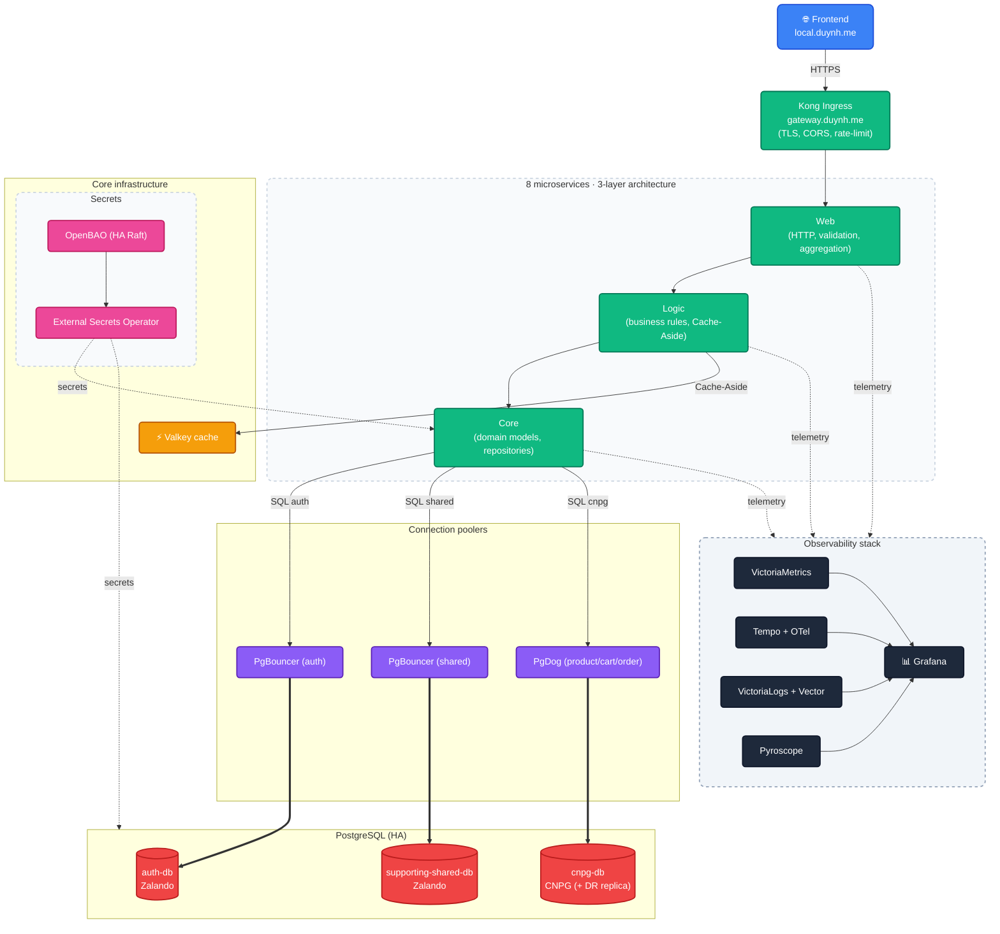

# Microservices Observability Platform

A GitOps-managed Kubernetes homelab cluster running on Kind (planned to graduate to a server).

---

## Overview

Production-grade microservices platform built to practise day-2 SRE work end-to-end:
8 Go services, full observability (metrics / traces / logs / profiles), HA PostgreSQL,
SLOs with burn-rate alerts, and a single source of truth in Git delivered via Flux.

**Key features:**

- 8 microservices behind one Kong API gateway with **Variant A** edge naming —
  single URL shape `/{service}/v1/{audience}/…`, browser and in-cluster callers use the
  same path. Kong is pure pass-through (no rewrites).
- Frontend on `https://local.duynh.me`, API gateway on `https://gateway.duynh.me`.
  TLS terminated by Kong with a publicly-trusted Let's Encrypt wildcard cert.
- Full observability: VictoriaMetrics, Tempo + Jaeger, VictoriaLogs + Vector, Pyroscope,
  15 Grafana dashboards.
- 3 PostgreSQL clusters (Zalando + CloudNativePG) + 1 DR replica, fronted by PgBouncer
  and PgDog. Schema migrations via Flyway 11.
- Valkey (Redis-compatible) cache with Cache-Aside pattern in the Logic layer.
- SLOs managed declaratively by Sloth Operator.
- GitOps with Flux Operator, ResourceSets, OCI artifacts, and Kustomize.
- Secrets in OpenBAO (HA Raft), synced into the cluster by External Secrets Operator.

> This repository contains **infrastructure, GitOps, observability, and docs**.
> Application code lives in separate repositories — see [`SERVICES.md`](SERVICES.md).

For deep documentation, start at [`docs/README.md`](docs/README.md).

---

## Architecture Overview



**At a glance:**

- **Edge** — Kong terminates TLS with a Let's Encrypt wildcard cert (`*.duynh.me`),
  enforces CORS, rate-limit, and request-size-limit. Force HTTP → HTTPS via Kong
  annotations. Auth is **not** done at the gateway — every service validates JWTs
  in its own middleware (defence-in-depth).
- **Microservices** — 4 bounded-context domains: identity, catalog, checkout, comms.
  Each service is its own repo, its own namespace, its own database role.
- **Data** — 3 PostgreSQL clusters with operators (Zalando + CloudNativePG), behind
  poolers, with Flyway migrations. cnpg-db has a continuously-recovering DR replica.
- **Observability** — OpenTelemetry-first across metrics, traces, logs, and profiles.
  All four pillars converge in Grafana via shared exemplars.
- **Delivery** — Flux Operator pulls OCI artifacts from a registry. Domain ResourceSets
  template per-service InputProviders so onboarding a service is one PR.

Detailed architecture: [`docs/observability/README.md`](docs/observability/README.md)
and [`docs/api/api-naming-convention.md`](docs/api/api-naming-convention.md).

---

## Technology Stack

### Application

| Concern | Choice |
|---|---|
| Language / runtime | Go 1.25 |
| HTTP framework | Gin |
| API shape | Variant A — `/{service}/v1/{audience}/…` |
| Architecture | Web → Logic → Core (per service) |
| Cache | Valkey (Redis-compatible), Cache-Aside in Logic layer |

### Data

| Concern | Choice |
|---|---|
| RDBMS | PostgreSQL (Zalando operator + CloudNativePG) — 3 clusters + 1 DR replica |
| Connection poolers | PgBouncer (auth, shared) · PgDog (product/cart/order) |
| Migrations | Flyway 11.19.0 |

### Platform

| Concern | Choice |
|---|---|
| Kubernetes | Kind (local) — planned graduation to a server |
| Packaging | Helm 3 + Kustomize |
| GitOps | Flux Operator, ResourceSets, OCI artifacts |
| API gateway / Ingress | Kong Ingress Controller |
| TLS | cert-manager + Let's Encrypt (DNS-01 via Cloudflare) |
| Secrets | OpenBAO (HA Raft, 3-node) + External Secrets Operator |
| Admission policies | Kyverno (PSS baseline + restricted) |

### Observability

| Pillar | Stack |
|---|---|
| Metrics | VictoriaMetrics (VMSingle, VMAgent, VMAlert, VMAlertmanager) |
| Tracing | OpenTelemetry Collector → Tempo + Jaeger |
| Logs | Vector → VictoriaLogs |
| Profiles | Pyroscope |
| Dashboards | Grafana (15 curated dashboards) |
| SLOs | Sloth Operator (PrometheusServiceLevel CRDs) |

---

## Access Points

All hostnames resolve to `127.0.0.1` and are routed by Kong. TLS is terminated at
Kong with a wildcard `*.duynh.me` cert from Let's Encrypt — browsers trust it
out of the box, no CA install needed.

### Set up `/etc/hosts`

Run the helper (idempotent, marker-managed block):

```bash
sudo scripts/setup-hosts.sh
```

Or add the entries manually:

```
127.0.0.1 local.duynh.me
127.0.0.1 gateway.duynh.me
127.0.0.1 grafana.duynh.me   vmui.duynh.me     vmalert.duynh.me
127.0.0.1 karma.duynh.me     jaeger.duynh.me   tempo.duynh.me
127.0.0.1 pyroscope.duynh.me logs.duynh.me     slo.duynh.me
127.0.0.1 ui.duynh.me        source.duynh.me   openbao.duynh.me
127.0.0.1 pgui.duynh.me      vm-mcp.duynh.me   vl-mcp.duynh.me
127.0.0.1 flux-mcp.duynh.me
```

Kind binds host ports `80`/`443` to Kong's NodePort `30080`/`30443` — configured
automatically by `make cluster-up`.

### Service URLs

| Category | URL | Purpose |
|---|---|---|
| Frontend | <https://local.duynh.me> | React SPA (calls the gateway cross-origin) |
| API gateway | <https://gateway.duynh.me> | Single public API edge — see [api-naming-convention.md](docs/api/api-naming-convention.md) |
| Grafana | <https://grafana.duynh.me> | Dashboards (anonymous viewer) |
| VictoriaMetrics | <https://vmui.duynh.me/vmui> | Metrics query UI |
| VMAlert | <https://vmalert.duynh.me> | Alert rule evaluation |
| Karma | <https://karma.duynh.me> | Alertmanager dashboard |
| Jaeger | <https://jaeger.duynh.me> | Distributed tracing UI |
| Tempo | <https://tempo.duynh.me> | Trace backend API |
| Pyroscope | <https://pyroscope.duynh.me> | Continuous profiling |
| VictoriaLogs | <https://logs.duynh.me> | Log query UI |
| Sloth UI | <https://slo.duynh.me> | SLO browser, SLI charts, burn-rate views |
| Flux UI | <https://ui.duynh.me> | GitOps reconciliation status |
| RustFS Console | <https://source.duynh.me> | S3 object storage console |
| OpenBAO | <https://openbao.duynh.me> | Secrets management UI |
| Postgres Operator UI | <https://pgui.duynh.me> | Cluster management |
| VM / VL / Flux MCP | <https://vm-mcp.duynh.me/mcp> · <https://vl-mcp.duynh.me/mcp> · <https://flux-mcp.duynh.me/mcp> | MCP servers for AI assistants |

### Deployment

```bash
make prereqs        # check tools (kind, kubectl, flux, helm, …)
make up             # cluster + Flux + everything (one-shot)

# or step-by-step
make cluster-up     # 1. Kind cluster + local OCI registry
make flux-up        # 2. Bootstrap Flux Operator
make flux-push      # 3. Push manifests; Flux reconciles in dependency order
```

Wait 5–10 minutes for first reconciliation. Status:

```bash
make flux-status
flux get kustomizations
```

Detailed walkthrough: [`docs/platform/setup.md`](docs/platform/setup.md).

---

## Documentation

Full index in [`docs/README.md`](docs/README.md). Quick links:

**Getting started**

- [Setup guide](docs/platform/setup.md) — deployment, prerequisites, troubleshooting
- [Application delivery](docs/platform/application-delivery.md) — ResourceSet patterns, onboarding a service
- [API reference](docs/api/api.md) — request/response shapes, error model
- [API naming convention](docs/api/api-naming-convention.md) — Variant A URL shape, full route inventory

**Observability**

- [Observability overview](docs/observability/README.md) — middleware chain, APM integration
- [Metrics guide](docs/observability/metrics/README.md) — custom metrics, VictoriaMetrics
- [Grafana dashboards](docs/observability/grafana/dashboard-reference.md) — 15 curated dashboards
- [SLOs](docs/observability/slo/README.md) — SLIs, error budgets, burn-rate alerts

**Platform**

- [Kong gateway](docs/platform/kong-gateway.md) — routing, CORS, rate-limit, TLS
- [cert-manager + Flux](docs/platform/cert-manager-flux.md) — issuer chain, DNS-01
- [Trust distribution](docs/security/trust-distribution.md) — homelab CA bundle via trust-manager
- [Kyverno policies](docs/security/policy-catalog.md) — admission rules, exception process

**Data**

- [Database integration](docs/databases/002-database-integration.md) — clusters, poolers, migrations
- [Further reading](docs/databases/010-documents.md) — internals, replication, ops

**Reference**

- [SERVICES.md](SERVICES.md) — service repositories
- [AGENTS.md](AGENTS.md) — AI agent guide
- [CHANGELOG.md](CHANGELOG.md) — release notes

---

**Built with ❤️ for learning observability.**
