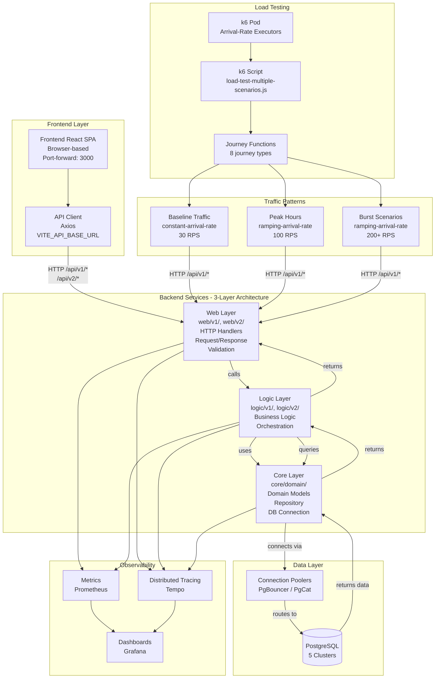

# Microservices Observability Platform

**Complete microservices observability solution** - Kubernetes-ready with Prometheus, Grafana, and full observability stack.

---

## Overview

Production-ready microservices monitoring platform with 9 Go services, complete observability (metrics, traces, logs, profiles), PostgreSQL database integration, and SRE practices (SLO tracking, error budgets).

**Key Features:**

- 9 microservices with v1/v2 APIs
- 34 Grafana dashboard panels (5 row groups)
- Complete observability stack (Prometheus, Tempo, Jaeger, Loki, Pyroscope)
- PostgreSQL database integration (5 clusters, Flyway migrations)
- SLO management via Sloth Operator
- k6 load testing

**For detailed documentation, see [`docs/README.md`](docs/README.md)**

---

## Architecture

### System Architecture

Complete system architecture showing Frontend (React SPA), k6 load testing, microservices stack (3-layer architecture), data layer, and observability:



**Key Points:**

- **Frontend (React SPA)**: Runs in browser, makes HTTP requests to Web Layer only (`/api/v1/*`, `/api/v2/*`)
- **k6 Load Testing**: Simulates traffic patterns, also calls Web Layer endpoints
- **3-Layer Architecture**: Web → Logic → Core (Frontend and k6 can ONLY access Web Layer)
- **Observability**: All layers emit traces/metrics to Tempo/Prometheus, visualized in Grafana

**Frontend Architecture**: See [`frontend/README.md`](frontend/README.md) for complete frontend documentation, API mapping, and integration details.

**Detailed Architecture**: See [`docs/observability/apm/ARCHITECTURE.md`](docs/observability/apm/ARCHITECTURE.md) for middleware chain and APM integration. Full system architecture in [`specs/system-context/01-architecture-overview.md`](specs/system-context/01-architecture-overview.md)

### Documentation Structure

**Standardized documentation organized by domain:**

```
docs/
├── api/                    # API documentation
├── databases/              # Database architecture
├── observability/          # Observability (grouped by domain)
│   ├── apm/               # Tracing, logging, profiling
│   ├── metrics/           # Prometheus/Grafana metrics
│   ├── slo/               # Service Level Objectives
│   └── logs/              # Logging systems (VictoriaLogs)
├── platform/              # Deployment & setup
├── runbooks/              # Operational runbooks
└── testing/               # Load testing (k6)
```

**See [`docs/README.md`](docs/README.md) for complete documentation index.**

### Microservices

| Service | Language | Description | Namespace | API Versions |
|---------|----------|-------------|-----------|--------------|
| auth | Go | Authentication & registration | auth | v1, v2 |
| user | Go | User management & profiles | user | v1, v2 |
| product | Go | Product catalog management | product | v1, v2 |
| cart | Go | Shopping cart operations | cart | v1, v2 |
| order | Go | Order processing & tracking | order | v1, v2 |
| review | Go | Product reviews & ratings | review | v1, v2 |
| notification | Go | Notification delivery | notification | v1, v2 |
| shipping | Go | Shipping tracking (legacy) | shipping | v1 only |
| shipping-v2 | Go | Enhanced shipping API | shipping | v2 only |

**Complete API Documentation**: See [`docs/api/API.md`](docs/api/API.md)

---

## Quick Start

### GitOps Deployment (One Command)

**Complete stack deployment using Flux Operator:**

```bash
# Prerequisites check
make prereqs

# One-command deployment (cluster + Flux + apps)
make up

# Or step-by-step:
make cluster-up   # 1. Create Kind cluster + OCI registry
make flux-up      # 2. Bootstrap Flux Operator
make flux-push    # 3. Deploy everything (infrastructure + apps)
```

**What gets deployed automatically:**

- Infrastructure: Monitoring (Prometheus, Grafana), APM (Tempo, Loki, Jaeger, Pyroscope, Vector, OTel)
- Databases: PostgreSQL operators, 5 clusters, connection poolers
- Applications: 9 microservices + frontend + k6 load testing
- SLO: Sloth Operator + Service Level Objectives

**Wait 5-10 minutes** for Flux reconciliation, then access services.

**Benefits:**

- **Simplified Makefile**: 85 lines (67% reduction), delegates to scripts
- **One-command deployment**: `make up` bootstraps everything
- **Automatic drift detection**: Flux reconciles changes automatically
- **Multi-environment support**: Local/production overlays
- **OCI-based GitOps**: Single source of truth in OCI registry

**Detailed Setup Guide**: See [`docs/platform/SETUP.md`](docs/platform/SETUP.md) for step-by-step instructions, architecture explanation, and troubleshooting.

---

## Technology Stack

- **Runtime**: Go 1.25.5
- **Database**: PostgreSQL (5 clusters via Zalando/CloudNativePG operators)
  - Connection poolers: PgBouncer, PgCat
  - Migrations: Flyway 11.8.2 (8 migration images)
- **HTTP Framework**: Gin
- **Observability**: OpenTelemetry (traces, metrics, logs)
- **GitOps**: Flux Operator, Kustomize, OCI Registry
- **Deployment**: Kubernetes (Kind), Helm 3
- **Monitoring**: Prometheus, Grafana, Tempo, Loki, Pyroscope, Jaeger

**Observability Details**: See [`docs/observability/apm/README.md`](docs/observability/apm/README.md) for complete APM system overview.

---

## Dashboard

**Grafana Dashboard**: `microservices-monitoring-001`

- **34 panels** organized in 5 row groups
- **Access**: <http://localhost:3000/d/microservices-monitoring-001/> (after port-forward)
- **Variables**: `$namespace`, `$app`, `$rate`

**Complete Dashboard Reference**: See [`docs/observability/metrics/GRAFANA_DASHBOARD.md`](docs/observability/metrics/GRAFANA_DASHBOARD.md) for all 34 panels with query analysis and troubleshooting.

**Metrics Documentation**: See [`docs/observability/metrics/METRICS.md`](docs/observability/metrics/METRICS.md) for complete metrics guide (6 custom metrics, 34 panels).

---

## Access Points

After deployment, access services via port-forwarding:

| Service | URL | Command | Credentials |
|---------|-----|---------|-------------|
| Flux Web UI | <http://localhost:9080> | `make flux-ui` | - |
| Grafana | <http://localhost:3000> | `kubectl port-forward -n monitoring svc/grafana-service 3000:3000` | Anonymous (enabled) |
| Prometheus | <http://localhost:9090> | `kubectl port-forward -n monitoring svc/kube-prometheus-stack-prometheus 9090:9090` | - |
| Jaeger UI | <http://localhost:16686> | `kubectl port-forward -n monitoring svc/jaeger-query 16686:16686` | - |
| Tempo | <http://localhost:3200> | `kubectl port-forward -n monitoring svc/tempo 3200:3200` | - |
| Frontend | <http://localhost:3000> | `kubectl port-forward -n default svc/frontend 3000:80` | - |
| API (any service) | <http://localhost:8080> | `kubectl port-forward -n <namespace> svc/<service> 8080:8080` | - |

**GitOps Monitoring**: Use `make flux-ui` to open Flux Web UI and monitor reconciliation status, view Kustomizations, and check deployment health.

**Makefile Commands**: See `make help` for all available commands (cluster, Flux, validation, utilities).

**Port-Forwarding Guide**: See [`docs/platform/SETUP.md`](docs/platform/SETUP.md)

---

## Documentation

### Getting Started

- **[Setup Guide](docs/platform/SETUP.md)** - Complete deployment instructions
- **[API Reference](docs/api/API.md)** - API endpoints and adding new microservices

### Observability

- **[Metrics Guide](docs/observability/metrics/METRICS.md)** - Complete metrics documentation (6 custom metrics, 34 panels)
- **[Grafana Dashboard Guide](docs/observability/metrics/GRAFANA_DASHBOARD.md)** - Complete dashboard reference (34 panels + annotations planning)
- **[APM Overview](docs/observability/apm/README.md)** - Complete APM system overview
- **[SLO Documentation](docs/observability/slo/README.md)** - SRE practices: SLI/SLO definitions, error budgets

### API & Databases

- **[API Reference](docs/api/API.md)** - Complete API documentation for all 9 microservices
- **[Database Guide](docs/databases/DATABASE.md)** - PostgreSQL database integration guide

### Testing & Operations

- **[k6 Load Testing](docs/testing/K6.md)** - k6 load testing setup and configuration
- **[Runbooks/Troubleshooting](docs/runbooks/troubleshooting/)** - Operational runbooks and troubleshooting guides

### Reference

- **[Documentation Index](docs/README.md)** - Complete documentation index with learning path
- **[AGENTS.md](AGENTS.md)** - AI Agent Guide for navigating the codebase

---

## Key Features

### Observability

- **Traces**: Distributed tracing with Tempo + Jaeger (via OpenTelemetry Collector)
- **Metrics**: Prometheus (custom business + infrastructure metrics)
- **Logs**: Structured logging with zap, correlated via trace_id/span_id (Loki + Vector)
- **Profiles**: Continuous profiling with Pyroscope (CPU, heap, goroutines, locks)

**APM Details**: See [`docs/observability/apm/README.md`](docs/observability/apm/README.md)

### Database

- **5 PostgreSQL Clusters**: review-db, auth-db, supporting-db (shared: user + notification + shipping-v2), product-db, transaction-db
- **Architecture Diagrams**: Comprehensive Mermaid diagrams showing overview and individual cluster details
- **Connection Poolers**: PgBouncer (Auth), PgCat (Product, Cart+Order)
- **Migrations**: Flyway 11.8.2 with 8 migration images
- **Operators**: Zalando Postgres Operator (v1.15.0), CloudNativePG Operator (v1.28.0)
- **Cross-Namespace Secrets**: Zalando operator configured for shared database pattern

**Database Details**: See [`docs/databases/DATABASE.md`](docs/databases/DATABASE.md) for complete architecture diagrams and configuration

### SLO Management

- **Sloth Operator**: Kubernetes-native SLO management
- **Error Budget Tracking**: Real-time error budget monitoring
- **Burn Rate Alerts**: Multi-window multi-burn-rate alerts
- **Automated Runbooks**: Latency diagnosis and error budget alert response

**SLO Details**: See [`docs/observability/slo/README.md`](docs/observability/slo/README.md)

---

**Built with ❤️ for learning observability**

🚀 **Happy Monitoring!**
