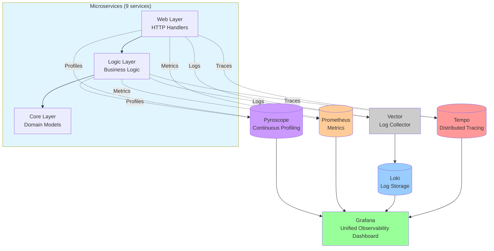

# Microservices Monitoring & Performance Applications

**Complete microservices monitoring solution with 32 Grafana panels in 5 row groups** - Kubernetes-ready with Prometheus & Grafana

---

## 🎯 What You Get

### 32 Panels Organized in 5 Row Groups

**📊 Row 1: Overview & Key Metrics (12 panels)**
- Response time percentiles (P50, P95, P99)
- Total RPS, Success RPS (2xx), Error RPS (4xx/5xx)
- Success Rate % & Error Rate %
- Apdex Score
- Total Requests, Up Instances, Restarts

**🚀 Row 2: Traffic & Requests (4 panels)**
- Status code distribution (pie chart)
- Requests by endpoint (pie chart)
- Request Rate by Endpoint (time series)
- RPS by Endpoint

**⚠️ Row 3: Errors & Performance (5 panels)**
- Request Rate by HTTP Method + Endpoint
- Error Rate by HTTP Method + Endpoint
- Response time per endpoint (P95, P50, P99)

**🔧 Row 4: Go Runtime & Memory (6 panels) - Memory Leak Detection**
- 🆕 **Heap Allocated Memory** - Detect heap memory leaks
- 🆕 **Heap In-Use Memory** - Monitor heap usage baseline
- 🆕 **Process Memory (RSS)** - OS-level memory tracking
- Goroutines & Threads - Detect goroutine leaks
- GC Duration - Monitor GC performance
- 🆕 **GC Frequency** - Track GC pressure

**🖥️ Row 5: Resources & Infrastructure (5 panels)**
- Memory usage per pods
- CPU usage per pods
- Network I/O
- Requests in flight
- Memory allocations

---

## 🏗️ Architecture

### Microservices (9 Services)
- **auth** - Authentication API (`/api/v1/auth/*`, `/api/v2/auth/*`)
- **user** - User management API (`/api/v1/users/*`, `/api/v2/users/*`)
- **product** - Product catalog API (`/api/v1/products/*`, `/api/v2/catalog/*`)
- **cart** - Shopping cart API (`/api/v1/cart/*`, `/api/v2/carts/*`)
- **order** - Order management API (`/api/v1/orders/*`, `/api/v2/orders/*`)
- **review** - Product reviews API (`/api/v1/reviews/*`, `/api/v2/reviews/*`)
- **notification** - Notifications API (`/api/v1/notify/*`, `/api/v2/notifications/*`)
- **shipping** - Shipping tracking API (`/api/v1/shipping/*`)
- **shipping-v2** - Enhanced shipping API (`/api/v2/shipments/*`)

### Monitoring Stack
- **Prometheus Operator** - Kubernetes-native Prometheus management via CRDs
- **kube-prometheus-stack** - Full monitoring stack with Prometheus, Operator, and integrations
- **Grafana Operator** - Kubernetes-native Grafana management
- **ServiceMonitor** - Automatic service discovery (namespace-based, scales to 1000+ pods)
- **k6** - Load testing & performance validation

### APM Stack (Application Performance Monitoring)
- **Grafana Tempo** - Distributed tracing backend
- **Loki** - Log aggregation and storage
- **Vector** - Log collection and processing
- **Pyroscope** - Continuous profiling (CPU, heap, goroutines, locks)

## 🚀 Quick Start

### Complete Deployment (All Steps)

```bash
git clone <repo-url>
cd project-monitoring-golang
chmod +x scripts/*.sh

# Infrastructure & Monitoring (Steps 1-3)
./scripts/01-create-kind-cluster.sh      # Create Kind cluster
./scripts/02-install-metrics.sh          # Install metrics infrastructure
./scripts/03-deploy-monitoring.sh        # Deploy Prometheus Operator + Grafana Operator (BEFORE apps)

# APM Stack (Step 4) - Required for full observability (BEFORE apps to collect traces/logs/profiles)
./scripts/04-deploy-apm.sh               # Deploy all APM components (Tempo, Pyroscope, Loki, Vector)

# Build & Deploy Applications (Steps 5-6)
./scripts/05-build-microservices.sh      # Build Docker images on Local
./scripts/06-deploy-microservices.sh     # Deploy microservices on Local and Registry

# Load Testing (Step 7)
./scripts/07-deploy-k6.sh                # Deploy K6 load generators via Helm (AFTER apps to test them)

# SLO System (Step 8) - Required for SRE practices
./scripts/08-deploy-slo.sh               # Deploy Sloth Operator and SLO CRDs

# Access Setup (Step 9)
./scripts/09-setup-access.sh             # Setup port forwarding
```

### Deployment Options

**K6 Deployment Options:**
```bash
# Deploy both load tests (recommended)
./scripts/07-deploy-k6.sh both

# Deploy only legacy test
./scripts/07-deploy-k6.sh legacy

# Deploy only multiple scenarios test
./scripts/07-deploy-k6.sh scenarios
```
📖 [Full K6 Documentation](./docs/k6/K6_LOAD_TESTING.md)

**SLO Deployment (Sloth Operator):**
```bash
# One-command deployment via Helm
./scripts/08-deploy-slo.sh
```
📖 [Full SLO Documentation](./docs/slo/README.md)

**APM Deployment Options:**
```bash
# One-command (recommended) - Deploys all APM components
./scripts/04-deploy-apm.sh

# Individual deployments (if you need specific components)
./scripts/04a-deploy-tempo.sh      # Deploy Grafana Tempo (distributed tracing)
./scripts/04b-deploy-pyroscope.sh  # Deploy Pyroscope (continuous profiling)
./scripts/04c-deploy-loki.sh       # Deploy Loki + Vector (log aggregation)
```

**What APM provides:**
- **Distributed Tracing**: End-to-end request tracing across all microservices
- **Structured Logging**: JSON logs with trace-id correlation
- **Continuous Profiling**: CPU, heap, goroutine, and lock profiling
- **Full Correlation**: Trace-to-logs, trace-to-metrics, trace-to-profiles

📖 [Full APM Documentation](./docs/apm/README.md)

### Utility Scripts

**Reload Dashboard (Step 8):**
```bash
./scripts/10-reload-dashboard.sh  # Reload Grafana dashboard after updates
```

**Runbooks (Steps 12-13):**
```bash
./scripts/11-diagnose-latency.sh      # Diagnose latency issues
./scripts/12-error-budget-alert.sh    # Error budget alert response
```

### Script Options

**Build Options:**
```bash
./scripts/05-build-microservices.sh [--no-cache|--force]
```

**Deploy Options (Helm):**
```bash
# Deploy using local Helm chart (default)
./scripts/06-deploy-microservices.sh --local

# Deploy from OCI registry
./scripts/06-deploy-microservices.sh --registry
```

**k6 Options:**
```bash
./scripts/07-deploy-k6.sh [both|legacy|scenarios]
```

### Access Services

```bash
# Port-forward all services
kubectl port-forward -n auth svc/auth 8081:8080 &
kubectl port-forward -n user svc/user 8082:8080 &
kubectl port-forward -n product svc/product 8083:8080 &
kubectl port-forward -n order svc/order 8084:8080 &
kubectl port-forward -n cart svc/cart 8085:8080 &

# Access monitoring
kubectl port-forward -n monitoring svc/grafana-service 3000:3000 &
kubectl port-forward -n monitoring svc/kube-prometheus-stack-prometheus 9090:9090 &

# Access APM services (after Step 17)
kubectl port-forward -n monitoring svc/tempo 3200:3200 &
kubectl port-forward -n monitoring svc/pyroscope 4040:4040 &
kubectl port-forward -n monitoring svc/loki 3100:3100 &
```

### Access URLs

```
📊 Grafana:    http://localhost:3000 (admin/admin)
📈 Prometheus: http://localhost:9090
🔧 User API:   http://localhost:8081/api/v1/users
🔧 Product API: http://localhost:8082/api/v1/products
🔧 Checkout API: http://localhost:8083/api/v1/checkout
🔧 Order API:  http://localhost:8084/api/v2/orders
🔧 Unified API: http://localhost:8085/api/v3/*

🔍 APM Services (after Step 17):
   📊 Tempo:      http://localhost:3200 (distributed tracing)
   🔬 Pyroscope:  http://localhost:4040 (continuous profiling)
   📝 Loki:       http://localhost:3100 (log aggregation)
```

### View Dashboard

Open Grafana → **"Microservices Monitoring & Performance Applications"** dashboard is auto-loaded!

**Direct link**: http://localhost:3000/d/microservices-monitoring-001/

---

## 📊 Dashboard Highlights

### Key Metrics at a Glance

| Panel | What It Shows | Why It Matters |
|-------|--------------|----------------|
| **P99 Response Time** | 99% of requests complete within this time | Tail latency - worst user experience |
| **RPS** | Requests per second | System throughput |
| **Apdex Score** | User satisfaction (0-1 scale) | Overall performance health |
| **Error Rate** | 4xx + 5xx responses | Reliability indicator |
| **Memory Usage** | Go heap allocation | Detect memory leaks |
| **CPU Usage** | Process CPU consumption | Resource utilization |

### Health Indicators

**🟢 Healthy System:**
- P95 < 300ms, P99 < 1s
- Apdex > 0.85
- Error rate < 1%
- 0 restarts
- Stable memory

**🟡 Warning:**
- P99 > 1s
- Apdex 0.7-0.85
- Error rate 1-5%
- Memory slowly growing

**🔴 Critical:**
- P99 > 2s
- Apdex < 0.7
- Error rate > 5%
- Frequent restarts
- Memory leak

### 🔬 Memory Leak Detection

**Row 4: Go Runtime & Memory** provides comprehensive leak detection with 6 panels:

**Detection Strategy:**

1. **Check Heap Metrics (3 panels):**
   - Heap Allocated ↑ continuously? 
   - Heap In-Use ↑ not returning to baseline?
   - Process RSS ↑ continuously?
   → All 3 increasing = **Heap Memory Leak**

2. **Check Goroutines (1 panel):**
   - Goroutines ↑ continuously?
   → **Goroutine Leak** (forgotten defer, unclosed channels)

3. **Check GC Metrics (2 panels):**
   - GC Duration + GC Frequency both ↑?
   → If heap also ↑ = **Leak confirmed**
   → If heap stable = **High load** (not a leak)

**Quick Decision Matrix:**

| Heap | Goroutines | GC | Diagnosis |
|------|------------|-----|-----------|
| ↑↑↑ | → | ↑↑ | **Heap Memory Leak** |
| →/↑ | ↑↑↑ | → | **Goroutine Leak** |
| ↑↓ | ↑↓ | ↑↑ | **High Load** (OK) |
| → | → | → | **Healthy** |

---

## 🔍 Understanding the Metrics

### Custom Application Metrics

The Go application exposes **6 custom metrics**:

1. **`request_duration_seconds`** (Histogram)
   - HTTP request latency
   - Powers P50/P95/P99 calculations
   - Buckets optimized for Apdex

2. **`requests_total`** (Counter)
   - Total HTTP requests
   - Used for RPS calculation

3. **`requests_in_flight`** (Gauge)
   - Concurrent requests
   - Detects traffic spikes

4. **`request_size_bytes`** (Histogram)
   - Incoming data volume

5. **`response_size_bytes`** (Histogram)
   - Outgoing data volume

6. **`error_rate_total`** (Counter)
   - Failed requests (4xx, 5xx)

### Go Runtime Metrics

Automatically exposed by `prometheus/client_golang`:
- `go_memstats_*` - Memory statistics
- `go_goroutines` - Goroutine count
- `go_gc_duration_seconds` - GC pause times
- `process_cpu_seconds_total` - CPU time

**📖 For detailed metrics documentation, see [docs/monitoring/METRICS.md](./docs/monitoring/METRICS.md)**

---

## 🧪 Load Testing

k6 load generators run continuously to generate traffic for all microservices:

```bash
# Check k6 load generator pods
kubectl get pods -n monitoring -l 'app in (k6-load-generator-legacy,k6-load-generator-scenarios)'

# View k6 logs
kubectl logs -n monitoring -l app=k6-load-generator-legacy -f
kubectl logs -n monitoring -l app=k6-load-generator-scenarios -f
```

### Manual Testing

```bash
# Quick test (100 requests)
for i in {1..100}; do curl http://localhost:8080/api/users & done

# Or deploy k6 load generators
./scripts/07-deploy-k6.sh
```

---

## 🏗️ Architecture

### 3-Layer Architecture

All microservices follow a clean 3-layer architecture pattern:

```mermaid
flowchart TD
    A[HTTP Request - Gin] --> B[Middleware Chain]
    
    subgraph Middleware
        B --> B1[1. TracingMiddleware]
        B1 --> B2[2. LoggingMiddleware]
        B2 --> B3[3. PrometheusMiddleware]
    end
    
    B3 --> C[Layer 1: Web - HTTP Handlers]
    
    subgraph Web["Web Layer"]
        C --> C1[internal/{service}/web/v1/]
        C --> C2[internal/{service}/web/v2/]
    end
    
    C --> D[Layer 2: Logic - Business Logic]
    
    subgraph Logic["Logic Layer"]
        D --> D1[internal/{service}/logic/v1/]
        D --> D2[internal/{service}/logic/v2/]
    end
    
    D --> E[Layer 3: Core - Domain Models]
    
    subgraph Core["Core Layer"]
        E --> E1[internal/{service}/core/domain/]
    end
    
    style A fill:#e1f5ff
    style B fill:#fff4e1
    style C fill:#ffe1f5
    style D fill:#f5e1ff
    style E fill:#e1ffe1
```

### APM Stack Integration

Each layer integrates with the APM stack for comprehensive observability:



📖 **For detailed architecture diagrams with mermaid visualizations, see [docs/apm/ARCHITECTURE.md](./docs/apm/ARCHITECTURE.md)**

### Kubernetes Components

- **Kind** - Local 3-node cluster (1 control-plane + 2 workers)
- **kube-state-metrics** - K8s object metrics
- **metrics-server** - Resource usage data

---

## 📚 Documentation

| Document | Description |
|----------|-------------|
| **[METRICS.md](./docs/monitoring/METRICS.md)** | ⭐ **Complete guide với phân tích chi tiết tất cả 32 panels** (5 row groups, memory leak detection) |
| **[K6_LOAD_TESTING.md](./docs/k6/K6_LOAD_TESTING.md)** | 🚀 **k6 continuous load generator setup & configuration** |
| **[SLO Documentation](./docs/slo/README.md)** | 🎯 **SRE practices: SLI/SLO definitions, error budgets, burn rate alerts** |
| **[SETUP.md](./docs/getting-started/SETUP.md)** | Step-by-step deployment guide |
| **[API Reference](./docs/api/API_REFERENCE.md)** | Complete API documentation for all 9 microservices |
| **[Documentation Index](./docs/README.md)** | Complete documentation index with learning path |
| **[Prometheus Rate Explained](./docs/monitoring/PROMETHEUS_RATE_EXPLAINED.md)** | 📊 Chi tiết về `rate()`, `increase()` và counter resets |
| **[Time Range & Rate Interval](./docs/monitoring/TIME_RANGE_AND_RATE_INTERVAL.md)** | ⏱️ **Time Range vs Rate Interval: Hướng dẫn chi tiết về Time Range và $rate variable** |
| **[Variables & Regex](./docs/monitoring/VARIABLES_REGEX.md)** | 🎯 Dashboard variables & regex patterns |
| **[AGENTS.md](./AGENTS.md)** | 🤖 **AI Agent Guide: Comprehensive navigation and workflows for AI agents** |
| **[Claude Commands](./.claude/commands/)** | 📋 **AI workflow commands: plan, implement, analyze, review, deploy, document** |
| **[Cursor Rules](./.cursor/rules/)** | 🔧 **Development guidelines: Kubernetes, Grafana, Prometheus, SLO, Go** |

---

## 🎯 SRE Practices

### SLI/SLO Implementation

This project includes comprehensive SRE practices with **Service Level Objectives (SLOs)** and **Error Budget** tracking:

**📊 SLI Definitions:**
- **Availability**: 99.5% (30d), 99.0% (7d) - Non-5xx responses
- **Latency**: 95% (30d), 90% (7d) - Requests < 500ms  
- **Error Rate**: 99% (30d), 98% (7d) - Non-4xx/5xx responses

**💰 Error Budget Policy:**
- **30-day Budget**: 0.5% of total requests
- **7-day Budget**: 1.0% of total requests
- **Burn Rate Alerts**: 15x (critical), 4x (warning), 1x (info)

**🚨 Multi-Window Alerts:**
- Critical: Budget exhausted in 2 days (15x burn rate)
- Warning: Budget exhausted in 7 days (4x burn rate)
- Info: Budget below 20%

**📈 SLO Dashboard:**
- Real-time error budget tracking
- Burn rate monitoring (1h, 6h, 3d windows)
- Time to exhaustion estimates
- SLI trend analysis

**🤖 Automated Runbooks:**
- `diagnose-latency.sh` - Latency issue analysis
- `error-budget-alert.sh` - Budget alert response
- Auto-classification of incidents by severity

**🚀 One-Command Deployment:**
```bash
./scripts/08-deploy-slo.sh
```

**📖 Full Documentation:** [SLO Documentation](./docs/slo/README.md)

---

## 🛠️ Technology Stack

- **Go 1.23** - Application runtime
- **Gin** - HTTP web framework
- **Prometheus** - Metrics collection
- **Grafana** - Visualization & dashboards
- **Grafana Operator** - Manages Grafana resources (dashboards, datasources)
- **Sloth Operator v0.15.0** - SLO management (automatic rule generation)
- **OpenTelemetry** - Distributed tracing
- **Zap** - Structured logging
- **Pyroscope** - Continuous profiling
- **k6** - Load testing
- **Kind** - Local Kubernetes
- **Helm** - Package management


---

## 🔧 Customization

### Add Custom Metrics

1. Define metric in `pkg/middleware/prometheus.go`:
```go
var MyMetric = promauto.NewCounterVec(
    prometheus.CounterOpts{
        Name: "my_metric_total",
        Help: "My custom metric",
    },
    []string{"label"},
)
```

2. Use in code:
```go
MyMetric.WithLabelValues("value").Inc()
```

3. Add panel to `grafana-dashboard.json`

### Modify Dashboard

- Edit `grafana-dashboard.json`
- Reapply dashboards via operator: `./scripts/10-reload-dashboard.sh`
- Port-forward Grafana: `kubectl port-forward -n monitoring svc/grafana-service 3000:3000`

---

## 🧹 Cleanup

```bash
# Delete everything
./scripts/cleanup.sh

# Or manual
kind delete cluster --name monitoring-local
```

---

## 🔧 Troubleshooting

### Common Issues

**1. ImagePullBackOff Errors**
```bash
# This happens when you skip Step 3 (build microservices)
# Solution: Always run Step 3 before Step 4
./scripts/05-build-microservices.sh
./scripts/06-deploy-microservices.sh

# Or manually for specific service
docker build --build-arg SERVICE_NAME=auth -f services/Dockerfile -t ghcr.io/duynhne/auth:v5 services/
kind load docker-image ghcr.io/duynhne/auth:v5 --name monitoring-local
kubectl rollout restart deployment -n auth -l app=auth
```

**2. Port Forwarding Not Working**
```bash
# Kill existing port forwards
pkill -f "kubectl port-forward"

# Restart port forwarding
kubectl port-forward -n monitoring svc/grafana-service 3000:3000 &
kubectl port-forward -n monitoring svc/kube-prometheus-stack-prometheus 9090:9090 &
kubectl port-forward -n user svc/user 8081:8080 &
```

**3. Pods Not Starting**
```bash
# Check pod status
kubectl get pods --all-namespaces

# Check pod logs
kubectl logs -n <namespace> <pod-name>
```

**4. Grafana Dashboard Not Loading**
```bash
# Restart Grafana
kubectl rollout restart deployment/grafana -n monitoring

# Check Grafana logs
kubectl logs -n monitoring -l app=grafana
```

## ❓ FAQ

**Q: Why Kind instead of Docker Compose?**
A: Kind provides real Kubernetes metrics. Docker Compose only gives 13/23 panels. Kind gives all 23!

**Q: Can I use this in production?**
A: Yes! This is a production-ready template. Add:
- TLS/ingress
- Persistent storage
- Alerting rules
- Authentication

**Q: How do I add more endpoints?**
A: Add handlers in `handlers/` directory. Metrics are auto-collected via middleware.

**Q: Dashboard shows no data?**
A: Generate traffic first! Deploy k6 load generators with `./scripts/07-deploy-k6.sh` or generate traffic manually.

**Q: What's Apdex Score?**
A: Application Performance Index. 0-1 scale measuring user satisfaction based on response times.

**Q: Scripts not executable?**
A: Run `chmod +x scripts/*.sh` to make all scripts executable.

---

## 🤝 Contributing

Contributions welcome! Areas to improve:
- Add more metrics
- New dashboard panels
- Additional endpoints
- Documentation

---

## 🌟 Star This Repo!

If this helps you understand monitoring, please ⭐ star the repository!

---

**Built with ❤️ for learning observability**

🚀 **Happy Monitoring!**