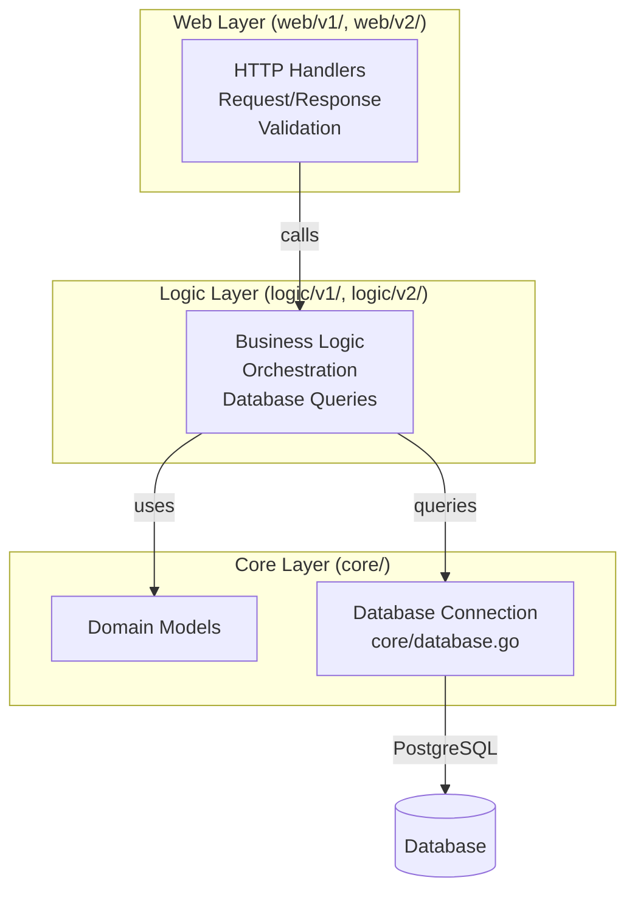

# Microservices Observability Platform

**Complete microservices observability solution** - Kubernetes-ready with Prometheus, Grafana, and full observability stack.

---

## Overview

Production-ready microservices monitoring platform with 9 Go services, complete observability (metrics, traces, logs, profiles), PostgreSQL database integration, and SRE practices (SLO tracking, error budgets).

**Key Features:**
- 9 microservices with v1/v2 APIs
- 34 Grafana dashboard panels (5 row groups)
- Complete observability stack (Prometheus, Tempo, Jaeger, Loki, Pyroscope)
- PostgreSQL database integration (5 clusters, Flyway migrations)
- SLO management via Sloth Operator
- k6 load testing

**For detailed documentation, see [`docs/README.md`](docs/README.md)**

---

## Quick Start

### Complete Deployment

```bash
git clone <repo-url>
cd monitoring
chmod +x scripts/*.sh

# Infrastructure & Monitoring
./scripts/01-create-kind-cluster.sh      # Create Kind cluster
./scripts/02-deploy-monitoring.sh        # Deploy Prometheus + Grafana

# APM Stack
./scripts/03-deploy-apm.sh               # Deploy Tempo, Pyroscope, Loki, Vector

# Database Infrastructure
./scripts/04-deploy-databases.sh         # Deploy PostgreSQL operators, clusters, poolers

# Build & Deploy Applications
./scripts/05-build-microservices.sh      # Build Docker images
./scripts/06-deploy-microservices.sh --registry   # Deploy services - Default --local | registry ghcr.io OCI registry

# Load Testing (AFTER apps)
./scripts/07-deploy-k6.sh                # Deploy k6 load generators

# SLO System
./scripts/08-deploy-slo.sh               # Deploy Sloth Operator and SLO CRDs

# Access Setup
./scripts/09-setup-access.sh             # Setup port-forwarding
```

**Detailed Setup Guide**: See [`docs/getting-started/SETUP.md`](docs/getting-started/SETUP.md) for step-by-step instructions, prerequisites, and troubleshooting.

---

## Architecture

### 3-Layer Architecture

All microservices follow a consistent 3-layer architecture:



**Detailed Architecture**: See [`docs/apm/ARCHITECTURE.md`](docs/apm/ARCHITECTURE.md) for middleware chain and APM integration. Full system architecture in [`specs/system-context/01-architecture-overview.md`](specs/system-context/01-architecture-overview.md)

### Microservices

| Service | Namespace | API Versions |
|---------|-----------|--------------|
| auth | auth | v1, v2 |
| user | user | v1, v2 |
| product | product | v1, v2 |
| cart | cart | v1, v2 |
| order | order | v1, v2 |
| review | review | v1, v2 |
| notification | notification | v1, v2 |
| shipping | shipping | v1 only |
| shipping-v2 | shipping | v2 only |

**Complete API Documentation**: See [`docs/api/API_REFERENCE.md`](docs/api/API_REFERENCE.md)

---

## Technology Stack

- **Runtime**: Go 1.25.5
- **Database**: PostgreSQL (5 clusters via Zalando/CloudNativePG operators)
  - Connection poolers: PgBouncer, PgCat
  - Migrations: Flyway 11.19.0 (8 migration images)
- **HTTP Framework**: Gin
- **Observability**: OpenTelemetry (traces, metrics, logs)
- **Deployment**: Kubernetes (Kind), Helm 3
- **Monitoring**: Prometheus, Grafana, Tempo, Loki, Pyroscope, Jaeger

**Observability Details**: See [`docs/apm/README.md`](docs/apm/README.md) for complete APM system overview.

---

## Dashboard

**Grafana Dashboard**: `microservices-monitoring-001`

- **34 panels** organized in 5 row groups
- **Access**: http://localhost:3000/d/microservices-monitoring-001/ (after port-forward)
- **Variables**: `$namespace`, `$app`, `$rate`

**Complete Dashboard Reference**: See [`docs/development/DASHBOARD_PANELS_GUIDE.md`](docs/development/DASHBOARD_PANELS_GUIDE.md) for all 34 panels with query analysis and troubleshooting.

**Metrics Documentation**: See [`docs/monitoring/METRICS.md`](docs/monitoring/METRICS.md) for complete metrics guide (6 custom metrics, 34 panels).

---

## Access Points

After running `./scripts/09-setup-access.sh` or manual port-forwarding:

| Service | URL | Credentials |
|---------|-----|-------------|
| Grafana | http://localhost:3000 | - |
| Prometheus | http://localhost:9090 | - |
| Jaeger UI | http://localhost:16686 | - |
| Tempo | http://localhost:3200 | - |
| API (via port-forward) | http://localhost:8080 | - |

**Port-Forwarding Guide**: See [`docs/getting-started/SETUP.md`](docs/getting-started/SETUP.md)

---

## Documentation

| Document | Description |
|----------|-------------|
| **[Setup Guide](docs/getting-started/SETUP.md)** | Complete deployment instructions |
| **[Metrics Guide](docs/monitoring/METRICS.md)** | Complete metrics documentation (6 custom metrics, 34 panels) |
| **[Dashboard Panels Guide](docs/development/DASHBOARD_PANELS_GUIDE.md)** | Complete dashboard reference (34 panels) |
| **[APM Overview](docs/apm/README.md)** | Complete APM system overview |
| **[SLO Documentation](docs/slo/README.md)** | SRE practices: SLI/SLO definitions, error budgets |
| **[API Reference](docs/api/API_REFERENCE.md)** | Complete API documentation for all 9 microservices |
| **[k6 Load Testing](docs/k6/K6_LOAD_TESTING.md)** | k6 load testing setup and configuration |
| **[Documentation Index](docs/README.md)** | Complete documentation index with learning path |
| **[AGENTS.md](AGENTS.md)** | AI Agent Guide for navigating the codebase |

---

## Key Features

### Observability

- **Traces**: Distributed tracing with Tempo + Jaeger (via OpenTelemetry Collector)
- **Metrics**: Prometheus (custom business + infrastructure metrics)
- **Logs**: Structured logging with zap, correlated via trace_id/span_id (Loki + Vector)
- **Profiles**: Continuous profiling with Pyroscope (CPU, heap, goroutines, locks)

**APM Details**: See [`docs/apm/README.md`](docs/apm/README.md)

### Database

- **5 PostgreSQL Clusters**: review-db, auth-db, supporting-db (shared: user + notification + shipping-v2), product-db, transaction-db
- **Connection Poolers**: PgBouncer (Auth), PgCat (Product, Cart+Order)
- **Migrations**: Flyway 11.19.0 with 8 migration images
- **Operators**: Zalando Postgres Operator (v1.15.0), CloudNativePG Operator (v1.24.0)

### SLO Management

- **Sloth Operator**: Kubernetes-native SLO management
- **Error Budget Tracking**: Real-time error budget monitoring
- **Burn Rate Alerts**: Multi-window multi-burn-rate alerts
- **Automated Runbooks**: Latency diagnosis and error budget alert response

**SLO Details**: See [`docs/slo/README.md`](docs/slo/README.md)

---

## Troubleshooting

Common issues and quick fixes. For detailed troubleshooting, see [`docs/monitoring/TROUBLESHOOTING.md`](docs/monitoring/TROUBLESHOOTING.md).

**Dashboard not loading:**
- Check port-forward: `kubectl port-forward -n monitoring svc/grafana-service 3000:3000`
- Re-apply dashboards: `./scripts/10-reload-dashboard.sh`

**Pods not starting:**
- Check pod status: `kubectl get pods -A`
- Check logs: `kubectl logs -n <namespace> <pod-name>`

**Metrics not appearing:**
- Generate traffic: Deploy k6 with `./scripts/07-deploy-k6.sh`
- Check ServiceMonitor: `kubectl get servicemonitor -n monitoring`

**Database connection issues:**
- Verify databases are deployed: `./scripts/04-deploy-databases.sh`
- Check secrets: `kubectl get secrets -n <namespace>`
- See `k8s/secrets/README.md` for secret creation

---

**Built with ❤️ for learning observability**

🚀 **Happy Monitoring!**
