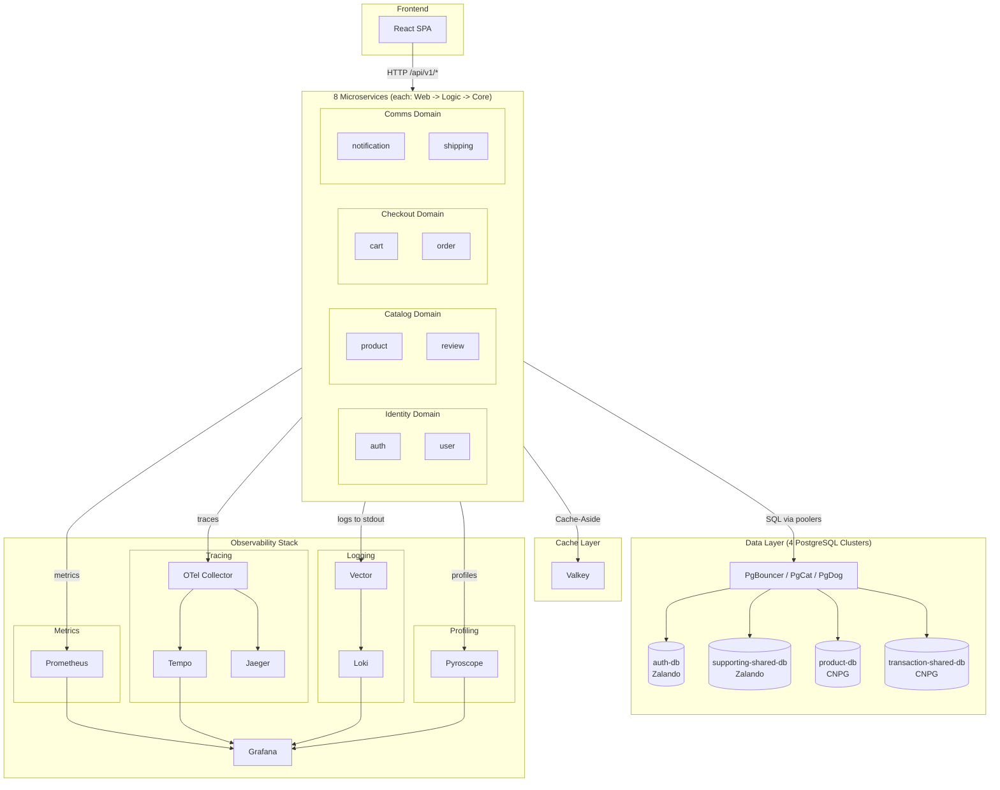

# Microservices Observability Platform

**Complete microservices observability solution** - Kubernetes-ready with Prometheus, Grafana, and full observability stack.

---

## Overview

Production-ready microservices monitoring platform with 8 Go services, complete observability (metrics, traces, logs, profiles), PostgreSQL database integration, and SRE practices (SLO tracking, error budgets).

**Key Features:**

- 8 microservices with v1 API (canonical, frontend-aligned)
- 34 Grafana dashboard panels (5 row groups)
- Complete observability stack (Prometheus, Tempo, Jaeger, Loki, Pyroscope)
- PostgreSQL database integration (4 clusters, Flyway migrations)
- Valkey caching (Redis-compatible) with Cache-Aside pattern
- SLO management via Sloth Operator

**For detailed documentation, see [`docs/README.md`](docs/README.md)**

---

## Architecture Overview

### System Architecture

Runtime architecture: Frontend (React SPA), 8 microservices (3-layer each), Valkey cache, 4 PostgreSQL clusters, and full observability stack.

> **Note**: This repository contains **infrastructure, GitOps, observability, and docs only**. Application code lives in separate repos (see [SERVICES.md](SERVICES.md)). Apps are deployed via Flux Operator ResourceSets (see [Application Delivery](docs/platform/application-delivery.md)).



**Key Points:**

- **Frontend (React SPA)**: Runs in browser, HTTP requests to Web Layer only (`/api/v1/*`). Frontend repo: [`duynhne/frontend`](https://github.com/duynhne/frontend).
- **8 Microservices**: Each follows 3-layer architecture (Web -> Logic -> Core), organized into 4 domains (identity, catalog, checkout, comms).
- **Cache-Aside Pattern**: Logic Layer checks Valkey first, queries database on miss, writes to cache.
- **4 PostgreSQL Clusters**: auth-db (Zalando), supporting-shared-db (Zalando, hosts user/notification/shipping/review), product-db (CNPG), transaction-shared-db (CNPG, hosts cart/order). Connected via PgBouncer, PgCat, or PgDog poolers.
- **Full Observability**: Traces (Tempo + Jaeger via OTel Collector), Metrics (Prometheus), Logs (Loki + Vector), Profiles (Pyroscope), all visualized in Grafana.
- **GitOps Delivery**: Flux Operator with domain ResourceSets + per-service InputProviders + OCI + Kustomize. See [Application Delivery](docs/platform/application-delivery.md) and [Setup](docs/platform/setup.md).

**Detailed Architecture**: See [`docs/observability/apm/architecture.md`](docs/observability/apm/architecture.md) for middleware chain and APM integration.

---

## Technology Stack
### Core Services
- **Runtime**: Go 1.25.5
    - 8 microservices
    - 3 layer: Web → Logic → Core

- **Database**: PostgreSQL (4 clusters via Zalando/CloudNativePG operators)
    - Connection poolers: PgBouncer, PgCat, PgDog
    - Migrations: Flyway 11.19.0 (8 migration images)
- **HTTP Framework**: Gin
- **Cache**: Valkey (Redis-compatible) with Cache-Aside pattern

**Complete API Documentation**: See [`docs/api/api.md`](docs/api/api.md)

### Infrastructure Stack
- **Kubernetes**: Local Cluster (Kind), Helm 3
- **GitOps**: Flux Operator, ResourceSet (Unified Templating), Kustomize, OCI Registry
    - Application layer: 4 domain ResourceSets (identity, catalog, checkout, comms) + per-service InputProviders
- **Dynamic Delivery**: OCIArtifactTag (Automated image updates)
- **Monitoring**: Prometheus, Grafana, Tempo, Loki, Pyroscope, Jaeger, Vector.

**Observability Details**: See [`docs/observability/apm/README.md`](docs/observability/apm/README.md) for complete APM system overview.


### GitOps Deployment

```bash
# Prerequisites check
make prereqs

# One-command deployment (cluster + Flux + apps)
make up

# Or step-by-step:
make cluster-up   # 1. Create Kind cluster + OCI registry
make flux-up      # 2. Bootstrap Flux Operator
make flux-push    # 3. Deploy everything (infrastructure + apps)
```

**What gets deployed automatically:**

- Infrastructure: Monitoring (Prometheus, Grafana), APM (Tempo, Loki, Jaeger, Pyroscope, Vector, OTel)
- Databases: PostgreSQL operators, 4 clusters, connection poolers
- Cache: Valkey (Redis-compatible) in cache-system namespace
- Applications: 8 microservices + frontend (via domain ResourceSets)
- SLO: Sloth Operator + Service Level Objectives

**Wait 5-10 minutes** for Flux reconciliation, then access services.

**Benefits:**

- **Simplified Makefile**: 85 lines (67% reduction), delegates to scripts
- **One-command deployment**: `make up` bootstraps everything
- **Automatic drift detection**: Flux reconciles changes automatically
- **Multi-environment support**: Local/production overlays
- **OCI-based GitOps**: Single source of truth in OCI registry

**Detailed Setup Guide**: See [`docs/platform/setup.md`](docs/platform/setup.md) for step-by-step instructions, architecture explanation, and troubleshooting.

---
## Grafana Dashboards

The platform includes **14 Grafana dashboards** covering observability, databases, and SLO monitoring. All dashboards are deployed via GitOps from `kubernetes/infra/configs/monitoring/grafana/dashboards/`.

**Key Dashboards:**
- **Microservices Monitoring** (`microservices-monitoring-001`): Main observability dashboard with 34 panels covering metrics, traffic, errors, and runtime
- **Tempo Distributed Tracing** (`tempo-obs-001`): Trace visualization with exemplars and log correlation
- **SLO Overview & Detailed**: Error budget tracking and burn rate monitoring
- **Database Dashboards**: PostgreSQL, CloudNativePG, PgBouncer, PgCat, PgDog monitoring
- **Logs & Infrastructure**: Loki logs explorer, Vector metrics

**Access**: All dashboards are available via Grafana at <http://localhost:3000> after port-forwarding (see [Access Points](#access-points) below).

**Documentation**: See [`docs/observability/metrics/grafana-dashboard.md`](docs/observability/metrics/grafana-dashboard.md) for complete dashboard reference (34 data panels + 5 row panels, query analysis, troubleshooting) and [`docs/observability/metrics/README.md`](docs/observability/metrics/README.md) for metrics guide.

---

## Access Points

After deployment, access services via port-forwarding. Use `make flux-ui` to automatically set up all port-forwards, or manually forward individual services:

| Service | URL | Command | Credentials |
|---------|-----|---------|-------------|
| Flux Web UI | <http://localhost:9080> | `make flux-ui` or `kubectl port-forward -n flux-system svc/flux-operator 9080:9080` | - |
| Grafana | <http://localhost:3000> | `kubectl port-forward -n monitoring svc/grafana-service 3000:3000` | Anonymous (enabled) |
| Prometheus | <http://localhost:9090> | `kubectl port-forward -n monitoring svc/kube-prometheus-stack-prometheus 9090:9090` | - |
| Jaeger UI | <http://localhost:16686> | `kubectl port-forward -n monitoring svc/jaeger 16686:16686` | - |
| Tempo | <http://localhost:3200> | `kubectl port-forward -n monitoring svc/tempo 3200:3200` | - |
| Pyroscope | <http://localhost:4040> | `kubectl port-forward -n monitoring svc/pyroscope 4040:4040` | - |
| VictoriaLogs | <http://localhost:9428> | `kubectl port-forward -n monitoring svc/victorialogs-victoria-logs-single-server 9428:9428` | - |
| Postgres Operator UI | <http://localhost:8082> | `kubectl port-forward -n postgres-operator svc/postgres-operator 8082:8080` | - |
| Frontend | <http://localhost:3001> | `kubectl port-forward -n default svc/frontend 3001:80` | - |

**Quick Setup**: Run `make flux-ui` to automatically set up all port-forwards in the background. To stop: `pkill -f 'kubectl port-forward'`

**GitOps Monitoring**: Use `make flux-ui` to open Flux Web UI and monitor reconciliation status, view Kustomizations, and check deployment health.

**Makefile Commands**: See `make help` for all available commands (cluster, Flux, validation, utilities).

**Port-Forwarding Guide**: See [`docs/platform/setup.md`](docs/platform/setup.md)

---

## Documentation

Complete documentation is available in the [`docs/`](docs/README.md) directory. Quick links:

**Getting Started:**
- **[Setup Guide](docs/platform/setup.md)** - Deployment instructions and troubleshooting
- **[Application Delivery](docs/platform/application-delivery.md)** - ResourceSet patterns & templates
- **[API Reference](docs/api/api.md)** - Complete API documentation

**Observability:**
- **[APM Overview](docs/observability/apm/README.md)** - Distributed tracing, metrics, logs, profiling
- **[Metrics Guide](docs/observability/metrics/README.md)** - Custom metrics and Prometheus integration
- **[Grafana Dashboards](docs/observability/metrics/grafana-dashboard.md)** - Dashboard reference (34 panels)
- **[SLO Documentation](docs/observability/slo/README.md)** - SLI/SLO definitions and error budgets

**Infrastructure:**
- **[Database Guide](docs/databases/database.md)** - PostgreSQL architecture (4 clusters, poolers, migrations)
- **[k6 Load Testing](docs/testing/k6.md)** - Load testing setup and scenarios *(k6 workload retired; doc kept for reference)*
- **[Runbooks](docs/runbooks/troubleshooting/)** - Operational troubleshooting guides

**Reference:**
- **[Documentation Index](docs/README.md)** - Complete index with learning path
- **[AGENTS.md](AGENTS.md)** - AI Agent Guide for codebase navigation

---

**Built with ❤️ for learning observability**

🚀 **Happy Monitoring!**
