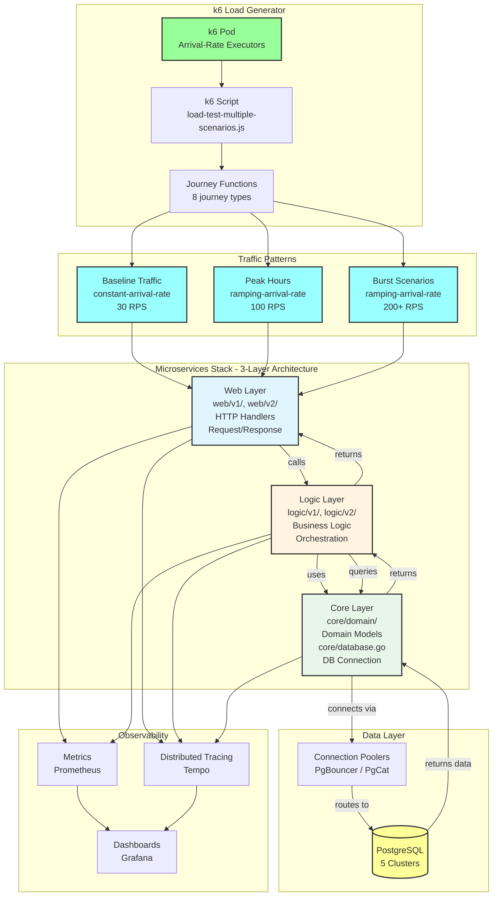

# Microservices Observability Platform

**Complete microservices observability solution** - Kubernetes-ready with Prometheus, Grafana, and full observability stack.

---

## Overview

Production-ready microservices monitoring platform with 9 Go services, complete observability (metrics, traces, logs, profiles), PostgreSQL database integration, and SRE practices (SLO tracking, error budgets).

**Key Features:**
- 9 microservices with v1/v2 APIs
- 34 Grafana dashboard panels (5 row groups)
- Complete observability stack (Prometheus, Tempo, Jaeger, Loki, Pyroscope)
- PostgreSQL database integration (5 clusters, Flyway migrations)
- SLO management via Sloth Operator
- k6 load testing

**For detailed documentation, see [`docs/README.md`](docs/README.md)**

---

## Architecture

### System Architecture

Complete system architecture showing k6 load testing, microservices stack (3-layer architecture), data layer, and observability:



**Detailed Architecture**: See [`docs/apm/ARCHITECTURE.md`](docs/apm/ARCHITECTURE.md) for middleware chain and APM integration. Full system architecture in [`specs/system-context/01-architecture-overview.md`](specs/system-context/01-architecture-overview.md)

### Microservices

| Service | Language | Description | Namespace | API Versions |
|---------|----------|-------------|-----------|--------------|
| auth | Go | Authentication & registration | auth | v1, v2 |
| user | Go | User management & profiles | user | v1, v2 |
| product | Go | Product catalog management | product | v1, v2 |
| cart | Go | Shopping cart operations | cart | v1, v2 |
| order | Go | Order processing & tracking | order | v1, v2 |
| review | Go | Product reviews & ratings | review | v1, v2 |
| notification | Go | Notification delivery | notification | v1, v2 |
| shipping | Go | Shipping tracking (legacy) | shipping | v1 only |
| shipping-v2 | Go | Enhanced shipping API | shipping | v2 only |

**Complete API Documentation**: See [`docs/guides/API_REFERENCE.md`](docs/guides/API_REFERENCE.md)

---

## Quick Start

### Complete Deployment

```bash
# Infrastructure & Monitoring
./scripts/01-create-kind-cluster.sh      # Create Kind cluster
./scripts/02-deploy-monitoring.sh        # Deploy Prometheus + Grafana

# APM Stack
./scripts/03-deploy-apm.sh               # Deploy Tempo, Pyroscope, Loki, Vector

# Database Infrastructure
./scripts/04-deploy-databases.sh         # Deploy PostgreSQL operators, clusters, poolers

# Deploy Applications (from OCI registry, images built by GitHub Actions)
./scripts/06-deploy-microservices.sh     # Deploy all microservices from ghcr.io OCI registry

# Load Testing (AFTER apps)
./scripts/07-deploy-k6.sh                # Deploy k6 load generators

# SLO System
./scripts/08-deploy-slo.sh               # Deploy Sloth Operator and SLO CRDs

# Access Setup
./scripts/09-setup-access.sh             # Setup port-forwarding
```

**Detailed Setup Guide**: See [`docs/guides/SETUP.md`](docs/guides/SETUP.md) for step-by-step instructions, prerequisites, and troubleshooting.

---

## Technology Stack

- **Runtime**: Go 1.25.5
- **Database**: PostgreSQL (5 clusters via Zalando/CloudNativePG operators)
  - Connection poolers: PgBouncer, PgCat
  - Migrations: Flyway 11.8.2 (8 migration images)
- **HTTP Framework**: Gin
- **Observability**: OpenTelemetry (traces, metrics, logs)
- **Deployment**: Kubernetes (Kind), Helm 3
- **Monitoring**: Prometheus, Grafana, Tempo, Loki, Pyroscope, Jaeger

**Observability Details**: See [`docs/apm/README.md`](docs/apm/README.md) for complete APM system overview.

---

## Dashboard

**Grafana Dashboard**: `microservices-monitoring-001`

- **34 panels** organized in 5 row groups
- **Access**: http://localhost:3000/d/microservices-monitoring-001/ (after port-forward)
- **Variables**: `$namespace`, `$app`, `$rate`

**Complete Dashboard Reference**: See [`docs/guides/GRAFANA_DASHBOARD.md`](docs/guides/GRAFANA_DASHBOARD.md) for all 34 panels with query analysis and troubleshooting.

**Metrics Documentation**: See [`docs/monitoring/METRICS.md`](docs/monitoring/METRICS.md) for complete metrics guide (6 custom metrics, 34 panels).

---

## Access Points

After running `./scripts/09-setup-access.sh` or manual port-forwarding:

| Service | URL | Credentials |
|---------|-----|-------------|
| Grafana | http://localhost:3000 | - |
| Prometheus | http://localhost:9090 | - |
| Jaeger UI | http://localhost:16686 | - |
| Tempo | http://localhost:3200 | - |
| API (via port-forward) | http://localhost:8080 | - |

**Port-Forwarding Guide**: See [`docs/guides/SETUP.md`](docs/guides/SETUP.md)

---

## Documentation

| Document | Description |
|----------|-------------|
| **[Setup Guide](docs/guides/SETUP.md)** | Complete deployment instructions |
| **[Metrics Guide](docs/monitoring/METRICS.md)** | Complete metrics documentation (6 custom metrics, 34 panels) |
| **[Grafana Dashboard Guide](docs/guides/GRAFANA_DASHBOARD.md)** | Complete dashboard reference (34 panels + annotations planning) |
| **[APM Overview](docs/apm/README.md)** | Complete APM system overview |
| **[SLO Documentation](docs/slo/README.md)** | SRE practices: SLI/SLO definitions, error budgets |
| **[API Reference](docs/guides/API_REFERENCE.md)** | Complete API documentation for all 9 microservices |
| **[k6 Load Testing](docs/k6/K6_LOAD_TESTING.md)** | k6 load testing setup and configuration |
| **[Documentation Index](docs/README.md)** | Complete documentation index with learning path |
| **[AGENTS.md](AGENTS.md)** | AI Agent Guide for navigating the codebase |

---

## Key Features

### Observability

- **Traces**: Distributed tracing with Tempo + Jaeger (via OpenTelemetry Collector)
- **Metrics**: Prometheus (custom business + infrastructure metrics)
- **Logs**: Structured logging with zap, correlated via trace_id/span_id (Loki + Vector)
- **Profiles**: Continuous profiling with Pyroscope (CPU, heap, goroutines, locks)

**APM Details**: See [`docs/apm/README.md`](docs/apm/README.md)

### Database

- **5 PostgreSQL Clusters**: review-db, auth-db, supporting-db (shared: user + notification + shipping-v2), product-db, transaction-db
- **Architecture Diagrams**: Comprehensive Mermaid diagrams showing overview and individual cluster details
- **Connection Poolers**: PgBouncer (Auth), PgCat (Product, Cart+Order)
- **Migrations**: Flyway 11.8.2 with 8 migration images
- **Operators**: Zalando Postgres Operator (v1.15.0), CloudNativePG Operator (v1.28.0)
- **Cross-Namespace Secrets**: Zalando operator configured for shared database pattern

**Database Details**: See [`docs/guides/DATABASE.md`](docs/guides/DATABASE.md) for complete architecture diagrams and configuration

### SLO Management

- **Sloth Operator**: Kubernetes-native SLO management
- **Error Budget Tracking**: Real-time error budget monitoring
- **Burn Rate Alerts**: Multi-window multi-burn-rate alerts
- **Automated Runbooks**: Latency diagnosis and error budget alert response

**SLO Details**: See [`docs/slo/README.md`](docs/slo/README.md)

---

**Built with ❤️ for learning observability**

🚀 **Happy Monitoring!**
