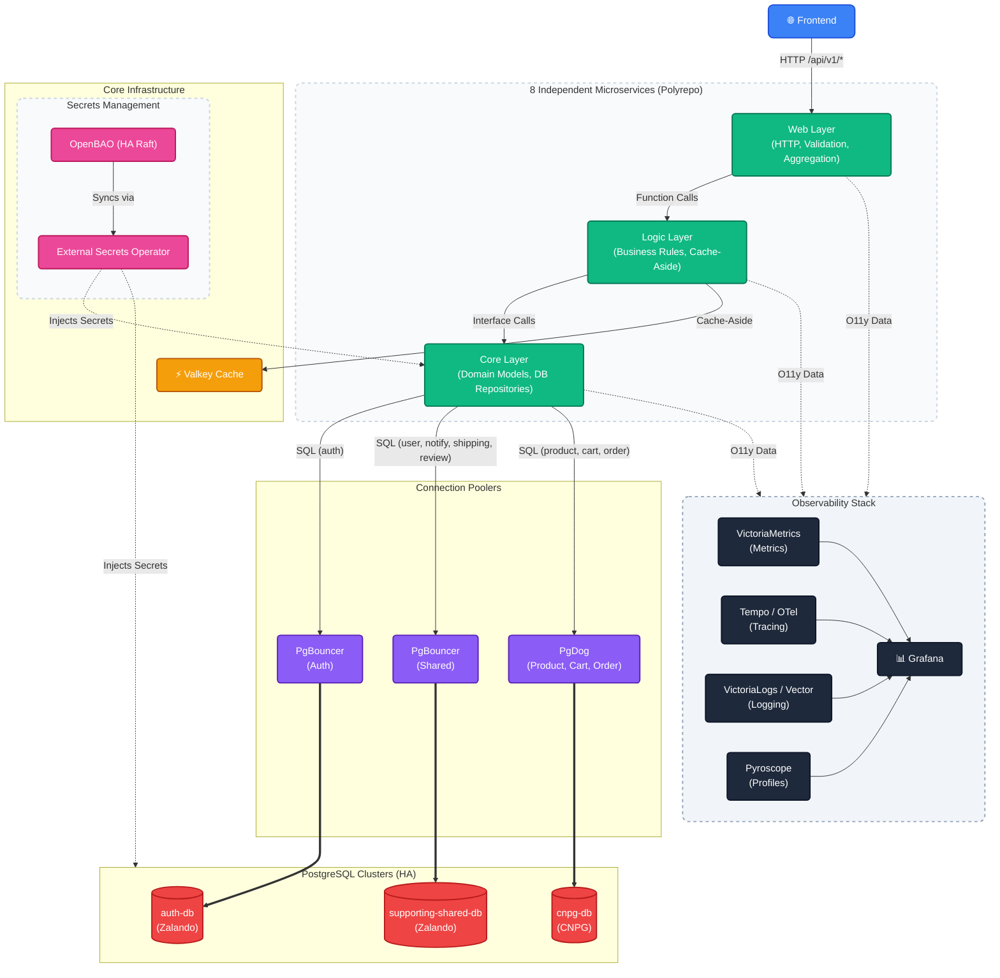

# Microservices Observability Platform

A GitOps-managed Kubernetes homelab cluster running on Kind Local (planned to server).

---

## Overview

Production-ready microservices monitoring platform with 8 Go services, complete observability (metrics, traces, logs, profiles), PostgreSQL database integration, and SRE practices (SLO tracking, error budgets).

**Key Features:**

- 8 microservices with v1 API (canonical, frontend-aligned)
- 15 Grafana dashboards (microservices, databases, tracing, infrastructure)
- Complete observability stack (VictoriaMetrics, Tempo, Jaeger, VictoriaLogs, Pyroscope)
- PostgreSQL database integration (3 clusters + DR replica, Flyway migrations)
- Valkey caching (Redis-compatible) with Cache-Aside pattern
- SLO management via Sloth Operator

**For detailed documentation, see [`docs/README.md`](docs/README.md)**

---

## Architecture Overview

### System Architecture

Runtime architecture: Frontend (React SPA), 8 microservices (3-layer each), Valkey cache, 3 PostgreSQL clusters (+ DR replica), and full observability stack.

> **Note**: This repository contains **infrastructure, GitOps, observability, and docs only**. Application code lives in separate repos (see [SERVICES.md](SERVICES.md)). Apps are deployed via Flux Operator ResourceSets (see [Application Delivery](docs/platform/application-delivery.md)).



**Key Points:**

- **Frontend (React SPA)**: Runs in browser, HTTP requests to Web Layer only (`/api/v1/*`). Frontend repo: [`duynhlab/frontend`](https://github.com/duynhlab/frontend).
- **8 Microservices**: Each follows 3-layer architecture (Web -> Logic -> Core), organized into 4 domains (identity, catalog, checkout, comms).
- **Cache-Aside Pattern**: Logic Layer checks Valkey first, queries database on miss, writes to cache.
- **3 PostgreSQL Clusters**: auth-db (Zalando), supporting-shared-db (Zalando, hosts user/notification/shipping/review), cnpg-db (CNPG, hosts product/cart/order). Connected via PgBouncer and PgDog poolers. A DR replica cluster (cnpg-db-replica) continuously recovers from cnpg-db WAL archive.
- **Full Observability**: Traces (Tempo + Jaeger via OTel Collector), Metrics (VictoriaMetrics via VMAgent/VMSingle), Logs (VictoriaLogs + Vector), Profiles (Pyroscope), all visualized in Grafana.
- **GitOps Delivery**: Flux Operator with domain ResourceSets + per-service InputProviders + OCI + Kustomize. See [Application Delivery](docs/platform/application-delivery.md) and [Setup](docs/platform/setup.md).

**Detailed Architecture**: See [`docs/observability/architecture.md`](docs/observability/architecture.md) for middleware chain and APM integration.

---

## Technology Stack
### Core Services
- **Runtime**: Go 1.25
    - 8 microservices
    - 3 layer: Web → Logic → Core

- **Database**: PostgreSQL (3 clusters + DR replica via Zalando/CloudNativePG operators)
    - Connection poolers: PgBouncer, PgDog
    - Migrations: Flyway 11.19.0 (8 migration images)
- **HTTP Framework**: Gin
- **Cache**: Valkey (Redis-compatible) with Cache-Aside pattern

**Complete API Documentation**: See [`docs/api/api.md`](docs/api/api.md)

### Infrastructure Stack
- **Kubernetes**: Local Cluster (Kind), Helm 3
- **GitOps**: Flux Operator, ResourceSet (Unified Templating), Kustomize, OCI Registry
    - Application layer: 4 domain ResourceSets (identity, catalog, checkout, comms) + per-service InputProviders
- **Monitoring**: VictoriaMetrics (VMSingle, VMAgent, VMAlert), Grafana, Tempo, VictoriaLogs, Pyroscope, Jaeger, Vector.

**Observability Details**: See [`docs/observability/README.md`](docs/observability/README.md) for complete observability system overview.


### GitOps Deployment

```bash
# Prerequisites check
make prereqs

# One-command deployment (cluster + Flux + apps)
make up

# Or step-by-step:
make cluster-up   # 1. Create Kind cluster + OCI registry
make flux-up      # 2. Bootstrap Flux Operator
make flux-push    # 3. Deploy everything (infrastructure + apps)
```

**What gets deployed automatically:**

- Infrastructure: Monitoring (VictoriaMetrics, Grafana), APM (Tempo, VictoriaLogs, Jaeger, Pyroscope, Vector, OTel)
- Databases: PostgreSQL operators, 3 clusters + DR replica, connection poolers
- Cache: Valkey (Redis-compatible) in cache-system namespace
- Applications: 8 microservices + frontend (via domain ResourceSets)
- SLO: Sloth Operator + Service Level Objectives

**Wait 5-10 minutes** for Flux reconciliation, then access services.

**Benefits:**

- **Simplified Makefile**: 80 lines, delegates to scripts
- **One-command deployment**: `make up` bootstraps everything
- **Automatic drift detection**: Flux reconciles changes automatically
- **Multi-environment support**: Local/production overlays
- **OCI-based GitOps**: Single source of truth in OCI registry

**Detailed Setup Guide**: See [`docs/platform/setup.md`](docs/platform/setup.md) for step-by-step instructions, architecture explanation, and troubleshooting.

---
## Grafana Dashboards

The platform includes **15 Grafana dashboards** covering observability, databases, and infrastructure monitoring. All dashboards are deployed via GitOps from `kubernetes/infra/configs/monitoring/grafana/dashboards/`.

**Key Dashboards:**
- **Microservices Monitoring**: Main observability dashboard covering metrics, traffic, errors, and runtime
- **Tempo Distributed Tracing**: Trace visualization with exemplars and log correlation
- **Kong Dashboard**: API gateway traffic, latency, and error rates
- **Kubernetes Cluster Overview**: Cluster-wide resource utilization
- **Database Dashboards**: PostgreSQL monitoring, CloudNativePG, PgBouncer, PgDog, query overview/drilldown, replication lag
- **Infrastructure**: Vector metrics, Redis/Valkey monitoring

**Access**: All dashboards are available via Grafana at http://grafana.duynhne.me (see [Access Points](#access-points) below).

**Documentation**: See [`docs/observability/grafana/dashboard-reference.md`](docs/observability/grafana/dashboard-reference.md) for complete dashboard reference and [`docs/observability/metrics/README.md`](docs/observability/metrics/README.md) for metrics guide.

---

## Access Points

After deployment, access services via domain names using `/etc/hosts` mapping through Kong Ingress.

### Setup `/etc/hosts`

Add the following entries to your `/etc/hosts` file:

```bash
# duynhlab homelab — Kong Ingress domains
127.0.0.1 gateway.duynhne.me
127.0.0.1 app.duynhne.me
127.0.0.1 grafana.duynhne.me
127.0.0.1 vmui.duynhne.me
127.0.0.1 vmalert.duynhne.me
127.0.0.1 karma.duynhne.me
127.0.0.1 jaeger.duynhne.me
127.0.0.1 tempo.duynhne.me
127.0.0.1 pyroscope.duynhne.me
127.0.0.1 logs.duynhne.me
127.0.0.1 ui.duynhne.me
127.0.0.1 source.duynhne.me
127.0.0.1 openbao.duynhne.me
127.0.0.1 pgui.duynhne.me
127.0.0.1 vm-mcp.duynhne.me
127.0.0.1 vl-mcp.duynhne.me
127.0.0.1 flux-mcp.duynhne.me
```

> **Note**: Requires Kind cluster with `extraPortMappings` (ports 80/443 → NodePort 30080/30443). This is configured automatically by `make cluster-up`.

### Service URLs

All services are routed through Kong Ingress Controller on port 80 (HTTP).

| Service | Domain | Description |
|---------|--------|-------------|
| **Frontend** | http://app.duynhne.me | React SPA |
| **API Gateway** | http://gateway.duynhne.me | Kong → 8 microservices (`/api/v1/*`) |
| **Grafana** | http://grafana.duynhne.me | Dashboards (anonymous access) |
| **VictoriaMetrics** | http://vmui.duynhne.me/vmui | Metrics query UI |
| **VMAlert** | http://vmalert.duynhne.me | Alert rules & evaluation |
| **Karma** | http://karma.duynhne.me | Alertmanager dashboard |
| **Jaeger** | http://jaeger.duynhne.me | Distributed tracing UI |
| **Tempo** | http://tempo.duynhne.me | Trace backend API |
| **Pyroscope** | http://pyroscope.duynhne.me | Continuous profiling |
| **VictoriaLogs** | http://logs.duynhne.me | Log query UI |
| **Flux UI** | http://ui.duynhne.me | GitOps reconciliation status |
| **RustFS Console** | http://source.duynhne.me | S3 object storage console |
| **OpenBAO** | http://openbao.duynhne.me | Secrets management UI |
| **Postgres Operator UI** | http://pgui.duynhne.me | Database cluster management |
| **VM MCP** | http://vm-mcp.duynhne.me/mcp | VictoriaMetrics MCP (AI assistants) |
| **VL MCP** | http://vl-mcp.duynhne.me/mcp | VictoriaLogs MCP (AI assistants) |
| **Flux MCP** | http://flux-mcp.duynhne.me/mcp | Flux Operator MCP (AI assistants) |

### Fallback: Port Forwarding

If `/etc/hosts` is not configured (e.g., CI environments), use `make flux-ui` for port-forwarding:

```bash
make flux-ui          # Start all port-forwards
pkill -f 'kubectl port-forward'  # Stop all
```

---

## Documentation

Complete documentation is available in the [`docs/`](docs/README.md) directory. Quick links:

**Getting Started:**
- **[Setup Guide](docs/platform/setup.md)** - Deployment instructions and troubleshooting
- **[Application Delivery](docs/platform/application-delivery.md)** - ResourceSet patterns & templates
- **[API Reference](docs/api/api.md)** - Complete API documentation

**Observability:**
- **[Observability Overview](docs/observability/README.md)** - Distributed tracing, metrics, logs, profiling
- **[Metrics Guide](docs/observability/metrics/README.md)** - Custom metrics and VictoriaMetrics integration
- **[Grafana Dashboards](docs/observability/grafana/dashboard-reference.md)** - Dashboard reference (15 dashboards)
- **[SLO Documentation](docs/observability/slo/README.md)** - SLI/SLO definitions and error budgets

**Infrastructure:**
- **[Database Guide](docs/databases/002-database-integration.md)** - PostgreSQL architecture (3 clusters + DR replica, poolers, migrations)
- **[k6 Load Testing](docs/testing/k6.md)** - Load testing setup and scenarios *(k6 workload retired; doc kept for reference)*
- **[Runbooks](docs/runbooks/troubleshooting/)** - Operational troubleshooting guides

**Reference:**
- **[Documentation Index](docs/README.md)** - Complete index with learning path
- **[AGENTS.md](AGENTS.md)** - AI Agent Guide for codebase navigation

---

**Built with ❤️ for learning observability**

🚀 **Happy Monitoring!**
