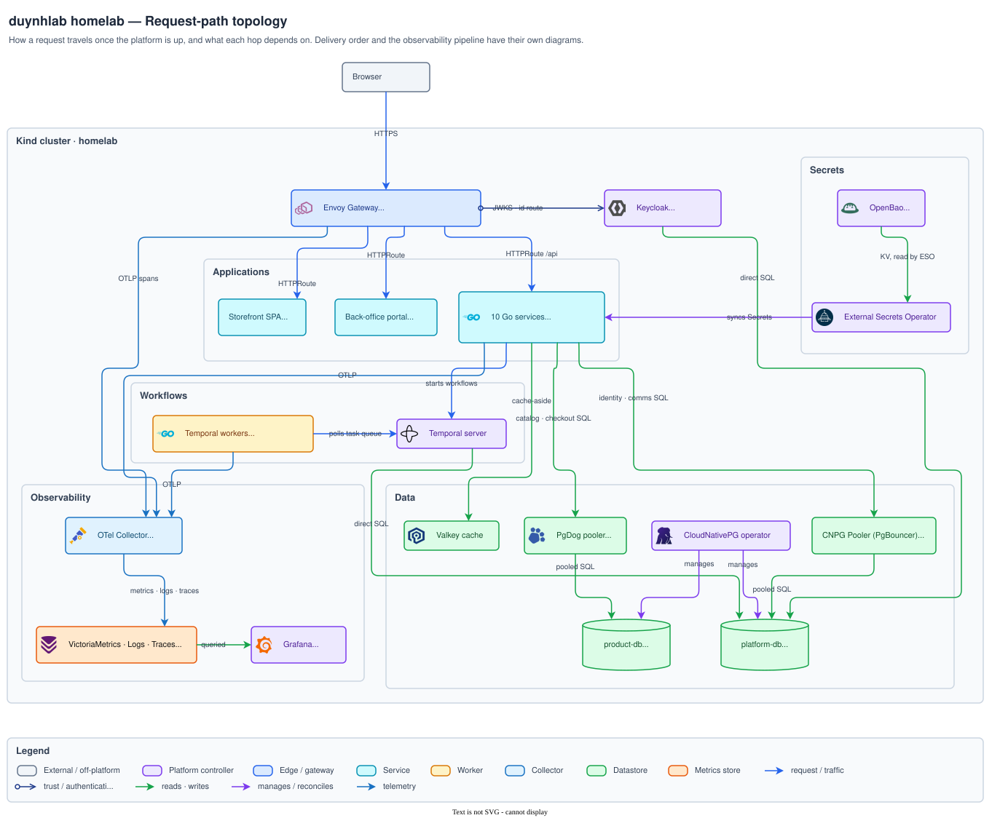
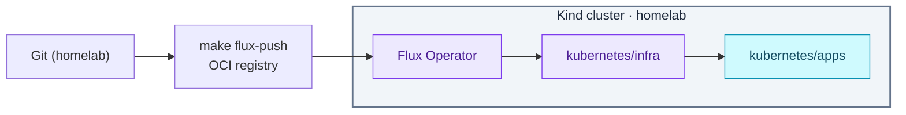

<div align="center">

<a name="readme-top"></a>

<h1>duynhlab homelab</h1>

<p><em>Infrastructure, GitOps, and observability for the duynhlab microservices platform.</em></p>

<p>
  <a href="kubernetes/">Kubernetes</a>
  &middot;
  <a href="terraform/">OpenTofu</a>
  &middot;
  <a href="local-stack/">Local Stack</a>
</p>

<p>
  <a href="https://kind.sigs.k8s.io/"></a>&nbsp;
  <a href="https://fluxcd.io/"></a>&nbsp;
  <a href="https://opentofu.org/"></a>&nbsp;
</p>

</div>

---

## Overview

Platform delivery hub: Kubernetes manifests (Flux + Kustomize + OCI), observability
stack, database and secrets infra, and Kyverno policies. Deploys **10 Go
microservices** across five domains (identity, catalog, checkout, fulfillment,
comms), **two Temporal workers**, a React storefront, and a back-office portal
on **Kind** — with **Keycloak** for identity and **Envoy Gateway** as the only
edge. Application source lives in separate repositories.

---

## Topology

How a request travels once the platform is up, and what each hop talks to. The
primary flow (requests) moves in the diagram.

<p align="center">
  <a href="docs/architecture/platform/topology.svg"></a>
</p>

<p align="center"><sub>Source <a href="docs/architecture/platform/topology.drawio"><code>platform/topology.drawio</code></a> · <a href="docs/architecture/platform/img/topology.png">PNG</a></sub></p>

---

## Repository layout

| Path | Role |
|------|------|
| `kubernetes/clusters/` | Flux bootstrap + per-cluster `Kustomization` dependency chain |
| `kubernetes/infra/` | Controllers and configs — monitoring, databases, secrets, Envoy Gateway, Kyverno |
| `kubernetes/apps/` | Domain ResourceSets and per-service InputProviders |
| `terraform/` | OpenTofu bootstrap of Flux Operator + `FluxInstance` |
| `local-stack/` | Docker Compose e2e stack (no cluster required) |
| `docs/` | Platform documentation |
| `scripts/` | Kind, Flux, and validation helpers (Makefile targets) |

---

## GitOps delivery

Manifests are built with Kustomize, published as OCI artifacts, and reconciled by
the Flux Operator. Infra must reconcile before apps (`dependsOn` in
`kubernetes/clusters/local/`).


```mermaid
flowchart LR
    classDef platform fill:#ede9fe,color:#4c1d95,stroke:#7c3aed;
    classDef service fill:#cffafe,color:#164e63,stroke:#0891b2;

    Git["Git (homelab)"] --> Push["make flux-push<br/>OCI registry"]
    subgraph Cluster ["Kind cluster · homelab"]
        Flux["Flux Operator"]:::platform
        Infra["kubernetes/infra"]:::platform
        Apps["kubernetes/apps"]:::service
    end
    style Cluster fill:#f1f5f9,stroke:#64748b,stroke-width:2px,color:#1e293b
    Push --> Flux
    Flux --> Infra
    Infra --> Apps
```

---

## Quick start

```bash
make prereqs                  # check kind, kubectl, flux, helm, docker, tofu
make hosts                    # *.duynh.me → 127.0.0.1 (sudo scripts/setup-hosts.sh)
make up                       # Kind + OCI push + Flux bootstrap
make flux-status              # watch reconciliation (~5–10 min first time)
```

Other targets: `make validate`, `make sync`, `make down`, `make help`.

---

## Local access

Kind maps host `80`/`443` to the Envoy Gateway NodePorts (`30080`/`30443`).
TLS is a wildcard `*.duynh.me` cert — self-signed `homelab-ca` on local Kind
(browser warning); Let's Encrypt on prod.

| URL | Purpose |
|-----|---------|
| https://local.duynh.me | Storefront SPA |
| https://backoffice.duynh.me | Back-office portal |
| https://gateway.duynh.me | API gateway |
| https://id.duynh.me | Keycloak (OIDC) |
| https://grafana.duynh.me | Grafana dashboards |
| https://vmui.duynh.me | VictoriaMetrics VMUI (metrics) |
| https://vmalert.duynh.me | VMAlert (alerting + recording rules) |
| https://karma.duynh.me | Karma (Alertmanager dashboard) |
| https://logs.duynh.me | VictoriaLogs (LogsQL) |
| https://victoriatraces.duynh.me | VictoriaTraces (traces) |
| https://pyroscope.duynh.me | Pyroscope (profiling) |
| https://slo.duynh.me | Sloth UI (SLOs) |
| https://temporal.duynh.me | Temporal UI |
| https://ui.duynh.me | Flux Operator UI |
| https://source.duynh.me | RustFS (S3 object store) |
| https://openbao.duynh.me | OpenBAO UI |
| https://kyverno.duynh.me | Policy Reporter UI (Kyverno) |

Demo login: `alice` / `password123` (by username).

---

## Local stack

Without Kubernetes, validate the exact source candidate before creating a
release tag:

```bash
cd local-stack && docker compose up -d --build
```

SPA at http://localhost:3001, gateway at http://localhost:8080. The
[full E2E release audit](local-stack/docs/e2e-audit.md) must pass before the
candidate is tagged and pinned for Kind.

---

**Built with ❤️.**
