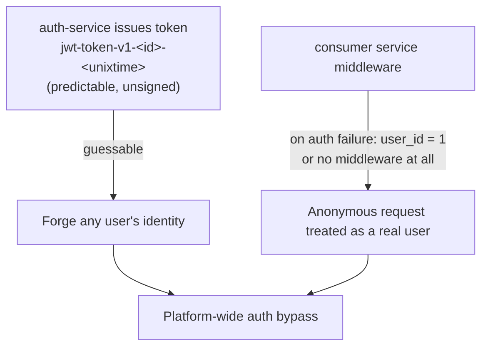

# Platform Code Review — Findings & Remediation

> **Date:** 2026-05-30
> **Scope:** `auth-service`, `cart-service`, `order-service`, `product-service`,
> `review-service`, `shipping-service`, `user-service`, `pkg`, `frontend`
> **Method:** One reviewer per repository, reading the actual source against the
> platform conventions in [`docs/api/`](docs/api/) and each repo's `AGENTS.md`
> (3-layer architecture, `/{service}/v1/{audience}/…` URL shape, `{"error": …}`
> envelope, pgx/v5, JWT-in-middleware).
> **Status legend:** ✅ Fixed in this round · ⏳ Deferred (documented, not yet done)
> · 📌 Ops action (verify outside the service repos)

---

## 1. Executive summary

The platform's **infrastructure code is consistently solid**: every service uses
parameterised SQL (no SQL injection was found anywhere), pgx/v5 is configured
correctly for the transaction-mode poolers, graceful shutdown follows the
VictoriaMetrics drain pattern, and the 3-layer boundaries are respected.

The problems cluster into a small number of **repeated patterns**, the most
serious being **authentication**. Fixing the patterns (not just the individual
sites) is what this review optimises for.

This round fixed all **Critical + High + clear-bug** findings across the 7 Go
services and one frontend bug. Lower-severity items (style, dead code, larger
refactors, missing tests) are documented below as deferred follow-ups.

### What was fixed in this round

Each service has a `fix/security-correctness-review` branch, based on `main`,
build/test/lint verified, **pushed but not yet opened as a PR**:

| Repo | Branch commit | Headline fix |
|------|---------------|--------------|
| auth-service | `Harden session tokens and auth error paths` | Forgeable token → CSPRNG opaque token |
| cart-service | `Fail closed on auth and fix cart correctness bugs` | Auth fail-open → fail-closed |
| order-service | `Enforce order ownership and fix context handling` | IDOR → ownership-scoped queries |
| product-service | `Fix product list correctness and stock reporting` | Stale cache + real stock |
| review-service | `Enforce JWT auth and harden review validation` | Added JWT middleware; identity from token |
| shipping-service | `Fix shipment NULL scan, input validation, readiness` | NULL-carrier 500 crash |
| user-service | `Fix profile security and correctness bugs` | IDOR/clobber/PII on profile |
| frontend | `Fix returnTo URL build in review login prompts` | Broken `returnTo` query/fragment |

---

## 2. Cross-cutting patterns (learn once, fix everywhere)

### 2.1 Authentication was broken at two independent layers 🔴

Either layer alone is a full bypass:

- **Layer 1 — auth-service issued fake tokens.** The "token" was
  `fmt.Sprintf("jwt-token-v1-%d-%d", id, unixSeconds)` — not a JWT, no signature,
  no randomness. ✅ Replaced with a 32-byte `crypto/rand` opaque token.
- **Layer 2 — consumers failed open.** `cart`, `order`, and `user` middleware
  defaulted to `user_id = "1"` on any auth failure; `review` had **no auth at
  all** and trusted `user_id` from the request body. ✅ All now **fail closed**
  (`401`), and identity always comes from the validated token, never the body.

**Lesson:** auth must **fail closed**. No valid token → `401`, never a default
user. Identity comes from the token, never from client-supplied fields.

### 2.2 Root cause: `pkg` has no shared auth/HTTP code

`pkg` contains only logging. There is no shared JWT helper or auth middleware, so
each service re-implemented its own by copy-paste — which is why the same
`user_id="1"` fallback and the same `context.Background()` bug appear in multiple
services. ⏳ **Recommended:** extract one tested, fail-closed auth middleware into
`pkg` and have every service import it. Highest-leverage follow-up.

### 2.3 Swallowed row-scan errors → silent data loss ✅

`cart`, `order`, and `product` repositories looped with `if err != nil { continue }`
and never checked `rows.Err()`. A single bad row was silently dropped, producing a
cart/order with missing items and a wrong total — dangerous at checkout. ✅ Fixed
to `return err` + `rows.Err()` check in all three.

### 2.4 `context.Background()` in auth middleware ✅

`cart`, `order`, `user` (and the new `review`) auth calls ignored the request
context — no client-cancellation propagation, broken trace linkage. ✅ All now
thread `c.Request.Context()` through `GetMe`.

### 2.5 Internal routes have no in-app authentication 📌

`product`, `user`, and `shipping` expose `internal` routes that rely **entirely**
on a NetworkPolicy existing in this repo — the services themselves do no caller
auth. 📌 **Verify** the NetworkPolicies actually exist and restrict ingress to the
intended caller namespaces. (Tracked here; not a service-repo change.)

---

## 3. Per-service findings

> Severity is the reviewer's rating. "Fixed" items shipped on each repo's
> `fix/security-correctness-review` branch.

### auth-service

| Sev | Finding | Location | Status |
|-----|---------|----------|--------|
| CRITICAL | Forgeable/guessable session token (not a real JWT) | `internal/logic/v1/service.go` | ✅ CSPRNG opaque token |
| HIGH | Username enumeration via login timing (bcrypt skipped when user absent) | `internal/logic/v1/service.go` | ✅ dummy-hash compare |
| MEDIUM | Binding errors leak validator/struct internals | `internal/web/v1/handler.go` | ✅ generic message |
| MEDIUM | `User.Password` JSON field can serialise into responses | `internal/core/domain/user.go` | ⏳ use `json:"-"` |
| MEDIUM | No logout / session revocation; expired rows accumulate | sessions repo | ⏳ |
| LOW | Session-create failure swallowed → login "succeeds" with a dead token | `internal/logic/v1/service.go` | ⏳ |

### cart-service

| Sev | Finding | Location | Status |
|-----|---------|----------|--------|
| CRITICAL | Auth middleware fails open to `user_id="1"` | `middleware/auth.go` | ✅ fail-closed 401 |
| CRITICAL | Handlers re-apply `user_id="1"` fallback | `internal/web/v1/handler.go` | ✅ removed |
| HIGH | Auth call uses `context.Background()` | `middleware/auth.go` | ✅ request ctx |
| HIGH | Unbounded startup DB connect can hang the pod | `cmd/main.go` | ✅ 10s timeout |
| HIGH | `FindByUserID` swallows scan errors, no `rows.Err()` | `internal/core/repository/postgres_cart_repository.go` | ✅ |
| MEDIUM | `AddToCart` returns 500 for invalid quantity | `internal/web/v1/handler.go` | ✅ → 400 |
| MEDIUM | Empty cart still reports `shipping=5.00`/`total=5.00` | `…/postgres_cart_repository.go` | ✅ zero when empty |
| MEDIUM | Shipping/total computed in repo (layering) | same | ⏳ move to logic |
| MEDIUM | Concurrent add+update race on a cart row | repo | ⏳ accepted at this scale |
| MEDIUM | No pool lifetime/idle/health tuning | `internal/core/database.go` | ⏳ |
| LOW | Dead `globalPool`/`GetPool`/`GetDB` | `internal/core/database.go` | ⏳ |

### order-service

| Sev | Finding | Location | Status |
|-----|---------|----------|--------|
| CRITICAL | IDOR — any user reads any order by sequential ID | `internal/web/v1/handler.go`, `…/postgres_order_repository.go` | ✅ `WHERE id=$1 AND user_id=$2` |
| CRITICAL | Same IDOR in `/details` aggregation | `internal/web/v1/aggregation.go` | ✅ |
| HIGH | No server-side order math validation (negative qty/price accepted) | `internal/logic/v1/service.go` | ✅ reject |
| HIGH | Post-commit cart-clear uses cancellable request ctx | `internal/web/v1/handler.go` | ✅ `WithoutCancel`+timeout |
| HIGH | Auth call uses `context.Background()` | `middleware/auth.go` | ✅ request ctx |
| MEDIUM | Order-item rows swallow scan errors, no `rows.Err()` | `…/postgres_order_repository.go` | ✅ |
| MEDIUM | No pool tuning; `created_at` set app-side not DB | `internal/core/database.go` | ⏳ |
| LOW | Global singletons + silent no-op wrappers; unused non-tx `Create` | handler/aggregation | ⏳ |

### product-service

| Sev | Finding | Location | Status |
|-----|---------|----------|--------|
| HIGH | `?order=asc` silently ignored (compares `"ASC"` only) | `…/postgres_product_repository.go` | ✅ case-normalise |
| HIGH | Cache invalidation only purges 4 hardcoded keys → stale lists | `internal/core/cache/product_cache.go` | ✅ SCAN `product:list:*` |
| MEDIUM | Hardcoded mock stock (`quantity:50`) hides real `stock_quantity` | `internal/web/v1/handler.go` | ✅ real column |
| MEDIUM | Scan errors swallowed; empty list marshals as `null` | `…/postgres_product_repository.go` | ✅ |
| MEDIUM | `/details` aggregate not cached; re-fetches reviews every call | `internal/web/v1/handler.go` | ⏳ |
| HIGH | Review HTTP client `MaxIdleConnsPerHost=2` throttles a read-hot path | `internal/web/v1/review_client.go` | ⏳ tune transport |
| (sec) | `POST /internal/products` has no in-app auth | `cmd/main.go` | 📌 verify NetworkPolicy |
| LOW | CORS allows only localhost; dead `Update`/`Delete`; related-products error discarded | various | ⏳ |

### review-service

| Sev | Finding | Location | Status |
|-----|---------|----------|--------|
| CRITICAL | No auth middleware at all on the private route | `cmd/main.go` | ✅ added (fail-closed, request ctx) |
| CRITICAL | `user_id` trusted from request body (impersonation) | `internal/web/v1/handler.go`, `…/domain/review.go` | ✅ from token |
| HIGH | Duplicate-review check is a race; no DB unique constraint | migrations, repo | ✅ `V3` UNIQUE + `23505` handling |
| HIGH | `comment` not required despite the spec | `…/domain/review.go` | ✅ `binding:"required"` |
| HIGH | `rating` `required` on an int is fragile | `…/domain/review.go` | ✅ drop `required`, keep `min/max` |
| MEDIUM | Validation errors leak raw binding strings | `internal/web/v1/handler.go` | ✅ generic message |
| MEDIUM | Invalid/non-numeric `product_id` returns 500 not 400 | `internal/logic/v1/service.go` | ✅ `ErrInvalidInput`→400 |
| MEDIUM | No request/DB timeouts | `cmd/main.go`, repo | ⏳ |
| LOW | `user_id` exposed in public review responses | repo/domain | ⏳ |

### shipping-service

| Sev | Finding | Location | Status |
|-----|---------|----------|--------|
| CRITICAL | NULL `carrier` column crashes the scan → 500 on valid rows | `internal/core/repository/postgres/shipping.go` | ✅ scan `*string` |
| HIGH | Estimate accepts negative/NaN/Inf weight → garbage/invalid JSON | `internal/web/v1/handler.go` | ✅ validate |
| HIGH | Empty `tracking_number` hits DB and 404s instead of 400 | `internal/web/v1/handler.go` | ✅ 400 fast-fail |
| MEDIUM | `/ready` doesn't check the DB | `cmd/main.go` | ✅ ping pool |
| MEDIUM | No per-request DB timeout | `…/postgres/shipping.go` | ✅ 3s timeout |
| MEDIUM | Public `track` leaks internal `id`/`order_id`; enumeration | `internal/web/v1/handler.go` | ⏳ trim public DTO |
| (sec) | `internal/orders/:orderId` has no in-app auth | `cmd/main.go` | 📌 verify NetworkPolicy |
| LOW | Undocumented `trackingId` alias; dead `EstimateRequest` struct | various | ⏳ |

### user-service

| Sev | Finding | Location | Status |
|-----|---------|----------|--------|
| CRITICAL | `CreateUser` synthesises IDs as `len(username)+100` (collisions) | `internal/logic/v1/service.go` | ✅ require explicit `user_id` (endpoint is unused/mock) |
| HIGH | Public `GET /users/:id` returns `email` (PII) | `…/psql/user_repository.go`, handler | ✅ minimal public view |
| HIGH | `UpdateProfile` silently defaults to `uid=1` on bad token | `internal/logic/v1/service.go` | ✅ error out |
| HIGH | Partial PUT clobbers unspecified fields to empty | `…/psql/user_repository.go` | ✅ `COALESCE(NULLIF(...))` |
| HIGH | Auth call uses `context.Background()` | `middleware/auth.go` | ✅ request ctx |
| (sec) | `POST /internal/users` has no in-app auth | `cmd/main.go` | 📌 verify NetworkPolicy |
| MEDIUM | `UpsertUserProfile` non-atomic check-then-insert race | `…/psql/user_repository.go` | ⏳ `ON CONFLICT` upsert |
| MEDIUM | `GetUser` mock ignores DB; fake-data + wrong 404 path | `…/psql/user_repository.go` | ⏳ implement real query |
| MEDIUM | Update response omits username/email, echoes input | `internal/logic/v1/service.go` | ⏳ |
| LOW | `allowUnauthenticatedFallback` flag can impersonate user 1 | `middleware/auth.go` | ⏳ guard against prod |

### pkg (shared library) — ⏳ no code change this round

Findings are out of the Critical/High/clear-bug scope chosen for this round:

| Sev | Finding | Status |
|-----|---------|--------|
| HIGH | Invalid `LOG_LEVEL` silently falls back to `info` with no warning | ⏳ |
| HIGH | No tests, though README/CI advertise `go test -race` | ⏳ add tests |
| MEDIUM | Two divergent loggers (`clog` RFC3339 vs `zerolog` Unix) → inconsistent log schema | ⏳ standardise on one |
| MEDIUM | `zerolog.TimeFieldFormat` is a process-global side effect; whole-second resolution | ⏳ |
| LOW | Doc comment claims it reads `LOG_LEVEL` env; it takes a param | ⏳ |

> Note: the module path `github.com/duynhne/pkg` is internally consistent (all
> services import `duynhne`), so this is **not** a build problem — just be aware
> the GitHub org is `duynhlab`.

### frontend

| Sev | Finding | Location | Status |
|-----|---------|----------|--------|
| MEDIUM | `returnTo` built with bare `#reviews` + unencoded → mode/anchor lost | `src/pages/ProductDetailPage/ProductDetailPage.jsx` | ✅ `encodeURIComponent` |
| HIGH | JWT in `localStorage` (XSS-exfiltratable) | `LoginPage.jsx`, `client.js` | ⏳ architectural; acceptable for demo |
| MEDIUM | Checkout sends client-supplied `price` (tampering vector) | `CheckoutPage.jsx` | ⏳ derive server-side |
| MEDIUM | OrdersPage detail fetch has a stale-response race | `OrdersPage.jsx` | ⏳ |
| LOW | CartPage reads `localStorage` non-reactively; dead effect; uneven loading UX | various | ⏳ |

> The earlier "wrong gateway host" flag (`duynh.me` vs `duynhne.me`) was
> **dropped**: `frontend/AGENTS.md` documents `gateway.duynh.me` as correct for
> the frontend. There is, however, a **documentation inconsistency** —
> `homelab/CLAUDE.md` and `docs/` mix `duynhne.me` and `duynh.me`. ⏳ Reconcile
> the docs so one canonical gateway host is used everywhere.

---

## 4. Recommended follow-up order

1. **Shared, fail-closed auth middleware in `pkg`** (§2.2) — removes the
   copy-paste class of bugs for good.
2. **Verify the `internal`-route NetworkPolicies** (§2.5) — `product`, `user`,
   `shipping` depend on them for their only access control.
3. **Reconcile the gateway hostname** across docs (`duynh.me` vs `duynhne.me`).
4. **`pkg` tests + single logger standard**, then the per-service MEDIUM/LOW
   cleanups (pool tuning, dead `globalPool`, atomic upserts, public DTOs).

---

*Generated from a per-repository source review on 2026-05-30. The code fixes for
all Critical/High/clear-bug items are on each repo's
`fix/security-correctness-review` branch, pending PR.*
