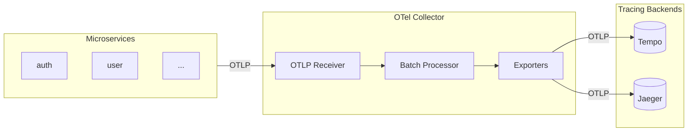

# Jaeger Distributed Tracing

Jaeger is an open-source distributed tracing platform. This deployment runs alongside Grafana Tempo, providing an alternative UI for trace visualization.

## Architecture



Applications send traces to OpenTelemetry Collector, which fans out to both Tempo and Jaeger.

## Prerequisites

- Kubernetes cluster
- Helm 3.x
- `monitoring` namespace exists

## Chart Information

- **Chart**: `jaegertracing/jaeger`
- **Chart Version**: `4.1.4`
- **App Version**: `2.13.0` (default when `tag: ""`)
- **Kubernetes**: `>= 1.21-0`

## Installation

### Via Script (Recommended)

```bash
./scripts/03d-deploy-jaeger.sh
```

This script deploys both Jaeger and OpenTelemetry Collector.

### Manual Installation

1. **Add Helm repository:**
   ```bash
   helm repo add jaegertracing https://jaegertracing.github.io/helm-charts
   helm repo update
   ```

2. **Install Jaeger:**
   ```bash
   helm upgrade --install jaeger jaegertracing/jaeger \
       -n monitoring \
       -f k8s/jaeger/values.yaml \
       --wait
   ```

3. **Apply Grafana datasource:**
   ```bash
   kubectl apply -f k8s/grafana-operator/datasource-jaeger.yaml
   ```

## Configuration

### values.yaml

| Parameter | Description | Default |
|-----------|-------------|---------|
| `allInOne.enabled` | Deploy all-in-one (collector + query + agent) | `true` |
| `allInOne.replicas` | Number of replicas | `1` |
| `allInOne.image.tag` | Jaeger version (empty = appVersion 2.13.0) | `""` |
| `config` | OTel Collector config (OTLP enabled by default) | See values.yaml |
| `storage.type` | Storage backend | `memory` |

### OTLP Configuration (v2)

Jaeger v2 uses OpenTelemetry Collector config format. OTLP receivers are enabled by default:

```yaml
config:
  receivers:
    otlp:
      protocols:
        grpc:
          endpoint: 0.0.0.0:4317
        http:
          endpoint: 0.0.0.0:4318
```

This config is included in `k8s/jaeger/values.yaml` to explicitly enable OTLP receivers.

### Storage Options

**In-Memory (default):**
```yaml
storage:
  type: memory
```
- Suitable for dev/POC
- Data lost on restart

**Badger (persistent):**
```yaml
storage:
  type: badger
  badger:
    ephemeral: false
    directory: /badger
```
- Persistent storage
- Requires PVC

## Jaeger v1 vs v2

This project uses **Jaeger v2** (recommended for new deployments).

### Comparison Table

| Feature | Jaeger v1 | Jaeger v2 |
|---------|-----------|-----------|
| **Image** | `jaegertracing/all-in-one` | `jaegertracing/jaeger` |
| **Architecture** | Jaeger native components | OpenTelemetry Collector based |
| **Config format** | Jaeger native flags/env vars | OTel Collector YAML |
| **OTLP support** | Via env var `COLLECTOR_OTLP_ENABLED` | Built-in default |
| **Receivers** | Jaeger, Zipkin | OTLP, Jaeger, Zipkin |
| **Storage backends** | Memory, Badger, Cassandra, ES, Kafka | Same + extensible via OTel |
| **Sampling** | Jaeger remote sampling | OTel tail-based sampling |
| **Status** | Maintenance mode | Active development |

### When to Use Each Version

**Jaeger v2 (Recommended):**
- New deployments
- OpenTelemetry-native environments
- Want future-proof architecture
- Need OTel Collector features (processors, exporters)
- Active development and new features

**Jaeger v1:**
- Legacy systems with existing v1 deployments
- Need specific v1 features not yet in v2
- Migration not feasible at the moment

### Migration from v1 to v2

Key changes when upgrading:

1. **Image change:**
   ```yaml
   # v1
   image:
     repository: jaegertracing/all-in-one
     tag: "1.54"
   
   # v2
   image:
     repository: jaegertracing/jaeger
     tag: ""  # Uses appVersion 2.13.0 by default
   ```

2. **OTLP configuration:**
   - v1: Requires `COLLECTOR_OTLP_ENABLED=true` env var
   - v2: OTLP enabled by default, no env var needed

3. **Config format:**
   - v1: Jaeger native flags and environment variables
   - v2: OpenTelemetry Collector YAML configuration

## Access

### Port Forward

```bash
kubectl port-forward -n monitoring svc/jaeger-query 16686:16686
```

Then open: http://localhost:16686

### Service Endpoints

| Service | Port | Protocol | Service Name (v2) |
|---------|------|----------|-------------------|
| Query UI | 16686 | HTTP | `jaeger-query` |
| Collector (OTLP gRPC) | 4317 | gRPC | `jaeger-collector` |
| Collector (OTLP HTTP) | 4318 | HTTP | `jaeger-collector` |
| Collector (Thrift) | 14268 | HTTP | `jaeger-collector` |

## Grafana Integration

Jaeger datasource is automatically configured via Grafana Operator:
- Datasource name: `Jaeger`
- UID: `jaeger`
- Features: Trace-to-logs, trace-to-metrics, node graph

## Troubleshooting

### Check Pod Status

```bash
kubectl get pods -n monitoring -l app.kubernetes.io/name=jaeger
```

### View Logs

```bash
kubectl logs -n monitoring -l app.kubernetes.io/name=jaeger
```

### Verify OTLP Endpoint

```bash
kubectl get svc -n monitoring | grep jaeger
```

### Common Issues

**No traces appearing:**
1. Check OTel Collector is running
2. Verify applications use correct endpoint: `otel-collector-opentelemetry-collector.monitoring.svc.cluster.local:4318`
3. Check OTel Collector logs for export errors

**Pod CrashLoopBackOff:**
1. Check resource limits
2. Verify storage configuration
3. Check logs for errors

## Comparison: Jaeger vs Tempo

| Feature | Jaeger | Tempo |
|---------|--------|-------|
| UI | Built-in, feature-rich | Via Grafana |
| Storage | Memory, Badger, Cassandra, ES | Local, S3, GCS |
| Query | Search by service, tags | TraceQL |
| Dependencies | Service dependency graph | Via metrics-generator |
| Resource usage | Higher | Lower |

**When to use Jaeger:**
- Need standalone tracing UI
- Familiar with Jaeger UI
- Want service dependency graph

**When to use Tempo:**
- Already using Grafana
- Want unified observability
- Need cost-effective storage

## Related Documentation

- [OpenTelemetry Collector](../otel-collector/README.md)
- [Tempo Configuration](../tempo/)
- [APM Overview](../../docs/apm/README.md)
- [Jaeger Official Docs](https://www.jaegertracing.io/docs/)
