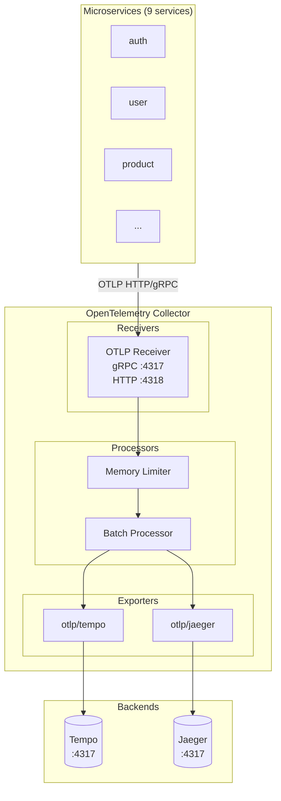

# OpenTelemetry Collector

The OpenTelemetry Collector is a vendor-agnostic proxy that receives, processes, and exports telemetry data. In this setup, it acts as a trace fan-out layer, distributing traces to multiple backends (Tempo and Jaeger).

## Architecture



## Benefits of Using OTel Collector

1. **Fan-out**: Send traces to multiple backends without modifying application code
2. **Decoupling**: Applications don't need to know about backend endpoints
3. **Processing**: Batch, filter, and transform traces before export
4. **Flexibility**: Easy to add/remove backends
5. **Reliability**: Built-in retry, queuing, and backpressure handling

## How Applications Send Traces

This project uses **OpenTelemetry SDK approach** (not sidecar):

### SDK Approach (Current)

Applications use OpenTelemetry SDK libraries to instrument code and send traces directly to OTel Collector:

```go
// Go example (from services/pkg/middleware/tracing.go)
exporter, _ := otlptracehttp.New(ctx,
    otlptracehttp.WithEndpoint("otel-collector:4318"),
)
tracerProvider := sdktrace.NewTracerProvider(
    sdktrace.WithBatcher(exporter),
)
```

**Configuration:**
- Environment variable: `OTEL_COLLECTOR_ENDPOINT=otel-collector-opentelemetry-collector.monitoring.svc.cluster.local:4318`
- Protocol: OTLP HTTP
- Libraries: `go.opentelemetry.io/otel` SDK

**Advantages:**
- Full control over instrumentation
- Custom sampling, attributes, and context propagation
- No additional containers needed
- Language-specific optimizations

**Disadvantages:**
- Requires code changes
- Language-specific implementation needed

### Sidecar Approach (Alternative)

OTel Collector runs as a sidecar container in the same pod:

```yaml
containers:
  - name: app
    image: myapp:latest
  - name: otel-collector
    image: otel/opentelemetry-collector
```

**Advantages:**
- No code changes required
- Works with any language
- Auto-instrumentation via OpenTelemetry Operator

**Disadvantages:**
- Higher resource usage (extra container per pod)
- More complex deployment
- Less control over instrumentation

### Why We Chose SDK Approach

This project uses SDK because:
1. **Go microservices**: Easy to integrate OpenTelemetry SDK
2. **Custom instrumentation**: Need fine-grained control over spans and attributes
3. **Resource efficiency**: No sidecar overhead
4. **Learning/POC**: Better understanding of OpenTelemetry internals

## OpenTelemetry Helm Charts Comparison

The OpenTelemetry project provides several Helm charts. Here's when to use each:

### Charts Overview

| Feature | opentelemetry-collector | opentelemetry-operator | opentelemetry-kube-stack |
|---------|------------------------|------------------------|--------------------------|
| **Purpose** | Deploy Collector directly | Operator manages Collectors via CRD | Full observability stack |
| **Auto-instrumentation** | No | Yes (Java, Python, Node.js, .NET, Go) | Yes |
| **CRD Management** | No | Yes (OpenTelemetryCollector, Instrumentation) | Yes |
| **Deployment Modes** | Deployment, DaemonSet, StatefulSet | Managed by Operator | Pre-configured |
| **Configuration** | values.yaml | CRD YAML | Minimal config |
| **Complexity** | Low | Medium | Low |
| **Flexibility** | High | Very High | Medium |
| **Best For** | Simple deployments, POC | Dynamic environments, GitOps | Quick start, K8s monitoring |

### When to Use Each Chart

**opentelemetry-collector** (this project uses this):
- POC/Development environments
- Full control over configuration needed
- Simple deployment with single collector
- No auto-instrumentation needed (already instrumented in code)
- Custom fan-out scenarios (e.g., Tempo + Jaeger)

**opentelemetry-operator**:
- Production with multiple collectors across namespaces
- Need auto-instrumentation without code changes
- GitOps workflow with CRD-based configuration
- Dynamic scaling and lifecycle management
- Managing collectors declaratively

**opentelemetry-kube-stack**:
- Quick deployment of full observability stack
- Monitor Kubernetes infrastructure (nodes, pods, containers)
- Minimal configuration required
- Out-of-the-box dashboards and collectors

### Why This Project Uses opentelemetry-collector

We chose `opentelemetry-collector` chart because:

1. **Learning/POC Project**: Simple and easy to understand
2. **Manual Instrumentation**: Our Go services already have OpenTelemetry middleware
3. **Explicit Configuration**: values.yaml is transparent and debuggable
4. **Fan-out Use Case**: Easy to configure multiple exporters (Tempo + Jaeger)
5. **Minimal Dependencies**: No need for cert-manager or additional CRDs

For production environments with many services, consider migrating to `opentelemetry-operator` for auto-instrumentation and CRD-based management.

## Prerequisites

- Kubernetes cluster
- Helm 3.x
- `monitoring` namespace exists
- Tempo and Jaeger deployed

## Installation

### Via Script (Recommended)

```bash
./scripts/03d-deploy-jaeger.sh
```

This script deploys both OpenTelemetry Collector and Jaeger.

### Manual Installation

1. **Add Helm repository:**
   ```bash
   helm repo add open-telemetry https://open-telemetry.github.io/opentelemetry-helm-charts
   helm repo update
   ```

2. **Install OTel Collector:**
   ```bash
   helm upgrade --install otel-collector open-telemetry/opentelemetry-collector \
       -n monitoring \
       -f k8s/otel-collector/values.yaml \
       --wait
   ```

## Configuration

### values.yaml Structure

```yaml
config:
  receivers:
    otlp:           # Receive traces from applications
      protocols:
        grpc: {}
        http: {}
  
  processors:
    batch: {}       # Batch traces for efficiency
    memory_limiter: {} # Prevent OOM
  
  exporters:
    otlp/tempo:     # Export to Tempo
      endpoint: tempo.monitoring.svc.cluster.local:4317
    otlp/jaeger:    # Export to Jaeger
      endpoint: jaeger-all-in-one.monitoring.svc.cluster.local:4317
  
  service:
    pipelines:
      traces:
        receivers: [otlp]
        processors: [memory_limiter, batch]
        exporters: [otlp/tempo, otlp/jaeger]
```

### Key Parameters

| Parameter | Description | Default |
|-----------|-------------|---------|
| `mode` | Deployment mode | `deployment` |
| `replicaCount` | Number of replicas | `1` |
| `config.receivers.otlp` | OTLP receiver config | gRPC + HTTP |
| `config.processors.batch.timeout` | Batch timeout | `5s` |
| `config.exporters.otlp/*` | Backend endpoints | Tempo + Jaeger |

## Service Endpoints

After deployment, the collector exposes:

| Port | Protocol | Purpose |
|------|----------|---------|
| 4317 | gRPC | OTLP gRPC receiver |
| 4318 | HTTP | OTLP HTTP receiver |
| 8888 | HTTP | Prometheus metrics |
| 13133 | HTTP | Health check |

**Application endpoint:**
```
otel-collector-opentelemetry-collector.monitoring.svc.cluster.local:4318
```

## Application Configuration

Update your microservices to send traces to OTel Collector instead of Tempo directly:

```yaml
# In charts/values/{service}.yaml
env:
  - name: OTEL_COLLECTOR_ENDPOINT
    value: "otel-collector-opentelemetry-collector.monitoring.svc.cluster.local:4318"
```

## Adding/Removing Backends

### Add a new backend

1. Add exporter in `values.yaml`:
   ```yaml
   exporters:
     otlp/newbackend:
       endpoint: newbackend.monitoring.svc.cluster.local:4317
       tls:
         insecure: true
   ```

2. Add to pipeline:
   ```yaml
   service:
     pipelines:
       traces:
         exporters: [otlp/tempo, otlp/jaeger, otlp/newbackend]
   ```

3. Upgrade:
   ```bash
   helm upgrade otel-collector open-telemetry/opentelemetry-collector \
       -n monitoring -f k8s/otel-collector/values.yaml
   ```

### Remove a backend

1. Remove exporter from `exporters` section
2. Remove from `pipelines.traces.exporters` list
3. Upgrade helm release

## Monitoring the Collector

### Check Status

```bash
kubectl get pods -n monitoring -l app.kubernetes.io/name=opentelemetry-collector
```

### View Logs

```bash
kubectl logs -n monitoring -l app.kubernetes.io/name=opentelemetry-collector
```

### Metrics

The collector exposes metrics at `:8888/metrics`:
```bash
kubectl port-forward -n monitoring svc/otel-collector-opentelemetry-collector 8888:8888
curl http://localhost:8888/metrics
```

Key metrics:
- `otelcol_receiver_accepted_spans` - Spans received
- `otelcol_exporter_sent_spans` - Spans exported
- `otelcol_processor_batch_batch_send_size` - Batch sizes

## Troubleshooting

### No traces in backends

1. Check collector is receiving traces:
   ```bash
   kubectl logs -n monitoring -l app.kubernetes.io/name=opentelemetry-collector | grep "Traces"
   ```

2. Verify application endpoint:
   ```bash
   kubectl exec -n auth deployment/auth -- env | grep OTEL_COLLECTOR_ENDPOINT
   ```

3. Test connectivity:
   ```bash
   kubectl exec -n monitoring deployment/otel-collector-opentelemetry-collector -- \
       wget -q -O- http://tempo:3200/ready
   ```

### High memory usage

Adjust memory limiter:
```yaml
processors:
  memory_limiter:
    limit_mib: 200
    spike_limit_mib: 50
    check_interval: 1s
```

### Slow exports

Increase batch size:
```yaml
processors:
  batch:
    send_batch_size: 1024
    timeout: 10s
```

## Debug Mode

Enable debug exporter to see traces in logs:

```yaml
exporters:
  debug:
    verbosity: detailed

service:
  pipelines:
    traces:
      exporters: [otlp/tempo, otlp/jaeger, debug]
```

## Related Documentation

- [Jaeger Configuration](../jaeger/README.md)
- [Tempo Configuration](../tempo/)
- [APM Overview](../../docs/apm/README.md)
- [OTel Collector Official Docs](https://opentelemetry.io/docs/collector/)
