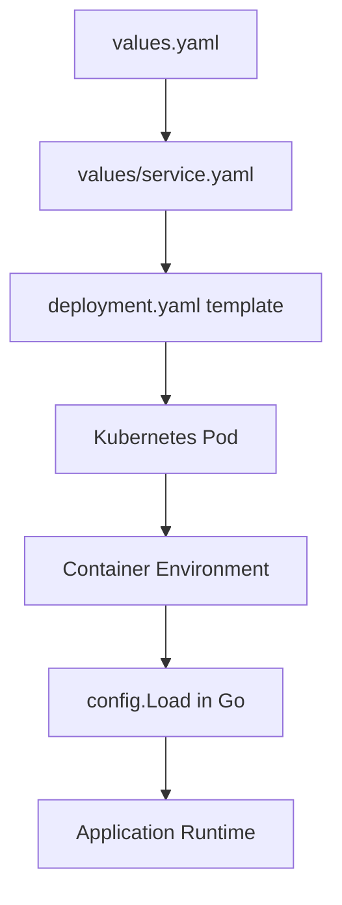

# Microservices Helm Chart

Generic Helm chart for deploying all 9 microservices in the monitoring project.

## Table of Contents
- [Quick Start](#quick-start)
- [Chart Structure](#chart-structure)
- [Configuration Management](#configuration-management)
- [Environment Variables: `env` vs `extraEnv`](#environment-variables-env-vs-extraenv)
- [Per-Service Values](#per-service-values)
- [Common Patterns](#common-patterns)
- [Examples](#examples)

---

## Quick Start

```bash
# Local deployment (all services)
./scripts/05-deploy-microservices.sh --local

# From OCI registry
./scripts/05-deploy-microservices.sh --registry

# Manual single service deployment
helm upgrade --install auth charts/ -f charts/values/auth.yaml -n auth --create-namespace
```

**OCI Registry**: `oci://ghcr.io/duynhne/charts/microservice`

---

## Chart Structure

```
charts/
├── Chart.yaml             # Chart metadata (name: microservice, version: 0.2.0)
├── values.yaml            # Default values template
├── values/                # Per-service value overrides
│   ├── auth.yaml          # Auth service configuration
│   ├── user.yaml          # User service configuration
│   ├── product.yaml
│   ├── cart.yaml
│   ├── order.yaml
│   ├── review.yaml
│   ├── notification.yaml
│   ├── shipping.yaml
│   └── shipping-v2.yaml
└── templates/
    ├── _helpers.tpl       # Template helpers
    ├── deployment.yaml    # Deployment template
    └── service.yaml       # Service template
```

---

## Configuration Management

### Configuration Sources (Priority Order)

1. **Default values** (hardcoded in `pkg/config/config.go`)
2. **`.env` file** (local development only, via `godotenv`)
3. **Environment variables** (Kubernetes runtime)
4. **Helm values** → `deployment.yaml` → `env`/`extraEnv` → container environment

### How Configuration Flows



**Key Point**: Helm values override **all** previous configuration layers.

---

## Environment Variables: `env` vs `extraEnv`

### Decision Matrix

| Use Case | Use `env` | Use `extraEnv` | Reason |
|----------|-----------|----------------|---------|
| **Core service config** (SERVICE_NAME, PORT, ENV) | ✅ Yes | ❌ No | Always required, common across services |
| **Tracing config** (OTEL_COLLECTOR_ENDPOINT, OTEL_SAMPLE_RATE) | ✅ Yes | ❌ No | Managed by chart, needs Helm templating |
| **Profiling config** (PYROSCOPE_ENDPOINT) | ✅ Yes | ❌ No | Managed by chart, needs Helm templating |
| **Quick testing** (ADD_DEBUG_VAR=true) | ❌ No | ✅ Yes | Temporary, ad-hoc variables |
| **Secrets** (API_KEY, DB_PASSWORD) | ❌ No | ✅ Yes | Injected via Secrets, not hardcoded |
| **Feature flags** (ENABLE_BETA_FEATURE) | ❌ No | ✅ Yes | Service-specific, not in common template |
| **External service URLs** (REDIS_HOST, KAFKA_BROKER) | ❌ No | ✅ Yes | Service-specific dependencies |

### `env` - Chart-Managed Core Configuration

**Purpose**: Core configuration that is **common across all services** and managed by the Helm chart.

**Characteristics**:
- ✅ Defined in `values.yaml` (default) and `values/service.yaml` (overrides)
- ✅ Helm templating supported (e.g., `{{ .Values.tracing.endpoint }}`)
- ✅ Versioned with chart
- ✅ Validated at chart level
- ❌ **Not for service-specific variables**

**Example** (`charts/values/auth.yaml`):

```yaml
env:
  - name: SERVICE_NAME
    value: "auth"
  - name: PORT
    value: "8080"
  - name: ENV
    value: "production"
  - name: OTEL_COLLECTOR_ENDPOINT
    value: "otel-collector-opentelemetry-collector.monitoring.svc.cluster.local:4318"
  - name: OTEL_SAMPLE_RATE
    value: "0.1"
  - name: PYROSCOPE_ENDPOINT
    value: "http://pyroscope.monitoring.svc.cluster.local:4040"
  - name: LOG_LEVEL
    value: "info"
```

**When to use `env`**:
- Core service configuration (SERVICE_NAME, PORT, ENV)
- APM configuration (OTEL_COLLECTOR_ENDPOINT, PYROSCOPE_ENDPOINT)
- Logging configuration (LOG_LEVEL, LOG_FORMAT)
- Variables that need Helm templating
- Configuration that should be versioned with the chart

### `extraEnv` - Service-Specific & Ad-hoc Variables

**Purpose**: Service-specific configuration and ad-hoc variables that are **not part of the common template**.

**Characteristics**:
- ✅ Service-specific dependencies (REDIS_HOST, KAFKA_BROKER)
- ✅ Feature flags (ENABLE_BETA_FEATURE)
- ✅ Secrets injection (API_KEY, DB_PASSWORD via `valueFrom`)
- ✅ Quick testing variables (ADD_DEBUG_VAR)
- ❌ **No Helm templating** (just YAML passthrough)

**Example** (`charts/values/auth.yaml`):

```yaml
extraEnv:
  # Service-specific dependency
  - name: REDIS_HOST
    value: "redis.auth.svc.cluster.local:6379"
  
  # Feature flag
  - name: ENABLE_2FA
    value: "true"
  
  # Secret injection (from Kubernetes Secret)
  - name: JWT_SECRET
    valueFrom:
      secretKeyRef:
        name: auth-secrets
        key: jwt-secret
  
  # Quick testing (temporary)
  - name: DEBUG_AUTH_FLOW
    value: "true"
```

**When to use `extraEnv`**:
- Service-specific dependencies (databases, message queues, caches)
- Feature flags and experimental features
- Secrets (via `valueFrom.secretKeyRef`)
- Quick testing and debugging variables
- Configuration that changes per environment (dev/staging/prod)

---

## Per-Service Values

### Minimal Service Configuration

Each service requires at minimum:

```yaml
# charts/values/myservice.yaml
fullnameOverride: "myservice"

env:
  - name: SERVICE_NAME
    value: "myservice"
  - name: PORT
    value: "8080"
  - name: ENV
    value: "production"
  - name: OTEL_COLLECTOR_ENDPOINT
    value: "otel-collector-opentelemetry-collector.monitoring.svc.cluster.local:4318"
  - name: OTEL_SAMPLE_RATE
    value: "0.1"
  - name: PYROSCOPE_ENDPOINT
    value: "http://pyroscope.monitoring.svc.cluster.local:4040"

image:
  repository: ghcr.io/duynhne/myservice  # Full image path
  tag: "latest"
  pullPolicy: IfNotPresent
```

### Advanced Service Configuration

With service-specific dependencies:

```yaml
# charts/values/order.yaml
fullnameOverride: "order"

env:
  - name: SERVICE_NAME
    value: "order"
  - name: PORT
    value: "8080"
  - name: ENV
    value: "production"
  # ... core config ...

extraEnv:
  # Database connection
  - name: DATABASE_HOST
    value: "postgres.order.svc.cluster.local:5432"
  - name: DATABASE_NAME
    value: "orders"
  - name: DATABASE_USER
    valueFrom:
      secretKeyRef:
        name: order-db-secrets
        key: username
  - name: DATABASE_PASSWORD
    valueFrom:
      secretKeyRef:
        name: order-db-secrets
        key: password
  
  # Message queue
  - name: KAFKA_BROKER
    value: "kafka.infra.svc.cluster.local:9092"
  - name: KAFKA_TOPIC
    value: "order-events"
  
  # Feature flags
  - name: ENABLE_ORDER_CANCELLATION
    value: "true"
  - name: ENABLE_PARTIAL_REFUNDS
    value: "false"

image:
  repository: ghcr.io/duynhne/order  # Full image path
  tag: "v1.2.3"
  pullPolicy: IfNotPresent
```

---

## Common Patterns

### Pattern 1: Development vs Production

```yaml
# Development (values/auth-dev.yaml)
env:
  - name: ENV
    value: "development"
  - name: OTEL_SAMPLE_RATE
    value: "1.0"  # 100% sampling for dev
  - name: LOG_LEVEL
    value: "debug"

# Production (values/auth-prod.yaml)
env:
  - name: ENV
    value: "production"
  - name: OTEL_SAMPLE_RATE
    value: "0.1"  # 10% sampling for prod
  - name: LOG_LEVEL
    value: "info"
```

### Pattern 2: Secret Injection

```yaml
extraEnv:
  # From Kubernetes Secret
  - name: API_KEY
    valueFrom:
      secretKeyRef:
        name: myservice-secrets
        key: api-key
  
  # From ConfigMap
  - name: FEATURE_FLAGS
    valueFrom:
      configMapKeyRef:
        name: myservice-config
        key: features
```

### Pattern 3: Multi-Region Deployment

```yaml
# us-east-1 region
extraEnv:
  - name: REGION
    value: "us-east-1"
  - name: S3_BUCKET
    value: "myapp-us-east-1"

# eu-west-1 region
extraEnv:
  - name: REGION
    value: "eu-west-1"
  - name: S3_BUCKET
    value: "myapp-eu-west-1"
```

---

## Examples

### Example 1: Basic Service Deployment

```bash
# Deploy auth service with default values
helm upgrade --install auth charts/ \
  -f charts/values/auth.yaml \
  -n auth \
  --create-namespace
```

### Example 2: Override Values at Install Time

```bash
# Override OTEL_SAMPLE_RATE for development
helm upgrade --install auth charts/ \
  -f charts/values/auth.yaml \
  --set env[3].value="1.0" \
  -n auth \
  --create-namespace
```

### Example 3: Add Extra Environment Variable

```bash
# Add DEBUG_MODE=true via command line
helm upgrade --install auth charts/ \
  -f charts/values/auth.yaml \
  --set extraEnv[0].name="DEBUG_MODE" \
  --set extraEnv[0].value="true" \
  -n auth \
  --create-namespace
```

### Example 4: Multi-Environment Deployment

```bash
# Development environment
helm upgrade --install auth charts/ \
  -f charts/values/auth.yaml \
  -f charts/values/auth-dev.yaml \
  -n auth-dev \
  --create-namespace

# Production environment
helm upgrade --install auth charts/ \
  -f charts/values/auth.yaml \
  -f charts/values/auth-prod.yaml \
  -n auth-prod \
  --create-namespace
```

---

## Best Practices

### ✅ DO

1. **Use `env` for core configuration** that is common across services
2. **Use `extraEnv` for service-specific dependencies** (databases, queues, caches)
3. **Use Secrets for sensitive data** (passwords, API keys, tokens)
4. **Document all custom `extraEnv` variables** in service-specific values files
5. **Use Helm templating in `env`** for dynamic values (e.g., `{{ .Values.tracing.endpoint }}`)
6. **Version your values files** alongside code changes
7. **Validate configuration in Go code** (via `pkg/config/config.go`)

### ❌ DON'T

1. **Don't hardcode secrets in values files** - use `valueFrom.secretKeyRef`
2. **Don't duplicate `env` configuration in `extraEnv`** - keep it DRY
3. **Don't use Helm templating in `extraEnv`** - it's not supported
4. **Don't mix concerns** - keep core config in `env`, service-specific in `extraEnv`
5. **Don't skip validation** - always validate configuration in Go code
6. **Don't commit sensitive data** - use Kubernetes Secrets or external secret managers

---

## Troubleshooting

### Configuration Not Taking Effect

1. **Check environment variable precedence**:
   ```bash
   kubectl exec -n auth deployment/auth -- env | grep SERVICE_NAME
   ```

2. **Verify Helm values are applied**:
   ```bash
   helm get values auth -n auth
   ```

3. **Check application configuration loading**:
   ```bash
   kubectl logs -n auth deployment/auth | grep "Service starting"
   ```

### Secret Not Found

1. **Verify secret exists**:
   ```bash
   kubectl get secrets -n auth
   ```

2. **Check secret key name**:
   ```bash
   kubectl describe secret auth-secrets -n auth
   ```

3. **Verify `valueFrom` syntax**:
   ```yaml
   - name: JWT_SECRET
     valueFrom:
       secretKeyRef:
         name: auth-secrets  # Secret name
         key: jwt-secret     # Key inside secret
   ```

### Configuration Validation Failure

If you see `Configuration validation failed` in logs:

1. **Check required variables**:
   - SERVICE_NAME
   - PORT
   - ENV
   - OTEL_COLLECTOR_ENDPOINT (if tracing enabled)
   - PYROSCOPE_ENDPOINT (if profiling enabled)

2. **Verify value formats**:
   - PORT: must be a valid number
   - ENV: must be one of (development, dev, staging, stage, production, prod)
   - OTEL_SAMPLE_RATE: must be between 0.0 and 1.0
   - LOG_LEVEL: must be one of (debug, info, warn, error)

---

## Related Documentation

- **Configuration Package**: `services/pkg/config/config.go` - Centralized config loading and validation
- **Deployment Template**: `charts/templates/deployment.yaml` - How `env` and `extraEnv` are rendered
- **Service Values**: `charts/values/*.yaml` - Per-service configuration examples
- **Deployment Script**: `scripts/05-deploy-microservices.sh` - Automated deployment
- **AGENTS.md**: Project structure and conventions

---

**Last Updated**: December 12, 2025 - Go 1.25 + Config Modernization

