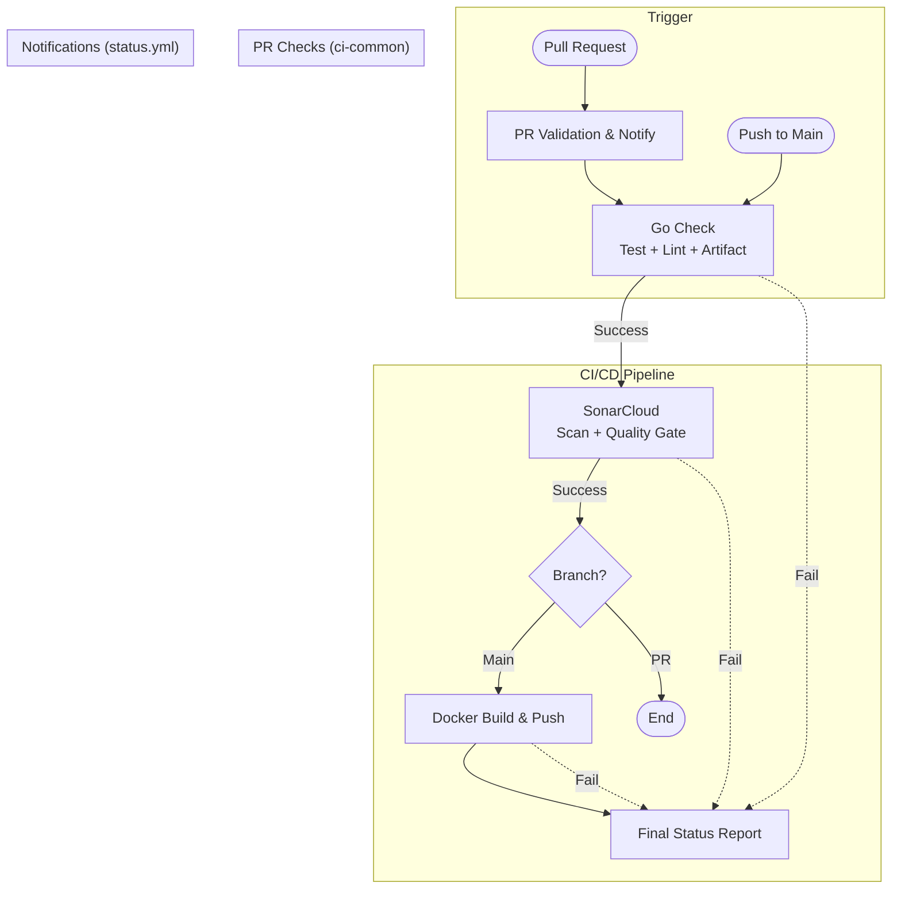
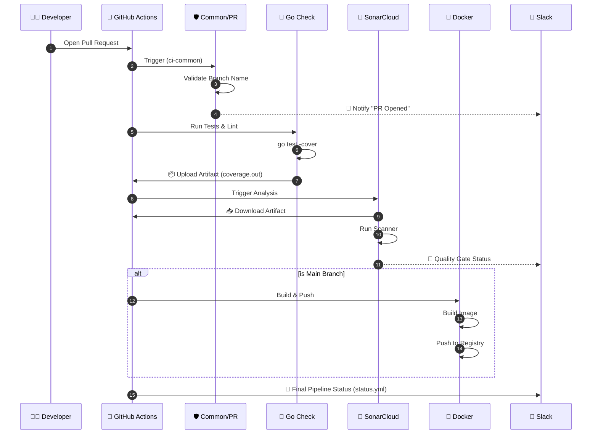

# 🚀 CI/CD Pipeline Documentation

This document outlines the **Trunk-Based Development** CI/CD pipeline implemented for all microservices (`auth`, `user`, `product`, `cart`, `order`, `review`, `notification`, `shipping`). The pipeline employs a **"Build Once, Analyze Everywhere"** strategy to optimize performance and eliminate redundant execution.

## 📊 Workflow Visualization

### 1. Orchestration Logic
This flowchart illustrates how jobs are connected and triggered based on events.

### 2. Execution Sequence
This diagram details the interaction between GitHub Actions, SonarCloud, and Slack.

---

## 🔄 Detailed Process Flows

### 1️⃣ Flow: Pull Request (Validation)
**Trigger:** Developer opens or updates a Pull Request targeting `main`.
**Goal:** Verify code quality, security, and functionality **before** merging.

| Step | Job Name | Trigger Condition | Action & Responsibility |
|------|----------|-------------------|-------------------------|
| **1** | `common` | **PR Only** | **Gateway Check**:  • Validates branch naming (must match `feat/*`, `fix/*`, etc.). • Notifies Slack that a PR has been opened/updated. |
| **2** | `go-check` | **Always** | **Build & Test**:  • Runs `go test -race -cover`. • Runs `golangci-lint`. • **Uploads** the `coverage.out` file as an artifact for the next step. |
| **3** | `sonar` | **Always** | **Quality Gate**:  • **Downloads** the `coverage.out` artifact. • Runs SonarScanner to analyze code & coverage. • Checks Quality Gate (Bugs, Vulnerabilities, Coverage %). • **Blocks** the PR if Quality Gate fails. |
| **4** | `notify` | **Always** | **Reporting**:  • Sends the final status (Success/Failure) to Slack. • Runs even if previous steps failed (`if: always()`). |

> 🚫 **Skipped:** `docker` job is NOT run on PRs to save resources and avoid polluting the registry with untagged images.

---

### 2️⃣ Flow: Push to Main (Delivery)
**Trigger:** PR is merged into `main` (or direct push).
**Goal:** Create a release candidate and publish the artifact.

| Step | Job Name | Trigger Condition | Action & Responsibility |
|------|----------|-------------------|-------------------------|
| **1** | `go-check` | **Always** | **Regression Check**:  • Re-runs tests and linting on the merged code to ensure stability. • Uploads fresh coverage artifact. |
| **2** | `sonar` | **Always** | **Analysis Update**:  • Updates the "Main Branch" dashboard on SonarCloud. • Ensures the `main` branch stays "Green". |
| **3** | `docker` | **Main Only** | **Deployment Artifact**:  • Builds the Docker image. • Tags it (e.g., `latest` or sha). • **Pushes** the image to GHCR (GitHub Container Registry). |
| **4** | `notify` | **Always** | **Reporting**:  • Sends a deployment/build success notification to Slack. • Runs even if previous steps failed (`if: always()`). |

> 🚫 **Skipped:** `common` job is NOT run on Push to Main (Branch validation is irrelevant after merge).