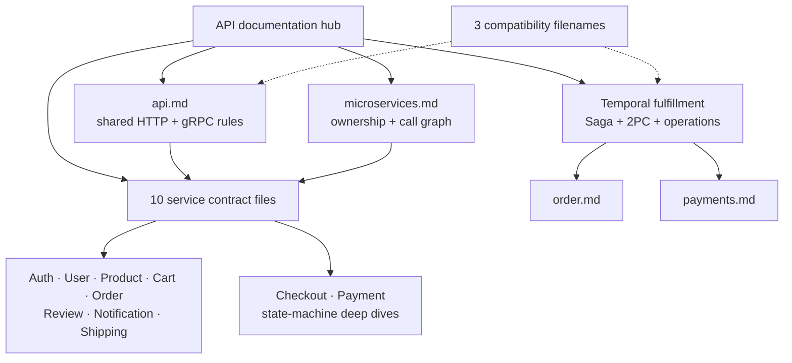

# API Documentation

Start here to learn the platform's shared API rules and then drill into one service at a time.

| Attribute | Value |
|-----------|-------|
| **Status** | Living documentation checked against all ten service repositories |
| **Canonical shared guide** | [api.md](./api.md) |
| **Service map** | [microservices.md](./microservices.md) |
| **Workflow guide** | [temporal-order-fulfillment.md](./temporal-order-fulfillment.md) |
| **Compatibility policy** | Old filenames remain as forwarding pages so external links keep working |

## Documentation Map

The arrows show documentation ownership, not runtime traffic. Runtime traffic is
shown in [api.md](./api.md#current-east-west-call-graph).

## Recommended Learning Path

| Step | Read | What it answers |
|------|------|-----------------|
| 1 | [api.md](./api.md) | How URLs, audiences, auth, errors, pagination, HTTP, and gRPC work |
| 2 | [microservices.md](./microservices.md) | Which service owns each feature and how services call one another |
| 3 | One service file below | Exact HTTP routes, gRPC methods, payload examples, and service rules |
| 4 | [temporal-order-fulfillment.md](./temporal-order-fulfillment.md) | Why Saga is used instead of 2PC and how the live workflow compensates |
| 5 | [payments.md](./payments.md) or [checkout.md](./checkout.md) | Deeper state-machine, idempotency, and operational examples |

## Document Ownership

Keeping each fact in one place prevents three copies from drifting.

| Information | Canonical owner |
|-------------|-----------------|
| Shared URL, auth, error, pagination, idempotency, and gRPC rules | [api.md](./api.md) |
| One service's routes, RPCs, payloads, and business constraints | That service's file |
| Cross-service feature ownership and call graph | [microservices.md](./microservices.md) |
| Saga, 2PC theory, Temporal workflow, compensation, and operations | [temporal-order-fulfillment.md](./temporal-order-fulfillment.md) |
| Design rationale and alternatives | RFC or ADR |
| Deployed gateway, network, database, or observability operation | The matching platform area |

## Service Contracts

| Service | Main responsibility | Contract |
|---------|---------------------|----------|
| Auth | Credentials, JWTs, refresh rotation, and JWKS | [auth.md](./auth.md) |
| User | Public and owner-scoped profiles | [user.md](./user.md) |
| Product | Catalog, price, stock, and review aggregation | [product.md](./product.md) |
| Cart | Active cart and checkout snapshot | [cart.md](./cart.md) |
| Order | Orders and fulfillment workflow handoff | [order.md](./order.md) |
| Review | Product ratings and comments | [review.md](./review.md) |
| Notification | Inbox records and delivery requests | [notification.md](./notification.md) |
| Shipping | Quotes, tracking, and shipment lifecycle | [shipping.md](./shipping.md) |
| Checkout | Purchase sessions, totals, promo, and confirm | [checkout.md](./checkout.md) |
| Payment | Payment state, ledger, refunds, and reconciliation | [payments.md](./payments.md) |

## Architecture and Workflow Guides

| Document | Covers | Current status |
|----------|--------|----------------|
| [api.md](./api.md) | HTTP and gRPC architecture, current call graph, HTTP/2 load balancing, security, observability | Implemented |
| [microservices.md](./microservices.md) | Service feature matrix, ownership, dependencies, and known gaps | Living reference |
| [temporal-order-fulfillment.md](./temporal-order-fulfillment.md) | Saga vs 2PC learning plus the live order workflow and Temporal operations | Implemented |
| [checkout.md](./checkout.md) | Checkout FSM, price re-validation, totals, promo, confirm, and abandonment | P1-P4 local-stack; P5 cluster planned |
| [payments.md](./payments.md) | Money state machine, idempotency, ledger, provider, and reconciliation | Implemented |

## Compatibility Pages

These files are intentionally retained for inbound links. New documents should
link to the canonical guide or exact section instead.

| Old filename | Canonical destination |
|--------------|-----------------------|
| [api-naming-convention.md](./api-naming-convention.md) | [api.md](./api.md), especially HTTP URL Model |
| [grpc-internal-comms.md](./grpc-internal-comms.md) | [api.md](./api.md), especially Current East-West Call Graph and gRPC Runtime Model |
| [saga-vs-2pc.md](./saga-vs-2pc.md) | [temporal-order-fulfillment.md](./temporal-order-fulfillment.md) |

## Related Areas

| Topic | Document |
|-------|----------|
| Kong routing and plugins | [Kong gateway](../platform/kong-gateway.md) |
| NetworkPolicy caller matrix | [Network policies](../security/network-policies.md) |
| Application and gRPC metrics | [Application metrics](../observability/metrics/metrics-apps.md) |
| Valkey cache-aside behavior | [Caching](../caching/caching.md) |
| Local environment | [local-stack README](../../local-stack/README.md) |
| Service repository index | [SERVICES.md](../../SERVICES.md) |

## Updating This Area

| Change | Required documentation |
|--------|------------------------|
| Shared convention changes | Update [api.md](./api.md) |
| Service route, RPC, payload, or state changes | Update only the owning service file |
| Call graph or feature ownership changes | Update [microservices.md](./microservices.md) and the relevant service files |
| Saga step or compensation changes | Update [temporal-order-fulfillment.md](./temporal-order-fulfillment.md) |
| New file | Link it here and from [docs/README.md](../README.md) |

Every substantive claim must match the service code, local-stack wiring, and
GitOps manifests. Mark designed but undeployed behavior as **planned**.

_Last updated: 2026-07-13_
