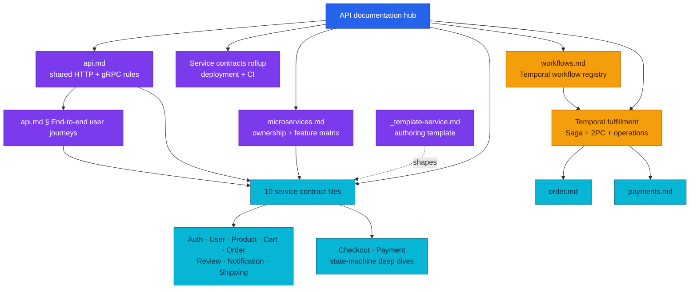

# API Documentation

Start here to learn the platform's shared API rules and then drill into one service at a time.

| Attribute | Value |
|-----------|-------|
| **Status** | Living documentation checked against all ten service repositories |
| **Canonical shared guide** | [api.md](./api.md) |
| **Service map** | [microservices.md](./microservices.md) |
| **Workflow guide** | [temporal-order-fulfillment.md](./temporal-order-fulfillment.md) |

## Documentation Map

The arrows show documentation ownership, not runtime traffic. Runtime traffic is
shown in [api.md](./api.md#current-east-west-call-graph).

## Recommended Learning Path

| Step | Read | What it answers |
|------|------|-----------------|
| 1 | [api.md](./api.md) | How URLs, audiences, auth, errors, pagination, HTTP, and gRPC work |
| 2 | [api.md § End-to-end user journeys](./api.md#end-to-end-user-journeys) | How one user journey (login, browse, checkout, fulfillment) travels through the services |
| 3 | [microservices.md](./microservices.md) | Which service owns each feature and how services call one another |
| 4 | One service file below | Exact HTTP routes, gRPC methods, payload examples, and service rules |
| 5 | [workflows.md](./workflows.md) | Which Temporal workflows exist, who orchestrates them, and who participates |
| 6 | [temporal-order-fulfillment.md](./temporal-order-fulfillment.md) | Why Saga is used instead of 2PC and how the live workflow compensates |
| 7 | [payments.md](./payments.md) or [checkout.md](./checkout.md) | Deeper state-machine, idempotency, and operational examples |

## Document Ownership

Keeping each fact in one place prevents three copies from drifting.

| Information | Canonical owner |
|-------------|-----------------|
| Shared URL, auth, error, pagination, idempotency, and gRPC rules | [api.md](./api.md) |
| East-west call graph and edge exposure rules | [api.md](./api.md) |
| One service's routes, RPCs, payloads, and business constraints | That service's file (At a glance **Deployment** row for local/cluster) |
| Platform deployment rollup and status vocabulary | This page § [Service contracts](#service-contracts) |
| Cross-service feature ownership | [microservices.md](./microservices.md) |
| Saga, 2PC theory, Temporal workflow, compensation, and operations | [temporal-order-fulfillment.md](./temporal-order-fulfillment.md) |
| Design rationale and alternatives | RFC or ADR |
| Deployed gateway, network, database, or observability operation | The matching platform area |
| Repository URLs, images, and CI badges | [docs/README.md § Repositories](../README.md#repositories) |

## Service Contracts {#service-contracts}

Per-service **At a glance** tables hold deployment detail; this rollup is the platform-wide view.

### Status vocabulary

| Badge | Meaning |
|-------|---------|
| **Implemented** | Runs in local-stack + cluster; e2e or manifest evidence |
| **Partial** | Partly shipped (e.g. HTTP live, edge prefix divergence) |
| **Technical debt** | Shipped but planned removal |
| **No caller** | Route/RPC wired, no live consumer — keep documented |
| **Planned** | Designed, not deployed |

### Platform rollup

| Component | Local | Cluster | Status | CI |
|-----------|:-----:|:-------:|--------|-----|
| [auth API](./auth.md) | ✓ | ✓ | Implemented |  |
| [user API](./user.md) | ✓ | ✓ | Implemented |  |
| [product API + gRPC](./product.md) | ✓ | ✓ | Implemented |  |
| [cart API + gRPC](./cart.md) | ✓ | ✓ | Implemented |  |
| [order API + gRPC](./order.md) | ✓ | ✓ | Implemented |  |
| [review API + gRPC](./review.md) | ✓ | ✓ | Implemented |  |
| [shipping API + gRPC](./shipping.md) | ✓ | ✓ | Implemented |  |
| [notification API + gRPC](./notification.md) | ✓ | ✓ | Implemented |  |
| [payment API + gRPC](./payments.md) | ✓ | ✓ | Implemented |  |
| [checkout API](./checkout.md) | ✓ | ✓ | Implemented |  |
| order-worker | ✓ | ✓ | Implemented | — |
| checkout-worker | ✓ | ✓ | Implemented | — |
| mockpay provider | ✓ | ✓ | Implemented | — |
| frontend SPA | ✓ | ✓ | Implemented |  |
| Legacy `POST /order/v1/private/orders` | ✓ | ✓ | Technical debt | — |
| Legacy order→cart REST pricing | ✓ | ✓ | Technical debt | — |
| gRPC mTLS east-west | — | — | Planned | — |

| Service | One-line responsibility | Contract |
|---------|-------------------------|----------|
| Auth | Credentials, JWTs, refresh rotation, and JWKS | [auth.md](./auth.md) |
| User | Public and owner-scoped profiles | [user.md](./user.md) |
| Product | Catalog, price, stock, and review aggregation | [product.md](./product.md) |
| Cart | Active cart and checkout snapshot | [cart.md](./cart.md) |
| Order | Orders and fulfillment workflow handoff | [order.md](./order.md) |
| Review | Product ratings and comments | [review.md](./review.md) |
| Notification | Inbox records and delivery requests | [notification.md](./notification.md) |
| Shipping | Quotes, tracking, and shipment lifecycle | [shipping.md](./shipping.md) |
| Checkout | Purchase sessions, totals, promo, and confirm | [checkout.md](./checkout.md) |
| Payment | Payment state, ledger, refunds, and reconciliation | [payments.md](./payments.md) |

## Architecture and Workflow Guides

| Document | Covers | Current status |
|----------|--------|----------------|
| [api.md](./api.md) | HTTP and gRPC architecture, call graph, user journeys, HTTP/2 load balancing, security, observability | Implemented |
| [microservices.md](./microservices.md) | Service feature matrix, ownership, dependencies, and known gaps | Living reference |
| [temporal-order-fulfillment.md](./temporal-order-fulfillment.md) | Saga vs 2PC learning plus the live order workflow and Temporal operations | Implemented |
| [checkout.md](./checkout.md) | Checkout FSM, price re-validation, totals, promo, confirm, and abandonment | P1-P5 shipped (local-stack + cluster); P6 legacy removal planned |
| [payments.md](./payments.md) | Money state machine, idempotency, ledger, provider, and reconciliation | Implemented |

## Related Areas

| Topic | Document |
|-------|----------|
| Kong routing and plugins | [Kong gateway](../platform/kong-gateway.md) |
| NetworkPolicy caller matrix | [Network policies](../security/network-policies.md) |
| Application and gRPC metrics | [Application metrics](../observability/metrics/metrics-apps.md) |
| Valkey cache-aside behavior | [Caching](../caching/caching.md) |
| Local environment | [local-stack README](../../local-stack/README.md) |
| Repository index (images + CI) | [docs/README.md § Repositories](../README.md#repositories) |

## Updating This Area

| Change | Required documentation |
|--------|------------------------|
| Shared convention changes | Update [api.md](./api.md) |
| Service route, RPC, payload, or state changes | Update only the owning service file |
| Deployment or CI status changes | Update this rollup + the service At a glance table |
| East-west call graph or edge exposure changes | Update [api.md](./api.md) |
| Cross-service feature ownership changes | Update [microservices.md](./microservices.md) and the relevant service files |
| Saga step or compensation changes | Update [temporal-order-fulfillment.md](./temporal-order-fulfillment.md) |
| At a glance or code map format | Table 1: `Dimension \| Value \| Status` (Deployment row merges local + cluster); code map: single grouped table (`Transport` / `logic` / `core` / `Platform`) per [_template-service.md](./_template-service.md) |
| New service contract file | Start from [_template-service.md](./_template-service.md) — At a glance (3 columns) + 15-part outline |
| New file | Link it here and from [docs/README.md](../README.md) |

Every substantive claim must match the service code, local-stack wiring, and
GitOps manifests. Mark designed but undeployed behavior as **planned**.

_Last updated: 2026-07-21_
