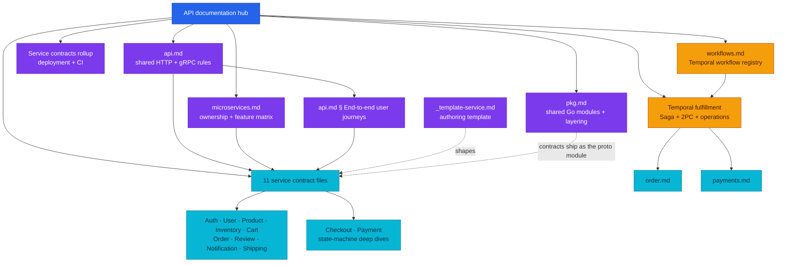

# API Documentation

Start here to learn the platform's shared API rules and then drill into one service at a time.

| Attribute | Value | RFC / ADR |
|-----------|-------|-----------|
| **Status** | Living documentation checked against all 11 service repositories | — |
| **Canonical shared guide** | [api.md](./api.md) | — |
| **Service map** | [microservices.md](./microservices.md) | — |
| **Workflow guide** | [temporal-order-fulfillment.md](./temporal-order-fulfillment.md) | — |
| **Design record** | — | None |

## Documentation Map

```mermaid
flowchart TD
    Hub["API documentation hub"] --> Shared["api.md<br/>shared HTTP + gRPC rules"]
    Hub --> Rollup["Service contracts rollup<br/>deployment + CI"]
    Hub --> Catalog["microservices.md<br/>ownership + feature matrix"]
    Hub --> Contracts["11 service contract files"]
    Hub --> Workflows["workflows.md<br/>Temporal workflow registry"]
    Hub --> Saga["Temporal fulfillment<br/>Saga + 2PC + operations"]
    Hub --> Pkg["pkg.md<br/>shared Go modules + layering"]
    Shared --> Journeys["api.md § End-to-end user journeys"]
    Contracts --> Basic["Auth · User · Product · Inventory · Cart<br/>Order · Review · Notification · Shipping"]
    Contracts --> Deep["Checkout · Payment<br/>state-machine deep dives"]
    Shared --> Contracts
    Catalog --> Contracts
    Journeys --> Contracts
    Workflows --> Saga
    Template["_template-service.md<br/>authoring template"] -.->|"shapes"| Contracts
    Saga --> Order["order.md"]
    Saga --> Payment["payments.md"]
    Pkg -.->|"contracts ship as the proto module"| Contracts

    classDef hub fill:#2563eb,color:#fff,stroke:#1e3a8a;
    classDef guide fill:#7c3aed,color:#fff,stroke:#5b21b6;
    classDef contract fill:#06b6d4,color:#082f49,stroke:#0e7490;
    classDef workflow fill:#f59e0b,color:#451a03,stroke:#b45309;
    class Hub hub;
    class Shared,Catalog,Rollup,Journeys,Template,Pkg guide;
    class Contracts,Basic,Deep,Order,Payment contract;
    class Saga,Workflows workflow;
```

The arrows show documentation ownership, not runtime traffic. Runtime traffic is
shown in [api.md](./api.md#current-east-west-call-graph).

## Recommended Learning Path

| Step | Read | What it answers |
|------|------|-----------------|
| 1 | [api.md](./api.md) | How URLs, audiences, auth, errors, pagination, HTTP, and gRPC work |
| 2 | [api.md § End-to-end user journeys](./api.md#end-to-end-user-journeys) | How one user journey (login, browse, checkout, fulfillment) travels through the services |
| 3 | [microservices.md](./microservices.md) | Which service owns each feature and how services call one another |
| 4 | One service file below | Exact HTTP routes, gRPC methods, payload examples, and service rules |
| 5 | [workflows.md](./workflows.md) | Which Temporal workflows exist, who orchestrates them, and who participates |
| 6 | [temporal-order-fulfillment.md](./temporal-order-fulfillment.md) | Why Saga is used instead of 2PC and how the live workflow compensates |
| 7 | [payments.md](./payments.md) or [checkout.md](./checkout.md) | Deeper state-machine, idempotency, and operational examples |
| 8 | [_template-service.md](./_template-service.md) then diff against [checkout.md](./checkout.md) | Authoring shape for new or migrated service contracts (v2) |

## Document Ownership

Three layers — not three copies of the same fact:

1. **Normative contract** (routes, RPCs, payloads, deployment status, ownership boundaries)
   lives here in `docs/api/`. Agents and service authors implement against these files.
2. **Design rationale** (alternatives, tradeoffs, rollout history) lives in
   [RFC](../proposals/rfc/) and [ADR](../proposals/adr/) — link via **Design records**,
   do not paste the full decision essay into a service contract.
3. **Allowed duplication:** Mermaid diagrams and explanatory prose may repeat across RFC/ADR
   and `docs/api/` when cross-linked and labelled (*Target state* vs *As-built contract*).
   **Drift is forbidden** on deployed behaviour (paths, status badges, ownership) — not on
   teaching diagrams that answer different questions.

### Where a fact belongs: here, the service README, or the service AGENTS.md

Three documents describe every service, and they answer different questions. A
fact written in the wrong one is a fact that will drift, because only one of the
three is read when the behaviour changes.

| Document | Answers | Must not contain |
|----------|---------|------------------|
| **`docs/api/{service}.md`** (here) | What the service promises: routes, RPCs, payloads, errors, ownership, deployment status | Repo build commands, directory tours, decision essays |
| Service **`README.md`** | How a human starts and verifies it locally, and where the contract lives | A second endpoint table, payload or error inventory, env-var catalogue, call graph, or deployment claim |
| Service **`AGENTS.md`** | How to implement in that repo: workflow, verification commands, architecture boundaries, service-specific invariants | Any API inventory — routes, RPCs, payloads, or the cross-service call graph |

The rule that makes this stick: **a service repo links the canonical contract,
it never reproduces it.** When the two disagree, `docs/api/` wins and the service
doc is corrected — not the other way round.

Invariants are the deliberate exception. Money units, idempotency keys,
anti-IDOR scoping, fail-closed behaviour, FSM ownership, pooler-safe database
settings, shutdown order — these belong in the service `AGENTS.md` because they
are rules an implementer can violate at the keyboard, and they stay there even
though the contract also implies them.

### Resolving a mismatch

When this documentation and the evidence disagree, classify before editing.
Choosing whichever side is cheaper to change is how a contract quietly becomes a
description of whatever the code happens to do.

| Class | Signal | Resolution |
|-------|--------|------------|
| **Stale service doc** | The service `README`/`AGENTS` contradicts the canonical contract | Correct the service doc; do not copy canonical tables into the repo |
| **Canonical doc missed a shipped change** | Code, tests, local-stack and manifests agree with each other, and this page is behind | Update the owning `{service}.md` with that evidence; touch rollups or the call graph only if their owned facts changed |
| **Implementation violates the contract** | The behaviour is not what the contract intends, and the contract is right | **Blocks the release tag.** Record it, open a separate implementation task — never rewrite the contract to legitimise the defect |
| **Designed but not deployed** | Manifests and local-stack do not run it yet | Tag it `Planned`; never present it as current |

The third class is the one worth being strict about. It is also the one that
looks most like a documentation bug, because the fastest way to make the
mismatch disappear is to edit this page — which converts a known defect into an
accepted behaviour without anyone deciding to accept it.

Every quick-facts table under a `docs/api/` title — and each service contract's
**Identity** table — uses three columns: **Attribute | Value | RFC / ADR**.
Normative design links belong on the **Design records** row; use `None` when the
doc has no owning RFC or ADR. Legacy v1 contracts may still say **Design record**
(singular) until migrated to [_template-service.md](./_template-service.md) v2.

| Information | Canonical owner |
|-------------|-----------------|
| Shared URL, auth, error, pagination, idempotency, and gRPC rules | [api.md](./api.md) |
| Cross-cutting observability policy, env, middleware, layer responsibilities | [observability.md](./observability.md) |
| Application logging JSON contract, levels, otelzap tee | [logs.md](./logs.md) |
| Metric instruments, cardinality, business metric authoring | [metrics.md](./metrics.md) |
| Tracing spans, sampling, span helpers | [tracing.md](./tracing.md) |
| Profiling client (`obsx.SetupProfiling`, env) | [profiling.md](./profiling.md) |
| Cache-Aside pattern, keys, stampede lock, env, invalidation boundaries | [caching.md](./caching.md) |
| East-west call graph and edge exposure rules | [api.md](./api.md) |
| One service's routes, RPCs, payloads, and business constraints | That service's file (At a glance **Deployment** row for local/cluster) |
| Platform deployment rollup and status vocabulary | This page § [Service contracts](#service-contracts) |
| Cross-service feature ownership | [microservices.md](./microservices.md) |
| Saga, 2PC theory, Temporal workflow, compensation, and operations | [temporal-order-fulfillment.md](./temporal-order-fulfillment.md) |
| Which `pkg` modules exist, how they are tagged, the import layering | [pkg.md](./pkg.md) |
| Which `pkg` modules a service imports and at which version | That service's own `go.mod` — never a document |
| Design rationale and alternatives | RFC or ADR |
| Deployed gateway, network, database, or observability backends/ops | The matching platform area under `docs/observability/` |
| Repository URLs, images, and CI badges | [docs/README.md § Repositories](../README.md#repositories) |

## Service Contracts

Per-service **At a glance** tables hold deployment detail; this rollup is the platform-wide view.

### Status vocabulary

| Badge | Meaning |
|-------|---------|
| **Implemented** | Runs in local-stack + cluster; e2e or manifest evidence |
| **Partial** | Partly shipped (e.g. HTTP live, edge prefix divergence) |
| **Technical debt** | Shipped but planned removal |
| **No caller** | Route/RPC wired, no live consumer — keep documented |
| **Planned** | Designed, not deployed |
| **None** | The surface does not exist for this service — e.g. no gRPC client, no worker. Distinct from **No caller**, which means it exists and nothing calls it |

### Platform rollup

| Component | Local | Cluster | Status | CI |
|-----------|:-----:|:-------:|--------|-----|
| [auth API](./auth.md) | ✓ | ✓ | Implemented |  |
| [user API](./user.md) | ✓ | ✓ | Implemented |  |
| [product API + gRPC](./product.md) | ✓ | ✓ | Implemented |  |
| [inventory gRPC](./inventory.md) | ✓ | ✓ | Implemented — the sole stock authority; callers: order saga, checkout, product /details |  |
| [cart API + gRPC](./cart.md) | ✓ | ✓ | Implemented |  |
| [order API + gRPC](./order.md) | ✓ | ✓ | Implemented |  |
| [review API + gRPC](./review.md) | ✓ | ✓ | Implemented |  |
| [shipping API + gRPC](./shipping.md) | ✓ | ✓ | Implemented |  |
| [notification API + gRPC](./notification.md) | ✓ | ✓ | Implemented |  |
| [payment API + gRPC](./payments.md) | ✓ | ✓ | Implemented |  |
| [checkout API](./checkout.md) | ✓ | ✓ | Implemented |  |
| order-worker | ✓ | ✓ | Implemented | — |
| checkout-worker | ✓ | ✓ | Implemented | — |
| mockpay provider | ✓ | ✓ | Implemented | — |
| frontend SPA | ✓ | ✓ | Implemented |  |
| gRPC mTLS east-west | — | — | Planned | — |

| Service | One-line responsibility | Contract |
|---------|-------------------------|----------|
| Auth | Credentials, JWTs, refresh rotation, and JWKS | [auth.md](./auth.md) |
| User | Public and owner-scoped profiles | [user.md](./user.md) |
| Product | Catalog, price, and review aggregation (**no stock** since RFC-0021 phase 4) | [product.md](./product.md) |
| Inventory | Warehouse balances, reservations, and movement ledger — the **sole** stock authority, called by checkout, product `/details`, and the order saga | [inventory.md](./inventory.md) |
| Cart | Active cart and checkout snapshot | [cart.md](./cart.md) |
| Order | Orders and fulfillment workflow handoff | [order.md](./order.md) |
| Review | Product ratings and comments | [review.md](./review.md) |
| Notification | Inbox records and delivery requests | [notification.md](./notification.md) |
| Shipping | Quotes, tracking, and shipment lifecycle | [shipping.md](./shipping.md) |
| Checkout | Purchase sessions, totals, promo, and confirm | [checkout.md](./checkout.md) |
| Payment | Payment state, ledger, refunds, and reconciliation | [payments.md](./payments.md) |

## Architecture and Workflow Guides

| Document | Covers | Current status |
|----------|--------|----------------|
| [api.md](./api.md) | HTTP and gRPC architecture, call graph, user journeys, HTTP/2 load balancing, security, observability | Implemented |
| [microservices.md](./microservices.md) | Service feature matrix, ownership, dependencies, and known gaps | Living reference |
| [temporal-order-fulfillment.md](./temporal-order-fulfillment.md) | Saga vs 2PC learning plus the live order workflow and Temporal operations | Implemented |
| [checkout.md](./checkout.md) | Checkout FSM, price re-validation, totals, promo, confirm, and abandonment | Implemented — P1-P5 shipped; the legacy order path was removed in RFC-0021 P5 |
| [payments.md](./payments.md) | Money state machine, idempotency, ledger, provider, and reconciliation | Implemented |

## Related Areas

| Topic | Document |
|-------|----------|
| Kong routing and plugins | [Kong gateway](../platform/kong-gateway.md) |
| NetworkPolicy caller matrix | [Network policies](../security/network-policies.md) |
| Application observability (normative contract) | [observability.md](./observability.md) · [logs](./logs.md) · [metrics](./metrics.md) · [tracing](./tracing.md) · [profiling](./profiling.md) |
| Metrics platform ops (alerts, dashboards) | [Application metrics (platform)](../observability/metrics/metrics-apps.md) |
| Valkey cache-aside behavior | [Application caching](./caching.md) · [Caching (platform)](../caching/README.md) |
| Shared Go library (packages, consumers, bump ledger) | [pkg.md](./pkg.md) |
| Local environment | [local-stack README](../../local-stack/README.md) |
| Repository index (images + CI) | [docs/README.md § Repositories](../README.md#repositories) |

## Updating This Area

| Change | Required documentation |
|--------|------------------------|
| Shared convention changes | Update [api.md](./api.md) |
| Shared observability / instrumentation changes | Update [observability.md](./observability.md) and the relevant pillar file |
| Cache-Aside contract, keys, stampede, or invalidation rules | Update [caching.md](./caching.md) |
| Service route, RPC, payload, or state changes | Update only the owning service file |
| Deployment or CI status changes | Update this rollup + the service At a glance table |
| East-west call graph or edge exposure changes | Update [api.md](./api.md) |
| Cross-service feature ownership changes | Update [microservices.md](./microservices.md) and the relevant service files |
| Saga step or compensation changes | Update [temporal-order-fulfillment.md](./temporal-order-fulfillment.md) |
| RFC `implemented` or ADR `Accepted` (API-touching) | Sync per [Document Ownership](#document-ownership); set **Design records** links; same PR or immediate follow-up — see [proposals lifecycle](../proposals/README.md) |
| At a glance or code map format | v2 template: `Dimension \| Value \| Status` rows include **Deployment**, **Runtime modes**, **HTTP server**, **Edge exposure**, **gRPC server/clients**, **Worker**, **Temporal**, **Async/events**, **Technical debt** — see [_template-service.md](./_template-service.md) |
| New service contract file | Start from [_template-service.md](./_template-service.md) v2 — At a glance + Identity + 15-part outline |
| New file | Link it here and from [docs/README.md](../README.md) |
| A service `README.md` or `AGENTS.md` disagrees with a contract | Correct the service doc — see [Where a fact belongs](#where-a-fact-belongs-here-the-service-readme-or-the-service-agentsmd) |

Every substantive claim must match the service code, local-stack wiring, and
GitOps manifests — that evidence is how a claim is verified, not a competing
source to prefer. Mark designed but undeployed behavior as **planned**, and when
the two disagree, classify it first: [Resolving a mismatch](#resolving-a-mismatch).

_Last updated: 2026-08-09 — adds the contract/README/AGENTS ownership boundary, the mismatch classification with its release-blocking class, the `None` status badge, and pkg to the ownership table and map._
