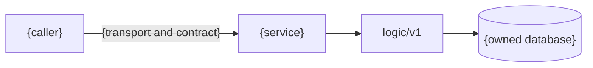

# {Service} Service API

<!--
Template for every service contract in docs/api/.

Copy, fill, and delete comments. Keep the 15-part section order exactly as
defined below.

Documentation language: English only.
Diagrams: Mermaid only, using the palette defined in AGENTS.md.
Shared rules belong in api.md; service-specific behavior belongs here.

Implementation status vocabulary:
Implemented / Partial / Technical debt / No caller / Planned / None.

Status describes implementation availability, never runtime business state.

Depth guide:
- Simple HTTP-only service: 180–300 lines.
- Stateful or multi-transport service: 250–450 lines.
- Complex workflow/payment/inventory details may move to a linked deep dive.
Do not omit contract semantics merely to meet a line-count target.

This document is an as-built, verified contract reference. HTTP routers,
request/response types, protobufs, tests, Kong configuration, and runtime
configuration remain the executable sources.

Versioning policy: do not duplicate — link api.md § versioning-and-compatibility.
CI badges live in hub rollup + docs/README.md § Repositories, not here.
-->

{Service} turns {input or intent} into {owned durable outcome}, while
{adjacent responsibility} remains owned by {owning service}.

> **Contract stance:** As-built. Planned behavior is explicitly tagged
> `Planned`; target-state behavior is never presented as current.

<!--
Part 2 — At a glance.

Keep cells short. Detail belongs in later sections.
Use the same rows in every service document.
-->

| Dimension | Value | Status |
|-----------|-------|--------|
| **Deployment** | local-stack + cluster | Implemented |
| **Runtime modes** | `api` <!-- + migrate / seed / worker / reaper --> | Implemented |
| **HTTP server** | {public/private/protected/internal/none} · `:8080` | Implemented |
| **Edge exposure** | Kong `{canonical prefixes}`; `{internal prefixes}` off-edge | Implemented |
| **gRPC server** | None <!-- or `package.Service/RPCs` · `:9090` --> | None |
| **gRPC clients** | None <!-- or short callee list --> | None |
| **Worker** | None <!-- or `{worker}` · queue `{queue}` --> | None |
| **Temporal** | None · [workflows.md](./workflows.md) <!-- or role + workflow --> | None |
| **Async / events** | None <!-- or published/consumed event families --> | None |
| **Technical debt** | None <!-- or short item + Known gaps link --> | None |

<!--
Part 3 — Stable identity and ownership metadata.

"Owns" means authoritative writer/source of truth.
"Does not own" should name adjacent concepts that are easy to place here by
mistake.
Versioning: link api.md § versioning — do not duplicate platform policy here.
-->

| Attribute | Value | RFC / ADR |
|-----------|-------|-----------|
| **Repository** | [`duynhlab/{service}-service`](https://github.com/duynhlab/{service}-service) | — |
| **Domain** | {bounded context / subdomain} | — |
| **Owns** | {authoritative data and business rules} | — |
| **Does not own** | {adjacent data and rules owned elsewhere} | — |
| **Database** | `{db}` on `{cluster}` via `{pooler/direct}` <!-- or None --> | — |
| **Cache** | None <!-- or cache name, purpose, authority rule --> | — |
| **Sensitive data** | None <!-- or PII/token/financial classification --> | — |
| **Contract sources** | HTTP `{router/types paths}` · gRPC `{proto repository/path}` | — |
| **Design records** | — | [RFC-NNNN](../proposals/rfc/RFC-NNNN/) <!-- or None --> |

## Temporal participation

<!--
Part 4 — Select ONE shape.

NONE:
None — this service does not start or participate in Temporal workflows.
See [workflows.md](./workflows.md).

PARTICIPANT:
Use the table below and remove orchestrator-only rows that do not apply.

ORCHESTRATOR:
Keep workflow ID, queue, start semantics, pivot, retry, compensation, and
versioning rows.
-->

| Field | Value |
|-------|-------|
| **Role** | Participant (gRPC) <!-- or Orchestrator / Participant (REST) --> |
| **Workflow / owner** | `OrderFulfillmentWorkflow` · owned by order |
| **Worker / task queue** | `{worker}` · `{queue}` <!-- or None for a pure participant --> |
| **Entry point** | {handler/command/signal that starts or reaches the workflow} |
| **Workflow ID** | `{stable-id-pattern}` <!-- orchestrator only --> |
| **This service's steps** | `{Activity}`, `{Compensation}` (compensation) |
| **Pivot / post-pivot rule** | {pivot or None; mandatory-forward vs best-effort} |
| **Idempotency** | {business key and replay behavior} |
| **Retry / timeout ownership** | {Temporal policy owner and service-side limits} |
| **Versioning** | {workflow patch/version strategy or None} |
| **Deep dive** | [workflows.md](./workflows.md#workflow-anchor) · [{deep-dive}.md](./{deep-dive}.md) |

## Why it exists

<!--
Part 5 — Explain:
1. The concrete problem before this service existed.
2. Why this is a separate ownership boundary.
3. What correctness property it provides.
4. What it deliberately does not do.

Do not write generic microservice theory.
-->

{Problem statement.}

{Why this service is the authority for its owned concept.}

### Boundary

| Question | Answer |
|----------|--------|
| **What is authoritative here?** | {data/rules} |
| **What is only a snapshot or projection?** | {data or None} |
| **What is delegated to another service?** | {responsibility → owner} |
| **What must never be implemented here?** | {boundary violations} |
| **Consistency model** | {strong / eventual / read-your-writes — optional} |

<!--
For checkout-like orchestrators, state explicitly that the service is not a
platform-wide BFF. Unrelated domain reads and writes continue to go from the
SPA/admin portal through Kong to the owning service.
-->

## Architecture

<!--
Part 6 — Exactly one Mermaid diagram answering one explicit question.

State the question before the diagram.
Show only relevant actors, service boundaries, transports, ports, owned
storage, and important failure boundaries.

Do not redraw the entire platform topology.
Use solid arrows for live synchronous paths and dotted arrows only for clearly
explained exceptional, optional, or planned paths.
-->

One question: **{question this diagram answers}?**

## Data model

<!--
Part 7 — As-built tables, constraints, money units.
Name authoritative writer vs projection/snapshot columns.
Tag undeployed columns or tables as Planned.
-->

## HTTP API

<!--
Part 8 — Full canonical paths (/{service}/v1/{audience}/...).

Minimum route table (see checkout.md):
| Method | Path | Purpose | Errors worth knowing |

Document at least one validation failure, one auth failure, and one
retry/idempotency path per non-trivial surface.
Link api.md for envelope, audiences, pagination, idempotency headers.
If no gRPC server, list outbound gRPC callees in a table here or under gRPC API.
-->

| Method | Path | Purpose | Errors worth knowing |
|--------|------|---------|----------------------|

Platform conventions apply: [api.md](./api.md#error-envelope) · [audiences](./api.md#audience-segments).

## gRPC API

<!--
Part 9 — RPC table with Saga column: — | step | compensation.
If no gRPC server: one line "None — HTTP only." plus outbound callee table if any.

Distinguish gRPC transport errors from business outcomes in the response body
(e.g. payment decline returns status failed, not a gRPC error — see payments.md).
-->

| RPC | Request → Response | Saga | Notes |
|-----|--------------------|------|-------|

## Business rules & techniques

<!--
Part 10 — Invariants, FSMs, idempotency keys, caching strategy, side effects.
Use a stateDiagram-v2 when state is non-trivial.
Link RFC/ADR for rationale — keep this section as operational rules, not the essay.
-->

## Callers & dependencies

<!--
Part 11 — Consumer services and upstream callees.
East-west detail per api.md call graph — do not redraw the full platform topology.
-->

## Known gaps

<!--
Part 12 — Technical debt, no-caller routes, planned removals, deprecation windows.
Write "None." if empty.
-->

## Operations

<!--
Part 13 — env vars, probes, key metrics, curl/grpcurl examples via Kong.
Include trace/correlation env when instrumented (RFC-0017 / observability.md).
-->

## Code map

<!--
Part 14 — Verify paths against the actual service repo.
-->

Paths in [`duynhlab/{service}-service`](https://github.com/duynhlab/{service}-service).
Transport peers call `logic/v1`; logic calls `core` only
([api.md § Inside Each Service](./api.md#inside-each-service)).

| Layer | Path | Notes |
|-------|------|-------|
| **Transport** | `internal/web/v1/` | HTTP handlers |
| | `internal/grpc/v1/` | gRPC server (if any) |
| **logic** | `internal/logic/v1/` | Business rules |
| **core** | `internal/core/` | Domain, repositories, ports |
| **Platform** | `cmd/main.go`, `config/`, `db/migrations/`, `pkg/proto/` | Bootstrap, schema, contract |

## References

<!--
Part 15 — api.md, workflows.md, RFC/ADRs, runbooks.
Learning exemplar for orchestrator shape: checkout.md
Learning exemplar for participant + money FSM: payments.md
-->

- [api.md](./api.md)
- [workflows.md](./workflows.md)
- <!-- RFC/ADR links -->
- <!-- [checkout.md](./checkout.md) — authoring exemplar -->

_Last updated: YYYY-MM-DD_
