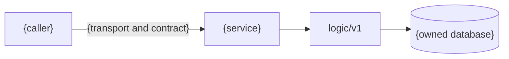

# {Service} Service API

<!--
Template for every service contract in docs/api/.

Copy, fill, and delete comments. Keep the 15-part section order exactly as
defined below.

Documentation language: English only.
Diagrams: Mermaid only, using the palette defined in AGENTS.md.
Shared rules belong in api.md; service-specific behavior belongs here.

Availability vocabulary:
Implemented / Partial / Planned / None / Archived.

Availability describes whether a capability exists, never runtime business
state. Technical debt, deprecated surfaces, and no-caller surfaces belong in
Known gaps because they can coexist with an implemented capability.

Depth guide:
- Simple HTTP-only service: 180–300 lines.
- Stateful or multi-transport service: 250–450 lines.
- Complex workflow/payment/inventory details may move to a linked deep dive.
Do not omit contract semantics merely to meet a line-count target.

This document is NORMATIVE. It is what agents and service authors implement
against. HTTP routers, request/response types, protobufs, tests, edge
configuration (`HTTPRoute`/`SecurityPolicy`/`BackendTrafficPolicy`),
manifests, and local-stack are VERIFICATION EVIDENCE: they are
how a claim here is proved true, not a competing source to prefer when it is
more convenient.

A mismatch between this document and the evidence is therefore never resolved by
picking whichever side is easier to change. Classify it first — see
README.md § Resolving a mismatch — and note that one class, an implementation
that violates the intended contract, BLOCKS the release tag until it is
reconciled or explicitly accepted.

Versioning policy: do not duplicate — link api.md § versioning-and-compatibility.
CI badges live in hub rollup + docs/README.md § Repositories, not here.
-->

{Service} turns {input or intent} into {owned durable outcome}, while
{adjacent responsibility} remains owned by {owning service}.

> **Contract stance:** As-built. Planned behavior is explicitly tagged
> `Planned`; target-state behavior is never presented as current.

<!--
Part 2 — At a glance.

Keep cells short. Detail belongs in later sections. Evidence links to the
smallest stable proof: this document's detailed section, a homelab manifest,
the workflow registry, or a code-map path. Use `—` when the capability is absent.
Use the same rows in every service document.
-->

| Capability | Current shape | Availability | Evidence |
|------------|---------------|--------------|----------|
| **Deployment** | local-stack + cluster | Implemented | [`compose.yaml`](../../local-stack/compose.yaml) · `kubernetes/apps/services/{service}.yaml` |
| **Runtime modes** | `api` <!-- + migrate / seed / worker / reaper --> | Implemented | [Code map](#code-map) |
| **HTTP server** | {public/private/protected/internal/none} · `:8080` | Implemented | [HTTP API](#http-api) |
| **Edge exposure** | Edge `HTTPRoute` on `{canonical prefixes}`; `{internal prefixes}` off-edge | Implemented | [HTTP API](#http-api) · [edge routes](../../kubernetes/infra/configs/envoy-gateway/routes/api.yaml) |
| **gRPC server** | None <!-- or `package.Service/RPCs` · `:9090` --> | None | — |
| **gRPC clients** | None <!-- or short callee list --> | None | — |
| **Worker** | None <!-- or `{worker}` · queue `{queue}` --> | None | — |
| **Temporal** | None | None | — |
| **Events** | None <!-- or published/consumed event families --> | None | — |

Known gaps: [None](#known-gaps).

<!--
Part 3 — Stable identity and ownership metadata.

"Owns" means authoritative writer/source of truth.
"Does not own" should name adjacent concepts that are easy to place here by
mistake.
Versioning: link api.md § versioning — do not duplicate platform policy here.
-->

| Attribute | Value |
|-----------|-------|
| **Owns** | {authoritative data and business rules} |
| **Does not own** | {adjacent data and rules owned elsewhere} |
| **Database** | `{db}` on `{cluster}` via `{pooler/direct}` <!-- or None --> |
| **Cache** | None <!-- or cache name, purpose, authority rule --> |
| **Sensitive data** | None <!-- or PII/token/financial classification --> |
| **Design records** | `RFC-NNNN` <!-- link ../proposals/rfc/RFC-NNNN/ once numbered, or None --> |

## Temporal participation

<!--
Part 4 — Select ONE shape.

NONE:
None — this service does not start or participate in Temporal workflows.
See [workflows.md](./workflows.md).

PARTICIPANT:
Use the table below and remove orchestrator-only rows that do not apply.

ORCHESTRATOR:
Keep workflow ID, queue, start semantics, pivot, retry, compensation, and
versioning rows.
-->

| Field | Value |
|-------|-------|
| **Role** | Participant (gRPC) <!-- or Orchestrator / Participant (REST) --> |
| **Workflow / owner** | `OrderFulfillmentWorkflow` · owned by order |
| **Worker / task queue** | `{worker}` · `{queue}` <!-- or None for a pure participant --> |
| **Entry point** | {handler/command/signal that starts or reaches the workflow} |
| **Workflow ID** | `{stable-id-pattern}` <!-- orchestrator only --> |
| **This service's steps** | `{Activity}`, `{Compensation}` (compensation) |
| **Pivot / post-pivot rule** | {pivot or None; mandatory-forward vs best-effort} |
| **Idempotency** | {business key and replay behavior} |
| **Retry / timeout ownership** | {Temporal policy owner and service-side limits} |
| **Versioning** | {workflow patch/version strategy or None} |
| **Deep dive** | [workflows.md](./workflows.md#workflow-anchor) · `{deep-dive}.md` <!-- link it once named --> |

## Why it exists

<!--
Part 5 — Explain:
1. The concrete problem before this service existed.
2. Why this is a separate ownership boundary.
3. What correctness property it provides.
4. What it deliberately does not do.

Do not write generic microservice theory.
-->

{Problem statement.}

{Why this service is the authority for its owned concept.}

### Boundary

| Question | Answer |
|----------|--------|
| **What is authoritative here?** | {data/rules} |
| **What is only a snapshot or projection?** | {data or None} |
| **What is delegated to another service?** | {responsibility → owner} |
| **What must never be implemented here?** | {boundary violations} |
| **Consistency model** | {strong / eventual / read-your-writes — optional} |

<!--
For checkout-like orchestrators, state explicitly that the service is not a
platform-wide BFF. Unrelated domain reads and writes continue to go from the
SPA/admin portal through the edge to the owning service.
-->

## Architecture

<!--
Part 6 — Exactly one Mermaid diagram answering one explicit question.

State the question before the diagram.
Show only relevant actors, service boundaries, transports, ports, owned
storage, and important failure boundaries.

Do not redraw the entire platform topology.
Use solid arrows for live synchronous paths and dotted arrows only for clearly
explained exceptional, optional, or planned paths.
-->

One question: **{question this diagram answers}?**

```mermaid
flowchart LR
    Caller["{caller}"] -->|"{transport and contract}"| Service["{service}"]
    Service --> Logic["logic/v1"]
    Logic --> DB[("{owned database}")]

    classDef edge fill:#2563eb,color:#fff,stroke:#1e3a8a;
    classDef service fill:#06b6d4,color:#082f49,stroke:#0e7490;
    classDef worker fill:#f59e0b,color:#451a03,stroke:#b45309;
    classDef platform fill:#7c3aed,color:#fff,stroke:#5b21b6;
    classDef data fill:#22c55e,color:#052e16,stroke:#15803d;
    classDef external fill:#64748b,color:#fff,stroke:#334155;
```

## Data model

<!--
Part 7 — As-built tables, constraints, money units.
Name authoritative writer vs projection/snapshot columns.
Tag undeployed columns or tables as Planned.
-->

## HTTP API

<!--
Part 8 — Full canonical paths (/{service}/v1/{audience}/...).

Minimum route table (see checkout.md):
| Method | Path | Purpose | Errors worth knowing |

Cover, for every non-trivial surface:
- Request and response semantics — which fields are required, what they mean,
  units (money is always minor units), and what the caller gets back.
- Validation: at least one concrete failure and the code it returns.
- Authentication AND authorization: who may call it, and the rule applied —
  these are different questions and the second is the one usually missing.
- Owner scoping: when a route reads or writes data belonging to a principal,
  state how ownership is enforced. An unscoped route is an IDOR, so say the
  rule explicitly rather than leaving it implied.
- Idempotency / retry behavior: what a repeated call does.
- Error outcomes are part of the contract. A documented code is stable — callers
  branch on it, so changing one is a breaking change, not a detail.

Link api.md for envelope, audiences, pagination, idempotency headers.
If no gRPC server, list outbound gRPC callees in a table here or under gRPC API.
-->

| Method | Path | Purpose | Errors worth knowing |
|--------|------|---------|----------------------|

Platform conventions apply: [api.md](./api.md#error-envelope) · [audiences](./api.md#audience-segments).

## gRPC API

<!--
Part 9 — RPC table with Saga column: — | step | compensation.
If no gRPC server: one line "None — HTTP only." plus outbound callee table if any.

Name the proto source for every RPC — the module and path the stubs come from
(pkg/proto/<svc>/v1) — so a reader can diff the contract against the generated code.

Distinguish gRPC transport errors from business outcomes in the response body
(e.g. payment decline returns status failed, not a gRPC error — see payments.md).

State idempotency per RPC: what a redelivery does. Saga steps are retried by the
workflow, so an RPC that is not safe to repeat is a defect, not a caveat.
-->

| RPC | Request → Response | Saga | Notes |
|-----|--------------------|------|-------|

## Business rules & techniques

<!--
Part 10 — Invariants, FSMs, idempotency keys, caching strategy, side effects.
Use a stateDiagram-v2 when state is non-trivial.
Link RFC/ADR for rationale — keep this section as operational rules, not the essay.
-->

## Callers & dependencies

<!--
Part 11 — Consumer services and upstream callees.
East-west detail per api.md call graph — do not redraw the full platform topology.
-->

## Known gaps

<!--
Part 12 — Technical debt, no-caller routes, planned removals, deprecation windows.
Write "None." if empty.
-->

## Operations

<!--
Part 13 — env vars, probes, key metrics, curl/grpcurl examples via the edge.
Include trace/correlation env when instrumented (RFC-0017 / observability.md).

Restricted to what is DEPLOYED. An env var the manifests do not set, or a probe
the chart does not configure, does not belong here — this section is read during
an incident, and a value that is merely intended is worse than an absent one.

Add failure behavior: what this service does when a dependency it needs is
unavailable. Fail-closed or fail-open, what the caller sees, and whether the
effect is retried, queued, or lost. This is the question asked at 3am and it is
the one most often missing.
-->

## Code map

<!--
Part 14 — Verify paths against the actual service repo.
-->

Paths in `duynhlab/{service}-service`.
Transport peers call `logic/v1`; logic calls `core` only
([api.md § Inside Each Service](./api.md#inside-each-service)).

| Layer | Path | Notes |
|-------|------|-------|
| **Transport** | `internal/web/v1/` | HTTP handlers |
| | `internal/grpc/v1/` | gRPC server (if any) |
| **logic** | `internal/logic/v1/` | Business rules |
| **core** | `internal/core/` | Domain, repositories, ports |
| **Platform** | `cmd/main.go`, `config/`, `db/migrations/`, `pkg/proto/` | Bootstrap, schema, contract |

## References

<!--
Part 15 — api.md, workflows.md, RFC/ADRs, runbooks.
Learning exemplar for orchestrator shape: checkout.md
Learning exemplar for participant + money FSM: payments.md
-->

- [api.md](./api.md)
- [workflows.md](./workflows.md)
- <!-- RFC/ADR links -->
- <!-- [checkout.md](./checkout.md) — authoring exemplar -->

<!--
Author checklist — delete this block before committing the filled document.

Each line names the evidence that proves a claim. Tick it because you opened the
file, not because the statement sounds right. Anything you could not verify is
marked `Planned` or listed under Known gaps; it is never left as an unqualified
present-tense sentence.

- [ ] Routes match the router — internal/web/v1/
- [ ] Payload fields and units match the DTOs — request/response types
- [ ] RPCs and messages match the protobufs — pkg/proto/<svc>/v1
- [ ] Documented failures are covered by tests, so the codes are real
- [ ] The service and its wiring exist in local-stack/compose.yaml
- [ ] Edge exposure matches the `HTTPRoute`s actually configured (`kubernetes/infra/configs/envoy-gateway/routes/`, `local-stack/gateway/eg/routes.yaml`)
- [ ] Deployment claims match kubernetes/apps/ — image, probes, env
- [ ] Call-graph edges owned by api.md are not redrawn here, only linked
- [ ] Capability availability uses the hub vocabulary, and Planned is used for
      anything not running
- [ ] Every link resolves, and each service contract is linked directly
- [ ] `_Last updated` says what changed, not only when
-->

_Last updated: YYYY-MM-DD_
