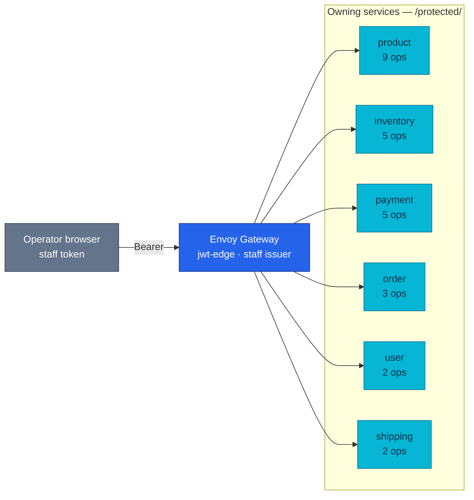

# Backoffice Admin Service

> **This is an application-service contract and consumer index, not a business
> API contract.** `admin-service` is a deployed React/Nginx workload, but it
> serves no API of its own. Every operation below remains owned, specified and
> versioned by the service that serves it.

The Backoffice ("Admin Portal") is a browser client. Because
[ADR-048](../proposals/adr/ADR-048-admin-portal-no-bff/) chose **no BFF**, the
browser fans out to the owning services directly, and that fan-out is a design
consequence worth being able to see in one place.

## At a glance

| Capability | Current shape | Availability | Evidence |
|------------|---------------|--------------|----------|
| **Deployment** | local-stack + cluster (`backoffice` namespace) | Implemented | [`compose.yaml`](../../local-stack/compose.yaml) · [`backoffice-rs.yaml`](../../kubernetes/apps/backoffice-rs.yaml) |
| **Runtime** | React static bundle served by Nginx on `:80` | Implemented | [Platform contract](../frontend/admin-portal/README.md#deployment) |
| **HTTP server** | Static assets + `/health`; no business API | Implemented | [Platform contract](../frontend/admin-portal/README.md#deployment) |
| **Edge exposure** | `backoffice.duynh.me` · `PathPrefix /` | Implemented | [`backoffice.yaml`](../../kubernetes/infra/configs/envoy-gateway/routes/backoffice.yaml) |
| **API served** | None | None | — |
| **API clients** | 26 operations over 23 paths across 6 owning services | Implemented | [Consumer matrix](#what-it-calls-by-feature) |
| **Worker** | None | None | — |
| **Temporal** | None | None | — |
| **Events** | None | None | — |

Known gaps: [three platform gaps](../frontend/admin-portal/README.md#known-gaps).

| Attribute | Value |
|-----------|-------|
| **Owns** | Operator UX, browser-side routing/query orchestration, and the inventory of protected operations it consumes |
| **Does not own** | Business data, protected API behavior, authorization decisions, or a BFF; those stay with the six serving services |
| **Database** | None |
| **Cache** | None authoritative; TanStack Query holds disposable browser state only |
| **Sensitive data** | Staff access token, held in browser memory only and sent as `Authorization: Bearer` |
| **Design records** | [RFC-0023](../proposals/rfc/RFC-0023/) · [ADR-047](../proposals/adr/ADR-047-protected-apis-on-owning-services/) · [ADR-048](../proposals/adr/ADR-048-admin-portal-no-bff/) · [ADR-049](../proposals/adr/ADR-049-admin-portal-tanstack-spa/) · [ADR-050](../proposals/adr/ADR-050-separate-staff-identity-realm/) |

## The fan-out



No service calls the portal, and the portal calls no service east-west. Every
arrow above is a browser request through the edge — the north-south counterpart
of [api.md § east-west call graph](./api.md#current-east-west-call-graph).

## What it calls, by feature

The source is organised one module per service (`src/features/{module}/api.ts`),
so the mapping is exactly one-to-one.

| Feature module | Service | Ops | Paths | Screens | Contract |
|----------------|---------|----:|------:|---------|----------|
| `catalog` | product | 9 | 6 | Catalog, product detail | [product.md](./product.md) |
| `inventory` | inventory | 5 | 5 | Inventory | [inventory.md](./inventory.md) |
| `payments` | payment | 5 | 5 | Payments, payment detail, reconciliation run | [payments.md](./payments.md) |
| `orders` | order | 3 | 3 | Orders, order detail | [order.md](./order.md) |
| `customers` | user | 2 | 2 | Customers, customer detail | [user.md](./user.md) |
| `shipments` | shipping | 2 | 2 | Shipments, shipment detail | [shipping.md](./shipping.md) |

`catalog` is the only module where operations outnumber paths: the catalog is the
one place the portal **writes**, so several paths carry more than one verb.

## The operations

Method, path, and the screen that needs it. Nothing else — semantics and payloads
are in the owning file named in each group heading.

### product — [product.md](./product.md)

| Method | Path | Screen |
|--------|------|--------|
| `GET` | `/product/v1/protected/products` | Catalog |
| `POST` | `/product/v1/protected/products` | Catalog — create |
| `GET` | `/product/v1/protected/products/:id` | Product detail |
| `PUT` | `/product/v1/protected/products/:id` | Product detail — edit |
| `POST` | `/product/v1/protected/products/:id/:action` | Product detail — lifecycle; `:action` is `publish` \| `archive` \| `restore` |
| `GET` | `/product/v1/protected/products/:id/audit` | Product detail — change history |
| `GET` | `/product/v1/protected/categories` | Catalog — category picker |
| `POST` | `/product/v1/protected/categories` | Catalog — create category |
| `PUT` | `/product/v1/protected/categories/:id` | Catalog — rename category |

### inventory — [inventory.md](./inventory.md)

| Method | Path | Screen |
|--------|------|--------|
| `GET` | `/inventory/v1/protected/balances` | Inventory |
| `GET` | `/inventory/v1/protected/movements` | Inventory — ledger |
| `GET` | `/inventory/v1/protected/reservations` | Inventory — open holds |
| `POST` | `/inventory/v1/protected/receipts` | Inventory — receive stock |
| `POST` | `/inventory/v1/protected/adjustments` | Inventory — correct a balance |

### payment — [payments.md](./payments.md)

Read-only. The portal never moves money.

| Method | Path | Screen |
|--------|------|--------|
| `GET` | `/payment/v1/protected/payments` | Payments |
| `GET` | `/payment/v1/protected/payments/:id` | Payment detail |
| `GET` | `/payment/v1/protected/attempts/open` | Payments — the doubt worklist |
| `GET` | `/payment/v1/protected/reconciliations/runs` | Payments — run headers |
| `GET` | `/payment/v1/protected/reconciliations/runs/:id` | Reconciliation run detail |

### order — [order.md](./order.md)

| Method | Path | Screen |
|--------|------|--------|
| `GET` | `/order/v1/protected/orders` | Orders |
| `GET` | `/order/v1/protected/orders/:id` | Order detail (case view) |
| `POST` | `/order/v1/protected/orders/:id/resolve` | Order detail — resolve a manual-review case |

### user — [user.md](./user.md)

| Method | Path | Screen |
|--------|------|--------|
| `GET` | `/user/v1/protected/users` | Customers |
| `GET` | `/user/v1/protected/users/:userId` | Customer detail |

### shipping — [shipping.md](./shipping.md)

| Method | Path | Screen |
|--------|------|--------|
| `GET` | `/shipping/v1/protected/shipments` | Shipments |
| `GET` | `/shipping/v1/protected/shipments/:id` | Shipment detail |

## Why the surface looks like this

Three decisions shape every row above, and each is recorded rather than restated
here:

- **`/protected/` on the owning service, never `/internal/` and never a database**
  — [ADR-047](../proposals/adr/ADR-047-protected-apis-on-owning-services/). The
  portal has exactly the authority its token grants.
- **No BFF** — [ADR-048](../proposals/adr/ADR-048-admin-portal-no-bff/). The
  fan-out is the accepted cost of not adding an aggregation tier whose only job
  would be to hide it. An admin BFF waits on a real read-aggregation trigger.
- **A separate realm** — [ADR-050](../proposals/adr/ADR-050-separate-staff-identity-realm/).
  A customer token fails at the edge as wrong-issuer before any role logic runs,
  so the role gate is defence in depth rather than the only fence.

The shared rules these routes obey — guard chain, pagination, error envelope —
belong to [api.md § Protected route conventions](./api.md#protected-route-conventions),
not here.

## Keeping this page true

This index is derived, so it can be re-derived. From the repo root, with
`admin-service` checked out alongside:

```bash
grep -rhoE "/[a-z-]+/v1/protected/[^\"'\`]*" ../admin-service/src/features/*/api.ts \
  | sort -u | wc -l          # expect 23 distinct paths
```

Two invariants are worth asserting whenever the portal's pin moves: the count
above, and that **every path is documented by its owner** — the second is the
check that matters, because a path the portal calls and no contract describes is
a real gap, not a formatting one. Both were run for this page: 26/26 operations
matched their owning file on method *and* path.

## References

- [Admin Portal (platform)](../frontend/admin-portal/README.md) — stack, delivery, edge exposure, gaps
- [Browser applications](../frontend/README.md) — both SPAs and the build-arg contract
- [api.md](./api.md) — shared HTTP rules, protected route conventions, east-west call graph
- [identity.md](./identity.md) — the two realms and where each token is verified
- [RFC-0023](../proposals/rfc/RFC-0023/README.md) — the RFC that introduced the portal and `/protected/`

---
_Last updated: 2026-08-26 — recognizes `admin-service` as the deployed Backoffice application service while preserving its no-BFF consumer boundary._
