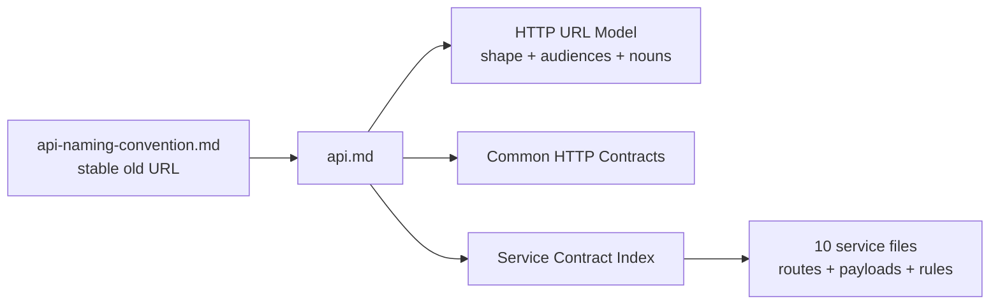

# API Naming Convention (Compatibility Page)

This filename is retained so older service docs, ADRs, RFCs, and code comments do not break.

| Attribute | Value |
|-----------|-------|
| **Status** | Compatibility page |
| **Canonical guide** | [api.md](./api.md) |
| **Moved content** | URL naming, audience segments, route ownership, versioning, and registration rules |
| **Removal policy** | Keep while external repositories or historical documents link here |

## Navigation Diagram

## Where the Content Lives

The naming guide and the former route catalog were merged into the shared API
guide. Service-specific routes now live with their owning service so a route is
not maintained in two places.

| Looking for | Read |
|-------------|------|
| Canonical URL shape | [HTTP URL Model](./api.md#http-url-model) |
| `public`, `private`, `protected`, and `internal` | [Audience segments](./api.md#audience-segments) |
| Plural collection rule and exceptions | [Collection noun rule](./api.md#collection-noun-rule) |
| Shared errors, pagination, auth, and idempotency | [Common HTTP Contracts](./api.md#common-http-contracts) |
| All ten service contract files | [Service Contract Index](./api.md#service-contract-index) |
| Compatibility and versioning rules | [Versioning and Compatibility](./api.md#versioning-and-compatibility) |
| Checklist for adding a route | [Changing an API](./api.md#changing-an-api) |

## Why This Page Remains

Changing a documentation filename is different from changing its content.
Sibling service repositories and accepted design records still contain this
path. Keeping a small forwarding page avoids broken learning trails while the
canonical material has only one owner.

## References

- [API documentation index](./README.md)
- [Canonical API guide](./api.md)
- [ADR-017](../proposals/adr/ADR-017-api-path-collection-noun/)

_Last updated: 2026-07-13_
