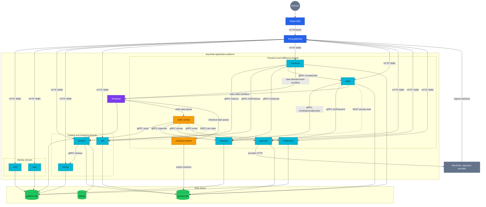
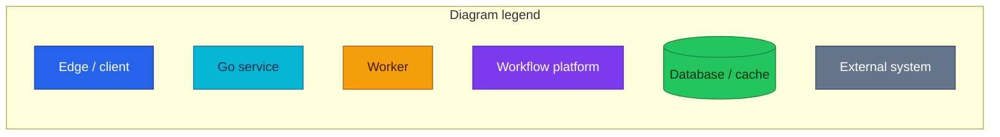
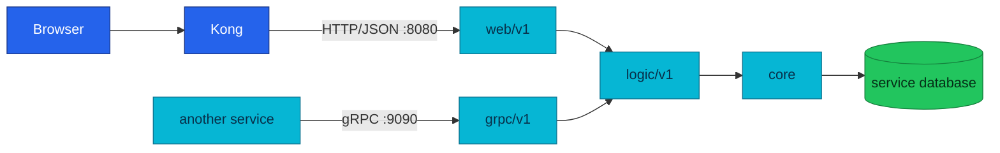
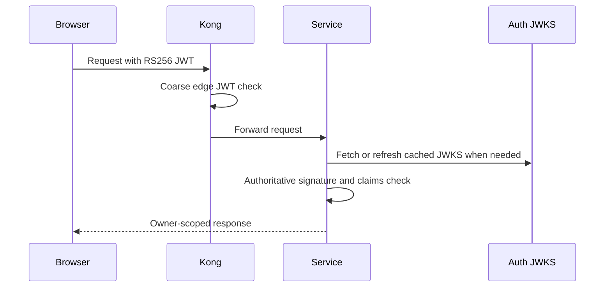
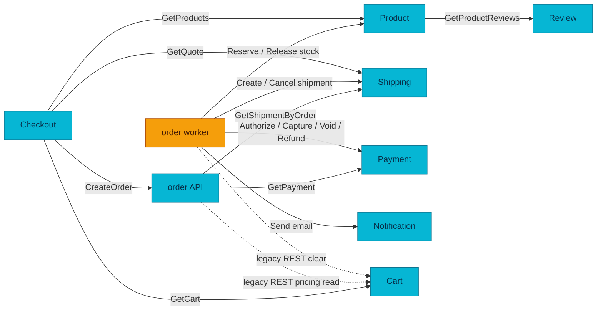
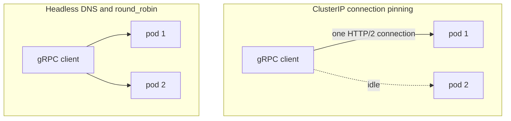

# API and Service Communication Guide

One place to learn how HTTP and gRPC contracts work across the duynhlab platform.

| Attribute | Value |
|-----------|-------|
| **Status** | Implemented; checkout P1-P5 runs in local-stack and the cluster |
| **Scope** | Shared HTTP conventions, gRPC conventions, and the current service call graph |
| **Public transport** | HTTP/JSON through Kong on `:8080` |
| **Internal transport** | gRPC on `:9090`; two documented cart REST exceptions remain |
| **Contract source** | HTTP routers in each service repo; protobufs in `duynhlab/pkg` |
| **Audience** | Readers learning the platform and engineers changing an API |

## Overview

There are two complementary contract layers:

| Layer | Used by | Format | Why |
|-------|---------|--------|-----|
| Edge API | Browser, provider webhooks, operational clients | HTTP/JSON | Easy to inspect, compatible with Kong and browsers |
| East-west API | One microservice calling another | gRPC/Protobuf | Typed contracts, deadlines, code generation, and efficient long-lived connections |

A service owns its data and its business rules. Calling another service does
not transfer that ownership. For example, checkout can ask shipping for a
quote, but only shipping defines the quote; checkout can ask order to create an
order, but only order writes the order.

## Architecture

### Platform API Topology





The topology names every deployed service and worker. Solid arrows are current
HTTP, gRPC, workflow, or data-store paths; dotted arrows are the two documented
cart REST exceptions. Exact RPC names are in
[Current East-West Call Graph](#current-east-west-call-graph), and each service
file explains its own callers and data authority.

### Inside Each Service

Every service follows the same dependency direction. HTTP and gRPC are
transport peers: both validate input and call the logic layer.



| Layer | Responsibility | Must not do |
|-------|----------------|-------------|
| `web/v1` | HTTP routing, JSON validation, auth middleware, status mapping | Own business rules or query another service's database |
| `grpc/v1` | Protobuf validation, gRPC status mapping, metadata handling | Duplicate logic already in `logic/v1` |
| `logic/v1` | Business rules, orchestration inside one service boundary | Depend on Gin or transport-specific types |
| `core` | Domain types, repositories, database and cache access | Reach upward into handlers |

## HTTP URL Model

The canonical v1 shape is:

```text
/{service}/v1/{audience}/{resource...}
```

Example:

```text
/product/v1/public/products/42
```

| Segment | Meaning | Example |
|---------|---------|---------|
| `service` | Deployable service and namespace | `product`, `order`, `payment` |
| `v1` | Contract major version | `v1` |
| `audience` | Who may call the route | `public`, `private`, `internal`, `protected` |
| `resource` | Plural collection noun, then identifiers or subresources | `orders/42/details` |

Kong passes the path through unchanged. A route mounted by a service must use
the same path that the browser sends; there is no gateway rewrite to hide a
different internal URL.

### Audience segments

| Audience | Authentication | Reachability | Typical use |
|----------|----------------|--------------|-------------|
| `public` | None, or a route-specific credential such as webhook HMAC | Kong may expose it | Login, catalog browsing, provider webhook |
| `private` | Valid RS256 access token | Kong and service | Signed-in user acting on owned data |
| `protected` | Valid token plus privileged policy | Kong and service | Administrative operations |
| `internal` | Service-specific internal rules | Cluster only | Reconciliation, trusted service operation |

`internal` must never be added to an ingress route. The real security fence is
NetworkPolicy, not merely the absence of a Kong path.

### Collection noun rule

Resources use plural nouns after the audience segment.

| Prefer | Avoid | Reason |
|--------|-------|--------|
| `/products` | `/product` | The path names a collection |
| `/orders/:id/details` | `/getOrderDetails` | HTTP method plus resource expresses the action |
| `/payments/:id/refunds` | `/refundPayment` | A refund is a subordinate resource |
| `/checkout/sessions/:id/confirm` | A forced generic noun | Confirm is an explicit process transition |

Auth and checkout are deliberate process-oriented exceptions. Do not copy
those exceptions into ordinary CRUD services.

### Hostnames

| Environment | Browser entry point | In-cluster service name |
|-------------|---------------------|-------------------------|
| Local-stack | `http://localhost:8080` | Docker Compose service name |
| Kubernetes | Kong hostname | `<service>.<namespace>.svc.cluster.local:8080` |
| Kubernetes gRPC | Not browser-accessible | `dns:///<service>-grpc.<namespace>.svc.cluster.local:9090` |

## Common HTTP Contracts

### Authentication

Private routes use the same layered model:



| Rule | Meaning |
|------|---------|
| Identity source | Read `user_id` from verified JWT claims, never from a private request body |
| Authoritative check | Each service verifies the token locally with `pkg/authmw` |
| Gateway check | Kong rejects obviously bad or expired private-route tokens first |
| Auth gRPC | Removed; services do not call auth `GetMe` |
| Failure mode | Missing, invalid, or unverifiable credentials fail closed |

### Error envelope

All service handlers use `pkg/httpx`:

```json
{
  "error": "Human-readable explanation",
  "code": "MACHINE_READABLE_CODE"
}
```

| Field | Intended reader | Stability |
|-------|-----------------|-----------|
| `error` | Human and logs | Wording may improve |
| `code` | Frontend and automated clients | Stable contract; renaming is breaking |

Common codes include:

| HTTP | Codes | Meaning |
|------|-------|---------|
| `400` | `VALIDATION_ERROR`, `IDEMPOTENCY_KEY_REQUIRED`, `PROMO_INVALID` | Request is malformed or misses a required condition |
| `401` | `UNAUTHORIZED` | Authentication failed |
| `403` | `FORBIDDEN` | Identity is known but not allowed |
| `404` | `NOT_FOUND` | Resource does not exist or is intentionally hidden by owner scoping |
| `409` | `CONFLICT`, `INVALID_TRANSITION`, `PRICE_CHANGED`, `STOCK_UNAVAILABLE`, `PROMO_EXPIRED`, `PROMO_EXHAUSTED` | Current state conflicts with the requested change |
| `410` | `SESSION_EXPIRED` | Checkout session existed but its TTL elapsed |
| `422` | `PAYMENT_DECLINED` | Request is valid but the provider declined it |
| `500` | `INTERNAL_ERROR` | Unexpected server failure without leaked internals |

A service may add domain-specific codes, but it must keep the same envelope.

### List pagination

List endpoints use `page` and `page_size`.

| Setting | Value |
|---------|-------|
| Default page | `1` |
| Default page size | `20` |
| Maximum page size | `100` |
| Invalid values | Fall back to defaults |
| Empty list | `"items": []`, never `null` |

```json
{
  "items": [],
  "page": 1,
  "page_size": 20,
  "total_items": 0,
  "total_pages": 0
}
```

### Data conventions

| Concern | Convention | Why |
|---------|------------|-----|
| JSON fields | `snake_case` | One predictable wire style |
| Timestamps | RFC 3339 strings in UTC | Portable and unambiguous |
| Money in service internals | `int64` minor units | Avoid floating-point accounting errors |
| Money in existing browser contracts | Follow the owning service file | Some v1 responses still expose decimal values |
| IDs | Positive numeric IDs unless a contract explicitly says otherwise | Matches current PostgreSQL keys |
| Empty collections | `[]` | Stable frontend rendering |
| State-changing retries | `Idempotency-Key` where duplicate effects matter | Survives double-clicks, timeouts, and retries |

### Idempotency

An idempotency key identifies one logical command, not one network attempt.

| Situation | Expected result |
|-----------|-----------------|
| Same key and same request | Replay the original result |
| Same key and different request | `409 IDEMPOTENCY_CONFLICT` |
| Same key still in flight | `409`, usually with a retry hint |
| Transient network failure | Retry with the same key |
| Business rejection before an effect | Contract decides whether the key remains reusable; document it in the service file |

Checkout, order, and payment have additional crash-recovery rules described in
their service documents.

## Service Contract Index

The shared rules live here. Route tables, payload examples, and service-specific
state transitions live in exactly one service file.

| Service | Owns | HTTP | gRPC role | Contract |
|---------|------|------|-----------|----------|
| Auth | Credentials, sessions, refresh tokens, JWKS | Public | None | [auth.md](./auth.md) |
| User | User profile data | Public, private, internal | None | [user.md](./user.md) |
| Product | Catalog, price, inventory | Public and internal | Server; Review client | [product.md](./product.md) |
| Cart | Active shopping cart | Private and internal | Server | [cart.md](./cart.md) |
| Order | Order record and fulfillment kickoff | Private | Server; multiple clients | [order.md](./order.md) |
| Review | Product reviews | Public and private | Server | [review.md](./review.md) |
| Notification | Notification records and delivery requests | Private and internal | Server | [notification.md](./notification.md) |
| Shipping | Quotes and shipment lifecycle | Public and internal | Server | [shipping.md](./shipping.md) |
| Checkout | Short-lived purchase session | Private | Client only | [checkout.md](./checkout.md) |
| Payment | Payment state, ledger, refunds | Public, private, internal | Server | [payments.md](./payments.md) |

[microservices.md](./microservices.md) is the high-level feature and ownership
map. It should not duplicate complete route or payload definitions.

## Choosing HTTP or gRPC

| Question | Use HTTP/JSON | Use gRPC |
|----------|---------------|----------|
| Can a browser or Kong reach it? | Yes | No |
| Is it an internal typed machine contract? | Sometimes for a documented legacy exception | Preferred |
| Is it a provider webhook? | Yes | No |
| Is easy manual inspection the main need? | Strong fit | Use reflection and `grpcurl` |
| Does it need generated clients and compile-time shape checks? | Weaker | Strong fit |

The rule is simple: browser traffic stays HTTP. New east-west calls use gRPC
unless an ADR documents a reason not to.

## Current East-West Call Graph



| Caller | Callee | Contract | Transport | Deployment |
|--------|--------|----------|-----------|------------|
| Product | Review | `GetProductReviews` | gRPC | Cluster and local-stack |
| Order API | Shipping | `GetShipmentByOrder` | gRPC | Cluster and local-stack |
| Order API | Payment | `GetPayment` | gRPC | Cluster and local-stack |
| Order worker | Product | `ReserveStock`, `ReleaseStock` | gRPC | Cluster and local-stack |
| Order worker | Shipping | `CreateShipment`, `CancelShipment` | gRPC | Cluster and local-stack |
| Order worker | Notification | `SendEmail` (`SendSMS` is served but has no live caller) | gRPC | Cluster and local-stack |
| Order worker | Payment | `Authorize`, `Capture`, `Void`, `Refund` | gRPC | Cluster and local-stack |
| Checkout | Cart | `GetCart` | gRPC | Cluster and local-stack |
| Checkout | Product | `GetProducts` | gRPC | Cluster and local-stack |
| Checkout | Shipping | `GetQuote` | gRPC | Cluster and local-stack |
| Checkout | Order | `CreateOrder` | gRPC | Cluster and local-stack |
| Order | Cart | Pricing read | REST exception | Current; planned removal after checkout migration |
| Order worker | Cart | Clear cart | REST exception | Current |

Auth has no gRPC server. The former `auth.GetMe` dependency was retired when
services moved to local JWT verification.

## gRPC Runtime Model

### Dual-port services

| Port | Name | Purpose | Exposure |
|------|------|---------|----------|
| `:8080` | `http` | HTTP API and probes | Kong or allowed internal callers |
| `:9090` | `grpc` | Internal Protobuf RPC | Allowed namespaces only |

A service starts its gRPC server whenever it implements one. There is no
`GRPC_ENABLED` feature flag and no REST fallback for migrated RPCs.

### Contract ownership

| Item | Location | Rule |
|------|----------|------|
| Proto source | `duynhlab/pkg/proto/<service>/v1/*.proto` | The callee owns the contract |
| Generated Go stubs | Committed beside the proto output in `duynhlab/pkg` | Service CI does not regenerate them |
| Package name | `<service>.v1` | Mirrors HTTP major version |
| Compatibility check | Buf lint and breaking checks | Breaking changes require a new version |

Keeping protos in the shared package avoids copying request structs across ten
repositories while retaining one release point for consumers.

### Kubernetes HTTP/2 load balancing

A normal ClusterIP balances TCP connections. gRPC multiplexes many RPCs over
one long-lived HTTP/2 connection, so a client may remain pinned to one pod.



The platform solution is:

1. A headless `<service>-grpc` Service exposes pod addresses.
2. Clients dial a `dns:///` target.
3. `pkg/grpcx` configures client-side `round_robin`.
4. The client opens subconnections and spreads RPCs across ready pods.

| Option | Decision | Reason |
|--------|----------|--------|
| Headless Service plus `round_robin` | Current | No extra infrastructure and works with existing Kubernetes |
| Service mesh | Deferred | No mesh is deployed; adding one only for gRPC balancing is disproportionate |
| Dedicated internal proxy | Rejected | Adds a hop and a component without a current need |

### Deadlines, retries, and health

| Mechanism | Current behavior | Reader takeaway |
|-----------|------------------|-----------------|
| Default deadline | Supplied by `pkg/grpcx` when a caller has none | Every RPC must eventually stop |
| Retry | Limited to safe transient gRPC statuses | Business failures are not retried blindly |
| Retry budget | Bounded attempts and backoff | A failing callee must not cause an unbounded retry storm |
| Keepalive | Shared client/server settings | Detect dead connections without excessive pings |
| Health | Standard gRPC health service | Kubernetes and operators can check readiness |
| Reflection | Enabled by default; `GRPC_REFLECTION=false` disables it | `grpcurl` can inspect allowed servers |

Application-level idempotency is still required. A transport retry cannot prove
whether the previous attempt committed before its response was lost.

## Observability

The middleware/interceptor order is tracing, then logging, then metrics.

| Signal | HTTP | gRPC |
|--------|------|------|
| Tracing | Gin middleware | `otelgrpc` client/server interceptors |
| Access logs | HTTP request logger | Server-side `grpcx` access interceptor |
| RED metrics | HTTP metrics | RPC client/server metrics |
| Export path | OTLP/HTTP to the collector | Same OTLP stream and service resource; no application scrape endpoint |
| Correlation | `trace_id` in logs | Trace context propagated through metadata |

Health and reflection RPCs are excluded from normal access telemetry to avoid
probe noise. gRPC failures use gRPC status codes; dashboards should group by
method, side, service, and code without labels that grow per user or resource.

## Security

| Control | Current state | Purpose |
|---------|---------------|---------|
| Kong edge JWT | Active on private HTTP routes | Coarse rejection before service work |
| Service JWT verification | Active | Authoritative identity and claims check |
| NetworkPolicy on `:9090` | Active for deployed service edges | Restrict which namespaces may call each gRPC server |
| TLS for external traffic | Environment-dependent at Kong | Protect north-south traffic |
| gRPC mTLS | Planned, not deployed | Authenticate and encrypt east-west connections |

Current gRPC clients use insecure transport credentials inside the cluster, so
NetworkPolicy is a required control, not an optional hardening item. Do not
describe mTLS as current until certificates and `grpcx` TLS configuration are
deployed.

## Aggregation Rules

An aggregation endpoint enriches one service's owned record with data from
other services, such as product details plus reviews or order details plus
shipping and payment.

| Rule | Why |
|------|-----|
| Look up and authorize the owned record first | Prevent cross-user data leaks |
| Use bounded downstream deadlines | One dependency must not hang the request |
| Mark optional enrichments soft-fail | The owned record can still be useful |
| Keep writes in the owning service | Aggregation is not shared database access |
| Trace every downstream call | Operators need to identify the slow or failing dependency |

The per-service document states which enrichments are optional. A soft failure
must omit or clearly empty the enrichment; it must not fabricate data.

## Versioning and Compatibility

| Change | v1-safe? | Action |
|--------|----------|--------|
| Add an optional response field | Usually | Add and document it |
| Add a new endpoint or RPC | Usually | Add tests and update the owning service doc |
| Add a new stable error code | Usually | Document client behavior |
| Rename or remove a field | No | Introduce a new contract version or migration |
| Change field meaning or units | No | Introduce a new contract version |
| Remove a route alias | Only after usage is zero | Observe, announce, then remove |

Deprecated HTTP aliases remain mounted during their migration window. New code
must use the canonical collection-noun route.

## Changing an API

Use this sequence for a new or modified contract:

| Step | Check |
|------|-------|
| 1. Identify owner | Which service owns the data and business rule? |
| 2. Choose audience | Browser/public, signed-in/private, privileged/protected, or cluster/internal? |
| 3. Choose transport | HTTP for browser/provider; normally gRPC for east-west |
| 4. Define contract | Inputs, outputs, units, errors, idempotency, and timeout |
| 5. Implement at transport layer | Handler validates and delegates to logic |
| 6. Protect it | Auth middleware and NetworkPolicy where applicable |
| 7. Instrument it | Trace, access log, RED metrics, and health behavior |
| 8. Test it | Success, validation, authorization, ownership, retry, and failure paths |
| 9. Document once | Shared rule here; service-specific contract in its service file |
| 10. Validate consumers | Frontend, caller service, Kong, local-stack, and GitOps references |

A substantial or contested change should start as an RFC. A decision already
made should be recorded as an ADR.

## Migration Lessons

The gRPC migration is complete for migrated hops, but its lessons remain useful.

| Lesson | What happened | Reusable rule |
|--------|---------------|---------------|
| Pilot one path first | Order to shipping proved codegen, tracing, and deployment | Validate the toolchain before broad migration |
| Avoid permanent dual paths | Temporary HTTP/gRPC migration paths increase testing surface | Remove fallback after cutover and rollback by reverting |
| Account for HTTP/2 | A naive ClusterIP can pin traffic to one pod | Design load balancing before scaling replicas |
| Preserve debuggability | Binary payloads are harder to inspect | Enable reflection and document `grpcurl` |
| Keep edge and internal concerns separate | Browsers still need HTTP/JSON | Do not replace edge APIs merely because gRPC exists |
| Revisit old assumptions | Auth gRPC became unnecessary after local JWKS verification | Remove a dependency when architecture makes it obsolete |

## Operations

| Task | Command or signal |
|------|-------------------|
| Inspect HTTP | `curl` through Kong or an allowed in-cluster address |
| Inspect gRPC services | `grpcurl <target> list` using server reflection |
| Check service health | HTTP `/health`, `/ready`, or gRPC health |
| Trace a request | Search Tempo/Jaeger by `trace_id` |
| Find downstream failures | Check RPC RED metrics and VictoriaLogs access entries |
| Validate manifests | `make validate` |
| Validate a service repo | `GOTOOLCHAIN=auto go build ./... && go test ./...` |

## References

- [API documentation index](./README.md)
- [Microservice map](./microservices.md)
- [Temporal order fulfillment](./temporal-order-fulfillment.md)
- [Kong gateway](../platform/kong-gateway.md)
- [Application metrics](../observability/metrics/metrics-apps.md)
- [ADR-017: collection-noun API migration](../proposals/adr/ADR-017-api-path-collection-noun/)
- [RFC-0009: authentication hardening](../proposals/rfc/RFC-0009/)
- [RFC-0014: observability standardization](../proposals/rfc/RFC-0014/)

_Last updated: 2026-07-14_
