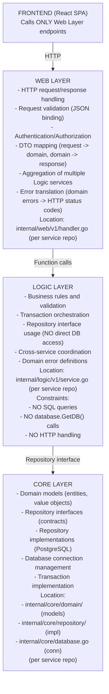

# API Reference

Per-endpoint request/response shapes and validation rules for the 9 Go
services. Routes live in the [naming convention](api-naming-convention.md);
the system catalog lives in [microservices.md](microservices.md); this file is
the payload contract.

| | |
|---|---|
| **Status** | Living reference — payloads & validation only |
| **URL shape** | Variant A — `/{service}/v1/{audience}/{resource…}` ([naming convention](api-naming-convention.md)) |
| **Architecture** | 3-Layer (Web / Logic / Core) |
| **Area hub** | [docs/api/README.md](README.md) |

> Services mount Variant A paths **directly** on their HTTP routers. Browser traffic hits them at `https://gateway.duynh.me/…`; service-to-service traffic hits them at `http://{svc}.{ns}.svc.cluster.local:8080/…`. There is no separate "cluster" path any more — the path is the path.

---

## Route Inventory

The complete, authoritative list of every HTTP path in the platform (browser-facing and internal) lives in [`api-naming-convention.md`](api-naming-convention.md) — the sole URL surface. This document covers per-endpoint request/response shapes and validation rules only; it does not duplicate the route inventory.

---

## API conventions

### Error envelope

Every error response carries a human-readable `error` string **and** a stable,
machine-readable `code` (added with the shared `pkg/httpx` helper):

```json
{ "error": "Product not found", "code": "NOT_FOUND" }
```

The `error` string may be reworded or localized; **`code` is the contract** clients
should branch on. Codes: `VALIDATION_ERROR`, `NOT_FOUND`, `UNAUTHORIZED`,
`FORBIDDEN`, `CONFLICT`, `INTERNAL_ERROR`. The per-endpoint tables below show the
`error` message; `code` is added uniformly via `httpx.RespondError`.

### List pagination

Collection endpoints return a pagination envelope, not a bare array:

```json
{ "items": [ ... ], "page": 1, "page_size": 20, "total_items": 42, "total_pages": 3 }
```

Query params: `page` (default 1) and `page_size` (default 20, max 100); invalid or
out-of-range values fall back to the defaults. Paginated lists: products, reviews,
orders, notifications. (Note: `product` still accepts the legacy `limit` query param
for page size; the other three use `page_size` — to be unified.)

### Observability

Every request is measured with the **RED method** from a single
`http_server_request_duration_seconds` histogram, and east-west gRPC calls emit
matching RED (`rpc_*`) metrics, all pushed over OTLP. How requests are instrumented, labelled,
and turned into SLOs is documented in
[observability → application metrics](../observability/metrics/metrics-apps.md).

---

## 3-Layer Architecture Responsibility

All backend services follow a strict 3-layer architecture. Understanding these layers is essential for both frontend and backend engineers.



### Key Rules

| Rule | Applies To | Description |
|------|------------|-------------|
| **Frontend calls Web only** | **Frontend** | **CRITICAL: Never call Logic or Core directly. Only HTTP requests to `/{service}/v1/{audience}/…` endpoints.** |
| Web aggregates | Web Layer | Combine multiple Logic calls in Web handlers |
| Logic uses repositories | Logic Layer | Access data via repository interfaces only |
| Core owns SQL | Core Layer | All database queries live in repository implementations |
| Dependency injection | All | Services receive dependencies via constructors |

**⚠️ Frontend Developers & AI Agents:**

**DO:**
- Make HTTP requests to Web Layer endpoints (`GET /product/v1/public/products`, `POST /cart/v1/private/cart`, etc.)
- Use aggregation endpoints for complex operations (e.g., `GET /product/v1/public/products/:id/details`)
- Let Web Layer handle validation, authentication, and error translation

**DO NOT:**
- ❌ Attempt to call Logic Layer functions directly (no function imports from `logic/` packages)
- ❌ Attempt to access Core Layer or database directly (no SQL queries, no repository calls)
- ❌ Implement client-side orchestration (make multiple API calls and combine results)
- ❌ Bypass Web Layer in any way

**For AI Agents:** See [`AGENTS.md`](../../AGENTS.md#frontend-integration-rules) for explicit Frontend integration rules and restrictions.

### Service Isolation

**Each service is completely independent:**

```
{service}-service/            # example: auth-service/, cart-service/, ...
├── go.mod                    # Independent module
├── cmd/main.go              # Entry point
├── internal/
│   ├── web/v1/handler.go    # HTTP handlers
│   ├── logic/v1/service.go  # Business logic
│   └── core/
│       ├── domain/          # Domain models
│       └── repository/      # DB access
├── middleware/
└── config/
```

**Key Changes:**
- ✅ **Polyrepo**: each service is its own GitHub repository (see `SERVICES.md`)
- ✅ **Independent module**: each service has its own `go.mod`
- ✅ **Shared library repo**: cross-cutting libs live in `duynhlab/pkg` (imported as `github.com/duynhlab/pkg/...`)

**Rationale:** Keep cross-service coupling minimal so each service stays portable and independently deployable.

---

## Aggregation APIs

These endpoints combine multiple data sources to provide complete responses. **Frontend MUST use these endpoints. No client-side orchestration allowed.**

### Aggregation failure modes & conventions

When an aggregation calls multiple sources, the failure handling is **explicit and
consistent** across all services:

- **Soft-fail (optional enrichment)** — a missing/unavailable secondary source returns
  partial data, never an error. Examples: product→review soft-fails reviews to `[]`;
  order→shipment soft-fails the shipment field to `null`. The primary entity stays available.
- **Best-effort (post-pivot side effects)** — user-visible side effects after the critical
  path (notifications, cart-clear in the order saga) are fire-and-forget/logged; their
  failure never rolls back an already-committed result.
- **Hard-fail (critical path)** — anything the response is *meaningless* without (the
  primary entity, or a pre-pivot saga step) returns an error / triggers compensation.

Rule of thumb: **enrichment soft-fails, side effects are best-effort, the critical path
hard-fails.** See [RFC-0001](../proposals/rfc/RFC-0001/) for the order saga's pivot semantics.

---

### GET /product/v1/public/products/:id/details

**Purpose:** Aggregated product details for Product Detail Page

> **Frontend MUST call this endpoint. No orchestration in FE.**

**Aggregates:**
- Product details (ProductService.GetProduct)
- Related products (ProductService.GetRelatedProducts)
- Stock information (real `stock_quantity` from the products table)
- Reviews (aggregated from the review service over **gRPC**; soft-fails to an empty array `[]` if the review service is unavailable)

**Logic Services Involved:**
- `ProductService.GetProduct(ctx, id)`
- `ProductService.GetRelatedProducts(ctx, id, limit)`

**Configuration:**
- Product service dials the review service over gRPC using the `REVIEW_GRPC_ADDR` environment variable. The call soft-fails to `[]` on error so product details stay available. See [`grpc-internal-comms.md`](grpc-internal-comms.md) for transport details.

#### Request

```
GET /product/v1/public/products/:id/details
```

**Headers:**
```
Content-Type: application/json
```

**Path Parameters:**
| Parameter | Type | Required | Description |
|-----------|------|----------|-------------|
| `id` | string | Yes | Product ID |

#### Response

**200 OK**
```json
{
  "product": {
    "id": "1",
    "name": "Wireless Mouse",
    "description": "Ergonomic wireless mouse with long battery life",
    "price": 29.99,
    "category": "Electronics"
  },
  "stock": {
    "available": true,
    "quantity": 50
  },
  "reviews": [],
  "reviews_summary": {
    "total": 0,
    "average_rating": 0.0
  },
  "related_products": [
    {
      "id": "2",
      "name": "Wireless Keyboard",
      "price": 49.99
    },
    {
      "id": "3",
      "name": "USB Hub",
      "price": 19.99
    }
  ]
}
```

**Error Responses:**

| Status | Body | Condition |
|--------|------|-----------|
| 404 | `{"error": "Product not found"}` | Product ID does not exist |
| 500 | `{"error": "Internal server error"}` | Server error |

---

### DELETE /cart/v1/private/cart/items/:itemId

**Purpose:** Remove a single item from the cart

> **Frontend MUST call this endpoint. No orchestration in FE.**

**Logic Services Involved:**
- `CartService.RemoveItem(ctx, userID, itemID)`
- `CartService.GetCart(ctx, userID)` (for updated totals)

#### Request

```
DELETE /cart/v1/private/cart/items/:itemId
```

**Headers:**
```
Content-Type: application/json
Authorization: Bearer <jwt_token>
```

**Path Parameters:**
| Parameter | Type | Required | Description |
|-----------|------|----------|-------------|
| `itemId` | string | Yes | Cart item ID |

#### Response

**200 OK**
```json
{
  "success": true,
  "cart_total": 49.98,
  "cart_count": 2
}
```

**Error Responses:**

| Status | Body | Condition |
|--------|------|-----------|
| 404 | `{"error": "Cart item not found"}` | Item ID does not exist |
| 500 | `{"error": "Internal server error"}` | Server error |

---

### PATCH /cart/v1/private/cart/items/:itemId

**Purpose:** Update the quantity of a cart item

> **Frontend MUST call this endpoint. No orchestration in FE.**

**Logic Services Involved:**
- `CartService.UpdateItemQuantity(ctx, userID, itemID, quantity)`
- `CartService.GetCart(ctx, userID)` (for updated totals)

#### Request

```
PATCH /cart/v1/private/cart/items/:itemId
```

**Headers:**
```
Content-Type: application/json
Authorization: Bearer <jwt_token>
```

**Path Parameters:**
| Parameter | Type | Required | Description |
|-----------|------|----------|-------------|
| `itemId` | string | Yes | Cart item ID |

**Request Body:**
```json
{
  "quantity": 3
}
```

| Field | Type | Required | Validation |
|-------|------|----------|------------|
| `quantity` | integer | Yes | min=1 (must be positive) |

#### Response

**200 OK**
```json
{
  "success": true,
  "cart_total": 89.97,
  "cart_count": 5
}
```

**Validation Rules:**
- `quantity` must be >= 1 (positive integer)

**Error Responses:**

| Status | Body | Condition |
|--------|------|-----------|
| 400 | `{"error": "<validation_error>"}` | Invalid request body |
| 400 | `{"error": "Invalid quantity"}` | Quantity validation failed |
| 404 | `{"error": "Cart item not found"}` | Item ID does not exist |
| 500 | `{"error": "Internal server error"}` | Server error |

---

### GET /cart/v1/private/cart/count

**Purpose:** Lightweight endpoint for cart badge count

> **Frontend MUST call this endpoint. No orchestration in FE.**

**Logic Services Involved:**
- `CartService.GetCartCount(ctx, userID)`

#### Request

```
GET /cart/v1/private/cart/count
```

**Headers:**
```
Content-Type: application/json
Authorization: Bearer <jwt_token>
```

#### Response

**200 OK**
```json
{
  "count": 3
}
```

**Error Responses:**

| Status | Body | Condition |
|--------|------|-----------|
| 500 | `{"error": "Internal server error"}` | Server error |

---

## Services

The per-service roster (namespaces, audiences, every route) lives in the
[route inventory](api-naming-convention.md#complete-route-inventory) — the
sole URL surface. Same path, two hosts: browsers hit
`https://gateway.duynh.me/…`; services hit each other at
`http://{svc}.{ns}.svc.cluster.local:8080/…`. Internal audiences are never
published to the gateway.

---

## Product Service

### GET /product/v1/public/products

List all products with optional filtering.

#### Request

```
GET /product/v1/public/products?category=Electronics&search=mouse&sort=price&order=asc
```

**Query Parameters:**
| Parameter | Type | Required | Description |
|-----------|------|----------|-------------|
| `category` | string | No | Filter by category |
| `search` | string | No | Search by product name (ILIKE) |
| `sort` | string | No | Sort field (`price`, `created_at`, `name`) |
| `order` | string | No | Sort order (`asc`, `desc`) |

#### Response

**200 OK**
```json
[
  {
    "id": "1",
    "name": "Wireless Mouse",
    "description": "Ergonomic wireless mouse",
    "price": 29.99,
    "category": "Electronics"
  },
  {
    "id": "2",
    "name": "USB Keyboard",
    "description": "Mechanical keyboard",
    "price": 79.99,
    "category": "Electronics"
  }
]
```

**Error Responses:**

| Status | Body | Condition |
|--------|------|-----------|
| 500 | `{"error": "Internal server error"}` | Server error |

---

### GET /product/v1/public/products/:id

Get a single product by ID.

#### Request

```
GET /product/v1/public/products/123
```

#### Response

**200 OK**
```json
{
  "id": "123",
  "name": "Wireless Mouse",
  "description": "Ergonomic wireless mouse with long battery life",
  "price": 29.99,
  "category": "Electronics"
}
```

**Error Responses:**

| Status | Body | Condition |
|--------|------|-----------|
| 404 | `{"error": "Product not found"}` | Product ID does not exist |
| 500 | `{"error": "Internal server error"}` | Server error |

---

### POST /product/v1/internal/products

Create a new product. **Internal only** — not routed through Kong; called via `http://product.product.svc.cluster.local:8080`.

#### Request

```
POST /product/v1/internal/products
Content-Type: application/json

{
  "name": "New Product",
  "description": "Product description",
  "price": 49.99,
  "category": "Electronics"
}
```

#### Response

**201 Created**
```json
{
  "id": "456",
  "name": "New Product",
  "description": "Product description",
  "price": 49.99,
  "category": "Electronics"
}
```

**Validation Rules:**
- `price` must be >= 0 (non-negative)

**Error Responses:**

| Status | Body | Condition |
|--------|------|-----------|
| 400 | `{"error": "<validation_error>"}` | Invalid request body |
| 400 | `{"error": "Invalid price"}` | Price < 0 |
| 500 | `{"error": "Internal server error"}` | Server error |

---

## Cart Service

### GET /cart/v1/private/cart

Get the current user's cart.

#### Request

```
GET /cart/v1/private/cart
Authorization: Bearer <jwt_token>
```

#### Response

**200 OK**
```json
{
  "id": "1",
  "user_id": "1",
  "items": [
    {
      "id": "item1",
      "product_id": "prod123",
      "product_name": "Wireless Mouse",
      "product_price": 29.99,
      "quantity": 2,
      "subtotal": 59.98
    }
  ],
  "subtotal": 59.98,
  "shipping": 5.00,
  "total": 64.98,
  "item_count": 2
}
```

---

### POST /cart/v1/private/cart

Add an item to the cart.

#### Request

```
POST /cart/v1/private/cart
Content-Type: application/json
Authorization: Bearer <jwt_token>

{
  "product_id": "prod123",
  "product_name": "Wireless Mouse",
  "product_price": 29.99,
  "quantity": 2
}
```

| Field | Type | Required | Description |
|-------|------|----------|-------------|
| `product_id` | string | Yes | Product ID to add |
| `product_name` | string | Yes | Product name (stored for display) |
| `product_price` | number | Yes | Product price at time of adding |
| `quantity` | integer | Yes | Quantity to add (min=1) |

#### Response

**200 OK**
```json
{
  "message": "Item added to cart"
}
```

**Validation Rules:**
- `quantity` must be > 0 (positive integer)
- `product_price` must be >= 0

**Error Responses:**

| Status | Body | Condition |
|--------|------|-----------|
| 400 | `{"error": "<validation_error>"}` | Missing required fields |
| 400 | `{"error": "Invalid quantity"}` | Quantity <= 0 |
| 500 | `{"error": "Internal server error"}` | Server error |

---

## Checkout Service (RFC-0015 P1)

Session orchestrator between the SPA and order — Variant A collection-noun
paths (`sessions`, ADR-017), all **private** (Kong edge-JWT + in-service
authmw), owner-scoped by the JWT `user_id`. P1 ships the session lifecycle;
shipping/payment/promo/confirm land in P2–P4. Full route inventory:
[api-naming-convention.md](./api-naming-convention.md).

| Method | Path | Notes |
|--------|------|-------|
| `POST` | `/checkout/v1/private/sessions` | Snapshot cart → session `open`; **201** created / **200** existing active session (idempotent); `409 CONFLICT` empty cart. Returns the session object directly (no wrapper); items carry `unit_price` (product-authoritative, dollars), `cart_price` (dollars), `price_changed`. Money is minor units internally, dollars on the wire — same as order/cart. |
| `GET` | `/checkout/v1/private/sessions/:id` | Session + items + totals. `404` unknown/foreign (anti-IDOR); `410 SESSION_EXPIRED` past TTL (lazy check). |
| `PUT` | `/checkout/v1/private/sessions/:id/address` | Body `{full_name, line1, line2?, city, region?, post_code?, country}` → `address_set`; `409 INVALID_TRANSITION` from terminal states. |
| `DELETE` | `/checkout/v1/private/sessions/:id` | Cancel (idempotent on cancelled). |

Money: int64 minor units. Session TTL 30 min, reset semantics + durable timer
arrive with P2 (`AbandonedCheckoutWorkflow`).

## Order Service

### GET /order/v1/private/orders

List all orders for the current user.

#### Request

```
GET /order/v1/private/orders
Authorization: Bearer <jwt_token>
```

#### Response

**200 OK**
```json
[
  {
    "id": "ord123",
    "user_id": "1",
    "status": "pending",
    "subtotal": 59.98,
    "shipping": 5.00,
    "total": 64.98,
    "created_at": "2026-01-07T08:00:00Z"
  }
]
```

---

### GET /order/v1/private/orders/:id

Get a specific order by ID.

#### Request

```
GET /order/v1/private/orders/ord123
Authorization: Bearer <jwt_token>
```

#### Response

**200 OK**
```json
{
  "id": "ord123",
  "user_id": "1",
  "status": "pending",
  "items": [
    {
      "product_id": "prod123",
      "product_name": "Wireless Mouse",
      "quantity": 2,
      "price": 29.99,
      "subtotal": 59.98
    }
  ],
  "subtotal": 59.98,
  "shipping": 5.00,
  "total": 64.98,
  "created_at": "2026-01-07T08:00:00Z"
}
```

**Error Responses:**

| Status | Body | Condition |
|--------|------|-----------|
| 404 | Order not found | Order ID does not exist |
| 500 | `{"error": "Internal server error"}` | Server error |

---

### GET /order/v1/private/orders/:id/details

**Aggregation Endpoint** - Get order with shipment and payment information.

This endpoint combines order data with shipment tracking (Shipping service) and the payment snapshot (Payment service, over gRPC). Used by frontend for strict 3-layer compliance (single endpoint per view).

#### Request

```
GET /order/v1/private/orders/123/details
Authorization: Bearer <jwt_token>
```

#### Response

**200 OK**
```json
{
  "order": {
    "id": "123",
    "user_id": "1",
    "status": "shipped",
    "items": [...],
    "subtotal": 59.98,
    "shipping": 5.00,
    "total": 64.98,
    "created_at": "2026-01-07T08:00:00Z"
  },
  "shipment": {
    "id": 1,
    "order_id": 123,
    "tracking_number": "1Z999AA10123456784",
    "carrier": "UPS",
    "status": "in_transit",
    "estimated_delivery": "2026-01-10T18:00:00Z",
    "created_at": "2026-01-07T12:00:00Z",
    "updated_at": "2026-01-08T09:30:00Z"
  },
  "payment": {
    "status": "captured",
    "amount": 64.98,
    "currency": "USD",
    "refunded": 0
  }
}
```

**Note:** `shipment` and `payment` may each be `null` — `shipment` if none exists
yet; `payment` if the payment feature is off, the order has no payment, or the
payment service is briefly unreachable (the enrichment soft-fails so order
details stay available). When present, `payment.status` is
`authorized`/`captured`/`failed`/`voided`/`refunded`/`partially_refunded`
(the last is derived when a refund is partial); `decline_code` appears only on
`failed`, `refunded` only when a refund has been applied. See
[payments.md](./payments.md#the-checkout-read-path-rfc-0010-p6).

**Error Responses:**

| Status | Body | Condition |
|--------|------|-----------|
| 404 | Order not found | Order ID does not exist |
| 500 | `{"error": "Internal server error"}` | Server error |

---

### POST /order/v1/private/orders

Create a new order.

> **Note:** `user_id` is extracted from the `Authorization: Bearer <token>` header by the Web Layer (auth middleware). Do not send `user_id` in the request body.

#### Request

```
POST /order/v1/private/orders
Content-Type: application/json
Authorization: Bearer <jwt_token>
Idempotency-Key: <client-generated key>   # optional

{
  "items": [
    {
      "product_id": "prod1",
      "product_name": "Wireless Mouse",
      "quantity": 2,
      "price": 29.99
    }
  ],
  "payment_method": "tok_visa"
}
```

| Field | Type | Required | Description |
|-------|------|----------|-------------|
| `items` | array | Yes | Order line items |
| `items[].product_id` | string | Yes | Product ID |
| `items[].product_name` | string | Yes | Product name (denormalized for order record) |
| `items[].quantity` | integer | Yes | Quantity (min=1) |
| `items[].price` | number | Yes | Unit price at time of order |
| `payment_method` | string | No | Opaque test token (`tok_…`) the saga charges. Validated for shape and rejected with **400** if PAN-like *before* the order is persisted; empty → a demo token. Never card data. See [payments.md](./payments.md#the-checkout-read-path-rfc-0010-p6). |

An optional **`Idempotency-Key` header** makes the create replay-safe: a retry
with the same key returns the previously created order (`201`, same body)
without reading the cart or starting a second saga.

#### Response

**201 Created**
```json
{
  "id": "ord456",
  "user_id": "user123",
  "status": "pending",
  "subtotal": 59.98,
  "shipping": 5.00,
  "total": 64.98, 
  "created_at": "2026-01-07T08:00:00Z"
}
```

**Validation Rules:**
- `subtotal` must be >= 0
- `shipping` defaults to $5.00 (fixed cost)
- `total` must equal `subtotal + shipping`
- Item `subtotal` must equal `quantity × price`

**Error Responses:**

| Status | Body | Condition |
|--------|------|-----------|
| 400 | `{"error": "Invalid order"}` | Items array empty or validation failed |
| 401 | `{"error": "Authentication required"}` | No valid user in auth context |
| 500 | `{"error": "Internal server error"}` | Server error |

---

## Auth Service

### POST /auth/v1/public/auth/login

#### Request

```
POST /auth/v1/public/auth/login
Content-Type: application/json

{
  "username": "user1",
  "password": "pass123"
}
```

#### Response

**200 OK**
```json
{
  "access_token": "eyJhbG...",
  "refresh_token": "8f3k...",
  "expires_in": 3600,
  "user": {
    "id": "1",
    "username": "user1",
    "email": "user1@example.com"
  }
}
```

The `access_token` is an RS256 JWT (1 h TTL) — the only credential since
RFC-0009 Phase 5; the opaque `token` field is gone. `refresh_token` is an
opaque rotating token for `POST /auth/v1/public/auth/refresh`.

---

### POST /auth/v1/public/auth/register

#### Request

```
POST /auth/v1/public/auth/register
Content-Type: application/json

{
  "username": "newuser",
  "email": "new@example.com",
  "password": "pass123"
}
```

#### Response

**201 Created** — same envelope as login (the user is signed in immediately):
```json
{
  "access_token": "eyJhbG...",
  "refresh_token": "8f3k...",
  "expires_in": 3600,
  "user": {
    "id": "123",
    "username": "newuser",
    "email": "new@example.com"
  }
}
```

---

### POST /auth/v1/public/auth/refresh

Rotates the presented refresh token and mints a fresh access token. Each
refresh token is **single-use**: the response carries its successor. Replaying
an already-used token is treated as theft — the whole token family is revoked
and every session on it must log in again.

#### Request

```
POST /auth/v1/public/auth/refresh
Content-Type: application/json

{
  "refresh_token": "<refresh_token>"
}
```

| Field | Type | Required | Description |
|-------|------|----------|-------------|
| `refresh_token` | string | Yes | The current (unused) refresh token |

#### Response

**200 OK** — same envelope as login; `refresh_token` is the **new** rotated token:
```json
{
  "access_token": "eyJhbG...",
  "refresh_token": "9q2m...",
  "expires_in": 3600,
  "user": {
    "id": "1",
    "username": "user1",
    "email": "user1@example.com"
  }
}
```

**Error Responses:**

| Status | Body | Condition |
|--------|------|-----------|
| 400 | `{"error": "Invalid request body"}` | Missing/malformed JSON or `refresh_token` |
| 401 | `{"error": "Invalid refresh token"}` | Unknown/expired token, or reuse of a rotated token (family revoked) |
| 500 | `{"error": "Internal server error"}` | Server error |

---

### GET /auth/v1/public/auth/jwks

Publishes the RSA public key set every service's JWT middleware (and Kong's
edge check) verifies against. Responses carry `Cache-Control: public,
max-age=300` — verifiers cache the key set for 5 minutes.

#### Response

**200 OK**
```json
{
  "keys": [
    {
      "kty": "RSA",
      "use": "sig",
      "alg": "RS256",
      "kid": "<base64url key id>",
      "n": "<base64url modulus>",
      "e": "<base64url exponent>"
    }
  ]
}
```

Exactly one key today; the `kid` matches the JWT header so verifiers can pick
the right key across future rotations.

---

### POST /auth/v1/public/auth/logout

Revokes the presented refresh token's **whole family** server-side, ending the
session (the outstanding access token simply expires — JWTs are stateless).
Public like `refresh`: it authenticates by the refresh token in the body, so a
client with an expired access token can still revoke. Idempotent — returns
`200 OK` even for an unknown/already-revoked token so clients can safely clear
local state.

#### Request

```
POST /auth/v1/public/auth/logout
Content-Type: application/json

{
  "refresh_token": "<refresh_token>"
}
```

#### Response

**200 OK**
```json
{
  "message": "logged out"
}
```

**Error Responses:**

| Status | Body | Condition |
|--------|------|-----------|
| 401 | `{"error": "Invalid authorization format"}` | Missing or malformed `Authorization` header |
| 500 | `{"error": "Internal server error"}` | Token revocation failed |

---

## User Service

Routes: see [`api-naming-convention.md`](api-naming-convention.md). No additional per-endpoint payload detail beyond the standard profile shape.

---

## Review Service

#### GET /review/v1/public/reviews

**Query Parameters:**

| Parameter | Type | Required | Description |
|-----------|------|----------|-------------|
| `product_id` | string | **Yes** | Product ID to get reviews for |

**Response (200 OK):**
```json
[
  {
    "id": "1",
    "product_id": "5",
    "user_id": "1",
    "rating": 5,
    "title": "Great product!",
    "comment": "Highly recommend this product.",
    "created_at": "2026-01-23T10:30:00Z"
  }
]
```

**Error (400 Bad Request):** Missing `product_id`
```json
{
  "error": "product_id query parameter is required"
}
```

#### POST /review/v1/private/reviews

> **Note:** `user_id` is derived from the JWT subject by the Web Layer (auth middleware). Do not send `user_id` in the request body.

**Request Body:**
```json
{
  "product_id": "5",
  "rating": 5,
  "title": "Great product!",
  "comment": "Highly recommend this product."
}
```

| Field | Type | Required | Description |
|-------|------|----------|-------------|
| `product_id` | string | Yes | Product ID |
| `rating` | int | Yes | Rating 1-5 |
| `title` | string | No | Review title |
| `comment` | string | Yes | Review comment |

**Response (201 Created):**
```json
{
  "id": "10",
  "product_id": "5",
  "user_id": "1",
  "rating": 5,
  "title": "Great product!",
  "comment": "Highly recommend this product.",
  "created_at": "2026-01-23T10:30:00Z"
}
```

**Error (409 Conflict):** User already reviewed this product
```json
{
  "error": "Review already exists"
}
```

---

## Notification Service

#### Notification Response Shape

```json
{
  "id": "1",
  "type": "order_shipped",
  "title": "Order Shipped",
  "message": "Your order #123 has been shipped",
  "status": "sent",
  "read": false,
  "created_at": "2026-01-25T10:30:00Z"
}
```

| Field | Type | Description |
|-------|------|-------------|
| `id` | string | Notification ID |
| `type` | string | Notification type (order_shipped, email, sms, etc.) |
| `title` | string | Notification title (may be same as message) |
| `message` | string | Notification message content |
| `status` | string | Delivery status (sent, pending, etc.) |
| `read` | boolean | Whether notification has been read |
| `created_at` | string | ISO 8601 timestamp when notification was created |

#### PATCH /notification/v1/private/notifications/read-all

Marks every unread notification for the authenticated user as read in one
request (the SPA's "Mark all as read"). `user_id` is derived from the JWT; the
update is owner-scoped and idempotent.

**200 OK**
```json
{ "updated": 6 }
```

`updated` is the number of notifications flipped to read — `0` when there were
none unread (still a success, not a 404).

---

## Shipping Service

#### Track Shipment

```
GET /shipping/v1/public/shipments/track?tracking_number=TRACK123
```

#### Estimate Shipping

```
GET /shipping/v1/public/shipments/estimate?origin=NYC&destination=LA&weight=2.5
```

#### Get Shipment by Order ID

```
GET /shipping/v1/internal/shipments/orders/123
```

Returns shipment info for a specific order (used by order aggregation endpoint).

---

## Payment Service

The payment subsystem's design record and operational surface (reconciliation,
webhooks, the saga's gRPC money steps) live in [payments.md](payments.md) and
[RFC-0010](../proposals/rfc/RFC-0010/); this section covers the browser-facing
payload contracts only. Amounts are integers in **minor units**
(`amount_minor`, e.g. cents).

### POST /payment/v1/private/payments

Idempotent authorize (and optionally capture) of a payment intent. The
**`Idempotency-Key` header is required** — a replay with the same key returns
the stored outcome verbatim. `user_id` comes from the JWT, never the body.

#### Request

```
POST /payment/v1/private/payments
Content-Type: application/json
Authorization: Bearer <jwt_token>
Idempotency-Key: <client-generated key>   # required

{
  "order_id": 123,
  "amount_minor": 6498,
  "currency": "USD",
  "capture_method": "manual",
  "payment_method": "tok_visa"
}
```

| Field | Type | Required | Description |
|-------|------|----------|-------------|
| `order_id` | integer | No | Order to attach the payment to |
| `amount_minor` | integer | Yes | Positive, bounded (minor units) |
| `currency` | string | No | 3-letter uppercase code; default `USD` |
| `capture_method` | string | No | `manual` (default) or `automatic` |
| `payment_method` | string | Yes | Opaque `tok_…` token — PAN-like digit runs rejected with 400 |

#### Response

**201 Created** — the payment object:
```json
{
  "id": 1,
  "user_id": 42,
  "order_id": 123,
  "amount_minor": 6498,
  "currency": "USD",
  "status": "authorized",
  "capture_method": "manual",
  "payment_method": "tok_visa",
  "provider_payment_id": "mp_...",
  "authorized_at": "2026-07-10T08:00:00Z",
  "refunded_minor": 0,
  "created_at": "2026-07-10T08:00:00Z",
  "updated_at": "2026-07-10T08:00:00Z"
}
```

**Error Responses:**

| Status | Body | Condition |
|--------|------|-----------|
| 400 | `{"error": "<validation message>"}` | Missing `Idempotency-Key`, bad amount/currency/capture_method, non-`tok_` payment method |
| 401 | `{"error": "Authentication required"}` | No valid JWT |
| 409 | `{"error": "Invalid payment state transition"}` | State-machine conflict |
| 422 | `{"error": "payment declined", "code": "PAYMENT_DECLINED", "payment": {…}}` | Provider decline — the payment object carries `decline_code` |
| 503 | `{"error": "provider unavailable, retry"}` | Transient provider failure |

### GET /payment/v1/private/payments · GET /payment/v1/private/payments/:id

Owner-scoped reads (JWT `user_id`): the list returns the standard pagination
envelope of payment objects (shape above); the single read returns one payment
or `404`.

### Internal & webhook surfaces

`POST /payment/v1/internal/payments/:id/refunds` (idempotent partial refund —
body `{"amount_minor": n, "reason": "…"}`, requires `Idempotency-Key`, returns
`201` with the refund object), the reconciliation runs API, and the HMAC-signed
`POST /payment/v1/public/payments/webhooks/mockpay` are in-cluster/provider contracts —
payloads and mechanics are documented in [payments.md](payments.md).

---

## Common Response Patterns

### Error Response Format

All error responses follow this format:

```json
{
  "error": "<error_message>"
}
```

### HTTP Status Codes

| Status | Meaning | When Used |
|--------|---------|-----------|
| 200 | OK | Successful GET, PATCH, DELETE |
| 201 | Created | Successful POST (resource created) |
| 400 | Bad Request | Validation error, invalid input |
| 404 | Not Found | Resource does not exist |
| 500 | Internal Server Error | Unexpected server error |

---

## API Versioning

### URL Pattern

```
/{service}/v1/{audience}/{resource…}
```

The major version lives between the service and the audience (Variant A). Bumping to v2 means adding `/{service}/v2/...` alongside v1; both can coexist until the v1 routes are retired.

### Policy

- **v1** is the only version live today — matches the frontend and every service-to-service caller.
- Breaking changes get a new version (**v2**) mounted alongside; the old version is kept until all callers migrate, then removed.
- Non-breaking additions (new fields, new optional query params) stay on v1.

---

## Related

- [API naming & gateway URL convention](api-naming-convention.md) — the route inventory (sole URL surface)
- [Microservices catalog](microservices.md) — responsibilities, data ownership, call graph
- [Payments](payments.md) · [gRPC east-west](grpc-internal-comms.md) · [Temporal saga](temporal-order-fulfillment.md)
- [Logging standards](../observability/logging/logging-standards.md) · [Graceful shutdown](../platform/graceful-shutdown.md)
- [Seed data & demo accounts](../platform/setup.md#seed-data--demo-accounts) — local-dev fixtures
- [pgx driver rationale](../databases/002-database-integration.md#go-postgresql-driver-pgx)

---

_Last updated: 2026-07-10 — added auth refresh/JWKS and Payment Service payload sections; register response corrected to the full auth envelope; documented the order-create `Idempotency-Key` header._
