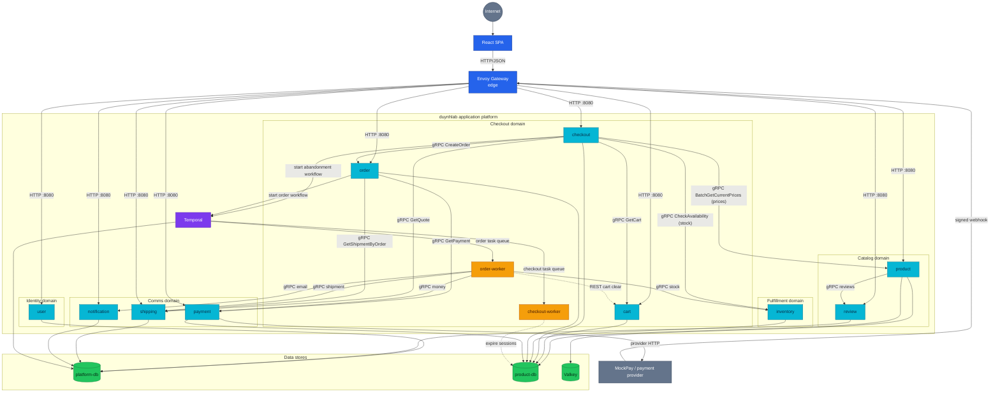
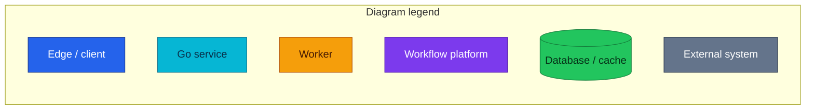
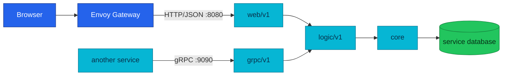
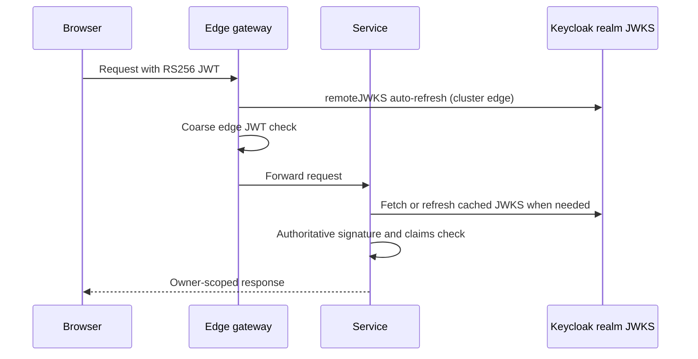
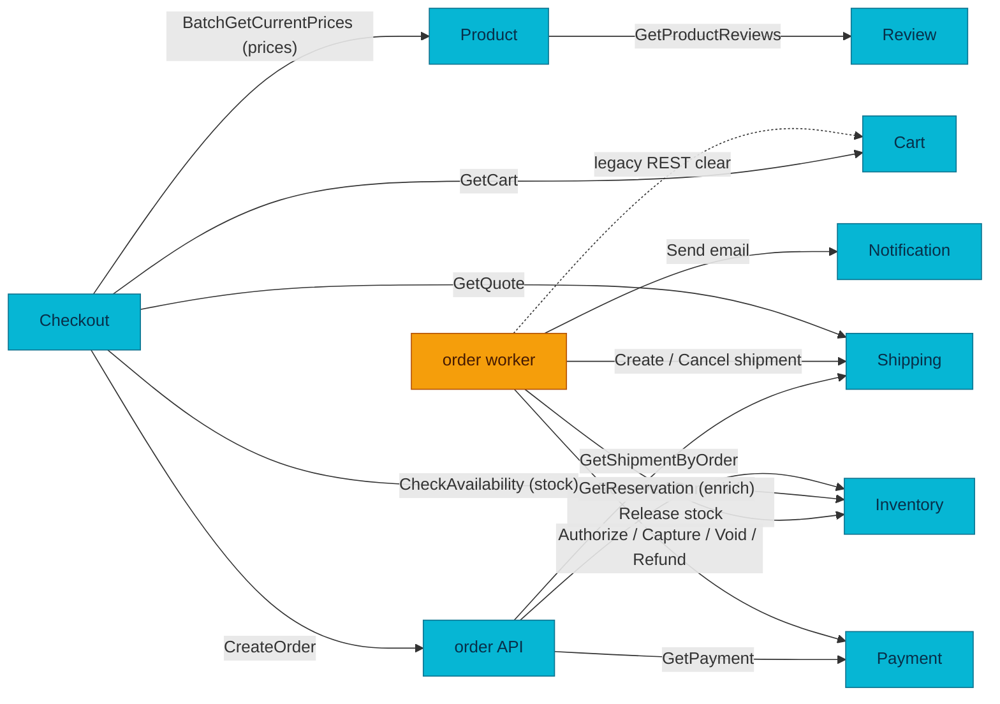
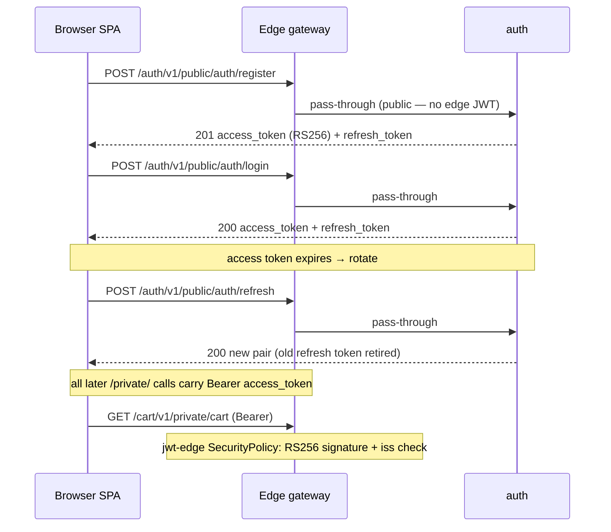
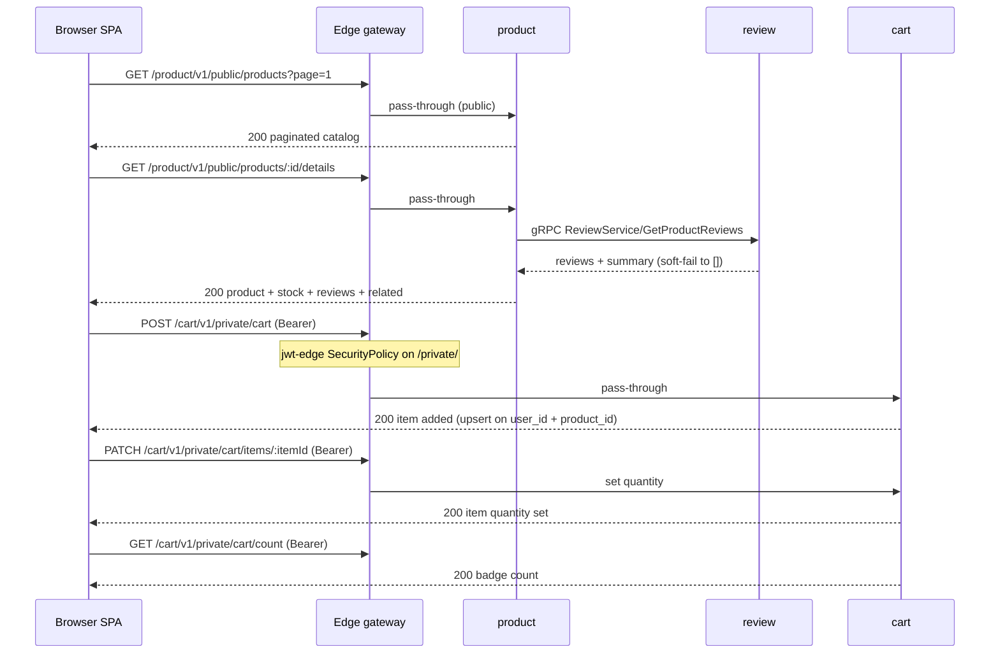
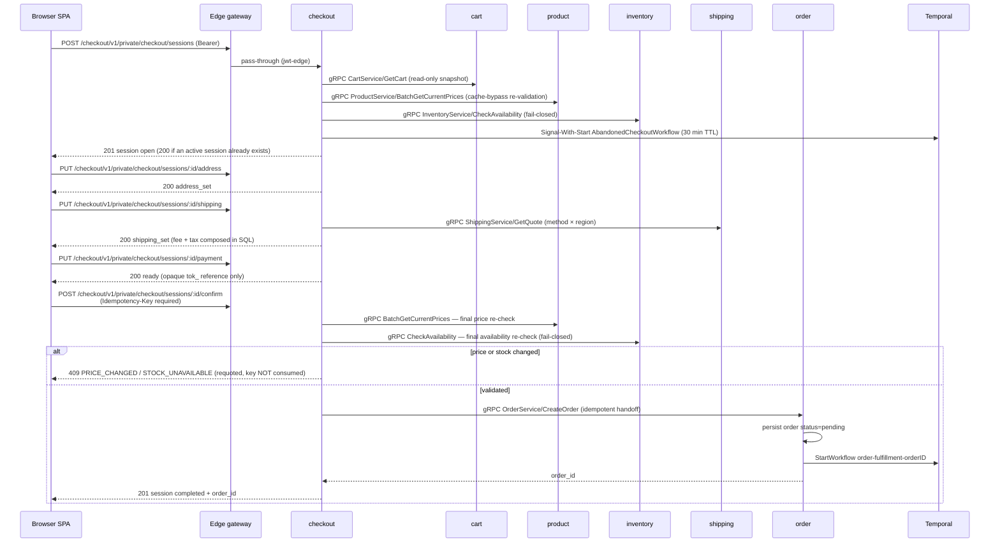
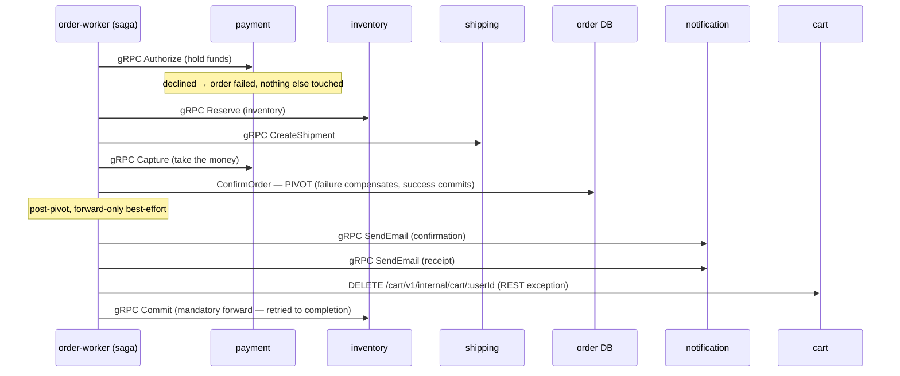
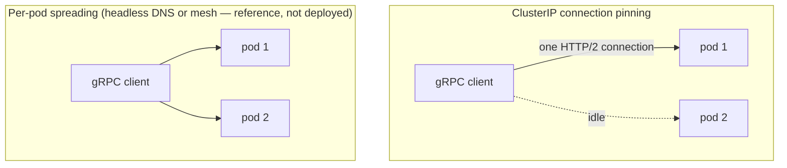

# API and Service Communication Guide

One place to learn how HTTP and gRPC contracts work across the duynhlab platform.

| Attribute | Value | RFC / ADR |
|-----------|-------|-----------|
| **Status** | Implemented; checkout P1-P5 runs in local-stack and the cluster | — |
| **Scope** | Shared HTTP conventions, gRPC conventions, and the current service call graph | — |
| **Public transport** | HTTP/JSON through the edge (Envoy Gateway) on `:8080` | — |
| **Internal transport** | gRPC on `:9090`; one documented cart REST exception remains (worker cart clear) | — |
| **Contract source** | HTTP routers in each service repo; protobufs in `duynhlab/pkg` | — |
| **Audience** | Readers learning the platform and engineers changing an API | — |
| **Design record** | — | None |

## Overview

There are two complementary contract layers:

| Layer | Used by | Format | Why |
|-------|---------|--------|-----|
| Edge API | Browser, provider webhooks, operational clients | HTTP/JSON | Easy to inspect directly from a browser or `curl` |
| East-west API | One microservice calling another | gRPC/Protobuf | Typed contracts, deadlines, code generation, and efficient long-lived connections |

A service owns its data and its business rules. Calling another service does
not transfer that ownership. For example, checkout can ask shipping for a
quote, but only shipping defines the quote; checkout can ask order to create an
order, but only order writes the order.

## Architecture

### Platform API Topology


```mermaid
flowchart TB
    %% ===== Layer 1: External actors =====
    Internet((Internet))
    Provider["MockPay / payment provider"]

    %% ===== Layer 2: Client =====
    Internet --> Browser["React SPA"]

    %% ===== Layer 3: Gateway =====
    Browser -->|"HTTP/JSON"| Edge["Envoy Gateway<br/>edge"]
    Provider -->|"signed webhook"| Edge

    %% ===== Layer 4: Application platform =====
    subgraph Platform["duynhlab application platform"]
        direction TB

        subgraph Identity["Identity domain"]
            User["user"]
        end

        subgraph Catalog["Catalog domain"]
            Product["product"]
            Review["review"]
        end

        subgraph CheckoutDomain["Checkout domain"]
            Cart["cart"]
            Checkout["checkout"]
            Order["order"]
            CheckoutWorker["checkout-worker"]
            OrderWorker["order-worker"]
        end

        subgraph Fulfillment["Fulfillment domain"]
            Inventory["inventory"]
        end

        subgraph Comms["Comms domain"]
            Shipping["shipping"]
            Payment["payment"]
            Notification["notification"]
        end

        Temporal["Temporal"]
    end

    %% Edge -> domain entry points
    Edge -->|"HTTP :8080"| User
    Edge -->|"HTTP :8080"| Product
    Edge -->|"HTTP :8080"| Review
    Edge -->|"HTTP :8080"| Cart
    Edge -->|"HTTP :8080"| Checkout
    Edge -->|"HTTP :8080"| Order
    Edge -->|"HTTP :8080"| Shipping
    Edge -->|"HTTP :8080"| Payment
    Edge -->|"HTTP :8080"| Notification

    %% Synchronous cross-service calls
    Product -->|"gRPC reviews"| Review
    Checkout -->|"gRPC GetCart"| Cart
    Checkout -->|"gRPC BatchGetCurrentPrices (prices)"| Product
    Checkout -->|"gRPC CheckAvailability (stock)"| Inventory
    Checkout -->|"gRPC GetQuote"| Shipping
    Checkout -->|"gRPC CreateOrder"| Order
    Order -->|"gRPC GetShipmentByOrder"| Shipping
    Order -->|"gRPC GetPayment"| Payment

    %% Async / workflow layer
    Checkout -->|"start abandonment workflow"| Temporal
    Order -->|"start order workflow"| Temporal
    Temporal -->|"checkout task queue"| CheckoutWorker
    Temporal -->|"order task queue"| OrderWorker

    OrderWorker -->|"gRPC stock"| Inventory
    OrderWorker -->|"gRPC shipment"| Shipping
    OrderWorker -->|"gRPC money"| Payment
    OrderWorker -->|"gRPC email"| Notification
    OrderWorker -.->|"REST cart clear"| Cart

    %% Outbound call to external payment provider
    Payment -->|"provider HTTP"| Provider

    %% ===== Layer 5: Data stores =====
    subgraph Data["Data stores"]
        direction TB
        PlatformDB[("platform-db")]
        ProductDB[("product-db")]
        Valkey[("Valkey")]
    end

    User --> PlatformDB
    Review --> PlatformDB
    Shipping --> PlatformDB
    Notification --> PlatformDB
    Temporal --> PlatformDB

    Product --> ProductDB
    Product --> Valkey
    Cart --> ProductDB
    Checkout --> ProductDB
    Inventory --> ProductDB
    Order --> ProductDB
    Payment --> ProductDB
    CheckoutWorker -.->|"expire sessions"| ProductDB

    classDef edge fill:#2563eb,color:#fff,stroke:#1e3a8a;
    classDef service fill:#06b6d4,color:#082f49,stroke:#0e7490;
    classDef worker fill:#f59e0b,color:#451a03,stroke:#b45309;
    classDef platform fill:#7c3aed,color:#fff,stroke:#5b21b6;
    classDef data fill:#22c55e,color:#052e16,stroke:#15803d;
    classDef external fill:#64748b,color:#fff,stroke:#334155;
    class Browser,Edge edge;
    class User,Product,Review,Cart,Checkout,Order,Inventory,Shipping,Payment,Notification service;
    class CheckoutWorker,OrderWorker worker;
    class Temporal platform;
    class PlatformDB,ProductDB,Valkey data;
    class Internet,Provider external;
```


```mermaid
graph LR
    subgraph Legend["Diagram legend"]
        Edge["Edge / client"]:::edge
        Service["Go service"]:::service
        Worker["Worker"]:::worker
        PlatformNode["Workflow platform"]:::platform
        DataNode[("Database / cache")]:::data
        External["External system"]:::external
    end

    classDef edge fill:#2563eb,color:#fff,stroke:#1e3a8a;
    classDef service fill:#06b6d4,color:#082f49,stroke:#0e7490;
    classDef worker fill:#f59e0b,color:#451a03,stroke:#b45309;
    classDef platform fill:#7c3aed,color:#fff,stroke:#5b21b6;
    classDef data fill:#22c55e,color:#052e16,stroke:#15803d;
    classDef external fill:#64748b,color:#fff,stroke:#334155;
```

Read the diagram **top-down**: Internet → React SPA → the edge → HTTP services and
workflows → data stores. It names every deployed service and worker. Solid arrows
are current HTTP, gRPC, workflow, or data-store paths; the dotted arrow is the
one documented cart REST exception (the worker's cart clear). Exact RPC names are in
[Current East-West Call Graph](#current-east-west-call-graph), and each service
file explains its own callers and data authority.

### Inside Each Service

Every service follows the same dependency direction. HTTP and gRPC are
transport peers: both validate input and call the logic layer.


```mermaid
flowchart LR
    Browser --> Edge["Envoy Gateway"]
    Edge -->|"HTTP/JSON :8080"| Web["web/v1"]
    Caller["another service"] -->|"gRPC :9090"| GRPC["grpc/v1"]
    Web --> Logic["logic/v1"]
    GRPC --> Logic
    Logic --> Core["core"]
    Core --> DB[(service database)]

    classDef edge fill:#2563eb,color:#fff,stroke:#1e3a8a;
    classDef service fill:#06b6d4,color:#082f49,stroke:#0e7490;
    classDef data fill:#22c55e,color:#052e16,stroke:#15803d;
    class Browser,Edge edge;
    class Caller,Web,GRPC,Logic,Core service;
    class DB data;
```

| Layer | Responsibility | Must not do |
|-------|----------------|-------------|
| `web/v1` | HTTP routing, JSON validation, auth middleware, status mapping | Own business rules or query another service's database |
| `grpc/v1` | Protobuf validation, gRPC status mapping, metadata handling | Duplicate logic already in `logic/v1` |
| `logic/v1` | Business rules, orchestration inside one service boundary | Depend on Gin or transport-specific types |
| `core` | Domain types, repositories, database and cache access | Reach upward into handlers |

## HTTP URL Model

The canonical v1 shape is:

```text
/{service}/v1/{audience}/{resource...}
```

Example:

```text
/product/v1/public/products/42
```

| Segment | Meaning | Example |
|---------|---------|---------|
| `service` | Deployable service and namespace | `product`, `order`, `payment` |
| `v1` | Contract major version | `v1` |
| `audience` | Who may call the route | `public`, `private`, `internal`, `protected` |
| `resource` | Plural collection noun, then identifiers or subresources | `orders/42/details` |

The edge passes the path through unchanged — no `URLRewrite` filter is
configured on any `HTTPRoute`, which is Gateway API's default behavior. A
route mounted by a service must use the same path that the browser sends;
there is no gateway rewrite to hide a different internal URL.

### Audience segments

| Audience | Authentication | Reachability | Typical use |
|----------|----------------|--------------|-------------|
| `public` | None, or a route-specific credential such as webhook HMAC | The edge may expose it | Login, catalog browsing, provider webhook |
| `private` | Valid RS256 access token | Edge and service | Signed-in user acting on owned data |
| `protected` | Valid token plus privileged policy | Edge and service | Administrative operations |
| `internal` | Service-specific internal rules | Cluster only | Reconciliation, trusted service operation |

`internal` must never be given an `HTTPRoute`. The real security fence is
NetworkPolicy, not merely the absence of a route.

### Collection noun rule

Resources use plural nouns after the audience segment.

| Prefer | Avoid | Reason |
|--------|-------|--------|
| `/products` | `/product` | The path names a collection |
| `/orders/:id/details` | `/getOrderDetails` | HTTP method plus resource expresses the action |
| `/payments/:id/refunds` | `/refundPayment` | A refund is a subordinate resource |
| `/checkout/sessions/:id/confirm` | A forced generic noun | Confirm is an explicit process transition |

Auth and checkout are deliberate process-oriented exceptions. Do not copy
those exceptions into ordinary CRUD services.

### Hostnames

| Environment | Browser entry point | In-cluster service name |
|-------------|---------------------|-------------------------|
| Local-stack | `http://localhost:8080` | Docker Compose service name |
| Kubernetes | Edge `Gateway` hostname (`gateway.duynh.me`) | `<service>.<namespace>.svc.cluster.local:8080` |
| Kubernetes gRPC | Not browser-accessible | `dns:///<service>.<namespace>.svc.cluster.local:9090` |

## Common HTTP Contracts

### Authentication

**Token issuer (RFC-0024 P3):** the verification contract fleet-wide is the
Keycloak realm — `iss https://id.duynh.me/realms/duynhlab` (local-stack:
`http://localhost:8081/realms/duynhlab`), audience `duynhlab-platform`
(vocabulary unchanged), `user_id` = the token `sub` (string UUID,
[ADR-042](../proposals/adr/ADR-042-oidc-sub-as-user-id/)). The auth-service surface is
**deleted** (RFC-0024 P5): no manifest, no namespace, no database, no edge
route — `/auth/v1/*` matches nothing at either environment's edge. The realm
is the only issuer; the retired contract stays readable in
[auth.md](./auth.md) as an archived record.

Private routes use the same layered model:


```mermaid
sequenceDiagram
    participant B as Browser
    participant K as Edge gateway
    participant S as Service
    participant A as Keycloak realm JWKS
    B->>K: Request with RS256 JWT
    K->>A: remoteJWKS auto-refresh (cluster edge)
    K->>K: Coarse edge JWT check
    K->>S: Forward request
    S->>A: Fetch or refresh cached JWKS when needed
    S->>S: Authoritative signature and claims check
    S-->>B: Owner-scoped response
```

| Rule | Meaning |
|------|---------|
| Identity source | Read `user_id` from verified JWT claims (`sub`, string UUID), never from a private request body |
| Authoritative check | Each service verifies the token locally with `pkg/authmw` (v0.37.0: `OIDC_ISSUER`/`OIDC_AUDIENCE`/`OIDC_JWKS_URL`) |
| Gateway check | The edge's `SecurityPolicy.jwt` (`remoteJWKS`) verifies signature/iss/aud/exp against the realm's JWKS, with no provisioned key material — verified end-to-end in local-stack; the cluster carries the same policy but it has not yet been exercised on Kind (**planned**) |
| Auth gRPC | Removed; services do not call auth `GetMe` |
| Failure mode | Missing, invalid, or unverifiable credentials fail closed |

### Error envelope

All service handlers use `pkg/httpx`:

```json
{
  "error": "Human-readable explanation",
  "code": "MACHINE_READABLE_CODE"
}
```

| Field | Intended reader | Stability |
|-------|-----------------|-----------|
| `error` | Human and logs | Wording may improve |
| `code` | Frontend and automated clients | Stable contract; renaming is breaking |

Common codes include:

| HTTP | Codes | Meaning |
|------|-------|---------|
| `400` | `VALIDATION_ERROR`, `IDEMPOTENCY_KEY_REQUIRED` | Request is malformed or misses a required condition |
| `401` | `UNAUTHORIZED` | Authentication failed |
| `403` | `FORBIDDEN` | Identity is known but not allowed |
| `404` | `NOT_FOUND`, `PROMO_INVALID` | Resource does not exist or is intentionally hidden by owner scoping |
| `409` | `CONFLICT`, `INVALID_TRANSITION`, `PRICE_CHANGED`, `STOCK_UNAVAILABLE`, `PROMO_EXPIRED`, `PROMO_EXHAUSTED` | Current state conflicts with the requested change |
| `410` | `SESSION_EXPIRED` | Checkout session existed but its TTL elapsed |
| `422` | `PAYMENT_DECLINED` | Request is valid but the provider declined it |
| `500` | `INTERNAL_ERROR` | Unexpected server failure without leaked internals |

A service may add domain-specific codes, but it must keep the same envelope.

### List pagination

List endpoints use `page` and `page_size`.

| Setting | Value |
|---------|-------|
| Default page | `1` |
| Default page size | `20` |
| Maximum page size | `100` |
| Invalid values | Fall back to defaults |
| Empty list | `"items": []`, never `null` |

```json
{
  "items": [],
  "page": 1,
  "page_size": 20,
  "total_items": 0,
  "total_pages": 0
}
```

### Data conventions

| Concern | Convention | Why |
|---------|------------|-----|
| JSON fields | `snake_case` | One predictable wire style |
| Timestamps | RFC 3339 strings in UTC | Portable and unambiguous |
| Money in service internals | `int64` minor units | Avoid floating-point accounting errors |
| Money in existing browser contracts | Follow the owning service file | Some v1 responses still expose decimal values |
| IDs | Positive numeric IDs unless a contract explicitly says otherwise | Matches current PostgreSQL keys |
| Empty collections | `[]` | Stable frontend rendering |
| State-changing retries | `Idempotency-Key` where duplicate effects matter | Survives double-clicks, timeouts, and retries |

### Idempotency

An idempotency key identifies one logical command, not one network attempt.

| Situation | Expected result |
|-----------|-----------------|
| Same key and same request | Replay the original result |
| Same key and different request | `409 IDEMPOTENCY_CONFLICT` |
| Same key still in flight | `409`, usually with a retry hint |
| Transient network failure | Retry with the same key |
| Business rejection before an effect | Contract decides whether the key remains reusable; document it in the service file |

Checkout, order, and payment have additional crash-recovery rules described in
their service documents.

### Protected route conventions (planned)

**Status: live** — [RFC-0023](../proposals/rfc/RFC-0023/) /
[ADR-047](../proposals/adr/ADR-047-protected-apis-on-owning-services/). The
first protected surface is **inventory** ([inventory.md](./inventory.md#http-api),
slice A); these conventions bind every `/{service}/v1/protected/…` route as it
ships, and the owning `docs/api/{service}.md` documents each as-built contract.

| Concern | Convention |
|---------|------------|
| Guard chain | Edge `jwt-edge-staff` SecurityPolicy (coarse signature/iss/aud/exp against the **workforce realm** `duynhlab-staff`, [ADR-050](../proposals/adr/ADR-050-separate-staff-identity-realm/)) → in-service `pkg/authmw` staff verifier (authoritative) → `MiddlewareRequireRole("backoffice_admin")`. A customer-realm token is wrong-issuer at the edge — it never reaches the role gate |
| Role miss | `403` with the shared envelope, code `FORBIDDEN`; never retried by clients |
| Actor | `actor_sub` = the verified token `sub`; a body-supplied actor is ignored |
| Pagination | The standard `page`/`page_size` envelope above — including on services whose public reads diverge (product's `limit`) |
| Idempotency | Retryable commands use `Idempotency-Key` (payment-lineage style) **or** body `command_id` (inventory style); the owning contract names which |
| Concurrency | Edits that can overwrite carry an expected `version`; mismatch returns the conflict for the operator to reconcile |
| Reason | Stock- and state-changing commands require a bounded `reason` (+ optional note) |
| Audit | A durable audit record commits in the **same transaction** as the write; a failed audit insert fails the command |
| Caller | The Backoffice browser only ever calls `/protected/` — never `/internal/` ([ADR-048](../proposals/adr/ADR-048-admin-portal-no-bff/): no BFF in between) |

## Service Contract Index

The per-service contract index and platform deployment rollup live in
[README.md § Service Contracts](./README.md#service-contracts). Each service
file's **At a glance** **Deployment** row is the per-service source of truth.

## Choosing HTTP or gRPC

| Question | Use HTTP/JSON | Use gRPC |
|----------|---------------|----------|
| Can a browser or the edge reach it? | Yes | No |
| Is it an internal typed machine contract? | Sometimes for a documented legacy exception | Preferred |
| Is it a provider webhook? | Yes | No |
| Is easy manual inspection the main need? | Strong fit | Use reflection and `grpcurl` |
| Does it need generated clients and compile-time shape checks? | Weaker | Strong fit |

The rule is simple: browser traffic stays HTTP. New east-west calls use gRPC
unless an ADR documents a reason not to.

## Current East-West Call Graph

The order-worker and checkout-worker edges below are Temporal saga activities;
the workflow registry (owners, task queues, participants) is
[workflows.md](./workflows.md).


```mermaid
flowchart LR
    Product -->|"GetProductReviews"| Review
    OrderAPI["order API"] -->|"GetShipmentByOrder"| Shipping
    OrderAPI -->|"GetPayment"| Payment
    Worker["order worker"] -->|"Reserve / Commit / Release stock"| Inventory
    Worker -->|"Create / Cancel shipment"| Shipping
    Worker -->|"Send email"| Notification
    Worker -->|"Authorize / Capture / Void / Refund"| Payment
    Checkout -->|"GetCart"| Cart
    Checkout -->|"BatchGetCurrentPrices (prices)"| Product
    Checkout -->|"CheckAvailability (stock)"| Inventory
    Checkout -->|"GetQuote"| Shipping
    Checkout -->|"CreateOrder"| OrderAPI
    OrderAPI -->|"GetReservation (enrich)"| Inventory
    Worker -.->|"legacy REST clear"| Cart

    classDef service fill:#06b6d4,color:#082f49,stroke:#0e7490;
    classDef worker fill:#f59e0b,color:#451a03,stroke:#b45309;
    class Product,Review,OrderAPI,Shipping,Payment,Notification,Checkout,Cart,Inventory service;
    class Worker worker;
```

| Caller | Callee | Contract | Transport | Deployment |
|--------|--------|----------|-----------|------------|
| Product | Review | `GetProductReviews` | gRPC | Cluster and local-stack |
| Order API | Shipping | `GetShipmentByOrder` | gRPC | Cluster and local-stack |
| Order API | Payment | `GetPayment` | gRPC | Cluster and local-stack |
| Order worker | Inventory | `Reserve`, `Commit`, `Release`, `GetReservation` | gRPC | Cluster and local-stack |
| Order API | Inventory | `GetReservation` (`/details` enrichment) | gRPC | Cluster and local-stack |
| Order worker | Shipping | `CreateShipment`, `CancelShipment` | gRPC | Cluster and local-stack |
| Order worker | Notification | `SendEmail` (`SendSMS` is served but has no live caller) | gRPC | Cluster and local-stack |
| Order worker | Payment | `Authorize`, `Capture`, `Void`, `Refund` | gRPC | Cluster and local-stack |
| Checkout | Cart | `GetCart` | gRPC | Cluster and local-stack |
| Checkout | Product | `BatchGetCurrentPrices` | gRPC | Cluster and local-stack |
| Checkout | Inventory | `CheckAvailability` | gRPC | Cluster and local-stack |
| Checkout | Shipping | `GetQuote` | gRPC | Cluster and local-stack |
| Checkout | Order | `CreateOrder` | gRPC | Cluster and local-stack |
| Order worker | Cart | Clear cart | REST exception | Current |

The order→cart pricing read died with the legacy REST create (RFC-0021 P5,
order-service v1.11.0); the worker's clear-cart is the one remaining REST
exception on the order side.

Auth has no gRPC server. The former `auth.GetMe` dependency was retired when
services moved to local JWT verification.

## Edge exposure

- No `/internal/` audience is exposed at either edge — verified in
  [local-stack routes.yaml](../../local-stack/gateway/eg/routes.yaml) and
  [cluster routes/api.yaml](../../kubernetes/infra/configs/envoy-gateway/routes/api.yaml).
- **The route path is what enforces this, not NetworkPolicy.** Every route in
  both environments is declared on an audience-scoped prefix
  (`/product/v1/public/`, `/cart/v1/private/`, `/order/v1/private/`, …), so an
  `/internal/` path simply has no `HTTPRoute` to match. NetworkPolicy is the
  second fence, and in local-stack there is no NetworkPolicy at all — a bare
  service-wide prefix there would expose the internal audience outright.
- That is not hypothetical: until 2026-08-11 local-stack routed product, cart and
  order on bare prefixes. `POST /product/v1/internal/products` answered with **no
  JWT** (its route carried no edge JWT policy), and `DELETE
  /cart/v1/internal/cart/:userId` answered for any shopper's token — the path
  carries the target user id, so one shopper could clear another's cart. The
  routes are now audience-scoped and the audit's **A8** row probes both.
- Service paths are identical in both environments (Variant A pass-through, no
  `URLRewrite` filter configured anywhere).

## End-to-end user journeys

Four user journeys — register, browse, checkout, fulfill — traced as sequence
diagrams across every service they touch. HTTP edges use the canonical shape
`/{service}/v1/{audience}/{resource...}` (see [HTTP URL Model](#http-url-model));
east-west edges use gRPC on `:9090` (see [gRPC Runtime Model](#grpc-runtime-model)).
Durable workflows are indexed in [workflows.md](./workflows.md). Per-component
deployment status is in each service **At a glance** table and the
[hub rollup](./README.md#service-contracts).

The four flows chain into one shopping journey: a JWT from flow 1 authorizes the
cart writes in flow 2, the cart becomes a checkout session in flow 3, and the
confirmed order drives the saga in flow 4.

### 1. Register / login → JWT

Owner: [auth.md](./auth.md). **Historical since RFC-0024 P3:** the SPA now
logs in against the Keycloak realm (`keycloak-js` PKCE,
[ADR-043](../proposals/adr/ADR-043-oidc-browser-workload-trust/)) and services
verify realm tokens only — the flow below still runs on the not-yet-retired
auth-service, but nothing consumes its tokens; it is decommissioned in P5. The
diagram reflects the cluster, where `api-auth-public` still routes to
auth-service; local-stack carries no `/auth/v1/` route at all, so this flow
cannot be driven there.


```mermaid
sequenceDiagram
    participant SPA as Browser SPA
    participant Edge as Edge gateway
    participant Auth as auth

    SPA->>Edge: POST /auth/v1/public/auth/register
    Edge->>Auth: pass-through (public — no edge JWT)
    Auth-->>SPA: 201 access_token (RS256) + refresh_token

    SPA->>Edge: POST /auth/v1/public/auth/login
    Edge->>Auth: pass-through
    Auth-->>SPA: 200 access_token + refresh_token

    Note over SPA,Auth: access token expires → rotate
    SPA->>Edge: POST /auth/v1/public/auth/refresh
    Edge->>Auth: pass-through
    Auth-->>SPA: 200 new pair (old refresh token retired)

    Note over SPA,Edge: all later /private/ calls carry Bearer access_token
    SPA->>Edge: GET /cart/v1/private/cart (Bearer)
    Note over Edge: jwt-edge SecurityPolicy: RS256 signature + iss check
```

### 2. Browse → cart CRUD

Owners: [product.md](./product.md), [cart.md](./cart.md).


```mermaid
sequenceDiagram
    participant SPA as Browser SPA
    participant Edge as Edge gateway
    participant Prod as product
    participant Rev as review
    participant Cart as cart

    SPA->>Edge: GET /product/v1/public/products?page=1
    Edge->>Prod: pass-through (public)
    Prod-->>SPA: 200 paginated catalog

    SPA->>Edge: GET /product/v1/public/products/:id/details
    Edge->>Prod: pass-through
    Prod->>Rev: gRPC ReviewService/GetProductReviews
    Rev-->>Prod: reviews + summary (soft-fail to [])
    Prod-->>SPA: 200 product + stock + reviews + related

    SPA->>Edge: POST /cart/v1/private/cart (Bearer)
    Note over Edge: jwt-edge SecurityPolicy on /private/
    Edge->>Cart: pass-through
    Cart-->>SPA: 200 item added (upsert on user_id + product_id)

    SPA->>Edge: PATCH /cart/v1/private/cart/items/:itemId (Bearer)
    Edge->>Cart: set quantity
    Cart-->>SPA: 200 item quantity set

    SPA->>Edge: GET /cart/v1/private/cart/count (Bearer)
    Cart-->>SPA: 200 badge count
```

### 3. Checkout session → confirm → order pending

Owners: [checkout.md](./checkout.md), [order.md](./order.md).


```mermaid
sequenceDiagram
    participant SPA as Browser SPA
    participant Edge as Edge gateway
    participant CK as checkout
    participant Cart as cart
    participant Prod as product
    participant Inv as inventory
    participant Ship as shipping
    participant Ord as order
    participant TMP as Temporal

    SPA->>Edge: POST /checkout/v1/private/checkout/sessions (Bearer)
    Edge->>CK: pass-through (jwt-edge)
    CK->>Cart: gRPC CartService/GetCart (read-only snapshot)
    CK->>Prod: gRPC ProductService/BatchGetCurrentPrices (cache-bypass re-validation)
    CK->>Inv: gRPC InventoryService/CheckAvailability (fail-closed)
    CK->>TMP: Signal-With-Start AbandonedCheckoutWorkflow (30 min TTL)
    CK-->>SPA: 201 session open (200 if an active session already exists)

    SPA->>Edge: PUT /checkout/v1/private/checkout/sessions/:id/address
    CK-->>SPA: 200 address_set
    SPA->>Edge: PUT /checkout/v1/private/checkout/sessions/:id/shipping
    CK->>Ship: gRPC ShippingService/GetQuote (method × region)
    CK-->>SPA: 200 shipping_set (fee + tax composed in SQL)
    SPA->>Edge: PUT /checkout/v1/private/checkout/sessions/:id/payment
    CK-->>SPA: 200 ready (opaque tok_ reference only)

    SPA->>Edge: POST /checkout/v1/private/checkout/sessions/:id/confirm<br/>(Idempotency-Key required)
    CK->>Prod: gRPC BatchGetCurrentPrices — final price re-check
    CK->>Inv: gRPC CheckAvailability — final availability re-check (fail-closed)
    alt price or stock changed
        CK-->>SPA: 409 PRICE_CHANGED / STOCK_UNAVAILABLE (requoted, key NOT consumed)
    else validated
        CK->>Ord: gRPC OrderService/CreateOrder (idempotent handoff)
        Ord->>Ord: persist order status=pending
        Ord->>TMP: StartWorkflow order-fulfillment-orderID
        Ord-->>CK: order_id
        CK-->>SPA: 201 session completed + order_id
    end
```

Confirm details: [checkout.md § Confirm](./checkout.md). The handoff is
asynchronous — the SPA polls `GET /order/v1/private/orders/:id` until the saga
lands the order in `confirmed` or `failed`.

### 4. Order fulfillment saga

Owner: [order.md](./order.md); step order and compensations:
[temporal.md](./temporal.md).


```mermaid
sequenceDiagram
    participant W as order-worker (saga)
    participant Pay as payment
    participant Inv as inventory
    participant Ship as shipping
    participant Ord as order DB
    participant Not as notification
    participant Cart as cart

    W->>Pay: gRPC Authorize (hold funds)
    Note over Pay: declined → order failed, nothing else touched
    W->>Inv: gRPC Reserve (inventory)
    W->>Ship: gRPC CreateShipment
    W->>Pay: gRPC Capture (take the money)
    W->>Ord: ConfirmOrder — PIVOT (failure compensates, success commits)
    Note over W: post-pivot, forward-only best-effort
    W->>Not: gRPC SendEmail (confirmation)
    W->>Not: gRPC SendEmail (receipt)
    W->>Cart: DELETE /cart/v1/internal/cart/:userId (REST exception)
    W->>Inv: gRPC Commit (mandatory forward — retried to completion)
```

## gRPC Runtime Model

### Dual-port services

| Port | Name | Purpose | Exposure |
|------|------|---------|----------|
| `:8080` | `http` | HTTP API and probes | The edge or allowed internal callers |
| `:9090` | `grpc` | Internal Protobuf RPC | Allowed namespaces only |

A service starts its gRPC server whenever it implements one. There is no
`GRPC_ENABLED` feature flag and no REST fallback for migrated RPCs.

### Contract ownership

| Item | Location | Rule |
|------|----------|------|
| Proto source | `duynhlab/pkg/proto/<service>/v1/*.proto` | The callee owns the contract |
| Generated Go stubs | Committed beside the proto output in `duynhlab/pkg` | Service CI does not regenerate them |
| Package name | `<service>.v1` | Mirrors HTTP major version |
| Compatibility check | Buf lint and breaking checks | Breaking changes require a new version |

Keeping protos in a shared module avoids copying request structs across eleven
repositories. Since the per-module split, `proto` releases on its own tag line,
so a contract change moves only the services that speak that contract — see
[pkg.md](./pkg.md).

### Kubernetes HTTP/2 load balancing

A normal ClusterIP balances TCP connections. gRPC multiplexes many RPCs over
one long-lived HTTP/2 connection, so a client may remain pinned to one pod.


```mermaid
flowchart TB
    subgraph Problem["ClusterIP connection pinning"]
        Client1["gRPC client"] -->|"one HTTP/2 connection"| Pod1["pod 1"]
        Client1 -.->|"idle"| Pod2["pod 2"]
    end
    subgraph Solution["Per-pod spreading (headless DNS or mesh — reference, not deployed)"]
        Client2["gRPC client"] --> Pod3["pod 1"]
        Client2 --> Pod4["pod 2"]
    end
```

The current deployment is:

1. Each service exposes gRPC as a second port on its single multi-port
   Service `<service>` (the mop chart removed the separate headless
   `<service>-grpc` twin in 0.14).
2. Clients dial `dns:///<service>.<namespace>.svc.cluster.local:9090`.
3. `pkg/grpcx` configures client-side `round_robin`.
4. Because a ClusterIP Service resolves to one virtual IP, `round_robin`
   currently sees a single address; per-pod spreading would need headless DNS
   or a mesh, which is acceptable at current replica counts.

| Option | Decision | Reason |
|--------|----------|--------|
| Single multi-port Service plus `dns:///` target | Current | One Service per workload; sufficient at current replica counts |
| Service mesh | Deferred | No mesh is deployed; adding one only for gRPC balancing is disproportionate |
| Dedicated internal proxy | Rejected | Adds a hop and a component without a current need |

### Deadlines, retries, and health

| Mechanism | Current behavior | Reader takeaway |
|-----------|------------------|-----------------|
| Default deadline | Supplied by `pkg/grpcx` when a caller has none | Every RPC must eventually stop |
| Retry | Limited to safe transient gRPC statuses | Business failures are not retried blindly |
| Retry budget | Bounded attempts and backoff | A failing callee must not cause an unbounded retry storm |
| Keepalive | Shared client/server settings | Detect dead connections without excessive pings |
| Health | Standard gRPC health service | Kubernetes and operators can check readiness |
| Reflection | Enabled by default; `GRPC_REFLECTION=false` disables it | `grpcurl` can inspect allowed servers |

Application-level idempotency is still required. A transport retry cannot prove
whether the previous attempt committed before its response was lost.

## Observability

All HTTP, gRPC, and worker entry points follow the shared application
instrumentation contract in [observability.md](./observability.md).

| Entry point | Shared behavior |
|-------------|-----------------|
| HTTP | `otelgin` server span and RED metrics; structured access logging |
| gRPC | `pkg/grpcx` client/server tracing, RED metrics, context propagation, and access logging |
| Worker / activity | Shared process resource plus supported worker/activity instrumentation |
| Process | Structured stdout/OTLP logs and optional continuous profiling |

Transport adapters propagate `context.Context` into `logic/v1`. They do not
construct telemetry providers/exporters, duplicate RED instruments, or create
a second generic request span.

Signal-specific authoring rules:
[logs](./logs.md) · [metrics](./metrics.md) ·
[tracing](./tracing.md) · [profiling](./profiling.md).

Health, readiness, and reflection probes are excluded from spans and RED
metrics on both transports, and from both gRPC and HTTP access logs — the HTTP
filter shipped fleet-wide in the x.2/x.3 wave, which took one service's probe
access logs from 513664 lines to 0. A *failing* probe is still logged.
Signal-by-signal matrix:
[observability.md § Health filtering](./observability.md#health-readiness-and-reflection-filtering).

## Security

| Control | Current state | Purpose |
|---------|---------------|---------|
| Edge JWT (`SecurityPolicy.jwt`) | Active on private HTTP routes in local-stack; cluster manifests carry the same policy but are unverified on Kind (**planned**) | Coarse rejection before service work |
| Service JWT verification | Active | Authoritative identity and claims check |
| NetworkPolicy on `:9090` | Active for deployed service edges | Restrict which namespaces may call each gRPC server |
| TLS for external traffic | Terminated at the cluster `Gateway` https listener; plain HTTP in local-stack | Protect north-south traffic |
| gRPC mTLS | Planned, not deployed | Authenticate and encrypt east-west connections |

Current gRPC clients use insecure transport credentials inside the cluster, so
NetworkPolicy is a required control, not an optional hardening item. Do not
describe mTLS as current until certificates and `grpcx` TLS configuration are
deployed.

## Aggregation Rules

An aggregation endpoint enriches one service's owned record with data from
other services, such as product details plus reviews or order details plus
shipping and payment.

| Rule | Why |
|------|-----|
| Look up and authorize the owned record first | Prevent cross-user data leaks |
| Use bounded downstream deadlines | One dependency must not hang the request |
| Mark optional enrichments soft-fail | The owned record can still be useful |
| Keep writes in the owning service | Aggregation is not shared database access |
| Trace every downstream call | Operators need to identify the slow or failing dependency |

The per-service document states which enrichments are optional. A soft failure
must omit or clearly empty the enrichment; it must not fabricate data.

## Versioning and Compatibility

| Change | v1-safe? | Action |
|--------|----------|--------|
| Add an optional response field | Usually | Add and document it |
| Add a new endpoint or RPC | Usually | Add tests and update the owning service doc |
| Add a new stable error code | Usually | Document client behavior |
| Rename or remove a field | No | Introduce a new contract version or migration |
| Change field meaning or units | No | Introduce a new contract version |
| Remove a route alias | Only after usage is zero | Observe, announce, then remove |

Deprecated HTTP aliases remain mounted during their migration window. New code
must use the canonical collection-noun route.

## Changing an API

Use this sequence for a new or modified contract:

| Step | Check |
|------|-------|
| 1. Identify owner | Which service owns the data and business rule? |
| 2. Choose audience | Browser/public, signed-in/private, privileged/protected, or cluster/internal? |
| 3. Choose transport | HTTP for browser/provider; normally gRPC for east-west |
| 4. Define contract | Inputs, outputs, units, errors, idempotency, and timeout |
| 5. Implement at transport layer | Handler validates and delegates to logic |
| 6. Protect it | Auth middleware and NetworkPolicy where applicable |
| 7. Instrument it | Comply with [observability.md](./observability.md); add only domain-specific instruments required by the owning service contract |
| 8. Test it | Success, validation, authorization, ownership, retry, and failure paths |
| 9. Document once | Shared rule here; service-specific contract in its service file |
| 10. Validate consumers | Frontend, caller service, the edge, local-stack, and GitOps references |

A substantial or contested change should start as an RFC. A decision already
made should be recorded as an ADR.

## Migration Lessons

The gRPC migration is complete for migrated hops, but its lessons remain useful.

| Lesson | What happened | Reusable rule |
|--------|---------------|---------------|
| Pilot one path first | Order to shipping proved codegen, tracing, and deployment | Validate the toolchain before broad migration |
| Avoid permanent dual paths | Temporary HTTP/gRPC migration paths increase testing surface | Remove fallback after cutover and rollback by reverting |
| Account for HTTP/2 | A naive ClusterIP can pin traffic to one pod | Design load balancing before scaling replicas |
| Preserve debuggability | Binary payloads are harder to inspect | Enable reflection and document `grpcurl` |
| Keep edge and internal concerns separate | Browsers still need HTTP/JSON | Do not replace edge APIs merely because gRPC exists |
| Revisit old assumptions | Auth gRPC became unnecessary after local JWKS verification | Remove a dependency when architecture makes it obsolete |

## Operations

| Task | Command or signal |
|------|-------------------|
| Inspect HTTP | `curl` through the edge or an allowed in-cluster address |
| Inspect gRPC services | `grpcurl <target> list` using server reflection |
| Check service health | HTTP `/health`, `/ready`, or gRPC health |
| Trace a request | Search Tempo/Jaeger by `trace_id` |
| Find downstream failures | Check RPC RED metrics and VictoriaLogs access entries |
| Validate manifests | `make validate` |
| Validate a service repo | `GOTOOLCHAIN=auto go build ./... && go test ./...` |

## References

- [API documentation index](./README.md)
- [Microservice map](./microservices.md)
- [Temporal order fulfillment](./temporal.md)
- [Envoy Gateway](../platform/envoy-gateway.md)
- [Application observability](./observability.md) · [Application metrics](./metrics.md) · [Application logging](./logs.md) · [Application tracing](./tracing.md) · [Application profiling](./profiling.md)
- [Metrics (platform ops)](../observability/metrics/metrics-apps.md)
- [ADR-017: collection-noun API migration](../proposals/adr/ADR-017-api-path-collection-noun/)
- [RFC-0009: authentication hardening](../proposals/rfc/RFC-0009/)
- [RFC-0014: observability standardization](../proposals/rfc/RFC-0014/)

_Last updated: 2026-08-14 — ADR-050: protected surfaces verify the workforce realm (`duynhlab-staff`); customer tokens die at the edge as wrong-issuer._
