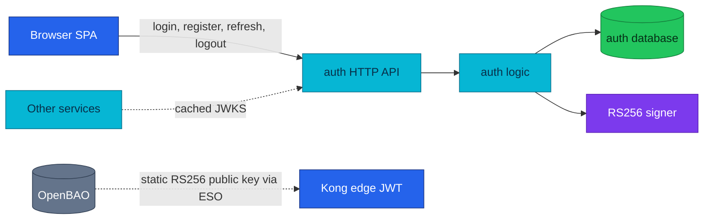

# Auth Service API

Auth turns credentials into short-lived RS256 access tokens and rotating refresh-token families.

| Attribute | Value |
|---|---|
| **Status** | Implemented; runs in local-stack and the cluster |
| **Repository** | [`duynhlab/auth-service`](https://github.com/duynhlab/auth-service) |
| **Owns** | Login credentials, password hashes, refresh-token families, JWT signing key |
| **HTTP** | Public API on `:8080` |
| **gRPC** | None; the former auth `GetMe` RPC was removed |
| **Callers** | Browser and service JWKS caches (Kong verifies edge JWTs with a statically provisioned public key, not the JWKS endpoint) |

## Overview

Auth has two jobs: prove a username/password pair and issue credentials that
other components can verify. It does not sit on every request path. Services
verify access tokens locally with the cached JWKS, while refresh and logout
return to auth because refresh-token state lives in the auth database.



One RSA keypair lives in OpenBAO at `secret/local/auth/jwt-signing`
(`private_key` + `public_key`). External Secrets Operator fans it out into two
Secrets: **`auth-jwt-signing`** (namespace `auth`, private key → auth env
`JWT_PRIVATE_KEY_PEM`, used to sign) and **`auth-issuer-jwt`** (namespace `kong`,
public key → a Kong `jwt` consumer credential on the `auth-issuer` consumer). In
local-stack the same split is an inline key in the declarative config.

Kong's edge check does **not** fetch the JWKS: the `jwt-edge` plugin looks up that
credential **by the token's `iss` claim** (`key_claim_name: iss`) and verifies the
RS256 signature and `exp` with the public key — Kong never holds the private key.
The service's `pkg/authmw` re-verifies the full token (audience, `nbf`, …) against
the cached JWKS and stays authoritative. Because Kong verifies against the
statically provisioned public key rather than the JWKS, rotating the signing key
means updating **both** ExternalSecrets — a JWKS refresh alone only covers the
services. Full provisioning and rotation choreography:
[OpenBAO — JWT signing key](../secrets/openbao.md).

## HTTP API

All routes are public because each route either establishes a session or uses
the refresh token itself as the credential. They are still rate-limited at the
gateway.

| Method | Path | Purpose | Success |
|---|---|---|---|
| `POST` | `/auth/v1/public/auth/login` | Verify username/password and create a token pair | `200` auth envelope |
| `POST` | `/auth/v1/public/auth/register` | Create credentials and create a token pair | `201` auth envelope |
| `POST` | `/auth/v1/public/auth/refresh` | Rotate a refresh token and mint a new pair | `200` auth envelope |
| `POST` | `/auth/v1/public/auth/logout` | Revoke the presented refresh-token family | `200 {"message":"logged out"}` |
| `GET` | `/auth/v1/public/auth/jwks` | Publish public verification keys | `200` JWKS, cacheable for 300 s |

### Login and register

| Operation | Required request fields | Important validation |
|---|---|---|
| Login | `username`, `password` | Unknown user and wrong password both return the same `401` response |
| Register | `username`, `email`, `password` | Duplicate username or email returns `409 CONFLICT` |

Both operations return the same shape:

```json
{
  "access_token": "<RS256 JWT>",
  "refresh_token": "<opaque token>",
  "expires_in": 3600,
  "user": {
    "id": "1",
    "username": "alice",
    "email": "alice@example.com"
  }
}
```

### Refresh and logout

```json
{ "refresh_token": "<opaque token>" }
```

Refresh tokens are rotated atomically. Reusing an old token revokes the whole
family and returns `401 UNAUTHORIZED`. Logout is idempotent: an unknown or
already-revoked token still returns `200`, allowing the SPA to clear local state
without branching on server state.

## Security model

| Control | Behavior |
|---|---|
| Access token | RS256 JWT — header carries `alg: RS256` + `kid`; claims `iss=https://gateway.duynh.me`, `aud=duynhlab-platform`, `sub`, `exp`, `iat`, `nbf`, `jti`, username, and email |
| Verification | Kong performs a coarse edge check; each service remains authoritative through `pkg/authmw` |
| Refresh storage | Only SHA-256 hashes are stored; raw refresh tokens are returned once |
| Reuse detection | A rotated-token replay revokes its family |
| Enumeration defense | Missing users still execute a dummy bcrypt comparison and return generic credentials errors |
| Key publication | JWKS exposes public key material only and carries `Cache-Control: public, max-age=300` |

## Deprecated aliases

The pre-v3 paths under `/auth/v1/public/{login,register,refresh,logout,jwks}`
remain temporary aliases for the ADR-017 expand phase. New callers must use the
`/auth/` collection segment shown above.

## Operations

| Check | Expected result |
|---|---|
| `GET /health` | Process is alive |
| `GET /ready` | Service is accepting traffic and is not draining |
| OTLP metrics export | HTTP RED and runtime metrics are pushed to the collector |
| Signing key | `JWT_PRIVATE_KEY_PEM` comes from the ESO-delivered `auth-jwt-signing` Secret (OpenBAO `secret/local/auth/jwt-signing`); an empty value falls back to an ephemeral key, which production refuses |

## References

- [Shared API conventions](api.md)
- [Microservices catalog](microservices.md)
- [OpenBAO — JWT signing key lifecycle](../secrets/openbao.md) (OpenBAO path + ESO fan-out + rotation)
- [Kong gateway — edge JWT](../platform/kong-gateway.md) (the `auth-issuer` consumer + `jwt-edge` plugin)
- [RFC-0009: RS256 JWT and edge authentication](../proposals/rfc/RFC-0009/)
- [ADR-006: Kong edge JWT](../proposals/adr/ADR-006-rs256-jwt-kong-edge-auth/)

_Last updated: 2026-07-19_
