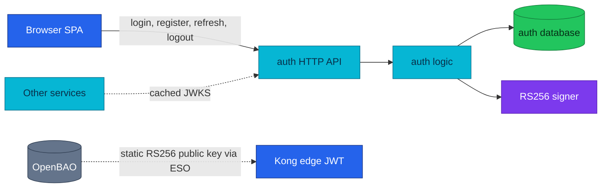
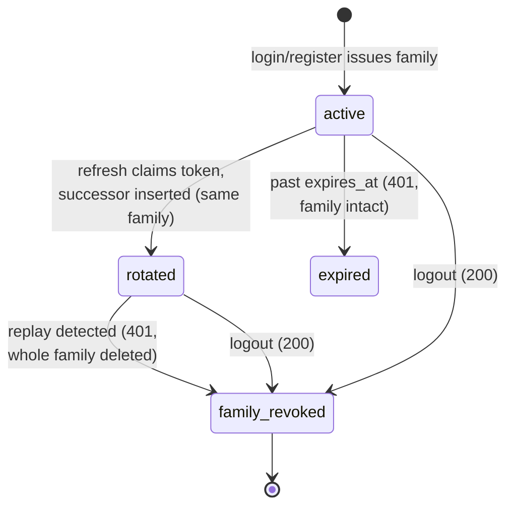

# Auth Service API

Auth turns credentials into short-lived RS256 access tokens and rotating refresh-token families.

| Dimension | Value | Status |
|-----------|-------|--------|
| **Deployment** | local-stack + cluster | Implemented |
| **HTTP** | public only · `:8080` · Kong `/auth/v1/public/` (no edge JWT) | Implemented |
| **gRPC server** | None | None |
| **gRPC client** | None | None |
| **Worker** | None | None |
| **Temporal** | None · [workflows.md](./workflows.md) | None |
| **Technical debt** | None | None |

| | |
|---|---|
| **Repository** | [`duynhlab/auth-service`](https://github.com/duynhlab/auth-service) |
| **Owns** | Login credentials, password hashes, refresh-token families, JWT signing key |
| **Database** | `auth` on `platform-db` (via `platform-db-pooler-rw`) |
| **Design record** | [RFC-0009](../proposals/rfc/RFC-0009/) |

## Temporal participation

None — this service does not start or participate in Temporal workflows.
See [workflows.md](./workflows.md).

## Why it exists

Auth has two jobs: prove a username/password pair and issue credentials that
other components can verify **without calling auth again**. It does not sit on
every request path. Services verify access tokens locally with the cached
JWKS, while refresh and logout return to auth because refresh-token state
lives in the auth database.

That "verify locally" design retired the former auth `GetMe` gRPC dependency:
auth is now HTTP-only, and losing auth degrades login/refresh — never every
authenticated request on the platform.

## Architecture



### Key distribution: one keypair, three verifiers

One RSA keypair lives in OpenBAO at `secret/local/auth/jwt-signing`
(`private_key` + `public_key`). External Secrets Operator fans it out into two
Secrets: **`auth-jwt-signing`** (namespace `auth`, private key → auth env
`JWT_PRIVATE_KEY_PEM`, used to sign) and **`auth-issuer-jwt`** (namespace `kong`,
public key → a Kong `jwt` consumer credential on the `auth-issuer` consumer). In
local-stack the same split is an inline key in the declarative config.

Kong's edge check does **not** fetch the JWKS: the `jwt-edge` plugin looks up that
credential **by the token's `iss` claim** (`key_claim_name: iss`) and verifies the
RS256 signature and `exp` with the public key — Kong never holds the private key.
The service's `pkg/authmw` re-verifies the full token (audience, `nbf`, …) against
the cached JWKS and stays authoritative. Because Kong verifies against the
statically provisioned public key rather than the JWKS, rotating the signing key
means updating **both** ExternalSecrets — a JWKS refresh alone only covers the
services. Full provisioning and rotation choreography:
[OpenBAO — JWT signing key](../secrets/openbao.md).

### JWKS publication (how services verify locally)

`GET /auth/v1/public/auth/jwks` serves the RFC 7517 key set built by the
signer: `kty: RSA`, `use: sig`, `alg: RS256`, and a deterministic `kid`
(base64url, no padding, of SHA-256 over the PKIX DER of the public key). Every
minted token carries the same `kid` in its header, so a verifier picks the
right key even during a rotation overlap. The response carries
`Cache-Control: public, max-age=300`; each service's `pkg/authmw` caches the
set and refreshes on demand, so an auth outage does not break verification of
already-cached keys.

## Data model

| Table | Columns worth knowing | Constraints |
|-------|-----------------------|-------------|
| `users` | `id`, `username`, `email`, `password_hash` (bcrypt), `created_at`, `last_login` | `username` and `email` both `UNIQUE` |
| `refresh_tokens` | `user_id`, `token_hash` (SHA-256 hex of the opaque token), `family_id` (UUID), `used_at` (NULL until rotated), `expires_at` | `token_hash UNIQUE`; indexes on `family_id` and `user_id` |

Raw refresh tokens are never stored — only their SHA-256 hash. The legacy
`sessions` table from the initial schema was dropped in migration
`000004_drop_sessions` when rotating refresh tokens replaced it.

## HTTP API

All routes are public because each route either establishes a session or uses
the refresh token itself as the credential — there is no edge JWT on this
prefix. They are still rate-limited at the gateway.

| Method | Path | Purpose | Success |
|---|---|---|---|
| `POST` | `/auth/v1/public/auth/login` | Verify username/password and create a token pair | `200` auth envelope |
| `POST` | `/auth/v1/public/auth/register` | Create credentials and create a token pair | `201` auth envelope |
| `POST` | `/auth/v1/public/auth/refresh` | Rotate a refresh token and mint a new pair | `200` auth envelope |
| `POST` | `/auth/v1/public/auth/logout` | Revoke the presented refresh-token family | `200 {"message":"logged out"}` |
| `GET` | `/auth/v1/public/auth/jwks` | Publish public verification keys | `200` JWKS, cacheable for 300 s |

### Login and register

| Operation | Required request fields | Important validation |
|---|---|---|
| Login | `username`, `password` | Unknown user and wrong password both return the same `401` response |
| Register | `username`, `email`, `password` | Duplicate username or email returns `409 CONFLICT` |

Both operations return the same shape:

```json
{
  "access_token": "<RS256 JWT>",
  "refresh_token": "<opaque token>",
  "expires_in": 3600,
  "user": {
    "id": "1",
    "username": "alice",
    "email": "alice@example.com"
  }
}
```

### Refresh and logout

```json
{ "refresh_token": "<opaque token>" }
```

Refresh tokens are rotated atomically. Reusing an old token revokes the whole
family and returns `401 UNAUTHORIZED`. Logout is idempotent: an unknown or
already-revoked token still returns `200`, allowing the SPA to clear local state
without branching on server state.

### Error matrix

Errors use the shared `{"error","code"}` envelope
([api.md § Error envelope](./api.md#error-envelope)).

| Route | HTTP | Code | Trigger |
|-------|------|------|---------|
| all `POST` | `400` | `VALIDATION_ERROR` | Malformed JSON or missing required fields |
| login | `401` | `UNAUTHORIZED` | Unknown user **or** wrong password — deliberately indistinguishable |
| login | `403` | `FORBIDDEN` | Password expired / account locked — mapped in the handler, but no logic path produces these today (No caller) |
| register | `409` | `CONFLICT` | Username or email already exists |
| refresh | `401` | `UNAUTHORIZED` | Token unknown, past `expires_at`, **or** replayed after rotation (reuse → family revoked) |
| jwks | `404` | `NOT_FOUND` | No signer configured (misconfigured deployment) |
| all | `500` | `INTERNAL_ERROR` | DB failure; also a reuse detection whose family revoke failed — a failed revoke is loud, never a silent `401` |

### Deprecated aliases

The pre-v3 paths under `/auth/v1/public/{login,register,refresh,logout,jwks}`
remain temporary aliases for the ADR-017 expand phase. New callers must use the
`/auth/` collection segment shown above.

## gRPC API

None — HTTP only. The former auth `GetMe` RPC was retired when services moved
to local JWT verification against the cached JWKS; auth runs no `:9090` server
and dials no other service.

## Business rules & techniques

### Refresh-token family FSM (rotation + reuse detection)

Login and register each start a **fresh family** (a UUID grouping every token
descended from one login). Refresh rotates within the family: one transaction
claims the presented token (`SET used_at = now()` guarded by
`WHERE used_at IS NULL`) and inserts its successor. A failed claim means the
token was already rotated — someone is replaying it — and the entire family is
deleted.



| Rule | Behavior |
|------|----------|
| Rotation atomicity | Claim + successor insert in one transaction; a lost race is treated as reuse, never a double-issue |
| Reuse detection | Replay of a rotated token ⇒ `DELETE` the family ⇒ every descendant dies with the thief's copy |
| Failed revoke | Returns `500`, not `401` — a compromised family must never stay silently live |
| Expiry | Past `expires_at` is a plain `401` — expiry is not theft, so the family survives |
| Logout | Revokes the presented token's family; outstanding access tokens simply expire (JWTs are stateless) |
| Best-effort issue | If minting the access token succeeded but attaching a refresh token fails at login/register, the response ships without one — login still works, refresh does not |

### Security model

| Control | Behavior |
|---|---|
| Access token | RS256 JWT — header carries `alg: RS256` + `kid`; claims `iss=https://gateway.duynh.me`, `aud=duynhlab-platform`, `sub`, `exp`, `iat`, `nbf`, `jti`, username, and email |
| Verification | Kong performs a coarse edge check on `/private/` routes platform-wide; each service remains authoritative through `pkg/authmw` |
| Refresh storage | Only SHA-256 hashes are stored; raw refresh tokens are returned once |
| Enumeration defense | Missing users still execute a dummy bcrypt comparison (random hash generated at startup) so unknown-user and wrong-password take the same time and return the same `401` |
| Key publication | JWKS exposes public key material only and carries `Cache-Control: public, max-age=300` |
| Ephemeral fallback | Empty `JWT_PRIVATE_KEY_PEM` falls back to an ephemeral key for local development; production refuses it |

## Callers & dependencies

| Direction | Peer | Contract |
|-----------|------|----------|
| Inbound | Browser SPA via Kong | The five public routes above |
| Inbound | Every service's `pkg/authmw` | `GET …/jwks`, cached 300 s |
| Inbound (indirect) | Kong `jwt-edge` plugin | Verifies with the statically provisioned public key (`auth-issuer` consumer), **not** the JWKS endpoint |
| Outbound | `auth` database on `platform-db` | Via `platform-db-pooler-rw.platform:5432` |

Auth calls no other service — no gRPC client, no REST east-west.

## Known gaps

- **Deprecated aliases** — the pre-v3 flat paths (see [HTTP API](#deprecated-aliases))
  stay mounted for the ADR-017 expand window; removal follows the shared
  alias-retirement sequence in [api.md](./api.md#versioning-and-compatibility).
- **`403` mappings without producers** — `ErrPasswordExpired` / `ErrAccountLocked`
  are handler-mapped but nothing in the logic layer returns them yet (No caller).

No P6 technical-debt items (see [Service contracts](./README.md#service-contracts)).

## Operations

| Check | Expected result |
|---|---|
| `GET /health` | Process is alive |
| `GET /ready` | Accepting traffic; returns `503` once shutdown drain begins |
| OTLP export | HTTP RED and runtime metrics pushed to the collector (no scrape endpoint) |
| Signing key | `JWT_PRIVATE_KEY_PEM` comes from the ESO-delivered `auth-jwt-signing` Secret (OpenBAO `secret/local/auth/jwt-signing`) |

**Key env:** `JWT_PRIVATE_KEY_PEM`, `JWT_ISSUER`, `JWT_AUDIENCE`,
`JWT_ACCESS_TTL`, `JWT_REFRESH_TTL` (default 720h / 30 days), `DB_*`, `PORT`.

**Business metrics** (bounded labels, never username/email):
`auth_registrations_total{result}`, `auth_refresh_operations_total{result}`,
`auth_family_revocations_total{reason}` (reasons `reuse` vs `logout` — a
`reuse` spike is the theft signal), `auth_password_hash_duration_seconds`.

```bash
# Login through Kong (local-stack)
curl -s -X POST http://localhost:8080/auth/v1/public/auth/login \
  -H 'Content-Type: application/json' \
  -d '{"username":"alice","password":"password123"}'

# Inspect the published key set
curl -s http://localhost:8080/auth/v1/public/auth/jwks
```

## Code map

Paths in [`duynhlab/auth-service`](https://github.com/duynhlab/auth-service). Transport peers call `logic/v1`; logic calls `core` only ([api.md § Inside Each Service](./api.md#inside-each-service)).

| Layer | Path | Notes |
|-------|------|-------|
| **Transport** | `internal/web/v1/handler.go` | Public routes, validation, status mapping |
| **logic** | `internal/logic/v1/service.go` | Login, register, refresh FSM, logout |
| | `internal/logic/v1/errors.go` | Sentinel errors |
| | `internal/logic/v1/metrics.go` | Registration, refresh, family-revocation metrics |
| **core** | `internal/core/jwt/signer.go` | RS256 mint, JWKS, deterministic `kid` |
| | `internal/core/domain/` | User, refresh-token domain types |
| | `internal/core/repository/` | Users + refresh-token persistence |
| | `internal/core/database.go` | pgx pool bootstrap |
| **Platform** | `cmd/main.go` | HTTP server, probes, graceful shutdown |
| | `config/config.go`, `middleware/` | `JWT_*`, `DB_*` env contract; obsx chain |
| | `db/migrations/sql/`, `db/seed/sql/` | Users, refresh tokens; drop legacy `sessions` |

## References

- [Shared API conventions](api.md) — auth model, error envelope, URL shape
- [Service contracts](./README.md#service-contracts) · [Workflow registry](workflows.md)
- [Microservices catalog](microservices.md)
- [OpenBAO — JWT signing key lifecycle](../secrets/openbao.md) (OpenBAO path + ESO fan-out + rotation)
- [Kong gateway — edge JWT](../platform/kong-gateway.md) (the `auth-issuer` consumer + `jwt-edge` plugin)
- [RFC-0009: RS256 JWT and edge authentication](../proposals/rfc/RFC-0009/)
- [ADR-006: Kong edge JWT](../proposals/adr/ADR-006-rs256-jwt-kong-edge-auth/) · [ADR-017: collection-noun migration](../proposals/adr/ADR-017-api-path-collection-noun/)

_Last updated: 2026-07-21_
