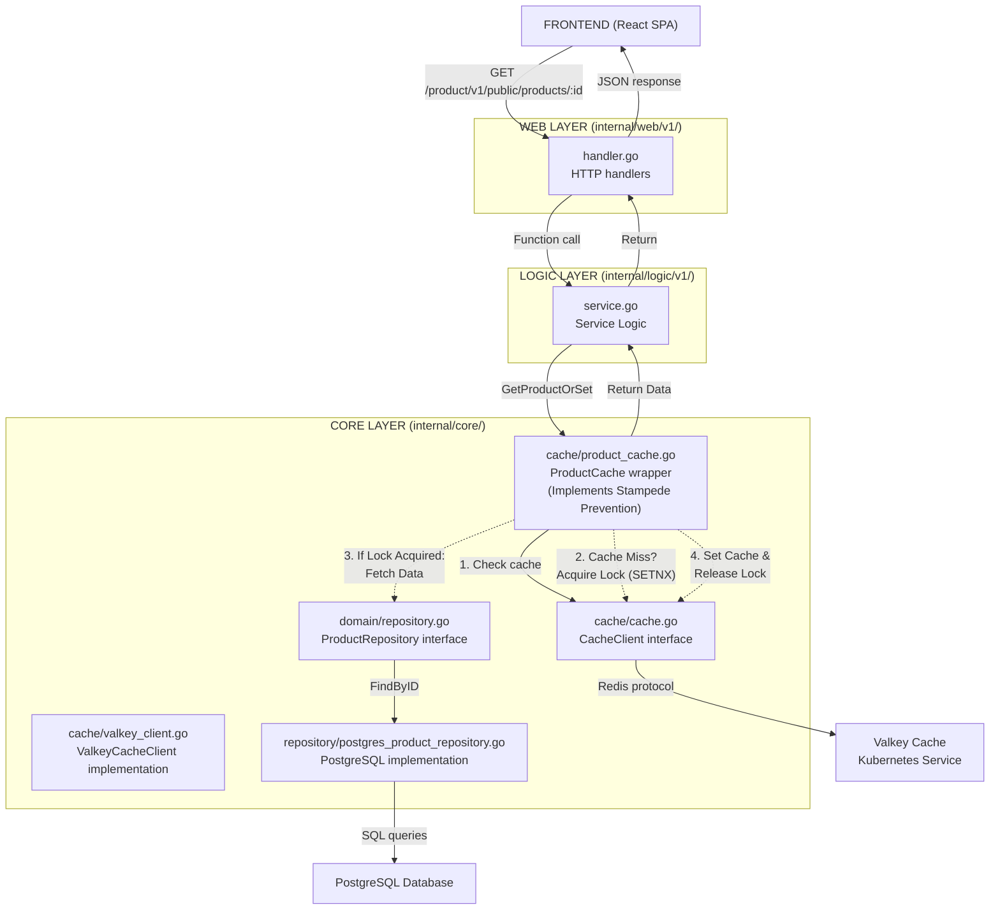
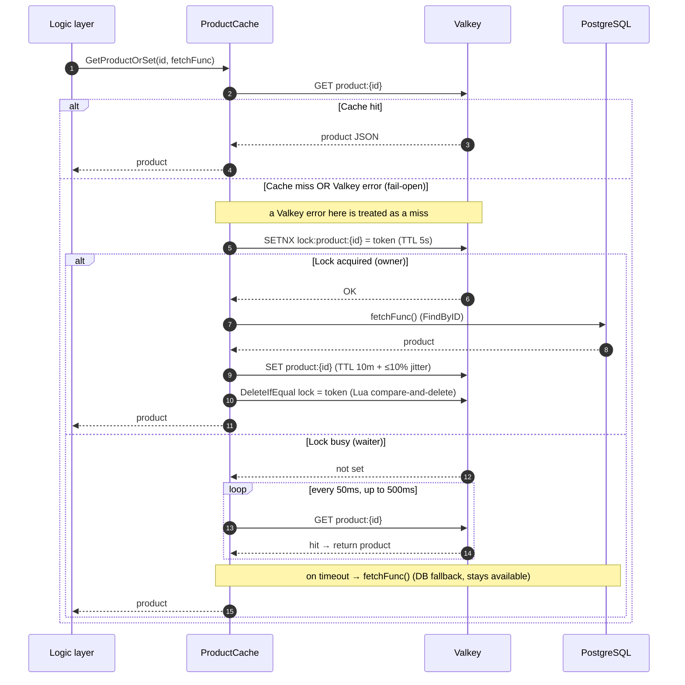

# Application Caching

Cache-Aside contract for services that adopt Valkey — layer placement, stampede locking, key conventions, env vars, fail-open semantics, and invalidation boundaries. **Reference implementation:** product-service (catalog reads only).

> **Platform ops** (Valkey Helm, eviction policy, Kong rate-limit db 1, metrics,
> troubleshooting) live in [Caching (platform)](../caching/README.md). Cross-service
> rules and roadmap: [RFC-0004](../proposals/rfc/RFC-0004/) (provisional).

| Attribute | Value | RFC / ADR |
|-----------|-------|-----------|
| **Pattern** | Cache-Aside (read-through), fail-open | — |
| **Reference impl** | product-service only (catalog) | — |
| **Platform backend** | [Caching (platform)](../caching/README.md) — Valkey, eviction, Kong db 1 | — |
| **Cross-cutting** | [Application observability](./observability.md) · [product.md](./product.md) | — |
| **Design record** | — | [RFC-0004](../proposals/rfc/RFC-0004/) (provisional) |

---

## Overview

Valkey caching is integrated into the Product service to improve performance for read-heavy endpoints. The implementation follows the **Cache-Aside pattern** and includes **Stampede Prevention** (Distributed Locking) for hot keys, a pattern common in high-traffic read-scaling architectures.

## Architecture Integration

The cache **abstraction** lives in the **Core Layer** (`internal/core/cache/`), following the same pattern as repository interfaces; the **cache-aside orchestration** (deciding when to read, populate, and invalidate) lives in the **Logic Layer**:



### Layer Responsibilities

- **Web Layer**: No changes - handles HTTP requests/responses as before
- **Logic Layer**: Implements Cache-Aside pattern
  - Check cache first via `ProductCache` interface
  - If cache hit → return cached data immediately
  - If cache miss → query repository → write cache → return data
- **Core Layer**: 
  - `cache/cache.go`: `CacheClient` interface (abstraction over cache implementation)
  - `cache/valkey_client.go`: `ValkeyCacheClient` implementation (Redis-compatible)
  - `cache/product_cache.go`: `ProductCache` wrapper with key generation and JSON serialization

## Cache Stampede Prevention

> **Note:** This advanced pattern is common in high-traffic PostgreSQL read-scaling architectures.

### The Problem: Thundering Herd
In a standard Cache-Aside pattern, a race condition occurs when a "hot" cache key expires:
1. **Cache Miss**: Key expires for a popular item (e.g., "iPhone 16").
2. **Concurrent Requests**: 1,000 users request this item simultaneously.
3. **DB Overload**: All 1,000 requests see a cache miss and trigger 1,000 database queries at the exact same moment.
4. **Impact**: Database CPU spikes, latency increases, potential outage.

### The Solution: Distributed Locking
We implement a **Locking Mechanism** (using Redis `SETNX`) to ensure only **one** process refreshes the cache.

1. **Request A** encounters cache miss.
2. **Request A** acquires a lock (`lock:product:123`) with a short TTL (5s). The lock value is a **per-acquisition random token**.
   - ✅ **Success**: Request A queries DB → updates cache → **releases the lock with a compare-and-delete** (a Lua script that deletes the key only if its value still equals A's token).
3. **Request B...Z** encounter cache miss.
4. **Request B...Z** try to acquire lock.
   - ❌ **Fail**: Lock already likely held by Request A.
   - **Wait**: They sleep 50ms and retry the cache check, for up to **500ms total**.
   - **Result**: They eventually read the fresh data put in cache by Request A.

**Benefit**: DB load = 1 query (instead of 1,000) on the happy path.

> **Why a token + compare-and-delete?** A plain `DEL` would let a slow request —
> whose 5s lock TTL already expired and was re-acquired by another worker — delete
> *someone else's* lock. The token-scoped release guarantees a worker only releases
> the lock it still owns.
>
> **Caveat — slow DB:** waiters give up after **500ms** and fall back to the DB to
> stay available. If the DB fetch itself exceeds 500ms (the exact "slow DB" case),
> multiple waiters fall through and query the DB. The lock bounds the herd on the
> *happy path*, not under a pathologically slow DB; raising the waiter budget trades
> availability for stronger herd protection.

## Cache-Aside Pattern Flow

The product service mounts caching only on **read** endpoints below. Routes are defined in `cmd/main.go` of [`product-service`](https://github.com/duynhlab/product-service):

| Method | Path | Audience | Caching |
|---|---|---|---|
| `GET` | `/product/v1/public/products` | public | list cache (`product:list:…`) |
| `GET` | `/product/v1/public/products/:id` | public | detail cache (`product:{id}`) + stampede lock |
| `GET` | `/product/v1/public/products/:id/details` | public | reuses detail cache (aggregates reviews) |
| `POST` | `/product/v1/internal/products` | **internal** (service-to-service only — not on gateway) | invalidates list cache |

### `GET /product/v1/public/products` — list products

1. **Logic Layer** calls `productCache.GetProductList(ctx, filters)`.
2. **Cache hit** → return cached products and total count immediately.
3. **Cache miss** →
   - Call `productRepo.FindAll(ctx, filters)` and `productRepo.Count(ctx, filters)`.
   - Query PostgreSQL.
   - Write result back via `productCache.SetProductList(ctx, filters, products, total)`.
   - Return data.

### `GET /product/v1/public/products/:id` — single product

1. **Logic Layer** calls `productCache.GetProductOrSet(ctx, id, fetchFunc)`.
2. **ProductCache** checks cache:
   - **Hit**: return cached product immediately.
   - **Miss**: try to acquire distributed lock (`lock:product:{id}`, TTL 5s).
3. **Locking logic**:
   - **Acquired**: call `fetchFunc` (DB query), `SET product:{id}` (TTL `CACHE_TTL_PRODUCT_DETAIL`, default 10m **plus ≤10% jitter**), release the lock via token-scoped compare-and-delete, return data.
   - **Busy**: spin every 50ms (re-checking cache) up to 500ms; on timeout fall back to `fetchFunc` to keep the request available.
   - **Fail-open**: if Valkey itself errors (the `GET` or the lock `SETNX`), the read degrades straight to `fetchFunc` (DB) instead of returning an error — see [Resilience & Failure Modes](#resilience--failure-modes).

#### Workflow (sequence)

The full single-product read path — cache hit, stampede-locked miss, waiter spin, and fail-open:



### `GET /product/v1/public/products/:id/details` — aggregation

Reuses the same single-product cache path (calls `ProductService.GetProduct` internally) and then aggregates review data from the review service. The product portion benefits from the detail cache and stampede lock; review aggregation is not cached at this layer.

### `POST /product/v1/internal/products` — create product (internal only)

> This route is on the **internal** audience and is **not exposed on the gateway**. It is reachable only via in-cluster service DNS. Today the boundary is Kong not exposing the route plus in-app controls; ingress NetworkPolicies are authored (`kubernetes/infra/configs/network-policies/`) and enforced by kindnet (Kind K8s 1.34+). See the [API audience model](./api.md#audience-segments).

1. Validate price, persist via `productRepo.Create(ctx, product)`.
2. **Cache invalidation**: call `productCache.InvalidateProductList(ctx)` to delete list cache keys so the new product appears in subsequent list queries.
3. Single-product detail cache is **not** invalidated here (a newly created `:id` cannot already exist in the detail cache).

## Resilience & Failure Modes

The cache is a **performance optimization, not a system of record**. Both read paths
**fail open**: any Valkey error (connection refused, timeout) is treated as a cache miss
and the read is served from PostgreSQL. A cache outage degrades latency, never availability.

| Concern | Behavior / bound |
|---|---|
| **Valkey outage** | List and detail reads fall back to the DB (fail-open). No 5xx from a dead cache. |
| **Lock-store outage** | `SETNX` error → skip the lock, read straight from the DB. |
| **Slow DB (> 500ms waiter budget)** | Waiters fall back to the DB; the single-flight guarantee is best-effort under a slow DB (see the Stampede caveat). |
| **Lock held by a crashed owner** | Auto-released by the 5s lock TTL; release is token-scoped compare-and-delete. |
| **TTL jitter** | List/detail TTLs carry ≤10% random jitter so keys created together don't expire in a synchronized wave. |
| **Negative caching** | **Not implemented** — repeated reads of a non-existent id always reach the DB (cache penetration). Acceptable today; revisit if hostile id-scanning appears. |

### Cache-aside write race (bounded-stale)

`CreateProduct` invalidates the list cache *after* the DB write. A concurrent `ListProducts`
that read the DB *before* the create committed can still write its (pre-create) result back
*after* the invalidation — re-populating a stale list entry. This is the well-known cache-aside
read-populate-vs-invalidate race. It is **bounded by `CACHE_TTL_PRODUCT_LIST` (5m)**: the stale
entry self-heals on expiry. Likewise the `SCAN`-based `InvalidateProductList` is not atomic and
can miss a list key created mid-scan; the same 5m bound applies. Do not rely on the list cache
for read-your-write consistency.

## Cache Ownership & Invalidation Boundary

**product-service is the sole owner of the product cache.** Two assumptions hold today and
must stay true, or the cache goes stale:

1. **Products are effectively immutable after creation.** The service exposes only create +
   read (no `Update`/`Delete`), so the detail cache (`product:{id}`) never needs single-key
   invalidation. **If an update/delete path is ever added it MUST call `InvalidateProduct(ctx, id)`**
   (and `InvalidateProductList`), or the detail cache serves stale data for up to
   `CACHE_TTL_PRODUCT_DETAIL` (10m).
2. **No other service writes product rows the cache reflects.** The `product-db` cluster is shared
   by product/cart/order; if another service mutates product data directly (e.g. decrements
   stock), product-service has **no invalidation hook** and serves stale detail data bounded by
   the 10m TTL. Today stock is not written this way; if it ever is, route the mutation through
   product-service or publish an invalidation event. This is a deliberate, documented boundary.
   Cross-service bust on reserve/release is tracked in [RFC-0004](../proposals/rfc/RFC-0004/) (not yet implemented).

## Cache Key Structure

### Single Product
```
product:{id}
```
Example: `product:123`

### Product List
```
product:list:{sha256 of the normalized filter tuple}
```
Example: `product:list:9f86d081884c7d659a2feaa0c55ad015a3bf4f1b2b0b822cd15d6c15b0f00a08`

The key is the **SHA-256 of the normalized `{category, search, sortBy, order, page, limit}`
tuple** (joined by an unambiguous delimiter), **not** a concatenation of the raw values.
Hashing removes a collision class: a free-text `search` containing the old `:` separator
(e.g. `search="a:b"`) would otherwise alias onto a different filter combination and serve the
wrong result set. The `product:list:` prefix is preserved so the `product:list:*` invalidation
SCAN still matches every variant.

**Normalized components** (defaults applied before hashing):
- `category`: "all" if empty
- `search`: "none" if empty
- `sortBy`: "created_at" default
- `order`: "asc"/"desc", "desc" default
- `page`: 1 default
- `limit`: 20 default

## Configuration

### Environment Variables

| Variable | Default | Description |
|----------|---------|-------------|
| `CACHE_ENABLED` | `true` | Enable/disable caching |
| `CACHE_HOST` | `valkey.cache-system.svc.cluster.local` | Valkey service hostname |
| `CACHE_PORT` | `6379` | Valkey service port |
| `CACHE_PASSWORD` | `` | Valkey password (empty for local dev) |
| `CACHE_DB` | `0` | Valkey database number |
| `CACHE_TTL_PRODUCT_LIST` | `5m` | TTL for product list cache |
| `CACHE_TTL_PRODUCT_DETAIL` | `10m` | TTL for single product cache |

> Each cached key's TTL gets a small random **jitter (≤10%)** on write so that keys created
> together (e.g. a warm-up burst) don't all expire in the same instant and trigger a
> synchronized refresh wave.

### Configuration Structure

```go
type CacheConfig struct {
    Enabled          bool          // Enable caching
    Host             string        // Cache host
    Port             string        // Cache port
    Password         string        // Cache password (optional)
    DB               int           // Cache database number
    TTLProductList   time.Duration // TTL for product list (default: 5m)
    TTLProductDetail time.Duration // TTL for single product (default: 10m)
}
```

## Observability (app instrumentation) {#observability-app-instrumentation}

Cache operations are traced via OpenTelemetry spans:

- `cache.hit`: Boolean attribute indicating cache hit/miss
- `cache.error`: Boolean attribute indicating cache operation errors
- `cache.write_error`: Boolean attribute indicating cache write failures
- `cache.invalidation_error`: Boolean attribute indicating cache invalidation failures

**Example Trace:**
```
product.list (Logic Layer)
  ├─ cache.hit: false
  ├─ products.count: 20
  └─ products.total: 150
```

Server-side Valkey metrics and hit-rate queries: [Caching (platform) § Observability](../caching/README.md#observability).

## References

- [Caching (platform)](../caching/README.md) — Valkey deployment, eviction, Kong db 1, ops
- [RFC-0004](../proposals/rfc/RFC-0004/) — cross-service caching contract (provisional)
- [product.md](./product.md) — product-specific cache policy summary
- [Application observability](./observability.md) — tracing middleware
- [3-Layer Architecture](./api.md#inside-each-service)
- [Redis Go Client](https://github.com/redis/go-redis)
- [Cache-Aside Pattern](https://docs.aws.amazon.com/AmazonElastiCache/latest/red-ug/Strategies.html)

_Last updated: 2026-07-22 — canonical app caching contract; moved from docs/caching/caching.md._
