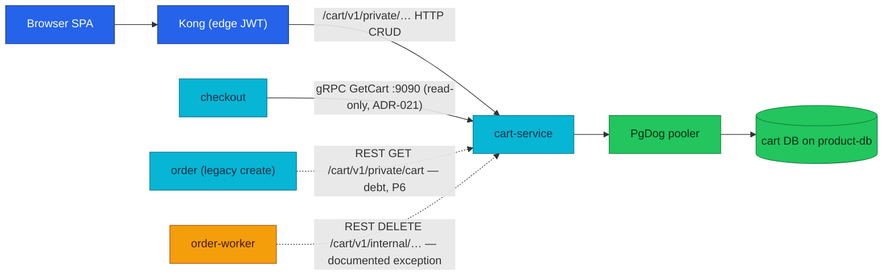

# Cart Service API

Cart turns browsing intent into a per-user, mutable basket — and hands checkout a read-only, minor-units snapshot of it.

| Dimension | Value |
|-----------|-------|
| **Local-stack** | Implemented |
| **Cluster** | Implemented |
| **HTTP** | private + internal clear · `:8080` · Kong `/cart/v1/private/` (local Kong: wide `/cart/` prefix) · edge JWT |
| **gRPC server** | `CartService/GetCart` · `:9090` |
| **gRPC client** | None |
| **Worker** | None |
| **Temporal** | Participant (REST) · `ClearCart` · [workflows.md](./workflows.md#order-fulfillment) |
| **Technical debt** | Legacy order→cart REST pricing hop · P6 removal · [Known gaps](#known-gaps) |

| | |
|---|---|
| **Repository** | [`duynhlab/cart-service`](https://github.com/duynhlab/cart-service) |
| **Owns** | Per-user cart and cart items (product/quantity selection + denormalized add-time price snapshot) |
| **Database** | `cart` on `product-db` via PgDog (`pgdog-product.product:6432`) |
| **Design record** | [ADR-021](../proposals/adr/ADR-021-cart-grpc-read-surface/) — cart gRPC read surface |

## Temporal participation

| Field | Value |
|-------|-------|
| **Role** | Participant (side-effect, REST) |
| **Workflow** | `OrderFulfillmentWorkflow` (owned by order) |
| **This service's steps** | `ClearCart` activity → `DELETE /cart/v1/internal/cart/:userId` after fulfillment — best-effort, no compensation |
| **Idempotency** | Delete-all-rows for one `user_id` — naturally idempotent; a replayed clear is a no-op |
| **Deep dive** | [workflows.md](./workflows.md#order-fulfillment) · [temporal-order-fulfillment.md](./temporal-order-fulfillment.md) |

Cart is the only saga participant reached over REST instead of gRPC — a
documented exception: the internal route lets the worker clear a cart **without
storing a user JWT in workflow history**, and a failed clear must never fail
the saga (the order already exists; a stale basket is a UX blemish, not a
money bug).

## Why it exists

Every commerce funnel needs a place where selection lives *before* money is
involved. Cart is that place — deliberately small:

- **It decides what you are buying** — which products, in which quantities,
  scoped to the authenticated user.
- **It does not decide what you pay.** The stored `product_price` is a
  denormalized snapshot taken at *add-to-cart* time, kept for display and for
  honest "price changed" comparisons. Checkout re-validates every line against
  product before confirm ([ADR-020](../proposals/adr/ADR-020-checkout-revalidation-policy/)).

Splitting those two authorities is the platform's answer to the stale-price
bug class: a catalog price change can never silently charge the old price,
because the money path (checkout → product) never trusts cart's copy.

## Architecture

One question: **who reads and writes the cart, and over which transport?**



Writes stay HTTP-and-browser-only; the single machine-to-machine surface is
the read-only gRPC snapshot. gRPC mTLS east-west is **Planned** (platform-wide
— see [DEPLOYMENT-STATUS.md](./DEPLOYMENT-STATUS.md)); today NetworkPolicy is
the fence.

## Data model

One table — `cart_items` (`db/migrations/sql/000001_init_schema.up.sql`):

| Column | Type | Notes |
|--------|------|-------|
| `id` | `SERIAL PK` | Item id surfaced as `:itemId` in the API |
| `user_id` | `INTEGER NOT NULL` | Cross-service reference to auth's user id — **no FK** (separate DBs) |
| `product_id` | `INTEGER NOT NULL` | Cross-service reference to product — no FK |
| `product_name` | `VARCHAR(255) NOT NULL` | Display snapshot at add time |
| `product_price` | `DECIMAL(10,2) NOT NULL` | **Add-time price snapshot** — display only, never the charge price |
| `quantity` | `INTEGER NOT NULL CHECK (quantity > 0)` | Positive-only, enforced in SQL and in logic |
| `created_at` / `updated_at` | `TIMESTAMP` | |

`UNIQUE (user_id, product_id)` is the shape-defining constraint: one row per
product per user, so "add the same product again" is an upsert, never a
duplicate line. Money is float dollars in this DB and on the browser wire;
the int64 minor-units conversion happens exactly once, at the gRPC boundary
(see Business rules).

## HTTP API

Shared rules (auth model, error envelope, pagination, data conventions) live
in [api.md](./api.md#common-http-contracts) — not repeated here. All private
routes require Kong edge JWT + in-service `pkg/authmw` verification;
`user_id` always comes from the verified JWT subject, never from request JSON
or query.

| Method | Path | Audience | Purpose |
|--------|------|----------|---------|
| `GET` | `/cart/v1/private/cart` | Private | The authenticated user's cart with totals |
| `POST` | `/cart/v1/private/cart` | Private | Add an item or increase its quantity (upsert) |
| `DELETE` | `/cart/v1/private/cart` | Private | Clear the authenticated user's cart |
| `GET` | `/cart/v1/private/cart/count` | Private | Item count for the SPA badge |
| `PATCH` | `/cart/v1/private/cart/items/:itemId` | Private | Set one item's quantity |
| `DELETE` | `/cart/v1/private/cart/items/:itemId` | Private | Remove one item |
| `DELETE` | `/cart/v1/internal/cart/:userId` | Internal | Post-saga clear — tokenless, NetworkPolicy-fenced, **not exposed at the cluster edge** (local-stack's wide prefix does route it, behind edge JWT — see below) |

Local-stack Kong routes the whole service on the wide `/cart/` prefix (JWT
plugin attached); the cluster ingress exposes only `/cart/v1/private/`.
Service paths are identical in both (Variant A pass-through,
`strip_path: false`) — see [DEPLOYMENT-STATUS.md](./DEPLOYMENT-STATUS.md#edge-exposure-verified).

### Add item — `POST /cart/v1/private/cart`

```json
{
  "product_id": "1",
  "product_name": "Mechanical Keyboard",
  "product_price": 89.99,
  "quantity": 1
}
```

The write is an upsert on `(user_id, product_id)` — adding an existing
product increments its quantity. The `INSERT … ON CONFLICT` form also
guarantees the pooler routes the statement to the primary.

### Cart response — `GET /cart/v1/private/cart`

```json
{
  "user_id": "1",
  "items": [
    {
      "id": "10",
      "product_id": "1",
      "product_name": "Mechanical Keyboard",
      "product_price": 89.99,
      "quantity": 1,
      "subtotal": 89.99
    }
  ],
  "subtotal": 89.99,
  "shipping": 5,
  "total": 94.99,
  "item_count": 1
}
```

The `shipping: 5` here is a flat display placeholder computed in the
repository layer — it is **not** the checkout shipping fee (that comes from
shipping's `GetQuote` and is composed inside checkout's session totals).

### Mutations & errors

| Mutation | Request | Success response |
|----------|---------|------------------|
| Update quantity | `{ "quantity": 2 }` | `200 {"message":"Cart item updated"}` |
| Remove item | No body | `200 {"message":"Cart item removed"}` |
| Clear cart | No body | `200 {"message":"Cart cleared"}` |
| Count | No body | `200 {"count": n}` |

| Status | Code | When |
|--------|------|------|
| `400` | `VALIDATION_ERROR` | Malformed body, non-positive quantity, missing `:userId` on the internal clear |
| `401` | `UNAUTHORIZED` | Missing/invalid JWT on private routes (edge filter + `pkg/authmw`) |
| `404` | `NOT_FOUND` | `GET /cart/v1/private/cart` when no cart rows exist for the user |
| `500` | `INTERNAL_ERROR` | Storage failure |

Envelope shape: [api.md § Error envelope](./api.md#error-envelope).

## gRPC API

| RPC | Request → Response | Saga | Notes |
|-----|--------------------|------|-------|
| `cart.v1.CartService/GetCart` | `GetCartRequest{user_id}` → `GetCartResponse{items[]}` | — | Checkout snapshot read at session create ([ADR-021](../proposals/adr/ADR-021-cart-grpc-read-surface/)). Items carry `cart_price_minor` (int64) |

Contract behavior worth knowing:

- **Empty is not an error.** An unknown user or an empty cart returns an
  empty item list, not a gRPC error — emptiness is a business condition the
  *caller* rules on (checkout answers `409 CONFLICT` on an empty snapshot).
- **Explicit `user_id`.** East-west calls carry no end-user JWT; checkout
  passes the JWT-derived user id explicitly. `InvalidArgument` if missing.
- **Read-only by design (ADR-021).** Browser writes stay HTTP; the post-saga
  clear stays a narrow internal REST route. The first machine-to-machine
  surface is deliberately limited to checkout's snapshot requirement.

Runtime conventions (single multi-port Service, `dns:///` addressing,
deadlines, health): [api.md § gRPC Runtime Model](./api.md#grpc-runtime-model).

## Business rules & techniques

- **Two-price authority model.** Cart answers *what* is selected;
  product answers *what it costs now*. Cart's stored price exists so checkout
  can flag `price_changed` lines honestly — it is never the charge price.
- **Upsert as the write primitive.** `ON CONFLICT (user_id, product_id) DO
  UPDATE` makes "add" idempotent in shape and race-safe: two concurrent adds
  of the same product converge to one row.
- **Minor units at the boundary, once.** The DB stores `DECIMAL` dollars; the
  gRPC wire is `cart_price_minor` int64. Conversion is one
  `math.Round(price * 100)` (half-away-from-zero) at the gRPC server —
  no float money ever crosses east-west. Quantities are clamped to `MaxInt32`
  defensively before the int→int32 wire conversion.
- **Owner scoping by JWT subject.** Every private handler resolves `user_id`
  from the verified token; a user cannot name another user's cart in any
  private request. The only by-`userId` surface is the internal clear, fenced
  by NetworkPolicy to the order workload.
- **One clear implementation, two doors.** Private
  `DELETE /cart/v1/private/cart` (JWT) and internal
  `DELETE /cart/v1/internal/cart/:userId` (saga) share the same logic and differ only
  in how the user id is resolved — and each attributes its source in metrics
  (`user_rest` vs `internal_saga`), so a saga-clear regression is visible.

### Authority summary

| Question | Authority |
|----------|-----------|
| Which products and quantities are selected? | Cart |
| What is the chargeable unit price? | Product, at checkout time (ADR-020) |
| Which user owns the private cart? | JWT subject verified by `pkg/authmw` |
| Who may call the tokenless internal clear? | NetworkPolicy-restricted order workload |

## Callers & dependencies

| Caller | Transport | What it does |
|--------|-----------|--------------|
| Browser SPA (via Kong) | HTTP private | Full cart CRUD + badge count |
| checkout | gRPC `GetCart` | Read-only snapshot at `POST /checkout/v1/private/checkout/sessions` |
| order (legacy create path) | REST `GET /cart/v1/private/cart` | Pricing read inside legacy `POST /order/v1/private/orders` — **Technical debt, P6** |
| order-worker (`ClearCart` activity) | REST `DELETE /cart/v1/internal/cart/:userId` | Best-effort basket clear after fulfillment |

Cart itself calls no other service — no gRPC client, no outbound REST. Its
only dependency is its database. Platform call graph:
[api.md § Current East-West Call Graph](./api.md#current-east-west-call-graph).

## Known gaps

- **Legacy order→cart REST pricing hop** — Technical debt. The legacy
  `POST /order/v1/private/orders` path still reads
  `GET /cart/v1/private/cart` for pricing, trusting cart's add-time price
  snapshot — exactly the stale-price gap RFC-0015 closed. Removal is planned
  for **P6** together with the legacy order create route
  ([RFC-0015](../proposals/rfc/RFC-0015/)).
- **gRPC mTLS** — Planned platform-wide (RFC-0020 research); `GetCart` is
  unauthenticated by design today, with NetworkPolicy as the fence.

## Operations

- **Probes:** `/health` and `/ready` on `:8080` (readiness drains
  `READINESS_DRAIN_DELAY` seconds on shutdown).
- **Key env:** `PORT` (8080), `GRPC_PORT` (9090), `DB_*` (+ `DB_POOL_MODE`,
  `DB_POOLER_TYPE` for PgDog), `AUTH_JWKS_URL`, `JWT_ISSUER`, `JWT_AUDIENCE`,
  `OTEL_COLLECTOR_ENDPOINT`, `PYROSCOPE_ENDPOINT`.
- **Business metrics** (OTLP, RFC-0017 W2):
  `cart_items_added_total{result}` (quantity-rejection KPI),
  `cart_cleared_total{source}` (`user_rest` vs `internal_saga` — a vanished
  `internal_saga` share means the saga clear is broken),
  `cart_snapshot_requests_total{result}` (gRPC reads: ok/empty/invalid/error).
- **Smoke via Kong** (local-stack, after login):

```bash
TOKEN=$(curl -s -X POST http://localhost:8080/auth/v1/public/auth/login \
  -H 'Content-Type: application/json' \
  -d '{"username":"alice","password":"password123"}' | jq -r .token)
curl -s http://localhost:8080/cart/v1/private/cart \
  -H "Authorization: Bearer $TOKEN" | jq .
```

## Code map

| Layer | Repo path |
|-------|-----------|
| Route wiring (private + internal groups) | `cart-service/cmd/main.go` |
| HTTP handlers | `cart-service/internal/web/v1/handler.go` |
| gRPC server (GetCart, minor-units boundary) | `cart-service/internal/grpc/v1/server.go` |
| Business logic | `cart-service/internal/logic/v1/service.go` |
| Business metrics | `cart-service/internal/logic/v1/metrics.go` |
| Domain types & errors | `cart-service/internal/core/domain/` |
| Repository (upsert, totals) | `cart-service/internal/core/repository/postgres_cart_repository.go` |
| Migrations & seed | `cart-service/db/migrations/sql/` · `cart-service/db/seed/sql/` |
| Proto contract | `pkg/proto/cart/v1/cart.proto` |

## References

- [api.md](./api.md) — shared HTTP/gRPC rules (auth, error envelope, gRPC runtime model)
- [workflows.md](./workflows.md) — Temporal workflow registry
- [DEPLOYMENT-STATUS.md](./DEPLOYMENT-STATUS.md) — platform deployment rollup
- [ADR-021](../proposals/adr/ADR-021-cart-grpc-read-surface/) — cart gRPC read surface
- [ADR-020](../proposals/adr/ADR-020-checkout-revalidation-policy/) — checkout re-validation policy
- [checkout.md](./checkout.md) · [product.md](./product.md) · [order.md](./order.md) — neighbor contracts
- [temporal-order-fulfillment.md](./temporal-order-fulfillment.md) — saga deep dive

_Last updated: 2026-07-21_
