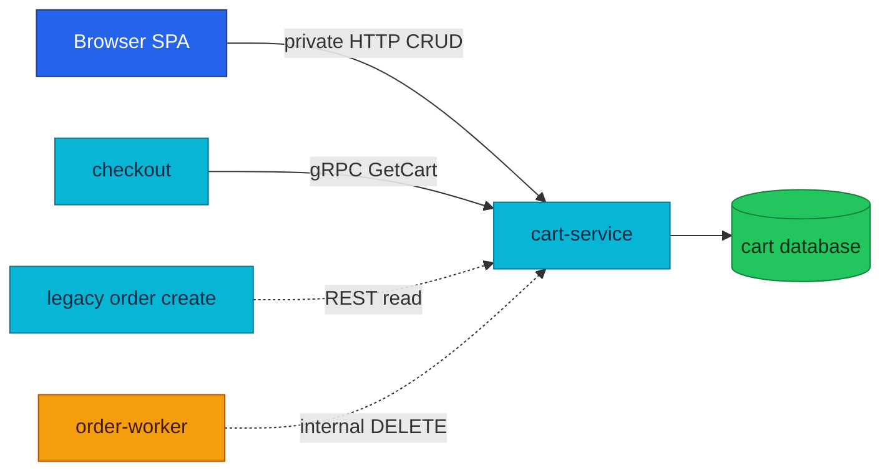

# Cart Service API

Cart owns each user's mutable shopping basket and exposes a read-only snapshot to checkout.

| Attribute | Value |
|---|---|
| **Status** | HTTP and gRPC implemented in local-stack; cluster checkout caller is deployed with RFC-0015 P5 |
| **Repository** | [`duynhlab/cart-service`](https://github.com/duynhlab/cart-service) |
| **Owns** | Per-user cart and cart items |
| **HTTP** | Private browser API plus an internal clear route on `:8080` |
| **gRPC** | Read-only `CartService/GetCart` on `:9090` |
| **Callers** | Browser, Checkout, legacy Order path, and order-worker clear activity |

## Overview

Cart decides which products and quantities the shopper selected. It does not
decide the final checkout price: its stored price is a denormalized snapshot,
and Checkout re-validates every line against Product before confirm.



## HTTP API

| Method | Path | Audience | Purpose |
|---|---|---|---|
| `GET` | `/cart/v1/private/cart` | Private | Get the authenticated user's cart |
| `POST` | `/cart/v1/private/cart` | Private | Add an item or increase its quantity |
| `DELETE` | `/cart/v1/private/cart` | Private | Clear the authenticated user's cart |
| `GET` | `/cart/v1/private/cart/count` | Private | Return the item count used by the SPA badge |
| `PATCH` | `/cart/v1/private/cart/items/:itemId` | Private | Set one item quantity |
| `DELETE` | `/cart/v1/private/cart/items/:itemId` | Private | Remove one item |
| `DELETE` | `/cart/v1/internal/cart/:userId` | Internal | Clear a cart after Saga completion without storing a JWT in workflow history |

### Add item

```json
{
  "product_id": "1",
  "product_name": "Mechanical Keyboard",
  "product_price": 89.99,
  "quantity": 1
}
```

The write is an upsert on `(user_id, product_id)`. `user_id` always comes from
the verified JWT, never request JSON.

### Cart response

```json
{
  "user_id": "1",
  "items": [
    {
      "id": "10",
      "product_id": "1",
      "product_name": "Mechanical Keyboard",
      "product_price": 89.99,
      "quantity": 1,
      "subtotal": 89.99
    }
  ],
  "subtotal": 89.99,
  "shipping": 5,
  "total": 94.99,
  "item_count": 1
}
```

| Mutation | Request | Success response |
|---|---|---|
| Update quantity | `{ "quantity": 2 }` | `200 {"message":"Cart item updated"}` |
| Remove item | No body | `200 {"message":"Cart item removed"}` |
| Clear cart | No body | `200 {"message":"Cart cleared"}` |
| Count | No body | `200 {"count": n}` |

## gRPC API

| RPC | Caller | Request | Response behavior |
|---|---|---|---|
| `cart.v1.CartService/GetCart` | Checkout | Explicit `user_id` | Items with `cart_price_minor`; empty cart is an empty list |

The gRPC contract is intentionally read-only. Browser writes remain HTTP, and
the post-Saga clear remains a narrow internal REST route. This keeps the first
machine-to-machine surface limited to Checkout's snapshot requirement.

## Authority and security

| Question | Authority |
|---|---|
| Which products and quantities are selected? | Cart |
| What is the current chargeable unit price? | Product at checkout time |
| Which user owns the private cart? | JWT subject verified by `pkg/authmw` |
| Who may call tokenless internal clear? | NetworkPolicy-restricted order workload |

## Operations

Cart exposes `/health` and `/ready` on `:8080`. HTTP, gRPC, and runtime
metrics are pushed over OTLP through the same observability pipeline.

## References

- [Shared API and gRPC conventions](api.md)
- [Checkout service](checkout.md)
- [Product service](product.md)
- [ADR-021: Cart gRPC read surface](../proposals/adr/ADR-021-cart-grpc-read-surface/)
- [Order-fulfillment Saga](temporal-order-fulfillment.md)

_Last updated: 2026-07-14_
