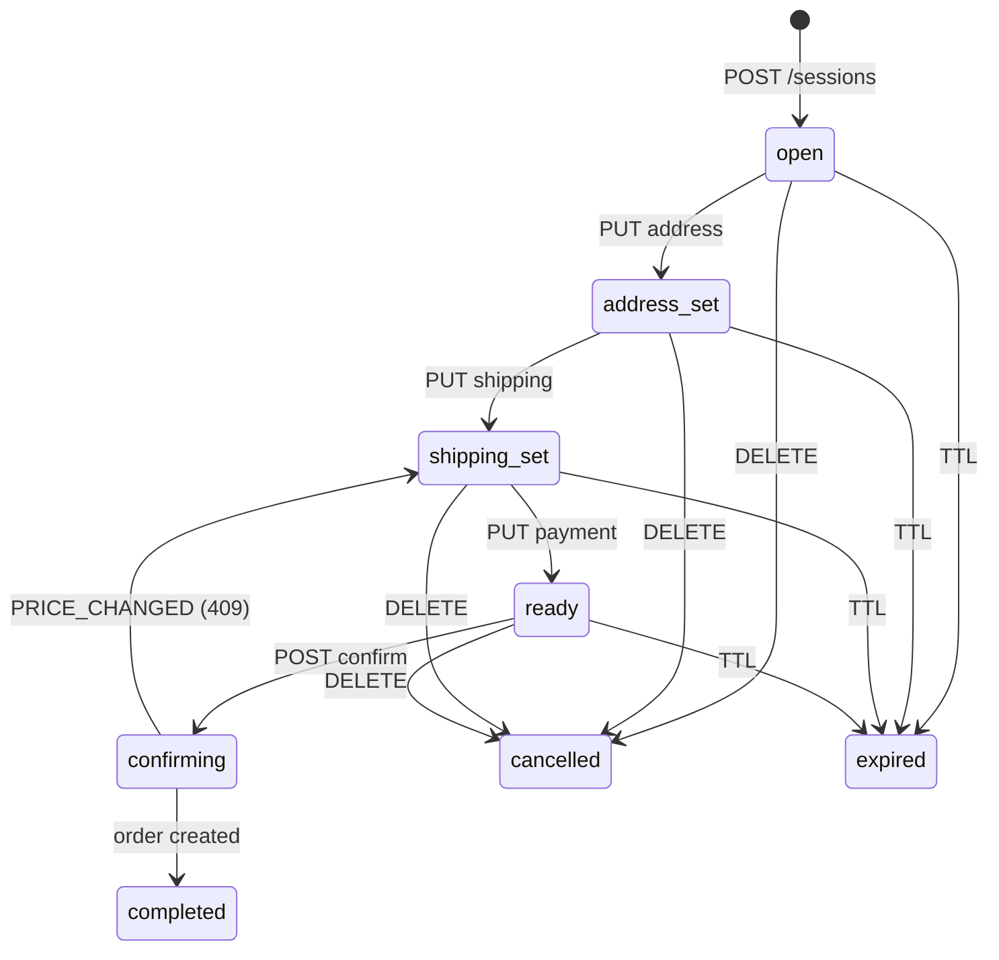
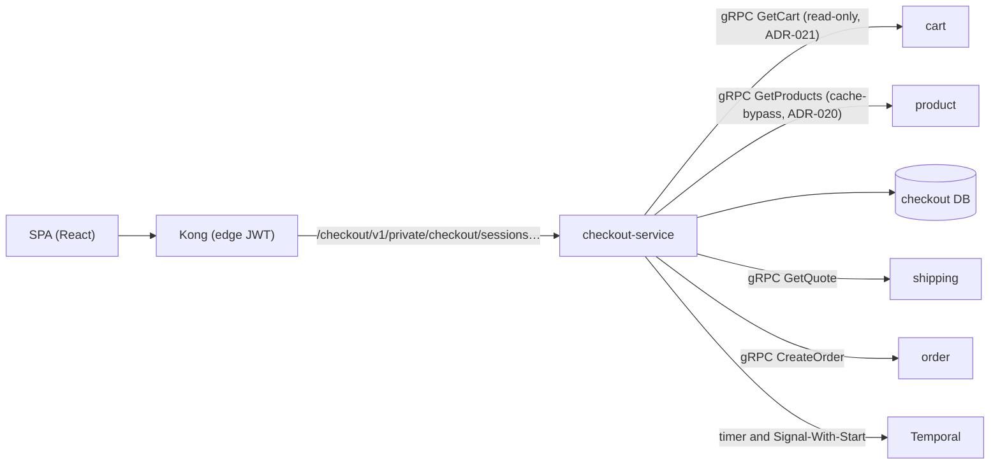

# Checkout — session orchestration, price re-validation & the order handoff

The service that turns "a cart" into "an order you can trust": checkout owns
the multi-step purchase funnel as a short-lived, auditable **session**, makes
sure the price you see is the price you pay, and hands a validated order to
order-service — which remains the only writer of orders.

| Attribute | Value |
|-----------|-------|
| **Design record** | [RFC-0015](../proposals/rfc/RFC-0015/) · [ADR-020](../proposals/adr/ADR-020-checkout-revalidation-policy/) (re-validation) · [ADR-021](../proposals/adr/ADR-021-cart-grpc-read-surface/) (cart read surface) |
| **Status** | **P1-P4 implemented in local-stack**: sessions, re-validation, confirm, abandonment, totals, SPA, and promo codes. **P5 cluster delivery and P6 legacy-path removal are planned.** |
| **Surface** | `/checkout/v1/private/checkout/sessions[…]` (process-named exception like auth — literal `checkout` segment, resources nested; v3.0.1) — private-only, Kong edge-JWT + in-service `pkg/authmw` |
| **East-west** | gRPC only: cart `GetCart`, product `GetProducts`, shipping `GetQuote`, and order `CreateOrder` |
| **Data** | `checkout` DB — `checkout_sessions`, `checkout_session_items`, `idempotency_keys` (P2), `tax_rules` (P3), `promo_codes` + `promo_redemptions` (P4); money in int64 minor units |
| **Repo** | [duynhlab/checkout-service](https://github.com/duynhlab/checkout-service) |

## Why it exists (the problem)

Before RFC-0015, checkout was a single POST: the SPA called
`POST /order/v1/private/orders` directly and order read prices from cart.
Three real gaps:

1. **Stale prices.** Cart stores `product_price` at *add-to-cart* time
   (possibly days earlier). Nothing re-checked against product before money
   was computed — a catalog price change silently charged the old price.
2. **No purchase state.** Address, shipping method, and payment selection had
   nowhere to live server-side; an interrupted checkout could not resume, and
   no step ordering was server-enforced.
3. **Weak idempotency at the top of the funnel.** The `Idempotency-Key` on
   `POST /orders` is optional; a double-clicked "Place order" was only safe
   if the SPA happened to send a key.

checkout-service answers all three with one concept: the **checkout
session** — an ephemeral record with a 30-minute TTL and an explicit state
machine.

## The session (the central concept)

A session is an **auditable quote**:

- **Snapshot.** Items come from cart (quantities, names) but **prices come
  from product** — two separate authorities: cart says *what* you are buying,
  product says *what it costs at checkout time* (ADR-020). Every line keeps
  both prices — `unit_price` (product) and `cart_price` (cart) on the wire,
  stored as `*_minor` cent columns internally. When they differ, the line is
  flagged `price_changed: true` and the SPA can say "price
  changed since you added this" — an honest funnel instead of a silently
  different one.
- **FSM.** State moves strictly forward through the funnel; edits under way
  re-enter the matching state, never jump ahead. The transition table lives
  in exactly ONE place (`internal/logic/v1/fsm.go`) — handlers never compare
  statuses themselves.
- **One active session per user.** `POST /sessions` is idempotent: an
  existing active session is returned (200) instead of creating a second one
  (201). A partial unique index enforces it, so even two racing requests
  produce one session (the loser receives the winner's session).

`completed`/`cancelled`/`expired` are terminal. `confirming` is **never
expired** (not even lazily): a confirm with an order handoff in flight must
finish as `completed` or drop back to `shipping_set` — it is never yanked
mid-flight.

## Architecture

checkout is a **client-only** service: nothing dials into it except Kong (no
gRPC server, no internal HTTP surface). Every outbound east-west call is gRPC
via `pkg/grpcx`.

## API

All routes are `private` — Kong edge-JWT is the coarse filter, in-service
`pkg/authmw` is authoritative, and sessions are **owner-scoped** by the JWT
`user_id`.

| Method | Path | Purpose | Errors worth knowing |
|--------|------|---------|----------------------|
| `POST` | `/checkout/v1/private/checkout/sessions` | Snapshot cart + re-validate prices → session `open`. **201** created, **200** existing active session (idempotent) | `409 CONFLICT` empty cart |
| `GET` | `/checkout/v1/private/checkout/sessions/:id` | Session + items + totals | `404` unknown **or someone else's** (anti-IDOR — indistinguishable); `410 SESSION_EXPIRED` past TTL |
| `PUT` | `/checkout/v1/private/checkout/sessions/:id/address` | Store the shipping address → `address_set` (re-editable from any pre-confirm state) | `400` missing/oversized fields; `409 INVALID_TRANSITION` from terminal states |
| `PUT` | `/checkout/v1/private/checkout/sessions/:id/shipping` | `{"shipping_method": "standard"}` → `shipping_set`. The fee comes from shipping's `GetQuote` (method × destination region) and a flat tax (seeded `tax_rules`, basis points on subtotal + fee) composes the total — all in minor units, recomputed in SQL | `400 VALIDATION_ERROR` unknown method/region; `409 INVALID_TRANSITION` before an address exists; `500 INTERNAL_ERROR` on shipping outage (only confirm maps upstream failures to `503` + `Retry-After` — a known asymmetry) |
| `PUT` | `/checkout/v1/private/checkout/sessions/:id/payment` | `{"payment_method_token": "tok_…"}` → `ready`. Opaque `tok_` references ONLY — PAN-shaped input is rejected **before** any persistence and never echoed (the order/payment rule) | `400 VALIDATION_ERROR` non-tok\_ input |
| `POST` | `/checkout/v1/private/checkout/sessions/:id/confirm` | The idempotent order handoff (below). Header `Idempotency-Key` REQUIRED (≤120 chars). **201** with the completed session incl. `order_id`; replays return the cached 201 | `400 IDEMPOTENCY_KEY_REQUIRED`; `409 PRICE_CHANGED` / `409 STOCK_UNAVAILABLE` (session requoted → `shipping_set`, **key not consumed** — re-review and confirm again with the same key); `409 CONFLICT` another confirm in flight; `409 IDEMPOTENCY_CONFLICT` same key, different session; `503` + `Retry-After` order/product transient (retry with the SAME key) |
| `DELETE` | `/checkout/v1/private/checkout/sessions/:id` | Cancel (idempotent on cancelled AND on a session the timer just expired) | `409 INVALID_TRANSITION` on completed |

Platform conventions apply: `snake_case` JSON, resources returned directly
(no wrapper envelope), the `{"error","code"}` error envelope, and dollars on
the wire (minor units internally, like order).

## Totals (P3, implemented) — one composition rule, owned by SQL

`total = subtotal + shipping_fee + tax − discount`, int64 minor units end to
end (dollars only on the browser wire). The parts have owners: **product** is
the price authority (subtotal), **shipping** is the fee authority
(`GetQuote`; static method × region table — `standard`/`express`,
domestic-VN vs rest-of-world), and **checkout** owns the flat tax rule
(`tax_rules`: region → rate_bps with a `DEFAULT` fallback, applied to
subtotal + fee). The stored total is always recomputed in SQL from persisted
components, so no client value can drift it. Changing the address
**invalidates the quote** in the same conditional write — method, fee, and
tax reset and the funnel returns through `PUT …/shipping`; a confirm-time
requote recomputes the tax on the fresh subtotal.

## Promo codes (P4, implemented) — apply is a preview, confirm is the ledger

`POST …/sessions/:id/promo {"code"}` attaches a code after a validated
preview (existence, expiry, remaining global/per-user capacity) and never
counts a use — abandoned sessions never burn one; `DELETE …/promo` detaches.
The discount re-derives from the current components at every totals change
(percent stays a percentage of the live subtotal, fixed stays clamped so the
total never goes negative) and rides `CreateOrder` so the charged total
equals the session total.

The **authoritative gate is the atomic redemption inside confirm**
(ADR-022): one transaction, serialized per code (`FOR UPDATE`), with
`UNIQUE (code, session_id)` as the idempotency anchor evaluated before any
expiry/cap check — crash re-drives count exactly once, both caps hold under
arbitrary concurrency (race-tested), and an exhausted/expired code at the
gate strips the promo to `shipping_set` with a `409 PROMO_EXHAUSTED` /
`409 PROMO_EXPIRED` carrying the fresh session body. The Idempotency-Key
survives every rejection. Watch `checkout_promo_redeemed_total` vs
`checkout_promo_rejected_total{reason}`.

## The confirm flow (P2, implemented) — one order per key, no matter what dies

Confirm is the only step that leaves checkout's own database: it hands the
validated session to order-service over gRPC (`order.v1/CreateOrder`,
ADR-018) and must create **at most one order per (user, Idempotency-Key)**
through any crash, retry, or race. Five mechanisms carry that guarantee:

1. **Claim** (`pkg/idempotency`, ADR-010): the key row is the retry ledger.
   A finished key replays its cached 201 verbatim; an in-flight key answers
   `409`; the claim's request hash binds the key to THIS session id.
2. **Session↔claim binding** (`confirm_key_id`): entering `confirming` CASes
   the claim id onto the row. A different Idempotency-Key can never act on a
   confirming (or completed) session — no second order, no post-hoc 201s.
3. **Attempt marker before CreateOrder**: a checkpoint (`subject_id = 0`) is
   written BEFORE the first order call, and price/stock re-validation runs
   only while no marker exists. A requote (PRICE_CHANGED) therefore can never
   coexist with an order that might already exist; marker re-entries always
   re-drive the idempotent CreateOrder instead.
4. **Deadline fencing**: the whole confirm runs under a 15s context; every
   write is ctx-bound, and the 90s lock-takeover window (startup-validated to
   be > 4× the deadline) therefore proves a taken-over owner is dead. Two
   live executions of the same key cannot exist.
5. **Transients never compensate**: order/product being down leaves the
   session `confirming`+bound and releases the key — an immediate same-key
   retry re-drives and converges (order-side idempotency makes the re-drive a
   replay, never a duplicate).

The known trade-off: a confirm that crashes and is never retried parks its
session in `confirming` (never expirable, blocks new sessions for that user).
The SPA persists the key per session so retry is always possible; the runbook
covers manual recovery — the marker tells ops whether an order attempt ever
happened (`subject_id IS NULL` ⇒ safe to unbind).

## Abandonment (P2, implemented) — the timer is a wake-up, never a verdict

`AbandonedCheckoutWorkflow` (one per session, Signal-With-Start from every
mutation; task queue `checkout`) makes expiry *timely*; the DB deadline
(`expires_at`, bumped to now+TTL by every successful mutation) stays the only
*authority* (ADR-019). When the timer fires, the `ExpireIfDue` activity
expires the row only if `expires_at <= now()`; if the deadline moved — a lost
signal, a TTL change, an idempotent reuse — it answers "not due + remaining"
and the workflow re-arms to the DB's own clock. Confirm/cancel signal
`finalize`; terminal and `confirming` rows make the watch exit (a later
mutation resurrects it). Losing Temporal entirely degrades expiry to the
lazy backstop and nothing else. Watch
`checkout_sessions_expired_total{reason}`: a lazy-majority means the worker
is down.

## How it works — three mechanisms worth learning

### 1. Price re-validation (closing the stale-price gap)

`POST /sessions` reads items from cart (`GetCart`), asks product for current
price + availability (`GetProducts` — **deliberately cache-bypassing**: the
cache serves browsing, the money path must read the real DB row), and locks
product prices into the snapshot. A product that vanished from the catalog is
still snapshotted (at cart price) but flagged — the hard gate is confirm-time
re-validation (P2). Re-validation runs **twice** by design: at session create
(UX honesty) and at confirm (the money moment).

### 2. The lazy-expiry backstop (correctness never depends on a worker)

The Temporal timer (P2) is a *janitor actor*, not the source of truth. The
truth is the `expires_at` column: **every** read and mutation first checks
`now > expires_at` — past the deadline the call answers `410 SESSION_EXPIRED`
and records `expired(lazy)` best-effort. With the worker down for an hour, no
expired session is ever honored; the worst degradation is "expiry recorded
late".

### 3. Optimistic concurrency at the SQL layer

Every transition is a conditional UPDATE (`WHERE status = $from`): losing a
race means zero rows affected → `409` "reload and retry" — one request never
overwrites another's state. Racing session creates are settled by the partial
unique index.

## Operations

- **Local-stack:** service `checkout` + `checkout-migrate` job + `checkout-worker`
  (the AbandonedCheckoutWorkflow poller, task queue `checkout`); migrations seed
  `tax_rules` and demo promo codes, sessions themselves have no seed; Kong route `/checkout/v1/private/` (edge JWT); no host port
  (platform convention — services are reached only through Kong). Audit:
  section **A9** in [`local-stack/README.md`](../../local-stack/README.md)
  (session lifecycle + price-change detection).
- **Key env:** `DB_*`, `AUTH_JWKS_URL`, `CART_GRPC_ADDR`,
  `PRODUCT_GRPC_ADDR`, `SHIPPING_GRPC_ADDR`, `ORDER_GRPC_ADDR`,
  `TEMPORAL_HOSTPORT`, `TEMPORAL_NAMESPACE`, and `SESSION_TTL_SECONDS`
  (1800).
- **Observability:** obsx OTLP (RFC-0014) — traces (chain
  tracing→logging→metrics), RED metrics, teed logs. Business metrics
  (`checkout_sessions_confirmed_total`, `checkout_sessions_expired_total{reason}`,
  `checkout_price_changed_total`, `checkout_confirm_duration_seconds`,
  `checkout_promo_redeemed_total`/`…_rejected_total`) land with P2+ flows. Operational signal to
  remember: a sustained majority of `expired{reason="lazy"}` means the worker
  is down or wedged.
- **Cluster (P5):** RSIP under the existing `checkout` domain ResourceSet,
  CNPG triplet, NetworkPolicies (Kong→8080; cart, product, order, and shipping each admit
  checkout→9090 — the full dial set of the confirm path). The netpol is a **release gate**: RFC-0015's east-west gRPC
  surface is unauthenticated by design and the fence is the policy.

## What checkout deliberately does NOT do (the boundary)

- **No order writes and no fulfillment saga starts** — checkout calls
  order-service's idempotent `CreateOrder` gRPC method. Order-service keeps
  the "insert pending + StartWorkflow in one place" invariant (ADR-018).
- **No stock reservation** — availability is *checked* only; reserving stays
  with the saga's `ReserveStock` (RFC-0003). The TOCTOU window between check
  and reserve is a named, accepted tradeoff in the RFC.
- **No card data** — `PUT …/payment` (P2) accepts only `tok_…` references;
  the stored token is `json:"-"` and never serialized outward.

## References

- [RFC-0015](../proposals/rfc/RFC-0015/) — full design record (alternatives, phases, exit criteria)
- [ADR-020](../proposals/adr/ADR-020-checkout-revalidation-policy/) · [ADR-021](../proposals/adr/ADR-021-cart-grpc-read-surface/)
- [api.md](./api.md) — shared HTTP and gRPC conventions
- [cart.md](./cart.md) · [product.md](./product.md) ·
  [shipping.md](./shipping.md) · [order.md](./order.md) — dependency contracts
- [microservices.md](./microservices.md) — feature matrix

_Last updated: 2026-07-13_
