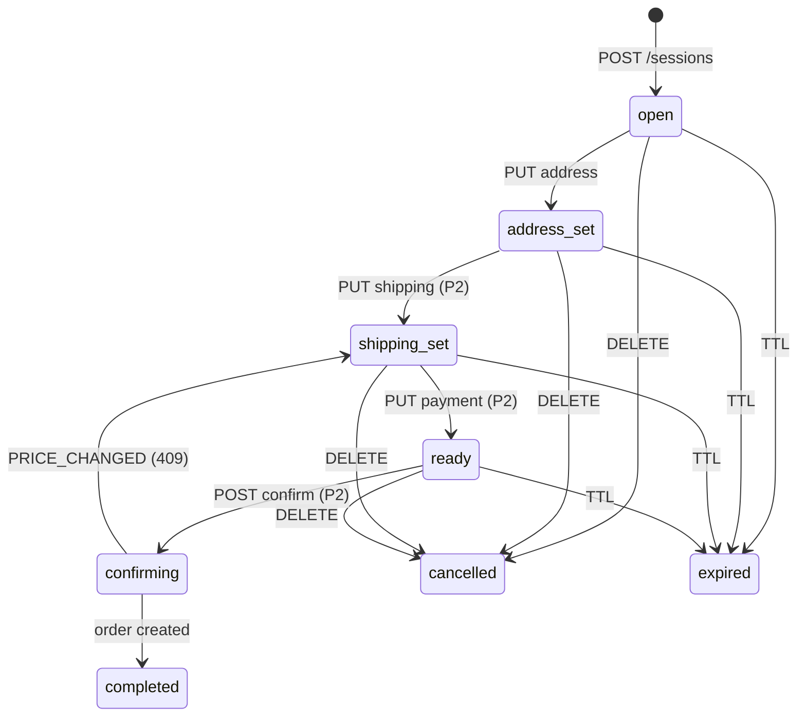
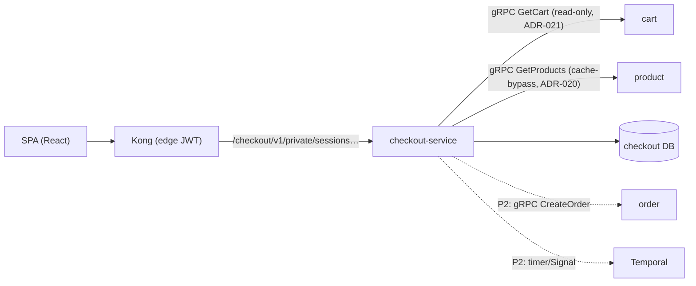

# Checkout — session orchestration, price re-validation & the order handoff

The service that turns "a cart" into "an order you can trust": checkout owns
the multi-step purchase funnel as a short-lived, auditable **session**, makes
sure the price you see is the price you pay, and hands a validated order to
order-service — which remains the only writer of orders.

| Attribute | Value |
|-----------|-------|
| **Design record** | [RFC-0015](../proposals/rfc/RFC-0015/) · [ADR-020](../proposals/adr/ADR-020-checkout-revalidation-policy/) (re-validation) · [ADR-021](../proposals/adr/ADR-021-cart-grpc-read-surface/) (cart read surface) |
| **Status** | **P1 implemented** (sessions + re-validation, local-stack); P2 confirm + abandonment timer, P3 totals + SPA, P4 promo, P5 cluster, P6 legacy-path removal |
| **Surface** | `/checkout/v1/private/sessions[…]` (collection noun `sessions`, ADR-017) — private-only, Kong edge-JWT + in-service `pkg/authmw` |
| **East-west** | gRPC only: cart `GetCart` (read-only), product `GetProducts` (cache-bypassing) |
| **Data** | `checkout` DB — `checkout_sessions` + `checkout_session_items`; money in int64 minor units |
| **Repo** | [duynhlab/checkout-service](https://github.com/duynhlab/checkout-service) |

## Why it exists (the problem)

Before RFC-0015, checkout was a single POST: the SPA called
`POST /order/v1/private/orders` directly and order read prices from cart.
Three real gaps:

1. **Stale prices.** Cart stores `product_price` at *add-to-cart* time
   (possibly days earlier). Nothing re-checked against product before money
   was computed — a catalog price change silently charged the old price.
2. **No purchase state.** Address, shipping method, and payment selection had
   nowhere to live server-side; an interrupted checkout could not resume, and
   no step ordering was server-enforced.
3. **Weak idempotency at the top of the funnel.** The `Idempotency-Key` on
   `POST /orders` is optional; a double-clicked "Place order" was only safe
   if the SPA happened to send a key.

checkout-service answers all three with one concept: the **checkout
session** — an ephemeral record with a 30-minute TTL and an explicit state
machine.

## The session (the central concept)

A session is an **auditable quote**:

- **Snapshot.** Items come from cart (quantities, names) but **prices come
  from product** — two separate authorities: cart says *what* you are buying,
  product says *what it costs at checkout time* (ADR-020). Every line keeps
  both `unit_price_minor` (product) and `cart_price_minor` (cart); when they
  differ the line is flagged `price_changed: true` and the SPA can say "price
  changed since you added this" — an honest funnel instead of a silently
  different one.
- **FSM.** State moves strictly forward through the funnel; edits under way
  re-enter the matching state, never jump ahead. The transition table lives
  in exactly ONE place (`internal/logic/v1/fsm.go`) — handlers never compare
  statuses themselves.
- **One active session per user.** `POST /sessions` is idempotent: an
  existing active session is returned (200) instead of creating a second one
  (201). A partial unique index enforces it, so even two racing requests
  produce one session (the loser receives the winner's session).

`completed`/`cancelled`/`expired` are terminal. `confirming` is **never
expired** (not even lazily): a confirm with an order handoff in flight must
finish as `completed` or drop back to `shipping_set` — it is never yanked
mid-flight.

## Architecture

checkout is a **client-only** service: nothing dials into it except Kong (no
gRPC server, no internal HTTP surface). Every outbound east-west call is gRPC
via `pkg/grpcx`.

## API (P1 surface)

All routes are `private` — Kong edge-JWT is the coarse filter, in-service
`pkg/authmw` is authoritative, and sessions are **owner-scoped** by the JWT
`user_id`.

| Method | Path | Purpose | Errors worth knowing |
|--------|------|---------|----------------------|
| `POST` | `/checkout/v1/private/sessions` | Snapshot cart + re-validate prices → session `open`. **201** created, **200** existing active session (idempotent) | `409 CONFLICT` empty cart |
| `GET` | `/checkout/v1/private/sessions/:id` | Session + items + totals | `404` unknown **or someone else's** (anti-IDOR — indistinguishable); `410 SESSION_EXPIRED` past TTL |
| `PUT` | `/checkout/v1/private/sessions/:id/address` | Store the shipping address → `address_set` (re-editable from any pre-confirm state) | `400` missing/oversized fields; `409 INVALID_TRANSITION` from terminal states |
| `DELETE` | `/checkout/v1/private/sessions/:id` | Cancel (idempotent on cancelled) | `409 INVALID_TRANSITION` on completed |

Platform conventions apply: `snake_case` JSON, the `{"error","code"}`
envelope, and int64 minor units for money (`2999` = $29.99 — floats never
cross a service boundary).

## How it works — three mechanisms worth learning

### 1. Price re-validation (closing the stale-price gap)

`POST /sessions` reads items from cart (`GetCart`), asks product for current
price + availability (`GetProducts` — **deliberately cache-bypassing**: the
cache serves browsing, the money path must read the real DB row), and locks
product prices into the snapshot. A product that vanished from the catalog is
still snapshotted (at cart price) but flagged — the hard gate is confirm-time
re-validation (P2). Re-validation runs **twice** by design: at session create
(UX honesty) and at confirm (the money moment).

### 2. The lazy-expiry backstop (correctness never depends on a worker)

The Temporal timer (P2) is a *janitor actor*, not the source of truth. The
truth is the `expires_at` column: **every** read and mutation first checks
`now > expires_at` — past the deadline the call answers `410 SESSION_EXPIRED`
and records `expired(lazy)` best-effort. With the worker down for an hour, no
expired session is ever honored; the worst degradation is "expiry recorded
late".

### 3. Optimistic concurrency at the SQL layer

Every transition is a conditional UPDATE (`WHERE status = $from`): losing a
race means zero rows affected → `409` "reload and retry" — one request never
overwrites another's state. Racing session creates are settled by the partial
unique index.

## Operations

- **Local-stack:** service `checkout` + `checkout-migrate` job (no seed — no
  demo data); Kong route `/checkout/v1/private/` (edge JWT); no host port
  (platform convention — services are reached only through Kong). Audit:
  section **A9** in [`local-stack/README.md`](../../local-stack/README.md)
  (session lifecycle + price-change detection).
- **Key env:** `DB_*`, `AUTH_JWKS_URL`, `CART_GRPC_ADDR`,
  `PRODUCT_GRPC_ADDR`, `SESSION_TTL_SECONDS` (1800).
- **Observability:** obsx OTLP (RFC-0014) — traces (chain
  tracing→logging→metrics), RED metrics, teed logs. Business metrics
  (`checkout_sessions_created_total`, `…_expired_total{reason}`,
  `checkout_price_changed_total`) land with P2+ flows. Operational signal to
  remember: a sustained majority of `expired{reason="lazy"}` means the worker
  is down or wedged.
- **Cluster (P5):** RSIP under the existing `checkout` domain ResourceSet,
  CNPG triplet, NetworkPolicies (Kong→8080; cart/product admit
  checkout→9090). The netpol is a **release gate**: RFC-0015's east-west gRPC
  surface is unauthenticated by design and the fence is the policy.

## What checkout deliberately does NOT do (the boundary)

- **No orders writes, no saga starts** — order-service keeps its "insert
  pending + StartWorkflow in one place" invariant (future ADR-018, P2).
- **No stock reservation** — availability is *checked* only; reserving stays
  with the saga's `ReserveStock` (RFC-0003). The TOCTOU window between check
  and reserve is a named, accepted tradeoff in the RFC.
- **No card data** — `PUT …/payment` (P2) accepts only `tok_…` references;
  the stored token is `json:"-"` and never serialized outward.

## References

- [RFC-0015](../proposals/rfc/RFC-0015/) — full design record (alternatives, phases, exit criteria)
- [ADR-020](../proposals/adr/ADR-020-checkout-revalidation-policy/) · [ADR-021](../proposals/adr/ADR-021-cart-grpc-read-surface/)
- [api-naming-convention.md](./api-naming-convention.md) — route inventory · [api.md](./api.md#checkout-service-rfc-0015-p1) — request/response shapes
- [grpc-internal-comms.md](./grpc-internal-comms.md) — the two new gRPC edges
- [microservices.md](./microservices.md) — feature matrix

_Last updated: 2026-07-12_
