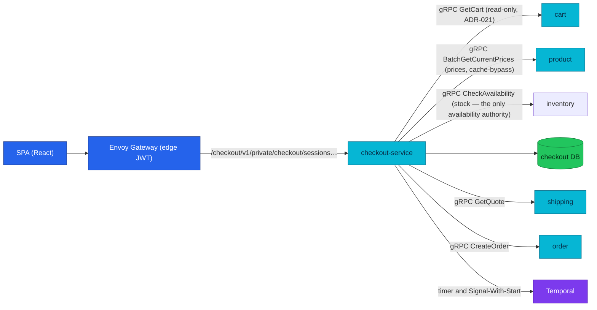
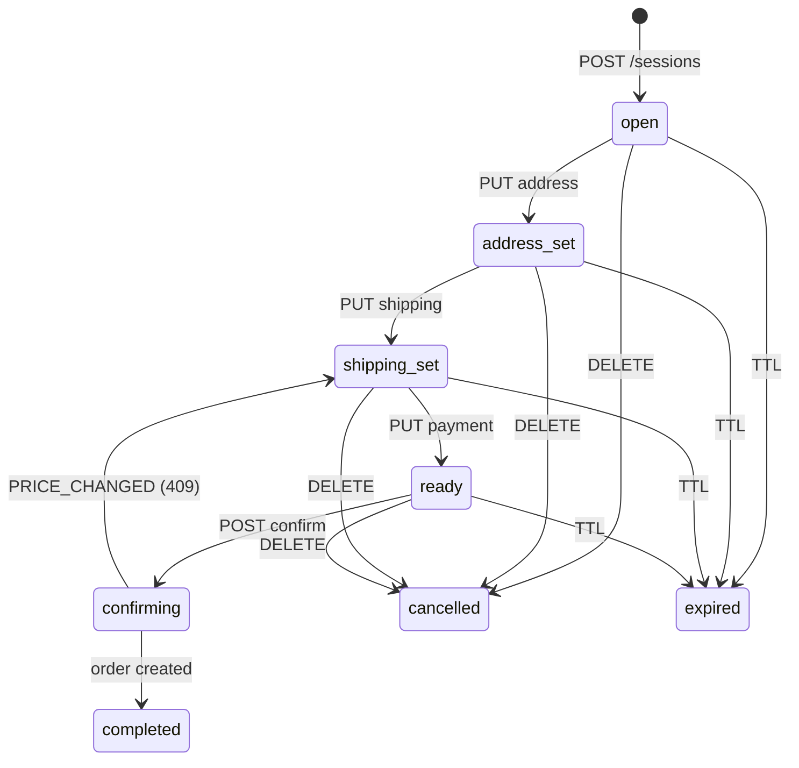

# Checkout Service API

The service that turns "a cart" into "an order you can trust": checkout owns
the multi-step purchase funnel as a short-lived, auditable **session**, makes
sure the price you see is the price you pay, and hands a validated order to
order-service — which remains the only writer of orders.

| Dimension | Value | Status |
|-----------|-------|--------|
| **Deployment** | local-stack + cluster | Implemented |
| **HTTP** | private only · `:8080` · edge `/checkout/v1/private/` (`jwt-edge` SecurityPolicy) | Implemented |
| **gRPC server** | None — client only | None |
| **gRPC client** | cart (`GetCart`), product (`BatchGetCurrentPrices`), inventory (`CheckAvailability`), shipping (`GetQuote`), order (`CreateOrder`) | Implemented |
| **Worker** | `checkout-worker` · queue `checkout` | Implemented |
| **Temporal** | Orchestrator · `AbandonedCheckoutWorkflow` · [workflows.md](./workflows.md#abandoned-checkout) | Implemented |
| **Technical debt** | None | None |

| Attribute | Value | RFC / ADR |
|-----------|-------|-----------|
| **Repository** | [`duynhlab/checkout-service`](https://github.com/duynhlab/checkout-service) | — |
| **Owns** | Checkout sessions: funnel state, price snapshots, confirm idempotency ledger, tax rules, promo codes | — |
| **Database** | `checkout` on `product-db` via PgDog (`pgdog-product.product:6432`) | — |
| **Design record** | — | [RFC-0015](../proposals/rfc/RFC-0015/) · [RFC-0021](../proposals/rfc/RFC-0021/) (inventory is the only availability authority; fail-closed) · [ADR-020](../proposals/adr/ADR-020-checkout-revalidation-policy/) (re-validation) · [ADR-021](../proposals/adr/ADR-021-cart-grpc-read-surface/) (cart read surface) · [ADR-027](../proposals/adr/ADR-027-inventory-sole-stock-authority/) (sole stock authority) · [ADR-019](../proposals/adr/ADR-019-session-expiry-model/) (session expiry model) · [ADR-053](../proposals/adr/ADR-053-untracked-sku-operator-data-not-outage/) (untracked SKU = `409 ITEM_NOT_ORDERABLE`) |

## Temporal participation

| Field | Value |
|-------|-------|
| **Role** | Orchestrator |
| **Workflow** | `AbandonedCheckoutWorkflow` — one per session, Signal-With-Start from every mutation |
| **Worker** | `checkout-worker` · task queue `checkout` · namespace `mop` (local-stack + cluster) |
| **Activities** | `ExpireIfDue` — in-process, touches only the checkout DB (no external participants) |
| **Idempotency** | The DB `expires_at` deadline is the only authority (ADR-019); the activity expires a row iff `expires_at <= now()`, otherwise re-arms to the DB clock |
| **Deep dive** | [workflows.md](./workflows.md#abandoned-checkout) · [Abandonment section below](#abandonment-p2-implemented--the-timer-is-a-wake-up-never-a-verdict) |

## Why it exists

Before RFC-0015, checkout was a single POST: the SPA called
`POST /order/v1/private/orders` directly and order read prices from cart.
Three real gaps:

1. **Stale prices.** Cart stores `product_price` at *add-to-cart* time
   (possibly days earlier). Nothing re-checked against product before money
   was computed — a catalog price change silently charged the old price.
2. **No purchase state.** Address, shipping method, and payment selection had
   nowhere to live server-side; an interrupted checkout could not resume, and
   no step ordering was server-enforced.
3. **Weak idempotency at the top of the funnel.** The `Idempotency-Key` on
   `POST /orders` is optional; a double-clicked "Place order" was only safe
   if the SPA happened to send a key.

checkout-service answers all three with one concept: the **checkout
session** — an ephemeral record with a 30-minute TTL and an explicit state
machine.

## Architecture

```mermaid
flowchart LR
    SPA["SPA (React)"] --> Edge["Envoy Gateway (edge JWT)"]
    Edge -->|"/checkout/v1/private/checkout/sessions…"| CK["checkout-service"]
    CK -->|"gRPC GetCart (read-only, ADR-021)"| CART[cart]
    CK -->|"gRPC BatchGetCurrentPrices (prices, cache-bypass)"| PROD[product]
    CK -->|"gRPC CheckAvailability (stock — the only availability authority)"| INV[inventory]
    CK --> DB[(checkout DB)]
    CK -->|"gRPC GetQuote"| SHIP[shipping]
    CK -->|"gRPC CreateOrder"| ORD[order]
    CK -->|"timer and Signal-With-Start"| TMP[Temporal]

    classDef edge fill:#2563eb,color:#fff,stroke:#1e3a8a;
    classDef service fill:#06b6d4,color:#082f49,stroke:#0e7490;
    classDef platform fill:#7c3aed,color:#fff,stroke:#5b21b6;
    classDef data fill:#22c55e,color:#052e16,stroke:#15803d;
    class SPA,Edge edge;
    class CK,CART,PROD,SHIP,ORD service;
    class TMP platform;
    class DB data;
```

checkout is a **client-only** service: nothing dials into it except the edge
(no gRPC server, no internal HTTP surface). Every outbound east-west call is gRPC
via `pkg/grpcx` — see [api.md § gRPC Runtime Model](./api.md#grpc-runtime-model).

## Data model

Tables: `checkout_sessions`, `checkout_session_items`, `idempotency_keys`
(P2), `tax_rules` (P3), `promo_codes` + `promo_redemptions` (P4). All money is
int64 minor units internally (`*_minor` cent columns); dollars only on the
browser wire. `user_id` columns (sessions and `idempotency_keys`) hold the
Keycloak `sub` — a string UUID since the RFC-0024 P3 cutover
([ADR-042](../proposals/adr/ADR-042-oidc-sub-as-user-id/); `idempotency_keys.user_id`
was `BIGINT`).

A session is an **auditable quote**:

- **Snapshot.** Items come from cart (quantities, names) but **prices come
  from product** — two separate authorities: cart says *what* you are buying,
  product says *what it costs at checkout time* (ADR-020). Every line keeps
  both prices — `unit_price` (product) and `cart_price` (cart) on the wire,
  stored as `*_minor` cent columns internally. When they differ, the line is
  flagged `price_changed: true` and the SPA can say "price
  changed since you added this" — an honest funnel instead of a silently
  different one.
- **FSM.** State moves strictly forward through the funnel; edits under way
  re-enter the matching state, never jump ahead. The transition table lives
  in exactly ONE place (`internal/logic/v1/fsm.go`) — handlers never compare
  statuses themselves.
- **One active session per user.** `POST /sessions` is idempotent: an
  existing active session is returned (200) instead of creating a second one
  (201). A partial unique index enforces it, so even two racing requests
  produce one session (the loser receives the winner's session).

```mermaid
stateDiagram-v2
    [*] --> open : POST /sessions
    open --> address_set : PUT address
    address_set --> shipping_set : PUT shipping
    shipping_set --> ready : PUT payment
    ready --> confirming : POST confirm
    confirming --> completed : order created
    confirming --> shipping_set : PRICE_CHANGED (409)
    open --> cancelled : DELETE
    address_set --> cancelled : DELETE
    shipping_set --> cancelled : DELETE
    ready --> cancelled : DELETE
    open --> expired : TTL
    address_set --> expired : TTL
    shipping_set --> expired : TTL
    ready --> expired : TTL
```

`completed`/`cancelled`/`expired` are terminal. `confirming` is **never
expired** (not even lazily): a confirm with an order handoff in flight must
finish as `completed` or drop back to `shipping_set` — it is never yanked
mid-flight.

## HTTP API

All routes are `private` — the edge's `jwt-edge` SecurityPolicy is the coarse filter, in-service
`pkg/authmw` is authoritative, and sessions are **owner-scoped** by the JWT
`user_id`. The path uses a process-named segment like auth (literal
`checkout` segment, resources nested; v3.0.1).

| Method | Path | Purpose | Errors worth knowing |
|--------|------|---------|----------------------|
| `POST` | `/checkout/v1/private/checkout/sessions` | Snapshot cart + re-validate prices → session `open`. **201** created, **200** existing active session (idempotent) | `409 CONFLICT` empty cart; `409 ITEM_NOT_ORDERABLE` (flat — no session exists yet to requote) when inventory does not track a cart SKU, no `Retry-After` ([ADR-053](../proposals/adr/ADR-053-untracked-sku-operator-data-not-outage/)); `503` + `Retry-After: 2` when cart/product/inventory is unreachable (0.5.1) or checkout's own database is unavailable (0.6.1) |
| `GET` | `/checkout/v1/private/checkout/sessions/:id` | Session + items + totals | `404` unknown **or someone else's** (anti-IDOR — indistinguishable); `410 SESSION_EXPIRED` past TTL; `503` + `Retry-After: 2` datastore unavailable (0.6.1) |
| `PUT` | `/checkout/v1/private/checkout/sessions/:id/address` | Store the shipping address → `address_set` (re-editable from any pre-confirm state) | `400` missing/oversized fields; `409 INVALID_TRANSITION` from terminal states; `503` + `Retry-After: 2` datastore unavailable (0.6.1, see below) |
| `PUT` | `/checkout/v1/private/checkout/sessions/:id/shipping` | `{"shipping_method": "standard"}` → `shipping_set`. The fee comes from shipping's `GetQuote` (method × destination region) and a flat tax (seeded `tax_rules`, basis points on subtotal + fee) composes the total — all in minor units, recomputed in SQL | `400 VALIDATION_ERROR` unknown method/region; `409 INVALID_TRANSITION` before an address exists; `500 INTERNAL_ERROR` on shipping outage (only create and confirm map upstream failures to `503` + `Retry-After` — a known asymmetry); `503` + `Retry-After: 2` datastore unavailable (0.6.1) |
| `PUT` | `/checkout/v1/private/checkout/sessions/:id/payment` | `{"payment_method_token": "tok_…"}` → `ready`. Opaque `tok_` references ONLY — PAN-shaped input is rejected **before** any persistence and never echoed (the order/payment rule) | `400 VALIDATION_ERROR` non-tok\_ input; `503` + `Retry-After: 2` datastore unavailable (0.6.1) |
| `POST` | `/checkout/v1/private/checkout/sessions/:id/confirm` | The idempotent order handoff (below). Header `Idempotency-Key` REQUIRED (≤120 chars). **201** with the completed session incl. `order_id`; replays return the cached 201 | `400 IDEMPOTENCY_KEY_REQUIRED`; `409 PRICE_CHANGED` / `409 STOCK_UNAVAILABLE` (session requoted → `shipping_set`, **key not consumed** — re-review and confirm again with the same key); `409 CONFLICT` another confirm in flight; `409 IDEMPOTENCY_CONFLICT` same key, different session; `503` + `Retry-After` order/product transient OR checkout's own datastore unavailable (0.6.1) — retry with the SAME key; `409 ITEM_NOT_ORDERABLE` **with the requoted session attached** when inventory does not track a SKU — the session is dropped back to `shipping_set` first (key not consumed), because that condition is persistent until an operator receives stock and `confirming` has no exit ([ADR-053](../proposals/adr/ADR-053-untracked-sku-operator-data-not-outage/); see below) |
| `POST` | `/checkout/v1/private/checkout/sessions/:id/promo` | `{"code"}` attaches a promo after a validated preview (see [Promo codes](#promo-codes-p4-implemented--apply-is-a-preview-confirm-is-the-ledger)) | `404 PROMO_INVALID` unknown code; `409 PROMO_EXPIRED` / `409 PROMO_EXHAUSTED` (a spent global cap or per-user limit — `409` here since 0.7.1, matching the confirm gate; it answered `500` before); `409 INVALID_TRANSITION` from a terminal state; `503` + `Retry-After: 2` datastore unavailable (0.6.1) |
| `DELETE` | `/checkout/v1/private/checkout/sessions/:id/promo` | Detach the promo | — |
| `DELETE` | `/checkout/v1/private/checkout/sessions/:id` | Cancel (idempotent on cancelled AND on a session the timer just expired) | `409 INVALID_TRANSITION` on completed; `503` + `Retry-After: 2` datastore unavailable (0.6.1) |

Platform conventions apply: `snake_case` JSON, resources returned directly
(no wrapper envelope), the `{"error","code"}` [error envelope](./api.md#error-envelope),
and dollars on the wire (minor units internally, like order).

## gRPC API

None — checkout runs **no gRPC server** (client only). Outbound calls, all
via `pkg/grpcx` on `dns:///<service>.<ns>.svc.cluster.local:9090`:

| Callee RPC | Used for | Saga | Contract owner |
|------------|----------|------|----------------|
| `cart.v1/GetCart` | Session snapshot (read-only, ADR-021) | — | [cart.md](./cart.md) |
| `product.v1/BatchGetCurrentPrices` | Price re-validation (cache-bypass, ADR-020) — the price half of the split read | — | [product.md](./product.md) |
| `inventory.v1/CheckAvailability` | Availability re-validation (RFC-0021 — inventory is the only availability authority) — fails closed at confirm (`503`), never maps to out-of-stock. `unknown_sku_ids` (a SKU with no balance row) is failed closed **and** requoted out of `confirming`: the condition is persistent, and a persistent condition parked in `confirming` has no exit — no FSM edge to `cancelled`, `lazyExpire` skips the state, and `FindActiveByUserID` keeps returning it. The SKU ids go to the log and the span, never the response body. An untracked SKU (`unknown_sku_ids`) answers `409 ITEM_NOT_ORDERABLE` — a persistent conflict for the operator to fix, distinct from `STOCK_UNAVAILABLE`'s wait-for-restock ([ADR-053](../proposals/adr/ADR-053-untracked-sku-operator-data-not-outage/)); transient upstream failure keeps the retryable `503` | — | [inventory.md](./inventory.md) |
| `shipping.v1/GetQuote` | Shipping fee (method × region) | — | [shipping.md](./shipping.md) |
| `order.v1/CreateOrder` | The confirm handoff (idempotent, ADR-018) | — | [order.md](./order.md) |

The order-fulfillment saga starts inside order-service, never here — the
`AbandonedCheckoutWorkflow` has no gRPC participants (in-process activities
only).

## Business rules & techniques

### Totals (P3, implemented) — one composition rule, owned by SQL

`total = subtotal + shipping_fee + tax − discount`, int64 minor units end to
end (dollars only on the browser wire). The parts have owners: **product** is
the price authority (subtotal), **shipping** is the fee authority
(`GetQuote`; static method × region table — `standard`/`express`,
domestic-VN vs rest-of-world), and **checkout** owns the flat tax rule
(`tax_rules`: region → rate_bps with a `DEFAULT` fallback, applied to
subtotal + fee). The stored total is always recomputed in SQL from persisted
components, so no client value can drift it. Changing the address
**invalidates the quote** in the same conditional write — method, fee, and
tax reset and the funnel returns through `PUT …/shipping`; a confirm-time
requote recomputes the tax on the fresh subtotal.

### Promo codes (P4, implemented) — apply is a preview, confirm is the ledger

`POST …/sessions/:id/promo {"code"}` attaches a code after a validated
preview (existence, expiry, remaining global/per-user capacity) and never
counts a use — abandoned sessions never burn one; `DELETE …/promo` detaches.
The discount re-derives from the current components at every totals change
(percent stays a percentage of the live subtotal, fixed stays clamped so the
total never goes negative) and rides `CreateOrder` so the charged total
equals the session total.

Every preview refusal is a status the shopper can act on: `404 PROMO_INVALID`
for an unknown code, `409 PROMO_EXPIRED` past its date, `409 PROMO_EXHAUSTED`
once a global cap or per-user limit is spent. That last one answered
`500 INTERNAL_ERROR` until 0.7.1 — `respondSessionError` simply had no arm for
it — so a shopper typing a used-up code was told the service was broken while
the confirm gate worded the identical condition correctly.

The **authoritative gate is the atomic redemption inside confirm**
(ADR-022): one transaction, serialized per code (`FOR UPDATE`), with
`UNIQUE (code, session_id)` as the idempotency anchor evaluated before any
expiry/cap check — crash re-drives count exactly once, both caps hold under
arbitrary concurrency (race-tested), and an exhausted/expired code at the
gate strips the promo to `shipping_set` with a `409 PROMO_EXHAUSTED` /
`409 PROMO_EXPIRED` carrying the fresh session body. The Idempotency-Key
survives every rejection. Watch `checkout_promo_redeemed_total` vs
`checkout_promo_rejected_total{reason}` — noting that the rejected counter is
incremented **only at the confirm gate**, so preview refusals at apply do not
appear in it and the ratio reads healthier than reality.

### The confirm flow (P2, implemented) — one order per key, no matter what dies

Confirm is the only step that leaves checkout's own database: it hands the
validated session to order-service over gRPC (`order.v1/CreateOrder`,
ADR-018) and must create **at most one order per (user, Idempotency-Key)**
through any crash, retry, or race. Five mechanisms carry that guarantee:

1. **Claim** (`pkg/idempotency`, ADR-010): the key row is the retry ledger.
   A finished key replays its cached 201 verbatim; an in-flight key answers
   `409`; the claim's request hash binds the key to THIS session id.
2. **Session↔claim binding** (`confirm_key_id`): entering `confirming` CASes
   the claim id onto the row. A different Idempotency-Key can never act on a
   confirming (or completed) session — no second order, no post-hoc 201s.
3. **Attempt marker before CreateOrder**: a checkpoint (`subject_id = 0`) is
   written BEFORE the first order call, and price/stock re-validation runs
   only while no marker exists. A requote (PRICE_CHANGED) therefore can never
   coexist with an order that might already exist; marker re-entries always
   re-drive the idempotent CreateOrder instead.
4. **Deadline fencing**: the whole confirm runs under a 15s context; every
   write is ctx-bound, and the 90s lock-takeover window (startup-validated to
   be > 4× the deadline) therefore proves a taken-over owner is dead. Two
   live executions of the same key cannot exist.
5. **Transients never compensate**: order/product being down leaves the
   session `confirming`+bound and releases the key — an immediate same-key
   retry re-drives and converges (order-side idempotency makes the re-drive a
   replay, never a duplicate).

The known trade-off: a confirm that crashes and is never retried parks its
session in `confirming` (never expirable, blocks new sessions for that user).
The SPA persists the key per session so retry is always possible; the runbook
covers manual recovery — the marker tells ops whether an order attempt ever
happened (`subject_id IS NULL` ⇒ safe to unbind).

### Abandonment (P2, implemented) — the timer is a wake-up, never a verdict

`AbandonedCheckoutWorkflow` (one per session, Signal-With-Start from every
mutation; task queue `checkout`) makes expiry *timely*; the DB deadline
(`expires_at`, bumped to now+TTL by every successful mutation) stays the only
*authority* (ADR-019). When the timer fires, the `ExpireIfDue` activity
expires the row only if `expires_at <= now()`; if the deadline moved — a lost
signal, a TTL change, an idempotent reuse — it answers "not due + remaining"
and the workflow re-arms to the DB's own clock. Confirm/cancel signal
`finalize`; terminal and `confirming` rows make the watch exit (a later
mutation resurrects it). Losing Temporal entirely degrades expiry to the
lazy backstop and nothing else. Watch
`checkout_sessions_expired_total{reason}`: a lazy-majority means the worker
is down.

### Price re-validation (closing the stale-price gap)

`POST /sessions` reads items from cart (`GetCart`), then split-reads the money
data (RFC-0021): **prices from product**
(`BatchGetCurrentPrices` — deliberately cache-bypassing: the cache serves
browsing, the money path must read the real DB row) and **availability from
inventory** (`CheckAvailability`). There is no fallback: `GetProducts` was
removed from the contract in product 1.8.0, and a missing availability answer
fails closed. Prices are locked into the snapshot. A product that vanished from the catalog is
still snapshotted (at cart price) but flagged — the hard gate is confirm-time
re-validation (P2). Re-validation runs **twice** by design: at session create
(UX honesty) and at confirm (the money moment).

### The lazy-expiry backstop (correctness never depends on a worker)

The Temporal timer (P2) is a *janitor actor*, not the source of truth. The
truth is the `expires_at` column: **every** read and mutation first checks
`now > expires_at` — past the deadline the call answers `410 SESSION_EXPIRED`
and records `expired(lazy)` best-effort. With the worker down for an hour, no
expired session is ever honored; the worst degradation is "expiry recorded
late".

### Optimistic concurrency at the SQL layer

Every transition is a conditional UPDATE (`WHERE status = $from`): losing a
race means zero rows affected → `409` "reload and retry" — one request never
overwrites another's state. Racing session creates are settled by the partial
unique index.

## Callers & dependencies

**Inbound:** only the SPA via the edge (`/checkout/v1/private/`, `jwt-edge` SecurityPolicy). No
service calls checkout — no gRPC server, no internal HTTP surface.

**Outbound:** the five gRPC callees above (cart, product, inventory, shipping, order)
plus Temporal (Signal-With-Start + timers) and the `checkout` DB.

What checkout deliberately does NOT do (the boundary):

- **No order writes and no fulfillment saga starts** — checkout calls
  order-service's idempotent `CreateOrder` gRPC method. Order-service keeps
  the "insert pending + StartWorkflow in one place" invariant (ADR-018).
- **No stock reservation** — availability is *checked* only; reserving stays
  with the saga's `ReserveInventory` activity against `inventory.v1/Reserve` — the
  product `ReserveStock`/`ReleaseStock` RPCs left the contract in pkg v0.33.0. The
  TOCTOU window between check
  and reserve is a named, accepted tradeoff in the RFC.
- **No card data** — `PUT …/payment` (P2) accepts only `tok_…` references;
  the stored token is `json:"-"` and never serialized outward.

## Known gaps

- **Promo lock contention answers `500`, deliberately** (0.6.2): redemptions
  of one code serialize on a row lock, and a queue longer than 2s surfaces as
  SQLSTATE `55P03` — contention is a load/design signal that must stay
  visible, not a retryable outage; classifying it as `503` would let a hot
  promo code manufacture fake-failover pages.
- **Error-mapping asymmetry** (accepted): a shipping-service outage during
  `PUT …/shipping` still answers `500`; only session create and confirm map
  *upstream* failures to `503` + `Retry-After`. Checkout's **own datastore**
  being unavailable answers `503` + `Retry-After: 2` on every session
  endpoint since 0.6.1 — safe to advertise as retryable because every write
  is idempotency-keyed or a conditional update.
- **Parked `confirming` session** (accepted trade-off): a crashed,
  never-retried confirm blocks new sessions for that user until manual
  recovery per the runbook.
- **gRPC mTLS** on the east-west confirm path is **Planned** platform-wide
  (RFC-0020 research); today NetworkPolicy is the fence.

## Operations

- **Local-stack:** service `checkout` + `checkout-migrate` job + `checkout-worker`
  (the AbandonedCheckoutWorkflow poller, task queue `checkout`); migrations seed
  `tax_rules` and demo promo codes, sessions themselves have no seed; `HTTPRoute` `/checkout/v1/private/` (`jwt-edge` SecurityPolicy); no host port
  (platform convention — services are reached only through the edge). Audit:
  sections **A9-A10** in
  [`local-stack/docs/e2e-audit.md`](../../local-stack/docs/e2e-audit.md)
  (session lifecycle, price-change detection, confirm + abandonment).
- **Key env:** `DB_*`, `OIDC_ISSUER`/`OIDC_AUDIENCE`/`OIDC_JWKS_URL` (pkg v0.37.0), `CART_GRPC_ADDR`,
  `PRODUCT_GRPC_ADDR`, `INVENTORY_GRPC_ADDR`, `SHIPPING_GRPC_ADDR`, `ORDER_GRPC_ADDR`,
  `TEMPORAL_HOSTPORT`, `TEMPORAL_NAMESPACE`, and `SESSION_TTL_SECONDS`
  (1800).
- **Observability:** obsx OTLP (RFC-0014) — traces (chain
  tracing→logging→metrics), RED metrics, teed logs. Business metrics
  (`checkout_sessions_confirmed_total`, `checkout_sessions_expired_total{reason}`,
  `checkout_price_changed_total`, `checkout_confirm_duration_seconds`,
  `checkout_promo_redeemed_total`/`…_rejected_total`) land with P2+ flows. Operational signal to
  remember: a sustained majority of `expired{reason="lazy"}` means the worker
  is down or wedged.
- **Cluster (P5):** RSIP under the existing `checkout` domain ResourceSet,
  CNPG triplet, NetworkPolicies (envoy-gateway→8080; cart, product, inventory, order, and shipping
  each admit checkout→9090 — the full dial set of the confirm path). The netpol is a **release gate**: RFC-0015's east-west gRPC
  surface is unauthenticated by design and the fence is the policy.

## Code map

Paths in [`duynhlab/checkout-service`](https://github.com/duynhlab/checkout-service). Transport peers call `logic/v1`; logic calls `core` only ([api.md § Inside Each Service](./api.md#inside-each-service)).

| Layer | Path | Notes |
|-------|------|-------|
| **Transport** | `internal/web/v1/handler.go` | HTTP handlers |
| **logic** | `internal/logic/v1/service.go` | Session logic |
| | `internal/logic/v1/fsm.go` | FSM |
| | `internal/logic/v1/confirm.go` | Confirm flow |
| | `internal/logic/v1/promo.go` | Promo codes |
| **core** | `internal/core/domain/` | Session, token redaction |
| | `internal/core/repository/postgres/` | Repository (SQL) |
| **Platform** | `cmd/main.go` | Entry point (API + worker modes) |
| | `internal/workflow/abandon.go`, `lazy.go`, `notifier.go` | Abandonment workflow + activities |
| | `internal/clients/clients.go` | gRPC clients |
| | `db/migrations/sql/` | Migrations (schema + seeds) |
| | `pkg/proto/{cart,inventory,order,product,shipping}/v1/*.proto` | Protos consumed |

## References

- [RFC-0015](../proposals/rfc/RFC-0015/) — full design record (alternatives, phases, exit criteria)
- [ADR-020](../proposals/adr/ADR-020-checkout-revalidation-policy/) · [ADR-021](../proposals/adr/ADR-021-cart-grpc-read-surface/)
- [api.md](./api.md) — shared HTTP and gRPC conventions
- [workflows.md](./workflows.md) — workflow registry · [Service contracts](./README.md#service-contracts)
- [cart.md](./cart.md) · [product.md](./product.md) · [shipping.md](./shipping.md) · [order.md](./order.md) — dependency contracts
- [microservices.md](./microservices.md) — feature matrix

_Last updated: 2026-08-12 — RFC-0024 P3 identity cutover: string `user_id` (Keycloak `sub`) in sessions and the idempotency ledger, `OIDC_*` verification env._
