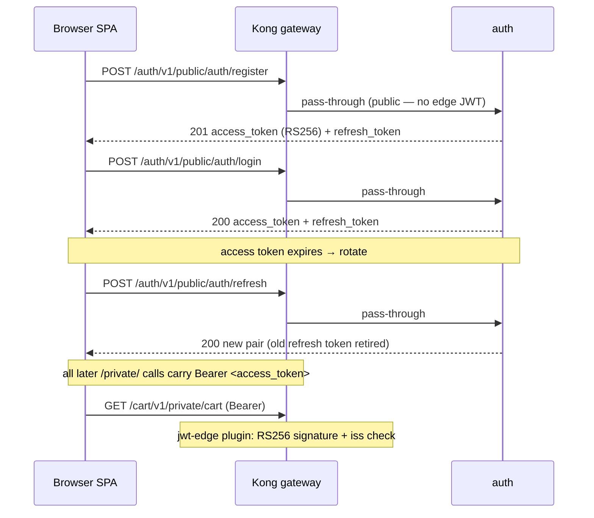
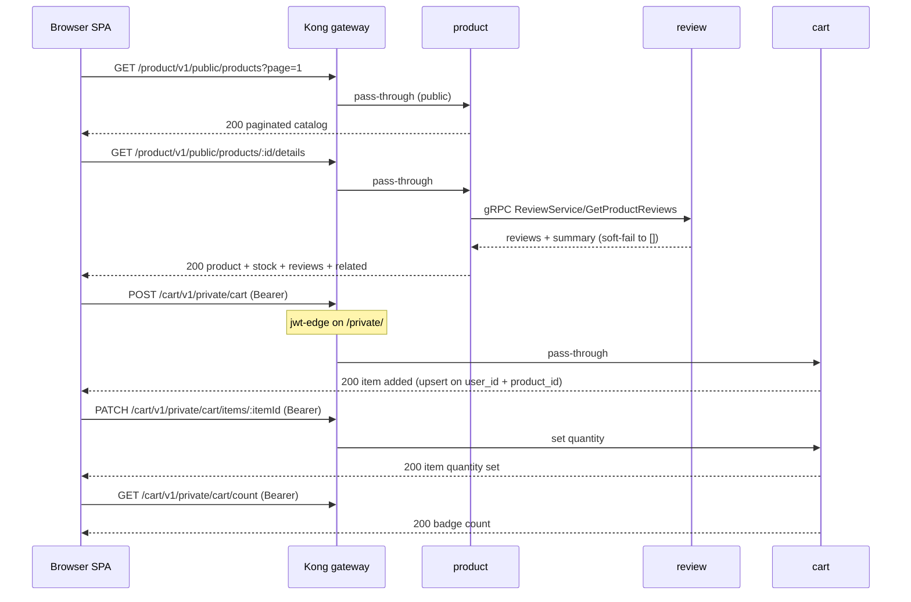
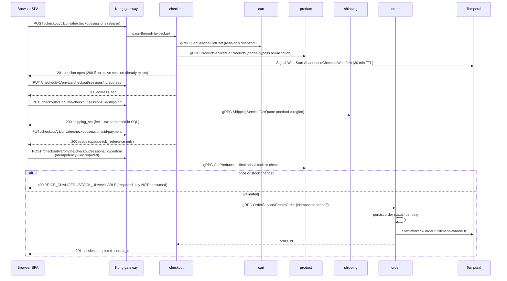
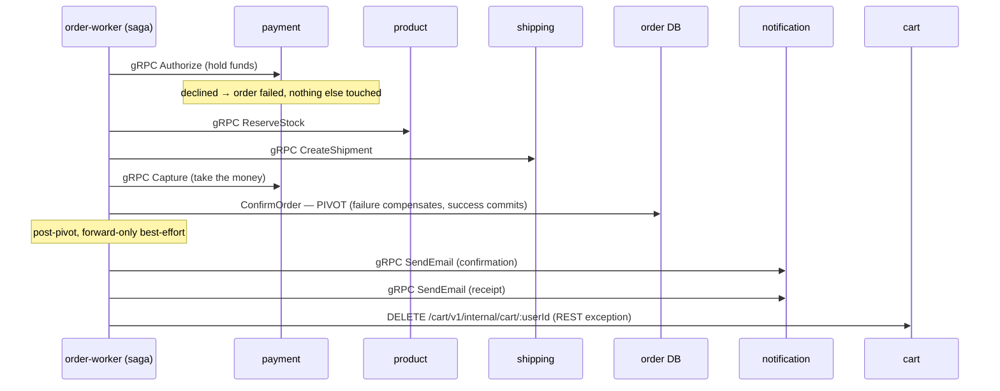

# End-to-End Flows

Four user journeys — register, browse, checkout, fulfill — traced as sequence diagrams across every service they touch, with full canonical paths and real gRPC method names.

## How to read these

Each section follows one user action from the SPA through Kong to the owning
services. HTTP edges use the canonical shape
`/{service}/v1/{audience}/{resource...}` (see
[api.md § HTTP URL Model](./api.md#http-url-model)); east-west edges use gRPC on
`:9090` (see [api.md § gRPC Runtime Model](./api.md#grpc-runtime-model)).
Shared rules — auth, error envelope, pagination, idempotency — live in
[api.md](./api.md) and are not repeated here. Durable workflows are indexed in
[workflows.md](./workflows.md). Deployment truth per component:
[DEPLOYMENT-STATUS.md](./DEPLOYMENT-STATUS.md).

The four flows chain into one shopping journey: a JWT from flow 1 authorizes
the cart writes in flow 2, the cart becomes a checkout session in flow 3, and
the confirmed order drives the saga in flow 4.

## 1. Register / login → JWT

Owner: [auth.md](./auth.md). Auth issues short-lived RS256 access tokens plus
an opaque rotating refresh token; every later request carries the access token
as a `Bearer` header. Kong's `jwt-edge` plugin pre-filters all `/private/`
routes at the edge (statically provisioned public key, RS256, issuer-matched),
and each service stays authoritative by re-verifying locally against the cached
JWKS — auth exposes no gRPC server and no `GetMe` endpoint.

Registration and login return the same auth envelope, so the SPA treats them
identically. Refresh rotation retires the presented token and detects reuse —
details and the error matrix are in [auth.md](./auth.md).

## 2. Browse → cart CRUD

Owners: [product.md](./product.md), [cart.md](./cart.md). Catalog reads are
public (no JWT); the product-details aggregation fans out to review over gRPC
(`ReviewService/GetProductReviews`, 3 s deadline, soft-fail to `[]`). Cart is
entirely private CRUD keyed by the JWT `user_id` — the client never supplies a
cart id.

Product reads are cache-aside over Valkey ([caching.md](../caching/caching.md));
cart stores product id + quantity only and re-prices nothing — pricing truth
stays with product until checkout snapshots it.

## 3. Checkout session → confirm → order pending

Owners: [checkout.md](./checkout.md) (session FSM, totals, idempotent confirm),
[order.md](./order.md) (persistence + saga start). Checkout is a pure gRPC
client — no gRPC server — fanning out to four services. Session TTL is 30
minutes, enforced by `AbandonedCheckoutWorkflow` (one per session,
Signal-With-Start on every mutation; queue `checkout`, worker
`checkout-worker` — see [workflows.md](./workflows.md#abandoned-checkout)).

Confirm is the idempotency showcase of the platform: the `Idempotency-Key`
claim row is the retry ledger, an attempt marker is checkpointed before
`CreateOrder`, and a crashed confirm re-drives the same idempotent RPC on retry
— the full replay ladder is in
[checkout.md § Confirm](./checkout.md). Abandonment is lazy-expiry with the
database as authority: the timer is a wake-up, never a verdict.

The handoff is deliberately asynchronous: order commits the row as `pending`
and returns immediately — the SPA shows "Processing…" and polls
`GET /order/v1/private/orders/:id` until the saga (flow 4) lands the order in
`confirmed` or `failed`. Confirm never blocks on fulfillment.

## 4. Order fulfillment saga

Owner: [order.md](./order.md); deep dive
[temporal-order-fulfillment.md](./temporal-order-fulfillment.md) (authoritative
for step order). `order-worker` (queue `order-fulfillment`, Temporal namespace
`mop`) drives `OrderFulfillmentWorkflow`: **authorize early, capture late**,
then confirm the order as the pivot. Every east-west step is gRPC except
`ClearCart`, a documented post-pivot REST exception
(`DELETE /cart/v1/internal/cart/:userId` — no JWT in workflow history).

Compensations run in reverse order from the failure point, and are
state-dependent:

| Failure point | Compensations (reverse order) |
|---|---|
| `Authorize` fails | mark order failed (nothing else done yet) |
| `ReserveStock` fails | `Void` → fail order |
| `CreateShipment` fails | `ReleaseStock` → `Void` → fail order |
| `Capture` fails | `CancelShipment` → `ReleaseStock` → `Void` → fail order |
| `ConfirmOrder` (pivot) fails | `Refund` → `CancelShipment` → `ReleaseStock` → fail order |

The `Refund` compensation exists only for the narrow captured-but-not-confirmed
window between `Capture` and the pivot. Notification's `SendSMS` RPC is wired
but has **no caller** ([notification.md](./notification.md)). Idempotency keys,
retry policies, and the operations runbook:
[temporal-order-fulfillment.md](./temporal-order-fulfillment.md).

## References

- [api.md](./api.md) — URL model, auth, error envelope, gRPC runtime
- [workflows.md](./workflows.md) — workflow registry and roles
- [DEPLOYMENT-STATUS.md](./DEPLOYMENT-STATUS.md) — local vs cluster vs planned
- Service contracts: [auth.md](./auth.md) · [product.md](./product.md) · [cart.md](./cart.md) · [checkout.md](./checkout.md) · [order.md](./order.md) · [payments.md](./payments.md) · [shipping.md](./shipping.md) · [notification.md](./notification.md) · [review.md](./review.md)

_Last updated: 2026-07-21_
