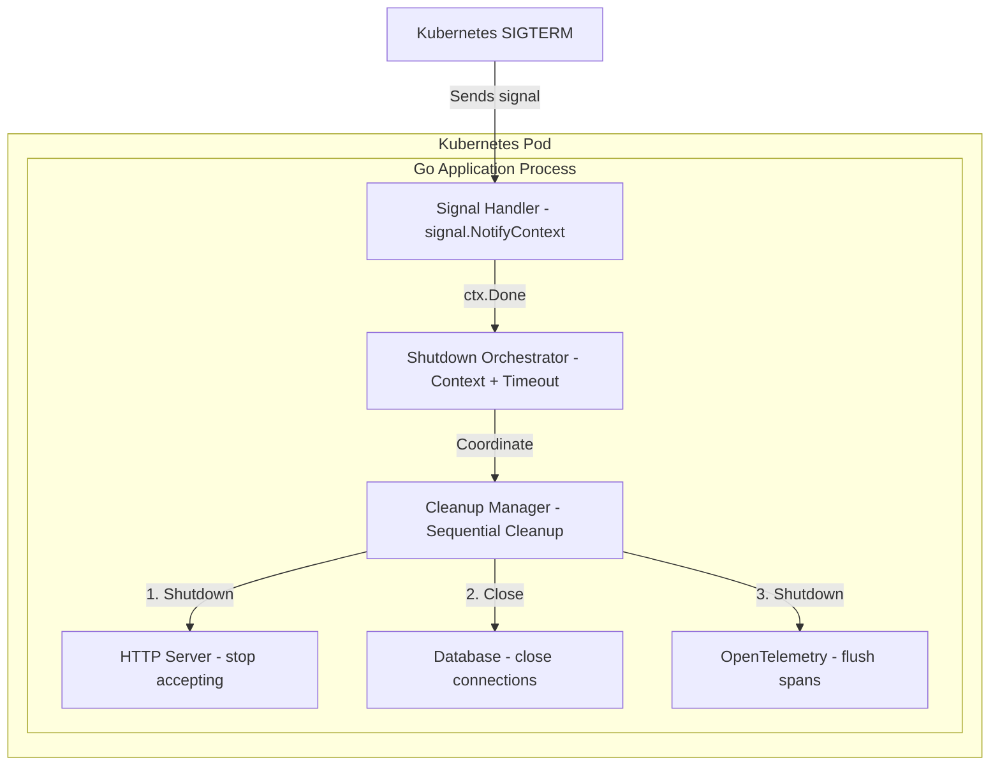
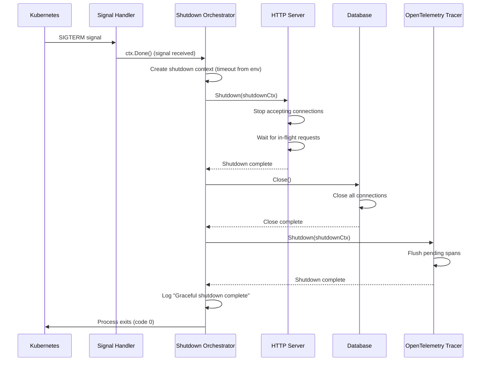
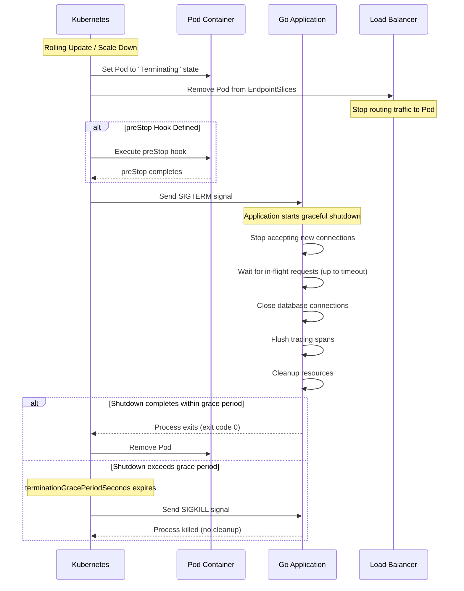
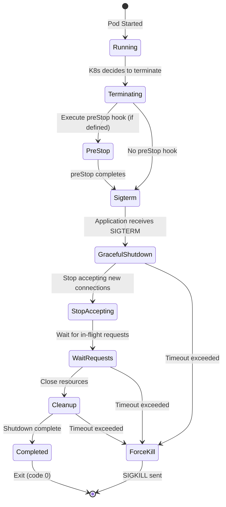

# Graceful Shutdown

> **Document Status:** Production  
> **Last Updated:** 2026-01-28

---

## Overview

Graceful shutdown ensures data integrity, prevents request loss, and maintains a seamless user experience during deployments and scaling operations. All microservices implement a consistent shutdown pattern using modern Go idioms.

**Why Graceful Shutdown Matters:**
- Avoid request loss during rolling updates
- Predictable resource cleanup (HTTP server → Database → Tracer)
- Zero-downtime deployments in Kubernetes

---

## Architecture

### System Components

The graceful shutdown enhancement follows an **in-process orchestration pattern** where signal handling, shutdown coordination, and resource cleanup all occur within each microservice's main process.



### Architecture Decisions

| Decision | Choice | Rationale |
|----------|--------|-----------|
| **Signal Handling** | `signal.NotifyContext` (context-based) | Modern Go pattern, testable, integrates with context ecosystem |
| **Shutdown Timeout** | Configurable via `SHUTDOWN_TIMEOUT` env var | Allows per-service tuning, default 10s maintains current behavior |
| **Readiness Drain** | `/ready` + `READINESS_DRAIN_DELAY` | Fail readiness first, wait for propagation, then shutdown HTTP server |
| **Cleanup Sequence** | Explicit sequential (HTTP → DB → Tracer) | Predictable order, easier to debug, follows industry best practices |
| **K8s Grace Period** | `terminationGracePeriodSeconds: 30` | Provides buffer (10s shutdown + 20s buffer) to prevent SIGKILL |
| **Error Handling** | Log errors, continue cleanup | Non-blocking approach ensures all resources get cleanup attempt |
| **Backward Compatibility** | Same external behavior | No breaking changes, only internal implementation improvement |

---

## Readiness drain (VictoriaMetrics pattern)

We follow the [VictoriaMetrics approach](https://victoriametrics.com/blog/go-graceful-shutdown/) to avoid new traffic during shutdown: **fail readiness first**, wait for propagation, then shut down the HTTP server.

### Readiness vs liveness

| Probe | Endpoint | When it fails | Purpose |
|-------|----------|----------------|---------|
| **Liveness** | `GET /health` | Never (always 200) | Tells Kubernetes the process is alive; restarts only on crash |
| **Readiness** | `GET /ready` | Returns 503 when `isShuttingDown` is true | Tells Kubernetes to stop sending new traffic; removed from Service endpoints |

Kubernetes uses readiness to remove the pod from EndpointSlices. Once we return 503 from `/ready`, we give load balancers and kube-proxy time to stop routing new requests to this pod.

### Drain delay rationale

After SIGTERM we:

1. Set `isShuttingDown = true` so `/ready` returns 503.
2. **Sleep for `READINESS_DRAIN_DELAY`** (default 5s) so the readiness change propagates (EndpointSlices update, LB refresh).
3. Then call `srv.Shutdown(ctx)` to wait for in-flight requests.

Without the drain delay, the pod can still receive new requests between “readiness failed” and “server actually stopping,” which can lead to connection errors or retries.

### Interaction with terminationGracePeriodSeconds

Keep the sum within the pod grace period:

- `READINESS_DRAIN_DELAY` + `SHUTDOWN_TIMEOUT` + buffer ≤ `terminationGracePeriodSeconds`
- Example: 5s + 10s + 15s = 30s → no SIGKILL under normal shutdown

---

## Shutdown Flow

### Internal Shutdown Sequence



### Kubernetes Termination Flow



---

## Kubernetes Termination Lifecycle

### State Diagram



### Timeline

```mermaid
gantt
    title Kubernetes Pod Termination Timeline (terminationGracePeriodSeconds: 30s)
    dateFormat HH:mm:ss
    axisFormat %H:%M:%S
    
    section Termination
    Pod marked Terminating :00:00:00, 1s
    Removed from EndpointSlices :00:00:01, 1s
    preStop hook (if any) :00:00:02, 3s
    SIGTERM sent :00:00:05, 1s
    Graceful shutdown :00:00:06, 10s
    SIGKILL (if timeout) :00:00:30, 1s
```



**Key Points:**
- Pod is removed from EndpointSlices immediately when marked "Terminating" (traffic stops)
- Our graceful shutdown implementation handles the SIGTERM → GracefulShutdown → Cleanup flow
- If shutdown exceeds `terminationGracePeriodSeconds` (30s), Kubernetes sends SIGKILL
- Our configurable shutdown timeout (default 10s) ensures we complete well within the grace period

---

## Configuration

### Environment Variables

| Variable | Default | Max | Description |
|----------|---------|-----|-------------|
| `SHUTDOWN_TIMEOUT` | `10s` | `60s` | Go duration string for shutdown timeout |
| `READINESS_DRAIN_DELAY` | `5s` | `30s` | Delay after readiness flips to 503, before HTTP shutdown |

**Example values:**
- `10s` - Default, suitable for most services
- `30s` - For services with long-running requests
- `5s` - For lightweight services

### Kubernetes Configuration

```yaml
# In Helm values or deployment manifest
spec:
  terminationGracePeriodSeconds: 30  # shutdown_timeout (10s) + buffer (20s)
  containers:
    - name: app
      env:
        - name: SHUTDOWN_TIMEOUT
          value: "10s"
        - name: READINESS_DRAIN_DELAY
          value: "5s"
```

**Rule:** Keep `READINESS_DRAIN_DELAY + SHUTDOWN_TIMEOUT + buffer <= terminationGracePeriodSeconds`.

### Current Configuration

All services use consistent settings via Helm values:

| Service | `READINESS_DRAIN_DELAY` | `SHUTDOWN_TIMEOUT` | `terminationGracePeriodSeconds` |
|---------|--------------------------|--------------------|---------------------------------|
| auth | 5s | 10s | 30 |
| user | 5s | 10s | 30 |
| product | 5s | 10s | 30 |
| cart | 5s | 10s | 30 |
| order | 5s | 10s | 30 |
| review | 5s | 10s | 30 |
| notification | 5s | 10s | 30 |
| shipping | 5s | 10s | 30 |

---

## Implementation

### Code Pattern

All services follow this pattern in each service repository (example: `~/Working/duynhne/auth-service/cmd/main.go`):

```go
var isShuttingDown atomic.Bool

// Liveness: always 200
r.GET("/health", func(c *gin.Context) {
    c.JSON(http.StatusOK, gin.H{"status": "ok"})
})

// Readiness: flips to 503 during shutdown drain
r.GET("/ready", func(c *gin.Context) {
    if isShuttingDown.Load() {
        c.JSON(http.StatusServiceUnavailable, gin.H{"status": "shutting_down"})
        return
    }
    c.JSON(http.StatusOK, gin.H{"status": "ok"})
})

// Context-based signal handling (modern Go pattern)
ctx, stop := signal.NotifyContext(context.Background(), syscall.SIGTERM, syscall.SIGINT)
defer stop()

// Start server in goroutine
go func() {
    if err := srv.ListenAndServe(); err != nil && err != http.ErrServerClosed {
        logger.Fatal("Server failed", zap.Error(err))
    }
}()

// Wait for shutdown signal
<-ctx.Done()
logger.Info("Shutdown signal received")

// Fail readiness first and wait for propagation (VictoriaMetrics pattern)
isShuttingDown.Store(true)
drainDelay := cfg.GetReadinessDrainDelayDuration()
time.Sleep(drainDelay)

// Configurable timeout from config
shutdownCtx, cancel := context.WithTimeout(context.Background(), cfg.GetShutdownTimeoutDuration())
defer cancel()

// Explicit cleanup sequence (order matters!)
// 1. HTTP Server - stop accepting new connections first
if err := srv.Shutdown(shutdownCtx); err != nil {
    logger.Error("Server shutdown error", zap.Error(err))
} else {
    logger.Info("HTTP server shutdown complete")
}

// 2. Database - close after server stops
if err := db.Close(); err != nil {
    logger.Error("Database close error", zap.Error(err))
} else {
    logger.Info("Database closed")
}

// 3. Tracer - flush spans last
if tp != nil {
    if err := tp.Shutdown(shutdownCtx); err != nil {
        logger.Error("Tracer shutdown error", zap.Error(err))
    } else {
        logger.Info("Tracer shutdown complete")
    }
}

logger.Info("Graceful shutdown complete")
```

### Cleanup Order

The cleanup sequence is **critical**:

1. **HTTP Server** - Stop accepting new connections first (prevents new work)
2. **Database** - Close connections after server stops (no new queries)
3. **Tracer** - Flush spans last (captures shutdown events)

---

## Common Failure Modes

| Problem | Cause | Solution |
|---------|-------|----------|
| **SIGKILL during shutdown** | `terminationGracePeriodSeconds` too small | Increase to `shutdown_timeout + 20s` |
| **Long-running requests timeout** | `SHUTDOWN_TIMEOUT` too short | Increase timeout or optimize request handling |
| **Leaked database connections** | DB not closed in shutdown sequence | Ensure explicit `db.Close()` in shutdown |
| **Missing trace spans** | Tracer not flushed | Call `tp.Shutdown()` before exit |
| **Requests during shutdown** | EndpointSlice update delay | Add `preStop` hook with small sleep |

---

## Verification

### Manual Testing

```bash
# 1. Run service locally
cd ~/Working/duynhne/auth-service
go run cmd/main.go

# 2. Send SIGTERM (simulates Kubernetes)
kill -SIGTERM $(pgrep -f "cmd/main.go")

# 3. Check logs for shutdown sequence
# Expected output:
# {"level":"info","msg":"Shutdown signal received"}
# {"level":"info","msg":"HTTP server shutdown complete"}
# {"level":"info","msg":"Database closed"}
# {"level":"info","msg":"Tracer shutdown complete"}
# {"level":"info","msg":"Graceful shutdown complete"}
```

### Kubernetes Testing

```bash
# Watch pod termination
kubectl get pods -n auth -w

# Trigger rolling update
kubectl rollout restart deployment auth -n auth

# Check events (should NOT see SIGKILL)
kubectl describe pod <pod-name> -n auth | grep -i kill
```

---

## References

- [Graceful Shutdown in Go (VictoriaMetrics)](https://victoriametrics.com/blog/go-graceful-shutdown/) – readiness drain and propagation delay pattern (primary reference)
- [Mastering Graceful Shutdowns in Go (HackerNoon)](https://hackernoon.com/mastering-graceful-shutdowns-in-go-a-comprehensive-guide-for-kubernetes)
- [Go signal.NotifyContext Documentation](https://pkg.go.dev/os/signal#NotifyContext)
- [Kubernetes Pod Lifecycle](https://kubernetes.io/docs/concepts/workloads/pods/pod-lifecycle/)
- [Kubernetes EndpointSlices Documentation](https://kubernetes.io/docs/concepts/services-networking/endpoint-slices/)
- [Gin Framework Graceful Shutdown](https://github.com/gin-gonic/gin#graceful-shutdown)

---

## Related Documentation

- [API Reference](api.md) - Service endpoints and architecture
- [Logging Standards](logs.md) - JSON log format and levels
- [Tracing Architecture](../observability/tracing/architecture.md) - OpenTelemetry integration
