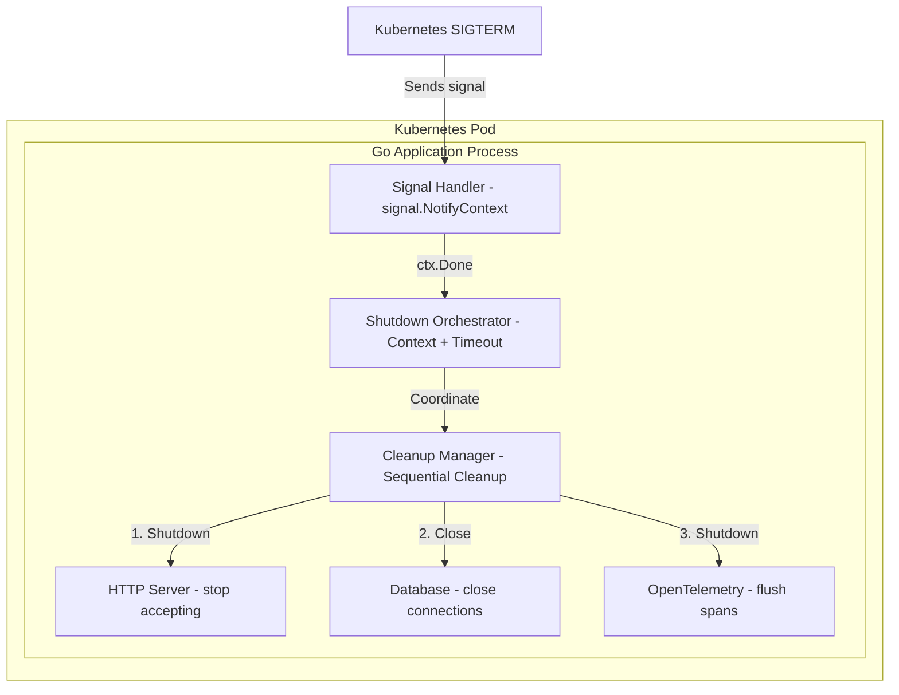
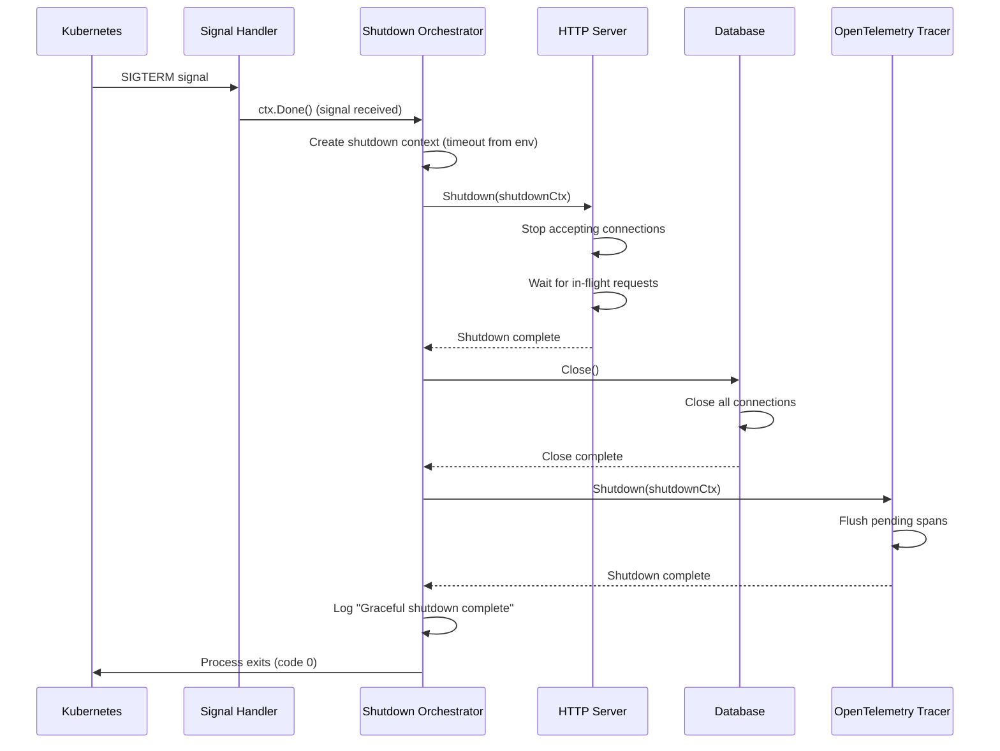
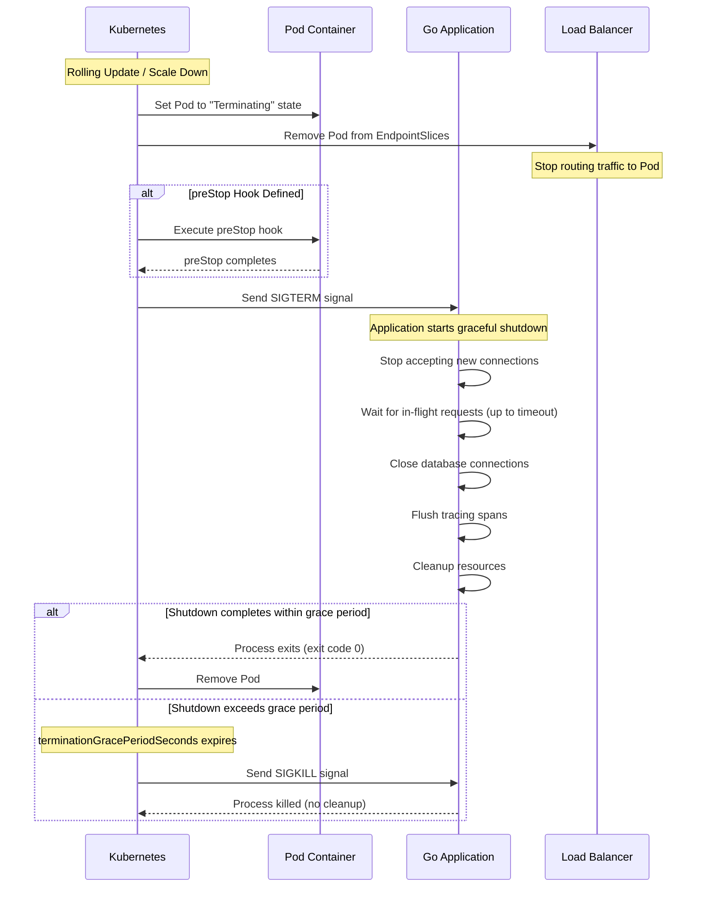
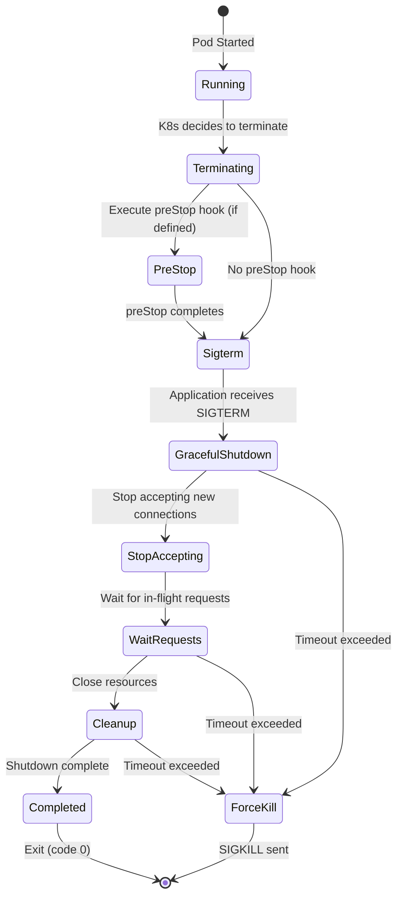

# Graceful Shutdown

The cross-service shutdown contract: how every Go HTTP service drains,
cleans up, and exits when Kubernetes (or compose) says stop. A sibling of
[observability.md](observability.md)'s instrumentation policy — the code
lives in the service repos; this page owns the shared behavior.

| | |
|---|---|
| **Applies to** | The 10 Go HTTP services (workers follow a Temporal-specific lifecycle — a recorded gap below) |
| **Contract env vars** | `READINESS_DRAIN_DELAY` (default 5s) · `SHUTDOWN_TIMEOUT` (default 10s) |
| **Pod budget** | `terminationGracePeriodSeconds` — defaults come from the `mop` chart (`duynhlab/helm-charts`); homelab pins none per-service |
| **Ordering** | fail `/ready` → drain delay → HTTP server → DB → tracer flush |

---

## Overview

Graceful shutdown ensures data integrity, prevents request loss, and maintains a seamless user experience during deployments and scaling operations. All microservices implement a consistent shutdown pattern using modern Go idioms.

**Why Graceful Shutdown Matters:**
- Avoid request loss during rolling updates
- Predictable resource cleanup (HTTP server → Database → Tracer)
- Zero-downtime deployments in Kubernetes

---

## Architecture

### System Components

The graceful shutdown enhancement follows an **in-process orchestration pattern** where signal handling, shutdown coordination, and resource cleanup all occur within each microservice's main process.


```mermaid
flowchart TB
    subgraph K8sPod["Kubernetes Pod"]
        subgraph GoApp["Go Application Process"]
            SignalHandler["Signal Handler - signal.NotifyContext"]
            ShutdownOrch["Shutdown Orchestrator - Context + Timeout"]
            CleanupMgr["Cleanup Manager - Sequential Cleanup"]
            HTTPServer["HTTP Server - stop accepting"]
            Database["Database - close connections"]
            Tracer["OpenTelemetry - flush spans"]
            SignalHandler -->|ctx.Done| ShutdownOrch
            ShutdownOrch -->|Coordinate| CleanupMgr
            CleanupMgr -->|1. Shutdown| HTTPServer
            CleanupMgr -->|2. Close| Database
            CleanupMgr -->|3. Shutdown| Tracer
        end
    end
    K8s["Kubernetes SIGTERM"] -->|Sends signal| SignalHandler
```

### Architecture Decisions

| Decision | Choice | Rationale |
|----------|--------|-----------|
| **Signal Handling** | `signal.NotifyContext` (context-based) | Modern Go pattern, testable, integrates with context ecosystem |
| **Shutdown Timeout** | Configurable via `SHUTDOWN_TIMEOUT` env var | Allows per-service tuning, default 10s maintains current behavior |
| **Readiness Drain** | `/ready` + `READINESS_DRAIN_DELAY` | Fail readiness first, wait for propagation, then shutdown HTTP server |
| **Cleanup Sequence** | Explicit sequential (HTTP → DB → Tracer) | Predictable order, easier to debug, follows industry best practices |
| **K8s Grace Period** | `terminationGracePeriodSeconds: 30` | Provides buffer (10s shutdown + 20s buffer) to prevent SIGKILL |
| **Error Handling** | Log errors, continue cleanup | Non-blocking approach ensures all resources get cleanup attempt |
| **Backward Compatibility** | Same external behavior | No breaking changes, only internal implementation improvement |

---

## Readiness drain (VictoriaMetrics pattern)

We follow the [VictoriaMetrics approach](https://victoriametrics.com/blog/go-graceful-shutdown/) to avoid new traffic during shutdown: **fail readiness first**, wait for propagation, then shut down the HTTP server.

### Readiness vs liveness

| Probe | Endpoint | When it fails | Purpose |
|-------|----------|----------------|---------|
| **Liveness** | `GET /health` | Never (always 200) | Tells Kubernetes the process is alive; restarts only on crash |
| **Readiness** | `GET /ready` | Returns 503 when `isShuttingDown` is true | Tells Kubernetes to stop sending new traffic; removed from Service endpoints |

Kubernetes uses readiness to remove the pod from EndpointSlices. Once we return 503 from `/ready`, we give load balancers and kube-proxy time to stop routing new requests to this pod.

### Drain delay rationale

After SIGTERM we:

1. Set `isShuttingDown = true` so `/ready` returns 503.
2. **Sleep for `READINESS_DRAIN_DELAY`** (default 5s) so the readiness change propagates (EndpointSlices update, LB refresh).
3. Then call `srv.Shutdown(ctx)` to wait for in-flight requests.

Without the drain delay, the pod can still receive new requests between “readiness failed” and “server actually stopping,” which can lead to connection errors or retries.

### Interaction with terminationGracePeriodSeconds

Keep the sum within the pod grace period:

- `READINESS_DRAIN_DELAY` + `SHUTDOWN_TIMEOUT` + buffer ≤ `terminationGracePeriodSeconds`
- Example: 5s + 10s + 15s = 30s → no SIGKILL under normal shutdown

---

## Shutdown Flow

### Internal Shutdown Sequence


```mermaid
sequenceDiagram
    participant K8s as Kubernetes
    participant Signal as Signal Handler
    participant Orchestrator as Shutdown Orchestrator
    participant Server as HTTP Server
    participant DB as Database
    participant Tracer as OpenTelemetry Tracer

    K8s->>Signal: SIGTERM signal
    Signal->>Orchestrator: ctx.Done() (signal received)
    Orchestrator->>Orchestrator: Create shutdown context (timeout from env)
    
    Orchestrator->>Server: Shutdown(shutdownCtx)
    Server->>Server: Stop accepting connections
    Server->>Server: Wait for in-flight requests
    Server-->>Orchestrator: Shutdown complete
    
    Orchestrator->>DB: Close()
    DB->>DB: Close all connections
    DB-->>Orchestrator: Close complete
    
    Orchestrator->>Tracer: Shutdown(shutdownCtx)
    Tracer->>Tracer: Flush pending spans
    Tracer-->>Orchestrator: Shutdown complete
    
    Orchestrator->>Orchestrator: Log "Graceful shutdown complete"
    Orchestrator->>K8s: Process exits (code 0)
```

### Kubernetes Termination Flow


```mermaid
sequenceDiagram
    participant K8s as Kubernetes
    participant Pod as Pod Container
    participant App as Go Application
    participant LB as Load Balancer

    Note over K8s: Rolling Update / Scale Down
    K8s->>Pod: Set Pod to "Terminating" state
    K8s->>LB: Remove Pod from EndpointSlices
    Note over LB: Stop routing traffic to Pod
    
    alt preStop Hook Defined
        K8s->>Pod: Execute preStop hook
        Pod-->>K8s: preStop completes
    end
    
    K8s->>App: Send SIGTERM signal
    Note over App: Application starts graceful shutdown
    
    App->>App: Stop accepting new connections
    App->>App: Wait for in-flight requests (up to timeout)
    App->>App: Close database connections
    App->>App: Flush tracing spans
    App->>App: Cleanup resources
    
    alt Shutdown completes within grace period
        App-->>K8s: Process exits (exit code 0)
        K8s->>Pod: Remove Pod
    else Shutdown exceeds grace period
        Note over K8s: terminationGracePeriodSeconds expires
        K8s->>App: Send SIGKILL signal
        App-->>K8s: Process killed (no cleanup)
    end
```

---

## Kubernetes Termination Lifecycle

### State Diagram


```mermaid
stateDiagram-v2
    [*] --> Running: Pod Started
    Running --> Terminating: K8s decides to terminate
    Terminating --> PreStop: Execute preStop hook (if defined)
    PreStop --> Sigterm: preStop completes
    Terminating --> Sigterm: No preStop hook
    Sigterm --> GracefulShutdown: Application receives SIGTERM
    GracefulShutdown --> StopAccepting: Stop accepting new connections
    StopAccepting --> WaitRequests: Wait for in-flight requests
    WaitRequests --> Cleanup: Close resources
    Cleanup --> Completed: Shutdown complete
    Completed --> [*]: Exit (code 0)
    
    GracefulShutdown --> ForceKill: Timeout exceeded
    WaitRequests --> ForceKill: Timeout exceeded
    Cleanup --> ForceKill: Timeout exceeded
    ForceKill --> [*]: SIGKILL sent
```

### Timeline


```mermaid
gantt
    title Kubernetes Pod Termination Timeline (terminationGracePeriodSeconds: 30s)
    dateFormat HH:mm:ss
    axisFormat %H:%M:%S
    
    section Termination
    Pod marked Terminating :00:00:00, 1s
    Removed from EndpointSlices :00:00:01, 1s
    preStop hook (if any) :00:00:02, 3s
    SIGTERM sent :00:00:05, 1s
    Graceful shutdown :00:00:06, 10s
    SIGKILL (if timeout) :00:00:30, 1s
```

**Key Points:**
- Endpoint removal is **not instantaneous**: the pod is marked Terminating and EndpointSlice consumers (kube-proxy, the gateway) converge asynchronously — this propagation window is exactly why the readiness-drain delay exists (§ above)
- Our graceful shutdown implementation handles the SIGTERM → GracefulShutdown → Cleanup flow
- If shutdown exceeds `terminationGracePeriodSeconds` (30s), Kubernetes sends SIGKILL
- Our configurable shutdown timeout (default 10s) ensures we complete well within the grace period

---

## Configuration

### Environment Variables

| Variable | Default | Max | Description |
|----------|---------|-----|-------------|
| `SHUTDOWN_TIMEOUT` | `10s` | `60s` | Go duration string for shutdown timeout |
| `READINESS_DRAIN_DELAY` | `5s` | `30s` | Delay after readiness flips to 503, before HTTP shutdown |

**Example values:**
- `10s` - Default, suitable for most services
- `30s` - For services with long-running requests
- `5s` - For lightweight services

### Kubernetes Configuration

```yaml
# In Helm values or deployment manifest
spec:
  terminationGracePeriodSeconds: 30  # shutdown_timeout (10s) + buffer (20s)
  containers:
    - name: app
      env:
        - name: SHUTDOWN_TIMEOUT
          value: "10s"
        - name: READINESS_DRAIN_DELAY
          value: "5s"
```

**Rule:** Keep `READINESS_DRAIN_DELAY + SHUTDOWN_TIMEOUT + buffer <= terminationGracePeriodSeconds`.

### Current Configuration

The contract values are **uniform defaults, not per-service pins**:
`READINESS_DRAIN_DELAY=5s` and `SHUTDOWN_TIMEOUT=10s` are the services' own
defaults, and `terminationGracePeriodSeconds` comes from the `mop` chart in
`duynhlab/helm-charts` — **no homelab manifest overrides any of the three**
(the order worker is the one exception to the *provenance*, not the value: since
ADR-054 it is a raw pod template rather than a chart render, so its budget is the
Kubernetes 30s default. Same number — `charts/mop` sets no
`terminationGracePeriodSeconds` key either — different source)
(nothing in `kubernetes/apps/` or `local-stack/compose.yaml` sets them; a
service that needs different numbers owns that override in its repo/chart
values). The budget rule above is what a reviewer checks, not a table.

**Recorded gaps:** the **Temporal workers** (`checkout-worker`,
`order-worker`) follow a worker-specific lifecycle (task-slot draining,
not HTTP draining) that this contract does not yet describe; `mockpay`, the
SPA, and the back-office portal are likewise out of scope here.

---

## Implementation

### Code Pattern

All services follow this pattern in each service repository (`<service>-service/cmd/main.go`):

```go
var isShuttingDown atomic.Bool

// Liveness: always 200
r.GET("/health", func(c *gin.Context) {
    c.JSON(http.StatusOK, gin.H{"status": "ok"})
})

// Readiness: flips to 503 during shutdown drain
r.GET("/ready", func(c *gin.Context) {
    if isShuttingDown.Load() {
        c.JSON(http.StatusServiceUnavailable, gin.H{"status": "shutting_down"})
        return
    }
    c.JSON(http.StatusOK, gin.H{"status": "ok"})
})

// Context-based signal handling (modern Go pattern)
ctx, stop := signal.NotifyContext(context.Background(), syscall.SIGTERM, syscall.SIGINT)
defer stop()

// Start server in goroutine
go func() {
    if err := srv.ListenAndServe(); err != nil && err != http.ErrServerClosed {
        logger.Fatal("Server failed", zap.Error(err))
    }
}()

// Wait for shutdown signal
<-ctx.Done()
logger.Info("Shutdown signal received")

// Fail readiness first and wait for propagation (VictoriaMetrics pattern)
isShuttingDown.Store(true)
drainDelay := cfg.GetReadinessDrainDelayDuration()
time.Sleep(drainDelay)

// Configurable timeout from config
shutdownCtx, cancel := context.WithTimeout(context.Background(), cfg.GetShutdownTimeoutDuration())
defer cancel()

// Explicit cleanup sequence (order matters!)
// 1. HTTP Server - stop accepting new connections first
if err := srv.Shutdown(shutdownCtx); err != nil {
    logger.Error("Server shutdown error", zap.Error(err))
} else {
    logger.Info("HTTP server shutdown complete")
}

// 2. Database - close after server stops
if err := db.Close(); err != nil {
    logger.Error("Database close error", zap.Error(err))
} else {
    logger.Info("Database closed")
}

// 3. Tracer - flush spans last
if tp != nil {
    if err := tp.Shutdown(shutdownCtx); err != nil {
        logger.Error("Tracer shutdown error", zap.Error(err))
    } else {
        logger.Info("Tracer shutdown complete")
    }
}

logger.Info("Graceful shutdown complete")
```

### Cleanup Order

The cleanup sequence is **critical**:

1. **HTTP Server** - Stop accepting new connections first (prevents new work)
2. **Database** - Close connections after server stops (no new queries)
3. **Tracer** - Flush spans last (captures shutdown events)

---

## Common Failure Modes

| Problem | Cause | Solution |
|---------|-------|----------|
| **SIGKILL during shutdown** | `terminationGracePeriodSeconds` too small | Increase to `shutdown_timeout + 20s` |
| **Long-running requests timeout** | `SHUTDOWN_TIMEOUT` too short | Increase timeout or optimize request handling |
| **Leaked database connections** | DB not closed in shutdown sequence | Ensure explicit `db.Close()` in shutdown |
| **Missing trace spans** | Tracer not flushed | Call `tp.Shutdown()` before exit |
| **Requests during shutdown** | EndpointSlice update delay | Add `preStop` hook with small sleep |

---

## Verification

### Manual Testing

```bash
# 1. Run the service locally (any service repo)
cd user-service
go run cmd/main.go

# 2. Send SIGTERM (simulates Kubernetes)
kill -SIGTERM $(pgrep -f "cmd/main.go")

# 3. Check logs for shutdown sequence
# Expected output:
# {"level":"info","msg":"Shutdown signal received"}
# {"level":"info","msg":"HTTP server shutdown complete"}
# {"level":"info","msg":"Database closed"}
# {"level":"info","msg":"Tracer shutdown complete"}
# {"level":"info","msg":"Graceful shutdown complete"}
```

### Kubernetes Testing

```bash
# Watch pod termination
kubectl get pods -n user -w

# Trigger rolling update
kubectl rollout restart deployment user -n user

# Check events (should NOT see SIGKILL)
kubectl describe pod <pod-name> -n user | grep -i kill
```

---

## References

- [Graceful Shutdown in Go (VictoriaMetrics)](https://victoriametrics.com/blog/go-graceful-shutdown/) – readiness drain and propagation delay pattern (primary reference)
- [Go signal.NotifyContext Documentation](https://pkg.go.dev/os/signal#NotifyContext)
- [Kubernetes Pod Lifecycle](https://kubernetes.io/docs/concepts/workloads/pods/pod-lifecycle/)
- [Kubernetes EndpointSlices Documentation](https://kubernetes.io/docs/concepts/services-networking/endpoint-slices/)
- [Gin Framework Graceful Shutdown](https://github.com/gin-gonic/gin#graceful-shutdown)

---

## Related Documentation

- [API Reference](./api.md) - Service endpoints and architecture
- [Application logging](./logs.md) - JSON log format and levels
- [Tracing Architecture](../observability/tracing/architecture.md) - OpenTelemetry integration

---
_Last updated: 2026-08-22 — RFC-0026/ADR-054: the Temporal Worker Controller owns the versioned-worker lifecycle (build id derived, one file, no activation step). Previously 2026-08-19 — moved from docs/platform/ to docs/api/ as the cross-service shutdown contract; the per-service config table (unbacked by any homelab manifest, incl. a retired-auth row) replaced by the uniform-defaults contract; EndpointSlice wording fixed (removal is not instantaneous — the drain delay exists because of the propagation window); machine-local paths and dead-namespace commands removed._
