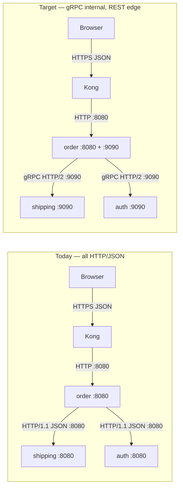
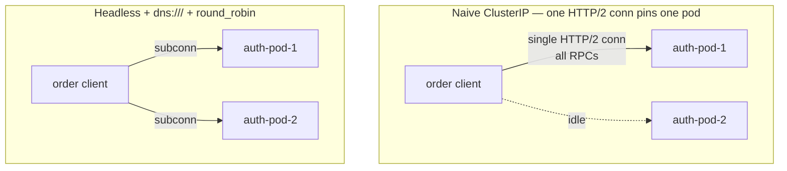
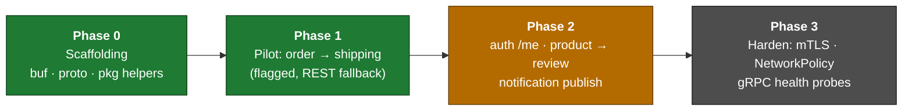
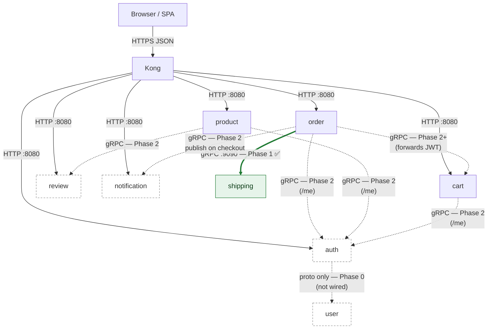

# gRPC for internal east-west communication

| Attribute | Value |
|-----------|--------|
| **Version** | **v0.1.0** |
| **Status** | **Partially implemented** — Phase 0–1 shipped (`order → shipping` pilot live, REST fallback); Phase 2–3 planned. See [§7 roadmap](#7-phased-roadmap). |
| **Scope** | Internal (east-west) service-to-service calls only |
| **Relation** | Complements [`api-naming-convention.md`](api-naming-convention.md) (HTTP/JSON URL surface stays the law of the land) |
| **Last updated** | 2026-05-31 |

## TL;DR

- Adopt gRPC **selectively** for internal east-west, machine-to-machine, latency-
  and contract-sensitive paths — not as a blanket replacement for HTTP.
- Run **dual-port** services: keep HTTP on `:8080` (`portName: http`) exactly as
  today, add gRPC on `:9090` (`portName: grpc`) only on the services that need it.
- **Hard rule:** browser/SPA traffic and everything through Kong stays HTTP/JSON.
  gRPC is internal-only. *If a browser can reach it, it stays REST.*
- Solve the Kubernetes HTTP/2 load-balancing pitfall with a **headless Service +
  client-side `round_robin`** first. **Defer** a service mesh — it is
  disproportionate for a pilot and we run no mesh today.
- Roll out **phased and pilot-first**, each phase gated on trace continuity and no
  SLO regression, with **one-step env-flag rollback** to the REST path.

---

## 1. Motivation & when to use gRPC

This is a balanced assessment. gRPC is a tool for a specific class of internal
calls, not a religion.

### What improves

- **Typed contracts + codegen.** Today the request/response shapes for
  service-to-service calls are hand-rolled JSON structs, duplicated across 8
  polyrepos. A field rename in `auth` and a stale copy in `order` is a runtime
  500 that no compiler catches. A shared `.proto` generates the structs; a
  breaking change is caught at **compile time** (and in CI, see §7).
- **Performance on the hottest path.** Binary Protobuf over a multiplexed HTTP/2
  connection is cheaper than JSON-over-HTTP/1.1 on the busiest east-west hop:
  **every service → auth `/auth/v1/private/me`** on every authenticated request.
- **Built-in deadlines.** gRPC deadlines propagate across hops as a first-class
  concept, replacing ad-hoc per-client HTTP timeouts.

### What it costs

- **Proto tooling in every repo** — `buf`, codegen, generated-stub hygiene.
- **Lost `curl` debuggability.** No more eyeballing JSON on the wire. Mitigate
  with **server reflection + `grpcurl`** (see §4).
- **Two code paths during migration.** A service speaks both HTTP and gRPC until
  a path is fully cut over — more surface to test.
- **The Kubernetes load-balancing pitfall** (see §3) — the single biggest
  operational gotcha, and the reason this is phased.

### Candidate paths

| Caller → callee | Decision | Phase |
|-----------------|----------|-------|
| every service → auth `/auth/v1/private/me` | gRPC | Phase 2 |
| product → review (aggregation) | gRPC | Phase 2 |
| order → shipping (internal order lookup) | **gRPC PILOT** | Phase 1 |
| order → cart (forwards user JWT) | gRPC later | Phase 2+ |
| order/shipping → notification (`notify/email`, `notify/sms`) | gRPC — **design proto + wire first caller** | Phase 2 |
| any browser / SPA → Kong | **STAY REST** | — (hard rule) |
| auth → user (registration) | not implemented — **design proto only** | Phase 0 |

> **Rule:** *If a browser can reach it, it stays REST.* gRPC is internal-only.
> NetworkPolicy is the fence, not the absence of an Ingress rule.

---

## 2. Target architecture

### Dual-port services

Every gRPC-speaking service keeps its existing HTTP listener and adds a second one:

| Port | `portName` | Purpose | Who calls it |
|------|-----------|---------|--------------|
| `8080` | `http` | Kong pass-through, browser, REST east-west, probes, `/metrics` | Kong, browser, services |
| `9090` | `grpc` | Protobuf over HTTP/2, internal-only | in-cluster services |

HTTP `:8080` is **unchanged** — Kong, the browser, the existing liveness/readiness
probes, and Prometheus scraping all keep working exactly as documented in
[`api-naming-convention.md`](api-naming-convention.md). gRPC is additive.

### Proto / contract management

- **Protos live in `github.com/duynhne/pkg`** under `pkg/proto/<svc>/v1/`, with the
  **generated stubs committed** alongside the `.proto` sources. Consumers
  `go get` `pkg` and import the generated package — no codegen step in service
  CI, no proto-plugin version drift between repos.
- **`buf`** drives lint, codegen, and breaking-change detection.
- **Versioned package paths:** Protobuf package `<svc>.v1` (e.g. `auth.v1`,
  `shipping.v1`), mirroring the `/v1/` already in the HTTP URL surface.
- **Rejected for now: a separate proto repo.** It adds a release/tag dance
  between three repos (proto → pkg → service) for no benefit at this scale. `pkg`
  is already the shared-library home; protos belong with it.

---

## 3. The Kubernetes HTTP/2 load-balancing problem

This is the key operational hazard and the reason the rollout is phased.

### The problem

A standard `ClusterIP` Service load-balances at **L4, per TCP connection**. HTTP/1.1
opens a fresh connection per request (or churns a small pool), so requests spread
across pods naturally. gRPC does the opposite: it **multiplexes every RPC over one
long-lived HTTP/2 connection**. That single connection is balanced once, at dial
time, and then **pins to a single pod** for its whole lifetime.

Result: with `auth`, `product`, `cart`, and `order` each running **2 replicas**, a
naive gRPC client sends *all* its traffic to **one** replica while the second sits
idle — defeating both replicas and any horizontal scaling.

### Fix comparison

| Option | Verdict | Why |
|--------|---------|-----|
| **(a)** Headless Service (`clusterIP: None`) + gRPC `dns:///` resolver + `round_robin` | **RECOMMENDED** | Client resolves every pod IP and opens a subconnection to each, balancing RPCs across all replicas. No new infra, works today. |
| **(b)** Service mesh (Linkerd / Istio / Cilium) | **Defer** | Solves it transparently at L7, but we run no mesh today; standing one up for a pilot is disproportionate. Revisit if mesh lands for other reasons. |
| **(c)** Dedicated L7 proxy (e.g. an internal Envoy hop) | **Reject** | Extra hop, extra component to operate, duplicates what option (a) gives for free. |

### Pilot timing

The Phase 1 pilot callee, **shipping, runs 1 replica**, so the pinning gotcha is
**dormant** — there is only one pod to pin to. This lets us validate the gRPC
plumbing (codegen, interceptors, deadlines, tracing) before tackling LB.

The Phase 2 callees — **auth, product, cart, order — run 2 replicas**, so the
headless + `round_robin` fix **must be in place and verified before Phase 2 ships**.

---

## 4. Observability continuity

The four-pillar observability stack must not regress. gRPC keeps it intact:

- **Tracing.** `otelgrpc` client/server interceptors propagate the trace context
  over gRPC metadata, so **Tempo/Jaeger spans stay continuous** across an
  HTTP→gRPC→HTTP call chain. No trace gaps.
- **Metrics.** Prometheus `/metrics` stays on HTTP `:8080`, scraped exactly as
  today. gRPC adds RPC-level metrics via the same interceptors; the existing
  RED dashboards are unaffected.
- **Health.** Implement the **gRPC Health Checking Protocol** and use
  `grpc-health-probe`. During dual-port, **keep the HTTP `/health` and `/ready`
  probes** (they already work); only switch the Kubernetes probes to gRPC once a
  service is gRPC-primary.
- **Debugging.** Enable **server reflection** so `grpcurl` can introspect and call
  services without a local copy of the protos — the gRPC analogue of `curl`.
- **OTLP exporter.** The collector already accepts OTLP on **gRPC `:4317`** and
  **HTTP `:4318`**. Services currently export over `:4318`. Switching the app's
  own OTLP exporter to `:4317` is **optional and independent** of this proposal —
  do it only if we want gRPC OTLP too; it is not a prerequisite.

---

## 5. Security

gRPC does not replace the existing controls — it **layers with** them. Three
complementary layers, each answering a different question:

| Layer | Question it answers | Mechanism |
|-------|---------------------|-----------|
| **NetworkPolicy** | *Who may connect?* | k8s NetworkPolicy (pod/namespace selectors) |
| **mTLS** | *Which service is this?* | gRPC mTLS, certs from cert-manager / trust-manager bundle |
| **JWT** | *Which user is this?* | JWT in gRPC metadata `authorization` key |

- **mTLS** is **defense-in-depth**, issued via the existing **cert-manager /
  trust-manager `homelab-ca-bundle`** PKI. It authenticates the *service*, not the
  user.
- **JWT carries the user identity.** For user-scoped calls (`/me` validation and
  `order → cart`), forward the caller's JWT in gRPC **metadata** under the
  `authorization` key — the gRPC equivalent of the `Authorization` header the
  services forward today.
- These are **complementary, not a substitution**: NetworkPolicy fences the
  network, mTLS proves service identity, JWT proves user identity.

---

## 6. GitOps / infrastructure impact

Described here, not implemented. No manifests in this doc.

- **Shared ResourceSet template** (`kubernetes/apps/domains/*-rs.yaml`): add a
  second container port and a second Service port with `portName: grpc` on
  `:9090`, **input-gated** exactly like the existing `<<- if (index inputs
  "review_url") >>` pattern — so only services that opt in get the gRPC port.
- **Headless Service option** for gRPC *callees* (`clusterIP: None`) to enable
  client-side `round_robin` (§3). Also gated; HTTP callees are untouched.
- **Env convention:** `*_GRPC_ADDR`, e.g.
  `AUTH_GRPC_ADDR=dns:///auth-grpc.auth.svc.cluster.local:9090`. The `dns:///`
  scheme is what activates the gRPC name resolver for `round_robin`.
- **Probes unchanged in the pilot** — HTTP `/health` + `/ready` stay until a
  service is gRPC-primary.
- **No Kong change.** Kong never sees gRPC; the gateway stays HTTP/JSON.
- **OTLP env switch** (`OTEL_COLLECTOR_ENDPOINT` `:4318` → `:4317`) is **optional**
  and decoupled from this work.

---

## 7. Phased roadmap

Each phase has explicit success criteria and a one-step rollback.

**Status:** Phase 0 and Phase 1 are **implemented** — the `order → shipping` hop
runs over gRPC and is verified in the local stack (`order` dials
`dns:///shipping:9090`; `shipping` serves gRPC on `:9090` with REST fallback via
feature flag). GitOps env wiring is input-gated and rolling out. Phase 2–3 are
**planned**.

> 🟢 implemented · 🟠 next · ⚫ planned

### Per-hop transport by phase

Which east-west hops move to gRPC, and when. **Solid green** = gRPC live today;
**dashed** = planned gRPC; everything from Kong stays HTTP/JSON (hard rule).

> Note: `every service → auth /me` is shown via the representative
> `order`/`product`/`cart` callers; in Phase 2 **all** JWT-validating services use
> the same gRPC hop. `notification`'s browser-facing routes (list/count/get/
> mark-read) **stay REST** — only the internal `notify/*` publish path is gRPC.

### Phase 0 — Scaffolding (no runtime change)

- Add `buf` config, `pkg/proto/<svc>/v1/` layout, and committed generated stubs to
  `pkg`.
- Add reusable helpers to `pkg`: gRPC server/client bootstrap, `otelgrpc`
  interceptors, gRPC health server, server reflection.
- CI: `buf lint` + `buf breaking` (against the committed baseline).
- **Design the `auth → user` proto only** (not implemented) to exercise the
  workflow end to end.
- **Success:** CI green; stubs import cleanly into a service; no deployment change.
- **Rollback:** delete the proto package; nothing runtime depends on it yet.

### Phase 1 — Pilot: order → shipping

- Add gRPC `:9090` to `shipping` (dual-port) behind a **feature flag**; `order`
  calls gRPC when the flag is on, **falls back to REST** when off.
- Stand up the **headless Service** for `shipping` (even though it is 1 replica)
  to exercise the resolver path.
- **Success:** identical responses on both paths; **Tempo trace continuity**
  across `order → shipping`; **no RED/SLO regression**.
- **Rollback:** flip the env flag off → `order` resumes the REST call. One step.

### Phase 2 — auth /me, product → review, and notification publish

- **Verify headless + `round_robin` spreads RPCs across both replicas first**
  (auth/product/cart/order are 2-replica — §3 must be solved here).
- Cut `every service → auth /me` and `product → review` to gRPC; **forward JWT in
  metadata** for `/me`.
- **Notification publish:** design `notification.v1` for the internal
  `notify/email` / `notify/sms` endpoints and **wire the first caller** — e.g.
  `order` publishing an "order created" notification on checkout. notification
  has **no caller today**, so this both designs the proto and introduces the
  producer (a fire-and-forget, internal, machine-to-machine call — a natural gRPC
  fit). Its **browser-facing** routes (list/count/get/mark-read) **stay REST**.
- **Success:** RPCs balanced across replicas (observable in per-pod metrics);
  trace continuity; no SLO regression; a notification row appears for the
  recipient after checkout.
- **Rollback:** per-path env flag back to REST.

### Phase 3 — Standardize & harden

- Standardize headless-Service LB across all gRPC callees.
- Switch Kubernetes probes to **gRPC health probes** on gRPC-primary services.
- Enable **mTLS** (cert-manager / trust-manager bundle).
- Add **NetworkPolicy** for gRPC ports.
- **Optional:** switch app OTLP export to `:4317`.
- **Success:** mTLS enforced; NetworkPolicy in place; trace continuity; no SLO
  regression.
- **Rollback:** per-control toggles (probe type, mTLS mode, policy) revert
  independently.

> **Success gate, every phase:** Tempo/Jaeger trace continuity intact · no
> RED/SLO regression · one-step env-flag rollback to the REST path.

---

## 8. Risks & non-goals

- **Browser/Kong stays REST.** Non-negotiable. gRPC never touches the gateway.
- **No big-bang rewrite.** Migration is path-by-path, behind flags, with REST
  fallback at every step.
- **Service mesh deferred.** Not adopted as part of this work; headless +
  `round_robin` covers LB without it.
- **Proto-break blast radius** is mitigated by `buf breaking` in CI — a breaking
  change fails the build before it can reach a consumer.
