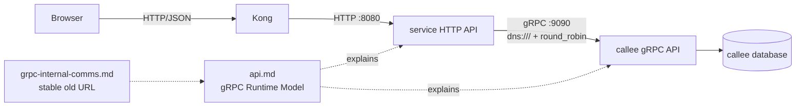

# gRPC Internal Communication (Compatibility Page)

The gRPC design and operating guidance now lives in the shared API guide.

| Attribute | Value |
|-----------|-------|
| **Status** | Compatibility page |
| **Canonical guide** | [api.md](./api.md) |
| **Current transport** | gRPC-only for migrated east-west calls; no feature flag or REST fallback |
| **Known exceptions** | Order-to-cart pricing read and worker cart clear still use REST |
| **Removal policy** | Keep while service repositories and historical decisions link here |

## Communication Diagram

## Where the Content Lives

| Looking for | Read |
|-------------|------|
| HTTP versus gRPC decision | [Choosing HTTP or gRPC](./api.md#choosing-http-or-grpc) |
| Current caller-to-callee matrix | [Current East-West Call Graph](./api.md#current-east-west-call-graph) |
| Dual ports and proto ownership | [gRPC Runtime Model](./api.md#grpc-runtime-model) |
| HTTP/2 connection-pinning problem | [Kubernetes HTTP/2 load balancing](./api.md#kubernetes-http2-load-balancing) |
| Deadlines, retry, health, and reflection | [Deadlines, retries, and health](./api.md#deadlines-retries-and-health) |
| Traces, access logs, and RPC metrics | [Observability](./api.md#observability) |
| NetworkPolicy and planned mTLS | [Security](./api.md#security) |
| Migration history and lessons | [Migration Lessons](./api.md#migration-lessons) |

## Current Summary

Browser and Kong traffic stays HTTP/JSON on `:8080`. Internal typed calls use
Protobuf over HTTP/2 on `:9090`. Kubernetes gRPC clients dial headless
`dns:///` Services with client-side `round_robin` so one long-lived
connection does not pin all traffic to one pod.

Protobuf sources and generated Go stubs live in `duynhlab/pkg`. Shared
`pkg/grpcx` behavior provides tracing, metrics, access logging, deadlines,
health, reflection, keepalive, and bounded retries.

## References

- [Canonical API guide](./api.md)
- [Application metrics](../observability/metrics/metrics-apps.md)
- [Microservice map](./microservices.md)

_Last updated: 2026-07-13_
