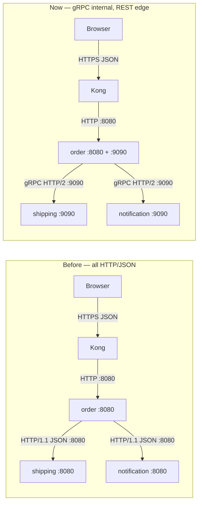
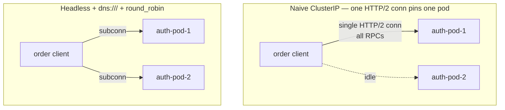
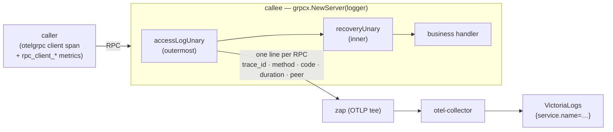
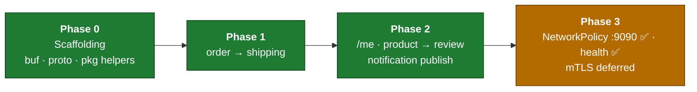
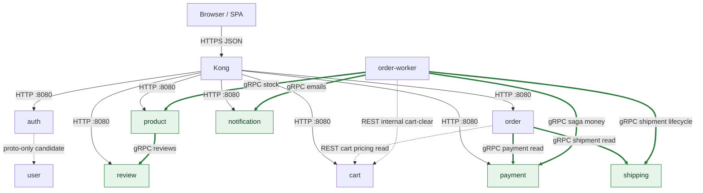

# gRPC for internal east-west communication

| Attribute | Value |
|-----------|--------|
| **Version** | **v1.0.0** |
| **Status** | **Implemented** — every east-west hop runs over gRPC (gRPC-only, no feature flag); cluster wired via headless Services; Phase 3 NetworkPolicy fences `:9090`, mTLS deferred. See [§7 roadmap](#7-phased-roadmap). |
| **Scope** | Internal (east-west) service-to-service calls only |
| **Relation** | Complements [`api-naming-convention.md`](api-naming-convention.md) (HTTP/JSON URL surface stays the law of the land) |
| **Last updated** | 2026-07-10 |

## Implementation status

The migration is **complete** for the migrated hops: they run over gRPC, the servers
are always-on (no feature flag), and there is no REST fallback. The **one documented
exception is the `order → cart` pair** (the checkout pricing read + the saga's
tokenless internal cart-clear), which remains REST — see the hop table below.

| Hop / item | Status | Where |
|------------|--------|-------|
| **Phase 0** — `pkg/grpcx` (otel, health, reflection, `round_robin`, default RPC deadline, auth-metadata helpers) + `auth`/`shipping`/`review`/`notification` protos with committed stubs; `buf` lint/breaking in CI | ✅ | `duynhlab/pkg` (v0.2.0) |
| **Phase 1** — `order → shipping` | ✅ gRPC-only | shipping + order |
| **Phase 2** — `/me` validation: all 5 consumers validated via `auth.GetMe` over gRPC through the shared fail-closed `pkg/authmw` | ⛔ retired by RFC-0009 Phase 5 (JWT-only authmw v0.12.0; `auth/v1` proto removed) | `pkg/authmw` + 5 services |
| **Phase 2** — `product → review` aggregation | ✅ gRPC-only | review + product |
| **Phase 2** — `order → notification` publish on checkout (best-effort; the saga worker drives it today) | ✅ | notification + order |
| **Payment (RFC-0010)** — `order` + `order-worker` → `payment` (saga capture/refund + `GetPayment` enrichment); `order-worker` → `product` (saga stock) | ✅ gRPC-only | payment + product + order + order-worker |
| **Cluster** — headless `{product,review,shipping,notification,payment}-grpc` Services (`:9090`) + ResourceSet `*_GRPC_ADDR` env (`auth-grpc` removed in Phase 5) | ✅ | mop chart (`grpc.enabled`), `kubernetes/apps/domains/*-rs.yaml`, `kubernetes/apps/services/*.yaml` |
| **Phase 3** — NetworkPolicy fences `:9090`; gRPC health service registered | ✅ | `kubernetes/infra/configs/network-policies/` |
| **Phase 3** — mTLS on `:9090` | ⏳ deferred | services use `insecure` creds; needs `grpcx` TLS + cert-manager |
| Verified end-to-end on Docker Compose (login, local JWKS verification, product reviews, checkout → notification) | ✅ | `homelab/local-stack` |

**gRPC is the official east-west transport** — servers run unconditionally on
`GRPC_PORT` (default `9090`); there is no `GRPC_ENABLED` flag and no REST fallback.
Consumers dial the headless Services:

| Var | Role | Default |
|-----|------|---------|
| `GRPC_PORT` | gRPC listen port (all services) | `9090` |
| `REVIEW_GRPC_ADDR` | product → review | `dns:///review-grpc.review.svc.cluster.local:9090` |
| `SHIPPING_GRPC_ADDR` | order → shipping (+ order-worker) | `dns:///shipping-grpc.shipping.svc.cluster.local:9090` |
| `NOTIFICATION_GRPC_ADDR` | order → notification (+ order-worker) | `dns:///notification-grpc.notification.svc.cluster.local:9090` |
| `PAYMENT_GRPC_ADDR` | order → payment (+ order-worker saga) | `dns:///payment-grpc.payment.svc.cluster.local:9090` |
| `PRODUCT_GRPC_ADDR` | order-worker → product | `dns:///product-grpc.product.svc.cluster.local:9090` |

## TL;DR

- Adopt gRPC **selectively** for internal east-west, machine-to-machine, latency-
  and contract-sensitive paths — not as a blanket replacement for HTTP.
- Run **dual-port** services: keep HTTP on `:8080` (`portName: http`) exactly as
  today, add gRPC on `:9090` (`portName: grpc`) only on the services that need it.
- **Hard rule:** browser/SPA traffic and everything through Kong stays HTTP/JSON.
  gRPC is internal-only. *If a browser can reach it, it stays REST.*
- Solve the Kubernetes HTTP/2 load-balancing pitfall with a **headless Service +
  client-side `round_robin`** first. **Defer** a service mesh — it is
  disproportionate for a pilot and we run no mesh today.
- Rolled out **phased and pilot-first**, each phase gated on trace continuity and
  no SLO regression. The cutover is now complete and **gRPC-only** — rollback is by
  reverting the relevant PR (the REST fallback has been removed).

---

## 1. Motivation & when to use gRPC

This is a balanced assessment. gRPC is a tool for a specific class of internal
calls, not a religion.

### What improves

- **Typed contracts + codegen.** Today the request/response shapes for
  service-to-service calls are hand-rolled JSON structs, duplicated across 8
  polyrepos. A field rename in `auth` and a stale copy in `order` is a runtime
  500 that no compiler catches. A shared `.proto` generates the structs; a
  breaking change is caught at **compile time** (and in CI, see §7).
- **Performance on the hottest path.** Binary Protobuf over a multiplexed HTTP/2
  connection is cheaper than JSON-over-HTTP/1.1 on the busiest east-west hop —
  originally **every service → auth `/me`** on each authenticated request.
  (That hop no longer exists: RFC-0009 Phase 5 moved token verification into
  each service via JWKS, and the remaining gRPC hops below keep the benefit.)
- **Built-in deadlines.** gRPC deadlines propagate across hops as a first-class
  concept, replacing ad-hoc per-client HTTP timeouts.

### What it costs

- **Proto tooling in every repo** — `buf`, codegen, generated-stub hygiene.
- **Lost `curl` debuggability.** No more eyeballing JSON on the wire. Mitigate
  with **server reflection + `grpcurl`** (see §4).
- **Two code paths during migration.** A service speaks both HTTP and gRPC until
  a path is fully cut over — more surface to test.
- **The Kubernetes load-balancing pitfall** (see §3) — the single biggest
  operational gotcha, and the reason this is phased.

### Candidate paths

| Caller → callee | Decision | Status |
|-----------------|----------|--------|
| every service → auth `/auth/v1/private/me` | gRPC | ⛔ **removed (Phase 5)** — services verify JWTs locally via JWKS; auth has no gRPC server |
| product → review (aggregation) | gRPC | ✅ gRPC-only |
| order → shipping (order-details shipment read) | gRPC | ✅ gRPC-only |
| order-worker → shipping (saga `CreateShipment`/`CancelShipment`) | gRPC | ✅ gRPC-only |
| order-worker → notification (saga emails, best-effort) | gRPC | ✅ best-effort |
| order + order-worker → payment (saga authorize/capture/void/refund + `GetPayment` enrichment) | gRPC | ✅ gRPC-only (RFC-0010) |
| order-worker → product (saga `ReserveStock`/`ReleaseStock`) | gRPC | ✅ gRPC-only (RFC-0010) |
| order → cart (pricing read, forwards user JWT; saga clear via tokenless internal route) | REST today | not migrated (both cart hops stay REST) |
| any browser / SPA → Kong | **STAY REST** | — (hard rule) |
| auth → user (registration) | not implemented | proto-only candidate |

> **Rule:** *If a browser can reach it, it stays REST.* gRPC is internal-only.
> NetworkPolicy is the fence, not the absence of an Ingress rule.

---

## 2. Target architecture

### Dual-port services

Every gRPC-speaking service keeps its existing HTTP listener and adds a second one:

| Port | `portName` | Purpose | Who calls it |
|------|-----------|---------|--------------|
| `8080` | `http` | Kong pass-through, browser, REST east-west, probes, `/metrics` | Kong, browser, services |
| `9090` | `grpc` | Protobuf over HTTP/2, internal-only | in-cluster services |

HTTP `:8080` is **unchanged** — Kong, the browser, the existing liveness/readiness
probes, and Prometheus scraping all keep working exactly as documented in
[`api-naming-convention.md`](api-naming-convention.md). gRPC is additive.

### Proto / contract management

- **Protos live in `github.com/duynhlab/pkg`** under `pkg/proto/<svc>/v1/`, with the
  **generated stubs committed** alongside the `.proto` sources. Consumers
  `go get` `pkg` and import the generated package — no codegen step in service
  CI, no proto-plugin version drift between repos.
- **`buf`** drives lint, codegen, and breaking-change detection.
- **Versioned package paths:** Protobuf package `<svc>.v1` (e.g. `auth.v1`,
  `shipping.v1`), mirroring the `/v1/` already in the HTTP URL surface.
- **Rejected for now: a separate proto repo.** It adds a release/tag dance
  between three repos (proto → pkg → service) for no benefit at this scale. `pkg`
  is already the shared-library home; protos belong with it.

---

## 3. The Kubernetes HTTP/2 load-balancing problem

This is the key operational hazard and the reason the rollout is phased.

### The problem

A standard `ClusterIP` Service load-balances at **L4, per TCP connection**. HTTP/1.1
opens a fresh connection per request (or churns a small pool), so requests spread
across pods naturally. gRPC does the opposite: it **multiplexes every RPC over one
long-lived HTTP/2 connection**. That single connection is balanced once, at dial
time, and then **pins to a single pod** for its whole lifetime.

Result: with `auth`, `product`, `cart`, and `order` each running **2 replicas**, a
naive gRPC client sends *all* its traffic to **one** replica while the second sits
idle — defeating both replicas and any horizontal scaling.

### Fix comparison

| Option | Verdict | Why |
|--------|---------|-----|
| **(a)** Headless Service (`clusterIP: None`) + gRPC `dns:///` resolver + `round_robin` | **RECOMMENDED** | Client resolves every pod IP and opens a subconnection to each, balancing RPCs across all replicas. No new infra, works today. |
| **(b)** Service mesh (Linkerd / Istio / Cilium) | **Defer** | Solves it transparently at L7, but we run no mesh today; standing one up for a pilot is disproportionate. Revisit if mesh lands for other reasons. |
| **(c)** Dedicated L7 proxy (e.g. an internal Envoy hop) | **Reject** | Extra hop, extra component to operate, duplicates what option (a) gives for free. |

### Pilot timing

The Phase 1 pilot callee, **shipping, runs 1 replica**, so the pinning gotcha is
**dormant** — there is only one pod to pin to. This lets us validate the gRPC
plumbing (codegen, interceptors, deadlines, tracing) before tackling LB.

The Phase 2 callees — **auth, product, cart, order — run 2 replicas**, so the
headless + `round_robin` fix is **in place**: standalone headless `{svc}-grpc`
Services (`clusterIP: None`, `:9090`) front every gRPC callee, and clients dial
them via `dns:///…-grpc.<ns>.svc.cluster.local:9090`.

---

## 4. Observability continuity

The four-pillar observability stack must not regress. gRPC keeps it intact:

- **Tracing.** `otelgrpc` client/server interceptors propagate the trace context
  over gRPC metadata, so **Tempo/Jaeger spans stay continuous** across an
  HTTP→gRPC→HTTP call chain. No trace gaps.
- **Metrics.** Prometheus `/metrics` stays on HTTP `:8080`, scraped exactly as
  today. gRPC adds RPC-level metrics via the same interceptors; the existing
  RED dashboards are unaffected. Metric names, labels
  (`rpc_server/client_call_duration_seconds_*`), and the dashboard row are
  documented in
  [observability → application metrics](../observability/metrics/metrics-apps.md#grpc-instrumentation-east-west).
- **Health.** Implement the **gRPC Health Checking Protocol** and use
  `grpc-health-probe`. During dual-port, **keep the HTTP `/health` and `/ready`
  probes** (they already work); only switch the Kubernetes probes to gRPC once a
  service is gRPC-primary.
- **Logging.** A shared **access-log interceptor** in `grpcx` (server-side) emits
  one structured line per incoming RPC — the gRPC counterpart of the HTTP request
  log — so east-west calls are visible in VictoriaLogs alongside edge traffic. See
  [Access logging](#access-logging-east-west) below.
- **Debugging.** Enable **server reflection** so `grpcurl` can introspect and call
  services without a local copy of the protos — the gRPC analogue of `curl`.
- **OTLP exporter.** The collector already accepts OTLP on **gRPC `:4317`** and
  **HTTP `:4318`**. Services currently export over `:4318`. Switching the app's
  own OTLP exporter to `:4317` is **optional and independent** of this proposal —
  do it only if we want gRPC OTLP too; it is not a prerequisite.

### Access logging (east-west)

Before RFC-0014 P4, an east-west RPC had spans and RED metrics but **no per-call
log line** — the HTTP `LoggingMiddleware` is a Gin middleware and never sees gRPC
traffic. `grpcx.NewServer(logger, …)` now chains a server-side access-log
interceptor (unary + stream) that logs each incoming RPC through the service's
OTLP-teed zap logger, so the line lands on the same `{service.name=…}` stream in
VictoriaLogs as the service's HTTP and application logs.

| Aspect | Behavior |
|---|---|
| **Fields** | `trace_id`, `method` (`info.FullMethod`), `code` (gRPC status string), `duration`, `peer` (caller pod address) |
| **Level** | `OK` → Info; any other code → Error (mirrors the HTTP logger's `>=400 → Error`) |
| **Side** | **Server (callee) only.** The caller already has the client span + `rpc_client_*` metrics; logging both ends would double every east-west line. |
| **Skipped** | Health checks (`/grpc.health.v1.Health/`) and reflection (`/grpc.reflection.`) — the same infra set `telemetryFilter` excludes from traces/metrics, so kubelet probes and keepalive pings don't flood the log. |
| **Panics** | A handler panic is recovered to `codes.Internal` (recovery interceptor, inner) and **still logged** as an Error line with `code=Internal` — the access interceptor is chained outermost so it observes the recovered result. |

**Field-naming vs the HTTP log (deliberate):** `trace_id` / `method` / `duration`
match exactly, so a `trace_id:"…"` query spans both protocols. The outcome and
caller fields differ on purpose — gRPC uses `code`/`peer`, HTTP uses
`status`/`client_ip` — because a gRPC status code is a distinct enum (reusing the
integer `status` field would make it mixed-type in VictoriaLogs) and `peer` is the
in-cluster caller, not the edge client behind Kong. Cross-protocol filtering
therefore keys on `trace_id`, not a shared status field.

Introduced in `pkg` v0.18.1 (the v0.18.0 interceptor had the recovery/access-log
chain inverted, so recovered panics were never logged — fixed in v0.18.1).

### Resilience & hardening (pkg/grpcx v0.6.0)

The shared `grpcx` bootstrap sets safe defaults so individual services don't have to:

| Concern | Default |
|---|---|
| **Handler panics** | Unary + stream **recovery interceptors** turn a panic into `codes.Internal` instead of crashing the shared HTTP+gRPC process. |
| **Pod churn / scale** | Server `keepalive.MaxConnectionAge` (30m, +5m grace) forces clients to periodically reconnect → re-resolve the headless DNS and **rebalance** across replicas after a rolling deploy/scale. |
| **Dead-peer detection** | Client `keepalive.ClientParameters` (Time 30s/Timeout 10s) detects a dead pod in seconds, not minutes. |
| **Transient restarts** | Default service config **retries on `UNAVAILABLE`** (≤3 attempts, exp backoff) — safe, since UNAVAILABLE is a pre-processing transport failure. |
| **Resource bounds** | `MaxConcurrentStreams` (1000) + explicit `MaxRecvMsgSize` (4 MiB). |
| **Reflection** | Registered by default for `grpcurl`; set `GRPC_REFLECTION=false` in prod to stop schema disclosure. |

**Server error-code mapping.** Callee handlers map domain errors to specific gRPC
codes (`InvalidArgument` for bad input, `NotFound`/empty where the resource is
optional, `Internal` only for genuine faults) rather than collapsing everything to
`Internal` — so RED metrics aren't poisoned by client-induced errors and retry
policies can key off the code correctly.

---

## 5. Security

> ⚠️ **Current posture (be honest about it).** The three-layer model below is the
> *target*. **Today only the network layer actively protects east-west gRPC:**
> mTLS is deferred (clients dial with `insecure` credentials, so there is no service
> identity), and the review/shipping/notification/payment gRPC servers do **no
> inbound JWT/auth check**. NetworkPolicy **is** enforced — kindnet enforces
> NetworkPolicy on the cluster's Kubernetes (≥ 1.34) locally, and a policy CNI does
> in prod — so the per-namespace ingress rules limit *which* workloads can reach
> `:9090`. Net effect: a workload in an allowed namespace can invoke internal RPCs
> — including `notification.SendEmail` — unauthenticated; NetworkPolicy fences
> *reachability*, not *identity*. Payment's policy is deliberately the tightest
> (its `:9090` moves money: only the order namespace is admitted, Kong never).
> **mTLS (service identity) is the prioritized next step** to close that gap.

gRPC does not replace the existing controls — it **layers with** them. Three
complementary layers, each answering a different question:

| Layer | Question it answers | Mechanism |
|-------|---------------------|-----------|
| **NetworkPolicy** | *Who may connect?* | k8s NetworkPolicy (pod/namespace selectors) |
| **mTLS** | *Which service is this?* | gRPC mTLS, certs from cert-manager / trust-manager bundle |
| **JWT** | *Which user is this?* | JWT in gRPC metadata `authorization` key |

- **mTLS** is **defense-in-depth**, issued via the existing **cert-manager /
  trust-manager `homelab-ca-bundle`** PKI. It authenticates the *service*, not the
  user.
- **JWT carries the user identity.** For user-scoped calls (today only the
  `order → cart` pricing read, which is REST), forward the caller's JWT — for a
  future user-scoped gRPC hop that means **metadata** under the `authorization`
  key, the gRPC equivalent of the `Authorization` header.
- These are **complementary, not a substitution**: NetworkPolicy fences the
  network, mTLS proves service identity, JWT proves user identity.

---

## 6. GitOps / infrastructure impact

Implemented, chart-native. The headless `{svc}-grpc` Service (`clusterIP: None`,
`:9090`) is rendered by the **mop chart** ([`duynhlab/helm-charts`](https://github.com/duynhlab/helm-charts/blob/main/charts/mop/templates/service-grpc.yaml),
`>=0.8.0`) whenever `grpc.enabled=true`; the gRPC dial addresses are wired
per-service through the domain ResourceSets (`kubernetes/apps/domains/*-rs.yaml`)
+ InputProviders. There are no standalone gRPC Service manifests — the earlier
`kubernetes/infra/configs/grpc-services/` stopgap was retired once the chart
gained native support.

- **Chart values, input-gated** (`kubernetes/apps/domains/*-rs.yaml`): a
  `grpc: { enabled: true, port: 9090 }` block guarded by `<<- if (index inputs
  "grpc_server") >>`, so only the gRPC-server services render the headless
  Service and the second container port. Callees opt in via `grpc_server: true`
  on their InputProvider (`kubernetes/apps/services/{product,review,shipping,notification,payment}.yaml`).
- **Headless Service** for gRPC *callees* (`clusterIP: None`) enables
  client-side `round_robin` (§3). HTTP callees (`grpc.enabled` unset) are untouched.
- **Env convention:** `*_GRPC_ADDR`, e.g.
  `SHIPPING_GRPC_ADDR=dns:///shipping-grpc.shipping.svc.cluster.local:9090`. The
  `dns:///` scheme is what activates the gRPC name resolver for `round_robin`.
- **Probes stay HTTP** — `/health` + `/ready` on `:8080`. The gRPC server shares
  the pod process, so the HTTP probes already reflect gRPC health; the chart adds
  no grpcurl probe.
- **No Kong change.** Kong never sees gRPC; the gateway stays HTTP/JSON.
- **OTLP env switch** (`OTEL_COLLECTOR_ENDPOINT` `:4318` → `:4317`) is **optional**
  and decoupled from this work.

---

## 7. Phased roadmap

> **Historical migration plan — superseded by the gRPC-only cutover; see [Implementation status](#implementation-status) above.** The feature-flag and REST-fallback mechanics described per phase below are how the migration was *planned*; the cluster is now gRPC-only with always-on servers and no fallback.

Each phase has explicit success criteria and a one-step rollback.

**Status:** Phases 0–2 are **implemented** and the cluster is wired — every
east-west hop runs over gRPC (gRPC-only, servers always-on), reachable via
headless `{svc}-grpc` Services. Phase 3 is partial: NetworkPolicy fences `:9090`
and the gRPC health service is registered; **mTLS is deferred** (services use
`insecure` credentials until it is wired into `grpcx` + cert-manager).

> 🟢 implemented · 🟠 partial (mTLS deferred)

### Per-hop transport

Every east-west hop is **gRPC-only** today (solid green, `:9090`); the browser/Kong
edge and the two order→cart hops (pricing read, internal cart-clear) stay HTTP/JSON.

> There is **no** per-request east-west hop to `auth` any more — since RFC-0009
> Phase 5 all JWT-validating services verify RS256 tokens locally against the
> cached JWKS (`pkg/authmw`), so `auth` runs no gRPC server. `notification`'s
> browser-facing routes (list/count/get/mark-read) **stay REST** — only the
> internal publish path is gRPC. The `order-worker` (RFC-0010 Temporal saga)
> drives the payment/product/shipping/notification hops from its activities.

### Phase 0 — Scaffolding (no runtime change)

- Add `buf` config, `pkg/proto/<svc>/v1/` layout, and committed generated stubs to
  `pkg`.
- Add reusable helpers to `pkg`: gRPC server/client bootstrap, `otelgrpc`
  interceptors, gRPC health server, server reflection.
- CI: `buf lint` + `buf breaking` (against the committed baseline).
- **Design the `auth → user` proto only** (not implemented) to exercise the
  workflow end to end.
- **Success:** CI green; stubs import cleanly into a service; no deployment change.
- **Rollback:** delete the proto package; nothing runtime depends on it yet.

### Phase 1 — order → shipping ✅ implemented (gRPC-only; cluster wired)

- Add gRPC `:9090` to `shipping` (dual-port) behind a **feature flag**; `order`
  calls gRPC when the flag is on, **falls back to REST** when off.
- Stand up the **headless Service** for `shipping` (even though it is 1 replica)
  to exercise the resolver path.
- **Success:** identical responses on both paths; **Tempo trace continuity**
  across `order → shipping`; **no RED/SLO regression**.
- **Rollback:** flip the env flag off → `order` resumes the REST call. One step.

### Phase 2 — auth /me, product → review, and notification publish ✅ implemented (gRPC-only)

- **Verify headless + `round_robin` spreads RPCs across both replicas first**
  (auth/product/cart/order are 2-replica — §3 must be solved here).
- Cut `every service → auth /me` and `product → review` to gRPC; **forward JWT in
  metadata** for `/me`.
- **Notification publish:** design `notification.v1` for the internal
  `notifications/email` / `notifications/sms` endpoints and **wire the first caller** — e.g.
  `order` publishing an "order created" notification on checkout. notification
  has **no caller today**, so this both designs the proto and introduces the
  producer (a fire-and-forget, internal, machine-to-machine call — a natural gRPC
  fit). Its **browser-facing** routes (list/count/get/mark-read) **stay REST**.
- **Success:** RPCs balanced across replicas (observable in per-pod metrics);
  trace continuity; no SLO regression; a notification row appears for the
  recipient after checkout.
- **Rollback:** per-path env flag back to REST.

### Phase 3 — Standardize & harden 🟠 partial (NetworkPolicy `:9090` ✅; mTLS deferred)

- Standardize headless-Service LB across all gRPC callees.
- Switch Kubernetes probes to **gRPC health probes** on gRPC-primary services.
- Enable **mTLS** (cert-manager / trust-manager bundle).
- Add **NetworkPolicy** for gRPC ports.
- **Optional:** switch app OTLP export to `:4317`.
- **Success:** mTLS enforced; NetworkPolicy in place; trace continuity; no SLO
  regression.
- **Rollback:** per-control toggles (probe type, mTLS mode, policy) revert
  independently.

> **Success gate, every phase:** Tempo/Jaeger trace continuity intact · no
> RED/SLO regression · one-step env-flag rollback to the REST path.

---

## 8. Risks & non-goals

- **Browser/Kong stays REST.** Non-negotiable. gRPC never touches the gateway.
- **No big-bang rewrite.** Migration is path-by-path, behind flags, with REST
  fallback at every step.
- **Service mesh deferred.** Not adopted as part of this work; headless +
  `round_robin` covers LB without it.
- **Proto-break blast radius** is mitigated by `buf breaking` in CI — a breaking
  change fails the build before it can reach a consumer.

---

_Last updated: 2026-07-11 — closed the `product-grpc` gap (`rsip-product` now sets `grpc_server: true`, so `product-grpc` renders in-cluster); stale auth-gRPC remnants removed (diagram, env-var and InputProvider examples); hop tables/diagram completed with the order-worker saga hops (stock, shipment lifecycle, emails) and the tokenless internal cart-clear._
