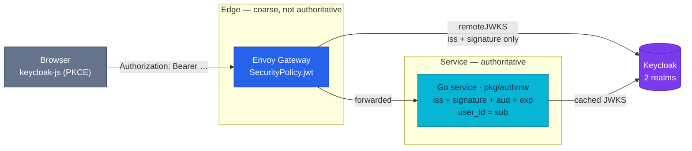

# Identity and Tokens

The verification contract every service and worker follows — two Keycloak realms, where a token is checked and by whom, the claim that becomes `user_id`, and the `OIDC_*` env pair that decides whether a pod can verify anything at all.

> **Platform ops** (Keycloak deployment, realm import, database, alerts,
> runbooks) live in [Keycloak (platform)](../platform/keycloak.md). Edge routing
> and policy attachment: [Envoy Gateway](../platform/envoy-gateway.md). The
> retired hand-rolled issuer stays readable in [auth.md](./auth.md).

| Attribute | Value | RFC / ADR |
|-----------|-------|-----------|
| **Issuer** | Keycloak — the only issuer fleet-wide; `auth-service` is deleted | [RFC-0024](../proposals/rfc/RFC-0024/) P3/P5 |
| **Realms** | `duynhlab` (customers) · `duynhlab-staff` (workforce) | [ADR-050](../proposals/adr/ADR-050-separate-staff-identity-realm/) |
| **Clients** | `customer-spa` · `admin-portal` — both public, PKCE `S256` | — |
| **Audience** | `duynhlab-platform`, stamped by an audience mapper; enforced **in-service only** | — |
| **Access token** | RS256, 900 s (15 min), refresh rotation with reuse revocation | — |
| **`user_id`** | The token `sub`, a string UUID, `VARCHAR(255)` in every schema | [ADR-042](../proposals/adr/ADR-042-oidc-sub-as-user-id/) |
| **Library** | `pkg/authmw` — fail-closed, local verification against a cached JWKS | [pkg.md](./pkg.md) |
| **Browser flow** | Authorization Code + PKCE via `keycloak-js`; no BFF | [ADR-043](../proposals/adr/ADR-043-oidc-browser-workload-trust/) · [ADR-048](../proposals/adr/ADR-048-admin-portal-no-bff/) |
| **Design record** | — | [RFC-0022](../proposals/rfc/RFC-0022/) (design) · [ADR-041](../proposals/adr/ADR-041-keycloak-platform-idp/) |

---

## Overview

Every request that carries an identity carries a Keycloak-issued RS256 bearer
token. Nothing else in the platform mints one: the RS256 signer, refresh
families, and JWKS endpoint that `auth-service` used to own were deleted whole at
RFC-0024 P5.

Two things about this contract are easy to get wrong, so they lead:

1. **The edge is not authoritative.** It checks issuer and signature. It does
   **not** check the audience — see [Two layers](#two-layers-and-what-each-one-actually-checks).
2. **A service needs two env vars per realm, and they are not
   interchangeable.** One is an identity claim, one is a network path. Getting
   this wrong is fail-closed and total — every guarded route answers `503`.

## Two realms

Customers and staff are separate realms, not separate roles in one realm
([ADR-050](../proposals/adr/ADR-050-separate-staff-identity-realm/)). A customer
token presented to a staff route is *wrong-issuer* at the edge and never reaches
the role gate.

| | `duynhlab` | `duynhlab-staff` |
|---|---|---|
| Audience | Storefront customers | Back-office operators |
| Client | `customer-spa` | `admin-portal` |
| Realm role | `customer` | `backoffice_admin` |
| Issuer | `https://id.duynh.me/realms/duynhlab` | `https://id.duynh.me/realms/duynhlab-staff` |
| Access token | 900 s | 900 s |
| SSO idle / max | 14 d / 30 d (`rememberMe` on) | 30 min / 10 h (`rememberMe` off) |
| Brute-force protection | off | **on** |
| Self-registration | off | off |

Both realms share the deliberate parts: public client with
`pkce.code.challenge.method: S256`, standard flow only, **Direct Access Grants
disabled** (so there is no password-grant shortcut — see
[Getting a token](#getting-a-token-for-tests)), implicit flow off, service
accounts off, `revokeRefreshToken: true` with `refreshTokenMaxReuse: 0`, and a
`platform-audience` mapper putting `duynhlab-platform` in the access token but
not the ID token.

Realm JSON is imported, not managed live —
`kubernetes/infra/controllers/keycloak/configmap-realm.yaml` holds both realms.
Import is one-shot; see
[Keycloak (platform) § Realm delivery](../platform/keycloak.md#realm-delivery).

## Two layers, and what each one actually checks



**The edge** attaches a `SecurityPolicy` with `remoteJWKS` per guarded route —
7 `jwt-edge` (customer realm) and 6 `jwt-edge-staff` (staff realm). It holds no
key material; it fetches the realm's JWKS.

**It does not verify the audience.** There is no `audiences:` field in any
SecurityPolicy, in the cluster or in local-stack — that is deliberate, so the
edge cannot start rejecting a token the services would have accepted. The
practical consequence: *any* token the realm signed passes the edge, including
one minted for a different client. `aud=duynhlab-platform` is enforced only by
`pkg/authmw`, in-process.

**The service** is authoritative: `pkg/authmw` verifies issuer, signature,
audience, and expiry locally against a cached JWKS, normalizes
`realm_access.roles`, and takes `user_id` from `sub`. It is **fail-closed** — a
token it cannot verify, and a JWKS it cannot reach, both deny.

Public routes carry no edge JWT policy at all, on purpose:
`api-user-public`, `api-review-public`, `api-payment-webhooks` (an HMAC over the
raw body is the credential, not a bearer token), and the `id.duynh.me` login
surface itself.

## `user_id` is the `sub`

`user_id = token.sub`, a string UUID, `VARCHAR(255)` in every schema that stores
it ([ADR-042](../proposals/adr/ADR-042-oidc-sub-as-user-id/)). There is no
numeric user id anywhere, no dual column, and no compatibility window — the
cutover was greenfield.

Rules that follow from it:

- Read the identity from verified claims, never from a request body.
- One identifier travels HTTP → gRPC → DB → Temporal input unchanged.
- String keys have no ordering — do not sort or range-scan on `user_id`.
- `pkg/idempotency` takes `UserID string` (was `int64`).

Per-service column rows: [cart](./cart.md) · [user](./user.md) ·
[review](./review.md) · [notification](./notification.md) ·
[checkout](./checkout.md) · [order](./order.md) · [payments](./payments.md).

## The env contract

The domain ResourceSets inject these from per-service input flags
(`kubernetes/apps/services/<name>.yaml` → `kubernetes/apps/domains/*-rs.yaml`).
Services do not hand-roll them.

| Flag | Injects |
|------|---------|
| `authmw: true` | `OIDC_ISSUER` = `https://id.duynh.me/realms/duynhlab`<br/>`OIDC_JWKS_URL` = `http://keycloak.identity.svc.cluster.local:8080/realms/duynhlab/protocol/openid-connect/certs` |
| `staffauthmw: true` | `OIDC_STAFF_ISSUER` = `https://id.duynh.me/realms/duynhlab-staff`<br/>`OIDC_STAFF_JWKS_URL` = the in-cluster staff-realm `certs` path |

**Issuer and JWKS URL are different kinds of thing.** The issuer is an identity
claim — it must equal the `iss` the realm stamps, so it stays the *public* host.
The JWKS URL is a network path — it must be fetchable from inside the pod, so it
names the *in-cluster* Service. Declare both. Left unset, the JWKS is derived
from the issuer, hairpins to the public host, resolves in-cluster to
`127.0.0.1`, and the fail-closed verifier answers every guarded request
`503 Authentication temporarily unavailable`. This shipped as a live defect and
was fixed 2026-08-22 — the incident detail is in
[api.md § Protected route conventions](./api.md#protected-route-conventions-planned).

Which services carry which:

| Service | `authmw` (customer) | `staffauthmw` |
|---------|:---:|:---:|
| cart · checkout · notification · review | ✅ | — |
| inventory · order · payment · product · shipping · user | ✅ | ✅ |

Ten services verify customer tokens; six of them also verify staff tokens. That
list is load-bearing beyond the env: the `identity` NetworkPolicy allows JWKS
egress from **exactly these ten namespaces**, so adding an eleventh consumer
means editing the policy too — see
[Keycloak (platform) § Network reachability](../platform/keycloak.md#network-reachability).

`frontend` and `backoffice` get no `OIDC_*` env: they are browsers. The realm,
client, and Keycloak origin are baked into their images at build time.

## Browsers

Storefront and back-office both run Authorization Code + PKCE through
`keycloak-js` ([ADR-043](../proposals/adr/ADR-043-oidc-browser-workload-trust/)).
The access token lives in JS memory — not `localStorage`, not a cookie — and
there is no BFF ([ADR-048](../proposals/adr/ADR-048-admin-portal-no-bff/)).

Two consequences worth stating: a full page load always costs a silent
re-authentication round trip, and there is **no central per-request
revocation** — a stolen token is valid until it expires, bounded by the 15-minute
access-token lifespan.

OAuth stops at the browser edge. East-west calls between services are not
OAuth-authenticated; they are trusted by network position (NetworkPolicy) until
workload identity lands. See
[api.md § Current East-West Call Graph](./api.md#current-east-west-call-graph).

## Getting a token for tests

Direct Access Grants are disabled on both realms, so there is no
`grant_type=password` shortcut. Use the headless Authorization Code + PKCE
helper:

```bash
# local-stack (defaults: customer realm, alice)
local-stack/scripts/keycloak-token.sh

# staff realm
KC_REALM=duynhlab-staff KC_CLIENT_ID=admin-portal \
  USERNAME=duyne PASSWORD='p@ss1234' local-stack/scripts/keycloak-token.sh

# against the cluster edge (self-signed CA)
KC_URL=https://id.duynh.me KC_INSECURE=1 local-stack/scripts/keycloak-token.sh
```

k6 does the same in `scripts/k6/lib/auth.js`, with the realm/client pairs and
demo identities in `scripts/k6/lib/config.js`. Demo login is by **username**
(`alice` / `password123`), not email.

## References

- [Keycloak (platform)](../platform/keycloak.md) — deployment, realm import, database, alerts, runbooks
- [api.md § Authentication](./api.md#authentication) — where this contract meets the shared HTTP rules
- [Envoy Gateway](../platform/envoy-gateway.md) — edge policy attachment and route inventory
- [pkg.md](./pkg.md) — `authmw` and `idempotency` module contracts
- [auth.md](./auth.md) — the retired hand-rolled issuer, kept as an archived record
- [RFC-0022](../proposals/rfc/RFC-0022/) — identity design record · [RFC-0024](../proposals/rfc/RFC-0024/) — the cutover that executed it
- [ADR-041](../proposals/adr/ADR-041-keycloak-platform-idp/) · [ADR-042](../proposals/adr/ADR-042-oidc-sub-as-user-id/) · [ADR-043](../proposals/adr/ADR-043-oidc-browser-workload-trust/) · [ADR-050](../proposals/adr/ADR-050-separate-staff-identity-realm/)

---

_Last updated: 2026-08-24 — first version: the identity contract had no home in `docs/api/`, so realms, the `sub`-as-`user_id` rule, and the `OIDC_*` env pair were scattered across `api.md`, `pkg.md`, and seven service files. Records that the edge does **not** verify `aud`._
