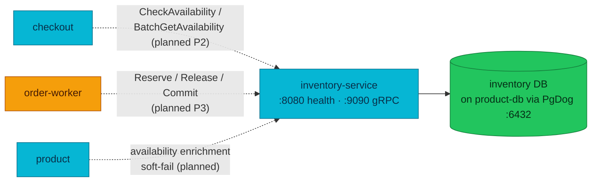

# Inventory Service API

Inventory turns raw stock counts into a governed authority: it holds per-warehouse
balances, hands out all-or-nothing reservations against a derived
available-to-promise, and records every physical and reserved change in an
append-only movement ledger — while catalog, price, and order status stay owned
elsewhere.

> **Contract stance:** As-built. The `inventory.v1` gRPC contract and its
> data/behaviour model are deployed and Implemented. **There is no live caller
> yet** — checkout and the order saga still use product-service's stock surface;
> inventory becomes the live stock authority over [RFC-0021](../proposals/rfc/RFC-0021/)
> phases 2–4. Cutover behaviour is tagged `Planned` and never presented as current.

| Dimension | Value | Status |
|-----------|-------|--------|
| **Deployment** | local-stack + cluster — **no live caller** (product is still the live stock authority) | Implemented |
| **Runtime modes** | `api` (serve) + `migrate` + `seed` (dev-only) | Implemented |
| **HTTP server** | internal · `:8080` · `/health` + `/ready` only | Implemented |
| **Edge exposure** | None — no Kong route; gRPC-only, NetworkPolicy-fenced | None |
| **gRPC server** | `inventory.v1.InventoryService/{BatchGetAvailability,CheckAvailability,Reserve,Release,Commit,GetReservation}` · `:9090` | Implemented |
| **gRPC clients** | None | None |
| **Worker** | None | None |
| **Temporal** | None · [workflows.md](./workflows.md) | None |
| **Async / events** | None | None |
| **Technical debt** | None | None |

| Attribute | Value | RFC / ADR |
|-----------|-------|-----------|
| **Repository** | [`duynhlab/inventory-service`](https://github.com/duynhlab/inventory-service) | — |
| **Domain** | Fulfillment (GitOps `platform.duynhlab.dev/domain: fulfillment`) | — |
| **Owns** | Warehouses, per-`(sku, warehouse)` balances (`on_hand`/`reserved`/`safety_stock`), reservation FSM, warehouse allocation, movement ledger, safety stock | — |
| **Does not own** | Catalog, descriptions, selling price ([product](./product.md)); order status ([order](./order.md)); checkout snapshot/totals ([checkout](./checkout.md)) | — |
| **Database** | `inventory` on `product-db` (CNPG) via PgDog `pgdog-product.product:6432`; migrations direct to `product-db-rw` | — |
| **Cache** | None | — |
| **Sensitive data** | None (no PII; SKU/warehouse/quantity only) | — |
| **Contract sources** | gRPC `pkg/proto/inventory/v1/inventory.proto`; HTTP health only | — |
| **Design records** | — | [RFC-0021](../proposals/rfc/RFC-0021/) · [ADR-027](../proposals/adr/ADR-027-inventory-sole-stock-authority/) · [ADR-028](../proposals/adr/ADR-028-inventory-reservation-model/) |

## Temporal participation

None — this service does not start or participate in Temporal workflows. See
[workflows.md](./workflows.md). When the phase-3 write cutover lands, the
order-fulfillment saga will call `Reserve`/`Release`/`Commit` as **Participant
(gRPC)** activities (**Planned**); today those activities still target product.

## Why it exists

Before inventory-service, stock was an attribute of the catalog: product-service
stored `products.stock_quantity` and a `stock_reservations` ledger and decremented
the column in place during the order saga ([product.md](./product.md)). That
forced one read-heavy catalog and one write/concurrency-heavy money path to share
a database, a cache, and a blast radius, with no warehouse model, no reservation
expiry, and no movement history that separates a physical change from a reserved
one.

Inventory is a separate ownership boundary because "how many can we sell right
now" has the opposite profile to "what is this product and what does it cost": it
is contended, must never oversell, and needs an auditable ledger. The correctness
property it provides is **no oversell / no double-reserve / no double-commit**,
enforced by database constraints and locked transactions rather than in-memory
locks ([ADR-028](../proposals/adr/ADR-028-inventory-reservation-model/)).

It deliberately does **not** own the catalog, price, or order status, and in v1
does not do multi-warehouse split fulfillment, backorder (ATP from incoming
stock), or reservation auto-expiry.

### Boundary

| Question | Answer |
|----------|--------|
| **What is authoritative here?** | Warehouse balances, reservations, allocations, movement ledger, safety stock |
| **What is only a snapshot or projection?** | None — inventory is the writer of its own state |
| **What is delegated to another service?** | Catalog/price → product; order status → order; session/totals → checkout |
| **What must never be implemented here?** | Product descriptions, selling price, order lifecycle, payment state |
| **Consistency model** | Strong within a `(sku, warehouse)` balance (locked transaction + DB CHECKs); availability reads are point-in-time and advisory |

## Architecture

One question: **who calls inventory, what does it own, and what is not yet live?**



Every inbound edge is **planned**: the service is deployed and its gRPC surface is
Implemented, but no caller is wired yet (RFC-0021 phases 2–3). Nothing dials
inventory's HTTP surface — `:8080` carries `/health` and `/ready` only; all
consumers use gRPC on `:9090`, fenced by NetworkPolicy from the `checkout` and
`order` namespaces.

## Data model

All quantities are whole units (`BIGINT`). Derived quantities are never stored.

| Table | Purpose | Key constraints |
|-------|---------|-----------------|
| `warehouses` | Warehouse registry | `code` unique; `status IN ('active','inactive')`; `WH-DEFAULT` seeded by migration (infrastructure, not demo data) |
| `inventory_balances` | One balance per `(sku_id, warehouse_id)` | PK `(sku_id, warehouse_id)`; `on_hand ≥ 0`, `reserved ≥ 0`, `safety_stock ≥ 0`, **`reserved ≤ on_hand`**; `version` column |
| `inventory_reservations` | Reservation header (FSM) | PK `id` (= caller `reservation_id`); `external_reference` (order id) **UNIQUE**; `request_hash`; `status IN ('reserved','committed','released','expired')`; `expires_at` nullable (observability-only) |
| `inventory_reservation_lines` | Per-SKU lines of a reservation | PK `(reservation_id, sku_id)`; `quantity > 0`; FK cascade on header |
| `inventory_movements` | Append-only ledger | `command_id` **UNIQUE**; `type IN ('RECEIVE','ADJUST','SET_SAFETY_STOCK','RESERVE','RELEASE','SALE_COMMITTED','RETURN')`; separate `on_hand_delta`/`reserved_delta`; `reference_type`/`reference_id` for reservation-driven rows; `actor` for admin commands |

**available-to-promise is derived, never stored:**
`available_to_promise = GREATEST(0, on_hand − reserved − safety_stock)`, computed
by queries so it cannot drift from its inputs. **"Sold" is not a bucket** — a
commit does `on_hand −= q; reserved −= q` and appends a `SALE_COMMITTED` movement.
The `reserved ≤ on_hand` and `≥ 0` CHECKs are the oversell backstop beneath the
application logic — correctness never relies on in-memory locks alone.

`sku_id` is an opaque immutable string (initially the product id); a future
variant model can add SKUs without a contract change.

## HTTP API

None public. `:8080` serves operational endpoints only:

| Method | Path | Purpose | Errors worth knowing |
|--------|------|---------|----------------------|
| `GET` | `/health` | Liveness | — |
| `GET` | `/ready` | Readiness (DB reachable) | `503` when the pool is not ready |

No Kong route reaches inventory; kubelet probes are host-level and bypass
NetworkPolicy. Platform conventions: [api.md](./api.md#error-envelope).

## gRPC API

Canonical contract: `pkg/proto/inventory/v1/inventory.proto`. Server on `:9090`
(clients dial `dns:///inventory.inventory.svc.cluster.local:9090` — see
[api.md § gRPC runtime model](./api.md#grpc-runtime-model)). Errors carry a
`google.rpc.ErrorInfo` detail with a stable machine reason via
`grpcx.ErrorWithReason`; business rejections are non-retryable for saga callers,
storage failures are retryable (`DEPENDENCY_UNAVAILABLE`).

| RPC | Request → Response | Saga | Notes |
|-----|--------------------|------|-------|
| `BatchGetAvailability` | `sku_ids[]` (1..200) → per-SKU `status` + `available_to_promise` | — | Read-only. Unknown/untracked SKU → `AVAILABILITY_STATUS_UNKNOWN` (never fabricated into `OUT_OF_STOCK`); tracked-but-zero → `OUT_OF_STOCK`. Over 200 ids → `VALIDATION_ERROR` |
| `CheckAvailability` | `items[]` (1..100) → `can_fulfill` + `shortages[]` | — | Whole-basket UX/revalidation gate. **Advisory only** — `Reserve` is the correctness gate; callers must not map a transport error to "out of stock". Duplicate SKU lines are summed before evaluation |
| `Reserve` | `reservation_id` + `order_id` + `items[]` + `request_hash` (+ optional `expires_at`) → `status` + `allocations[]` | step | All-or-none; one warehouse fulfils the whole order. Idempotent by `reservation_id` + `request_hash` (replay returns the original); divergent hash → `IDEMPOTENCY_CONFLICT`; no warehouse fulfils → `INSUFFICIENT_STOCK` with per-line shortages |
| `Release` | `reservation_id` + bounded `reason` → `status` | compensation | Pre-pivot compensation. Releasing an already-released reservation is a no-op success; releasing a `COMMITTED` reservation → `INVALID_TRANSITION` (a sale is undone by a `RETURN`, never a release) |
| `Commit` | `reservation_id` → `status` | mandatory forward | Post-pivot: `on_hand −= q; reserved −= q` + `SALE_COMMITTED` movement. Idempotent (committing a `COMMITTED` returns it unchanged); committing a `RELEASED` → `INVALID_TRANSITION`. Callers retry until it succeeds |
| `GetReservation` | `reservation_id` → header + lines + allocations | — | Read-only; for the order-domain reconciler and operators |

**Error reasons** (proto taxonomy, `grpcx` reason constants): `VALIDATION_ERROR`
(`InvalidArgument`), `INSUFFICIENT_STOCK` (`FailedPrecondition`),
`IDEMPOTENCY_CONFLICT` (`AlreadyExists`), `INVALID_TRANSITION`
(`FailedPrecondition`), `CONCURRENCY_CONFLICT` (`Aborted`, retryable),
`NOT_FOUND` (`NotFound`), `DEPENDENCY_UNAVAILABLE` (`Unavailable`, retryable —
fail-closed on any storage error). `SKU_NOT_FOUND`/`WAREHOUSE_NOT_FOUND` are
defined in the shared reason set for future availability paths; the reservation
write path currently surfaces unknown-reservation as the generic `NOT_FOUND`.
Versioning: [api.md § versioning](./api.md#versioning-and-compatibility) — not
duplicated here.

## Business rules & techniques

### Reservation FSM

`RESERVED` is the only non-terminal state; each transition is replay-idempotent.

```mermaid
stateDiagram-v2
    [*] --> RESERVED: Reserve<br/>all-or-none · one warehouse
    RESERVED --> COMMITTED: Commit<br/>on_hand−=q; reserved−=q<br/>SALE_COMMITTED
    RESERVED --> RELEASED: Release<br/>reserved−=q
    RESERVED --> EXPIRED: reconciler (planned, phase 3)
    COMMITTED --> [*]
    RELEASED --> [*]
    EXPIRED --> [*]
```



### Claim-via-row idempotency

A reservation is claimed by its **row**: PK `reservation_id` (= order id in the
initial integration) plus a canonical `request_hash` over the business-effective
fields (items sorted by `sku_id`, quantities, destination). Same id + same hash →
the original result is returned; same id + a different hash → `IDEMPOTENCY_CONFLICT`;
`external_reference` (order id) is `UNIQUE`, so reusing an order id under a new
reservation id conflicts too. Duplicate SKU lines are aggregated before hashing
and allocation so the hash and the per-line balance math agree.

### Allocation (one order, one warehouse)

Reserve picks the **lowest-id active warehouse** whose per-warehouse ATP satisfies
*every* line, locks that warehouse's balance rows `FOR UPDATE` in
`(warehouse_id, sku_id)` order (a single global lock order → no deadlock between
concurrent reservations), and re-validates ATP under the locks. The unlocked scan
is only a hint; the locked read is the correctness gate. A basket no single active
warehouse can fulfil is `INSUFFICIENT_STOCK` even if the union could — v1 does not
split across warehouses.

### Movement ledger

Every state change appends a movement with **separate** `on_hand_delta` and
`reserved_delta`, so `RESERVE` (+reserved), `RELEASE` (−reserved), `SALE_COMMITTED`
(−both), and admin `RECEIVE`/`ADJUST`/`SET_SAFETY_STOCK`/`RETURN` audit
unambiguously. Admin commands are idempotent by `command_id` (UNIQUE) and record
the issuing `actor`; reservation-driven movements are keyed by
`reference_type`/`reference_id`. Rationale in
[ADR-028](../proposals/adr/ADR-028-inventory-reservation-model/).

### Availability classification

`BatchGetAvailability` maps ATP to a bounded status: `≤ 0` → `OUT_OF_STOCK`,
`< 5` → `LOW_STOCK`, else `IN_STOCK`. Money paths read `available_to_promise`;
browsing surfaces should prefer `status`.

## Callers & dependencies

| Direction | Peer | Transport | Purpose | Status |
|-----------|------|-----------|---------|--------|
| Inbound | checkout | gRPC `CheckAvailability` / `BatchGetAvailability` | Confirm-time revalidation + snapshot availability | **Planned** (phase 2) |
| Inbound | order-worker | gRPC `Reserve` / `Release` / `Commit` | Saga stock step, compensation, mandatory-forward commit | **Planned** (phase 3) |
| Inbound | product | gRPC availability enrichment (soft-fail) | Product-details availability | **Planned** |
| Outbound | inventory DB via PgDog | Postgres | All persistence | Implemented |

Today the order saga still uses product's `ReserveStock`/`ReleaseStock`
([product.md](./product.md)); the platform-wide call graph is in
[api.md § Current east-west call graph](./api.md#current-east-west-call-graph).

## Known gaps

- **No live caller.** The gRPC contract is Implemented and deployed, but checkout
  and the order saga still use product stock. Read cutover is RFC-0021 **phase 2**,
  write cutover **phase 3**, product-stock removal **phase 4** — all **Planned**.
- **No reservation auto-expiry (v1).** `expires_at` is observability-only; nothing
  transitions a reservation to `EXPIRED`. A reconciler that reports (then expires)
  stale `RESERVED` rows is **Planned for phase 3** — write-path alerts
  (oversell/negative-ATP gauge, stale-RESERVED age, commit lag) are deliberately
  not shipped yet because their metrics only exist once traffic flows.
- **One-order-one-warehouse.** Multi-warehouse split fulfillment and backorder
  (ATP-from-incoming) are non-goals; the contract reserves `warehouse_id` and a
  `destination_region` hint (accepted but unused in v1) so they land later without
  a break.
- **East-west mTLS is Planned** ([RFC-0020](../proposals/rfc/RFC-0020/)); the
  `:9090` surface is NetworkPolicy-fenced only. Reflection is off in the cluster
  (`grpc_reflection: "false"`); local-stack keeps the default for grpcurl debugging.

## Operations

- **Ports:** HTTP + probes on `:8080` (`PORT`), gRPC on `:9090` (`GRPC_PORT`).
- **Runtime modes:** default serve (`api`); `migrate` applies versioned schema in
  every environment (init container / direct host); `seed` applies dev-only demo
  stock and refuses unless `ENV=development`.
- **Key env:** `DB_*` (PgDog `pgdog-product.product:6432` at runtime; migrations
  against `product-db-rw`), `SERVICE_NAME`/`OTEL_SERVICE_NAME=inventory`,
  `GRPC_REFLECTION` (`"false"` in cluster). Trace/log correlation rides the
  standard `pkg/obsx` OTLP pipeline (RFC-0017 / [observability.md](./observability.md)).
- **Cluster:** RSIP [`kubernetes/apps/services/inventory.yaml`](../../kubernetes/apps/services/inventory.yaml)
  (domain `fulfillment`); NetworkPolicy `allow-inventory-grpc` admits
  checkout + order → `:9090` (pod-scoped, mirrors `allow-product-grpc`); DB triplet
  on `product-db`.
- **Signals:** `inventory_reservation_total{operation,outcome}`
  (`operation` ∈ `reserve|release|commit`; `outcome` ∈
  `ok|replayed|insufficient|conflict|concurrency|invalid_transition|not_found|error`)
  — the reservation FSM health in one counter — and `inventory_check_total{outcome}`
  (`fulfillable|shortage|error`). Logic operations open a `layer=logic` span named
  `inventory.<operation>` with bounded `operation`/`outcome` attributes only (no
  sku/order/reservation/warehouse ids on telemetry). Recording rules + symptom
  alerts (`InventoryReservationInfraErrors`, `InventoryGrpcErrorRatio`) ship in
  [`prometheusrules/microservices/inventory.yaml`](../../kubernetes/infra/configs/observability/metrics/prometheusrules/microservices/inventory.yaml);
  until phase 2 wires callers, every rate reads ~0 by design.
- **Smoke test (gRPC, inside the network):**

```bash
grpcurl -plaintext -d '{"sku_ids":["1","2"]}' \
  inventory.inventory.svc.cluster.local:9090 \
  inventory.v1.InventoryService/BatchGetAvailability
```

## Code map

Paths in [`duynhlab/inventory-service`](https://github.com/duynhlab/inventory-service).
Transport peers call `logic/v1`; logic calls `core` only
([api.md § Inside Each Service](./api.md#inside-each-service)).

| Layer | Path | Notes |
|-------|------|-------|
| **Transport** | `internal/grpc/v1/server.go` | gRPC read RPCs, batch bounds |
| | `internal/grpc/v1/reservations.go` | gRPC write RPCs, reason mapping |
| | `internal/grpc/v1/validate.go` | Input bounds (sku/reservation/reason regexes) |
| **logic** | `internal/logic/v1/availability.go` | ATP derivation, status classification |
| | `internal/logic/v1/reservations.go` | Reserve/Release/Commit orchestration |
| | `internal/logic/v1/metrics.go`, `tracing.go` | Bounded business metrics + logic spans |
| **core** | `internal/core/domain/reservation.go` | FSM states, canonical hash, errors |
| | `internal/core/domain/inventory.go` | Movement types, stock-command port |
| | `internal/core/repository/reservations.go` | Locked allocation, FOR UPDATE, concurrency mapping |
| | `internal/core/repository/stock_commands.go` | Idempotent admin commands + ledger |
| **Platform** | `cmd/main.go`, `config/config.go` | Bootstrap, run modes |
| | `db/migrations/sql/` | Schema (warehouses, balances, reservations, movements) |
| | `pkg/proto/inventory/v1/inventory.proto` | Contract (in `duynhlab/pkg`) |

## References

- [api.md](./api.md) — shared HTTP/gRPC rules, error envelope, gRPC runtime model, versioning
- [Service contracts](./README.md#service-contracts) — deployment rollup
- [product.md](./product.md) — the predecessor `stock_quantity`/`ReserveStock` model being replaced
- [checkout.md](./checkout.md) · [order.md](./order.md) — future callers (phases 2–3)
- [RFC-0021](../proposals/rfc/RFC-0021/) — inventory extraction program (supersedes [RFC-0003](../proposals/rfc/RFC-0003/))
- [ADR-027](../proposals/adr/ADR-027-inventory-sole-stock-authority/) — stock authority · [ADR-028](../proposals/adr/ADR-028-inventory-reservation-model/) — reservation/balance model

_Last updated: 2026-07-24_
