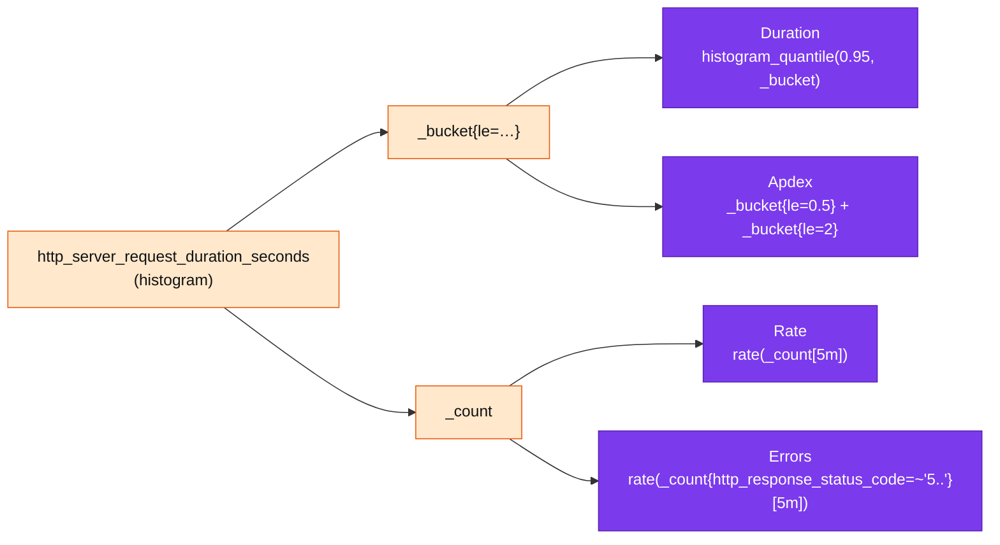
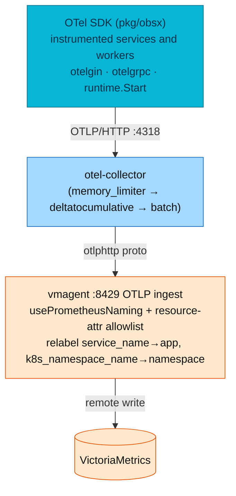

# Application Metrics

RED, gRPC, runtime, database client, and business metric authoring contract for every Go service and worker in the platform service catalog — instrument names, labels, cardinality rules, and OTel Meter API conventions.

| Attribute | Value | RFC / ADR |
|-----------|-------|-----------|
| **Export** | OTLP push via `obsx.SetupObservability` — no app `/metrics` scrape | — |
| **Core histogram** | `http_server_request_duration_seconds` — single source of RED | — |
| **Business catalog** | [metrics-catalog.md](../observability/metrics/metrics-catalog.md) — all 63 shipped instruments | — |
| **Platform ops** | [Application metrics (platform view)](../observability/metrics/metrics-apps.md) — alerts, dashboards, troubleshooting | — |
| **Cross-cutting** | [Application observability](./observability.md) | — |
| **Design record** | — | [RFC-0014](../proposals/rfc/RFC-0014/) · [RFC-0017](../proposals/rfc/RFC-0017/) · [RFC-0013](../proposals/rfc/RFC-0013/) · [ADR-016](../proposals/adr/ADR-016-otel-metrics-cutover/) |

---

Microservices are request-driven, so they are measured with the **RED method**.
The design principle, shared by every large-scale platform (Uber M3, Grab,
Google SRE), is **one histogram = three signals**: a single
`http_server_request_duration_seconds` observation per request yields Rate,
Errors, and Duration, plus SLO compliance and Apdex — no redundant counters.
East-west gRPC calls follow the identical model on the same OTLP export.

The instrument names and labels are OpenTelemetry semantic conventions
(`http.server.request.duration`, `http.request.method`, `http.route`,
`http.response.status_code`), translated to their PromQL form by vmagent's
`usePrometheusNaming` on ingest.

### Metric families at a glance

Three families, two very different origins. **RED** and **USE** are
**auto-instrumented** — no per-service code, identical across the fleet — and
answer *"is the service fast and healthy?"*. **Business** metrics are
**hand-declared** in a service's own code and answer *"is the domain
behaving?"* — auto-instrumentation cannot know them. RED/USE are not something
a service author writes; a service only adds Business instruments.

| Family | Method | Metric families | Type | Service scope | Source (who emits) |
|--------|--------|-----------------|------|---------------|--------------------|
| **Request** | RED | `http_server_request_duration_seconds`, `http_server_{request,response}_body_size_bytes` | Histogram | instrumented API services | `otelgin` (auto) |
| **East-west** | RED | `rpc_{server,client}_call_duration_seconds` | Histogram | services making/serving gRPC | `otelgrpc` via `pkg/grpcx` (auto) |
| **Runtime** | USE | `go_goroutine_count`, `go_memory_*_bytes` | Gauge | instrumented services and workers | `runtime.Start` (auto) |
| **Container** | USE | `container_memory_working_set_bytes`, `container_cpu_*` | Gauge | every pod | cAdvisor (auto, cluster) |
| **Business** | domain | per-service `<svc>_*` (see  [§ Business metrics](#business-metrics-custom)) | Counter/Histogram | per RFC-0017 service catalog | **hand-declared** in service code |

> Business metrics are a **domain metric family**, not RED or USE — those two are
> already covered by the auto layer above, so never hand-write them. Since
> **RFC-0017** every service in the catalog declares its own domain instruments;
> the [Business KPIs dashboard](../observability/metrics/metrics-apps.md#dashboard) is built entirely from them.

## HTTP server metrics (auto-instrumented)

These are **not custom** — three HTTP metrics are emitted by `otelgin` itself
(the same instrumentation the tracing middleware wraps), feeding the global
MeterProvider that `pkg/obsx` installs. `obsx` sets the providers; it does not
install the `otelgin` middleware — `httpmw.Tracing` (shared `pkg/httpmw`) does.
Fleet migration off the per-service `<svc>-service/middleware/` copies is **in
progress**; the shared package is the contract for new and migrated code. All
three also carry the OTLP resource-attribute labels (`app`, `namespace`,
`k8s_pod_name`, …); only the per-request semconv labels are listed below.

| Metric | Type | App labels | Purpose |
|--------|------|------------|---------|
| `http_server_request_duration_seconds` | Histogram | `http_request_method`, `http_route`, `http_response_status_code` | RED core — Rate (`_count`), Errors (`_count`+status), Duration (`_bucket`) |
| `http_server_request_body_size_bytes` | Histogram | `http_request_method`, `http_route`, `http_response_status_code` | Request body size; RX bytes/s via `_sum` |
| `http_server_response_body_size_bytes` | Histogram | `http_request_method`, `http_route`, `http_response_status_code` | Response body size; TX bytes/s via `_sum` |

> **Saturation (in-flight) is not emitted.** The scrape era had a
> `requests_in_flight` gauge (4th Golden Signal). Its semconv successor
> `http.server.active_requests` is **not emitted by `otelgin` v0.69** (verified
> live 2026-07-09), so the metric and its two saturation alerts were retired at
> the cutover. Re-add once upstream ships it; until then, saturation is inferred
> from cAdvisor working-set + goroutine trends.

### One histogram → three signals

`http_server_request_duration_seconds` is the single source of truth for RED. An
OTLP-exported histogram carries `_bucket`, `_count`, and `_sum` sub-metrics
after Prometheus naming, so one observation per request covers everything:



| RED signal | PromQL | Sub-metric |
|-----------|--------|------------|
| **Rate** | `rate(http_server_request_duration_seconds_count{app!=""}[5m])` | `_count` |
| **Errors** | `rate(http_server_request_duration_seconds_count{app!="", http_response_status_code=~"5.."}[5m])` | `_count` + status |
| **Duration** (P95) | `histogram_quantile(0.95, rate(http_server_request_duration_seconds_bucket{app!=""}[5m]))` | `_bucket` |
| Error rate % | `(errors / rate) * 100` | `_count` ratio |
| Apdex | `(satisfied + 0.5 * tolerating) / total` | `_bucket{le="0.5"}`, `_bucket{le="2"}` |

### Histogram buckets

`http_server_request_duration_seconds` buckets are **SLO-tuned** with extra
precision around the 500 ms latency threshold:
`0.005, 0.01, 0.025, 0.05, 0.1, 0.2, 0.3, 0.5, 0.75, 1, 2, 5, 10`.

This is the **canonical fleet bucket set** — pinned by an explicit SDK
**View** in `pkg/obsx` (RFC-0014 D-7), because the semconv *advised* bucket
boundaries lack `le=2` (Apdex *tolerating*) and the 0.2/0.3 SLO precision
points. Every service must use exactly these values; divergent buckets break
cross-service `histogram_quantile()` comparisons and blunt SLO precision
([RFC-0013](../proposals/rfc/RFC-0013/README.md),
[RFC-0014](../proposals/rfc/RFC-0014/README.md)).

| Bucket (s) | Purpose |
|------------|---------|
| 0.005, 0.01, 0.025 | Fast responses (cache hits, health checks) |
| 0.05, 0.1 | Typical DB queries |
| **0.2, 0.3** | Precision zone before the SLO threshold |
| **0.5** | SLO latency threshold; Apdex *satisfying* boundary |
| **0.75** | Precision zone after the SLO threshold |
| 1 | Slow responses |
| **2** | Apdex *tolerating* boundary |
| 5, 10 | Timeouts, degraded responses |

`http_server_request_body_size_bytes` / `http_server_response_body_size_bytes`
use a byte-bucket View (`256, 1024, 4096, 16384, 65536, 262144, 1048576,
4194304` — powers of four from 256 B to 4 MiB; semconv gives no size-bucket
advice) and measure the HTTP body only (not TCP/IP, headers, or TLS overhead).

### Bucket semantics

- A boundary array of N values defines **N+1 buckets**: each bucket is
  `(lower, upper]` — inclusive of its upper bound — plus an implicit overflow
  bucket `(max, +∞)` that catches everything above the last boundary.
- Every exported histogram point carries **Count**, **Sum**, and the
  per-bucket counts (optionally Min/Max). Percentiles are **computed by the
  backend** from bucket counts (`histogram_quantile()`), never by the SDK —
  which is why boundary placement decides quantile accuracy.
- The SDK keeps **one metric stream per unique attribute set** — every new
  label combination materializes a full set of bucket series. This is why ID
  labels are forbidden: one `user_id` label turns 38 histogram series (16
  duration + 11 per body-size histogram) into 38 series *per user*.

### Temporality

Every OTel metric stream has an **aggregation temporality**:

| Temporality | Each export contains | Fits |
|-------------|----------------------|------|
| **Cumulative** | The running total since process start | Prometheus-lineage backends (`rate()` computes the delta) |
| **Delta** | Only the change since the previous export | Backends that re-aggregate server-side |

Platform contract: **cumulative** — the Go SDK default, and what
VictoriaMetrics expects (RFC-0017 D-7). The collector's `deltatocumulative`
processor is purely defensive: a delta sample stored in VictoriaMetrics would
silently break `rate()`. Services never override temporality.

Deep dive (explicit vs exponential histograms, temporality mechanics):
[Histograms (platform)](../observability/metrics/histograms.md).

## Labels & provenance

Application code sets **only the semconv per-request attributes**
(`http.request.method`, `http.route`, `http.response.status_code`); the SDK's
`Resource` carries identity (`service.name`, `k8s.namespace.name`,
`k8s.pod.name`, …). vmagent promotes a fixed allowlist of resource attributes to
labels on ingest and relabels the two the whole platform groups by.

| Label | Source | Example | Added by |
|-------|--------|---------|----------|
| `http_request_method` | HTTP request | `GET` | Application (otelgin) |
| `http_route` | Route pattern | `/api/v1/users/:id` | Application (otelgin) |
| `http_response_status_code` | Status code | `200` | Application (otelgin) |
| `app` | `service.name` resource attr | `auth` | **vmagent relabel** |
| `namespace` | `k8s.namespace.name` resource attr | `auth` | **vmagent relabel** |
| `k8s_pod_name` | `k8s.pod.name` resource attr | `auth-7d4c…` | **vmagent** (promoted) |

vmagent's OTLP ingest runs with a **deliberately narrow** resource-attribute
allowlist (`promoteAllResourceAttributes: false`) so the SDK-default
`service.instance.id` / `process.pid` don't re-mint every series on each
restart:

```yaml
# kubernetes/infra/configs/observability/metrics/victoriametrics/vmagent.yaml
extraArgs:
  opentelemetry.usePrometheusNaming: "true"          # http.server.request.duration → http_server_request_duration_seconds_*
  opentelemetry.promoteAllResourceAttributes: "false"
  opentelemetry.promoteResourceAttributes: "service.name,service.version,k8s.namespace.name,k8s.pod.name,deployment.environment.name"
  opentelemetry.promoteScopeMetadata: "false"        # otel_scope_* labels have no consumer
inlineRelabelConfig:
  - { action: replace, source_labels: [service_name],        regex: "(.+)", target_label: app }
  - { action: replace, source_labels: [k8s_namespace_name], regex: "(.+)", target_label: namespace }
```

The `regex: "(.+)"` guard means the relabel only fires on OTLP-pushed series
(empty `service_name` never matches), so scraped infra series keep their own
`app`/`namespace`. New services need **no** registration — they inherit the
pipeline the moment their SDK points at the collector.



> **No app `/metrics` scrape exists anymore.** The scrape-era `ServiceMonitor`
> (`app.kubernetes.io/component: api`) and the order-worker `PodMonitor` were
> retired at the P3 cutover. vmagent scraping / ServiceMonitors remain **only
> for infra exporters** (postgres/pg_exporter, kube-state-metrics, cAdvisor,
> collector self-telemetry) — those legitimately stay on pull. The RFC once
> designed a `legacy-checkout` scrape fence; checkout-service was never deployed
> and ADR-016 dropped the fence at landing.

## App-side cardinality control

Two application-level rules keep series count bounded and predictable:

**Route normalization** — `otelgin` sets `http_route` from the **matched route
pattern**, not the raw URL, so IDs don't explode cardinality:

| Approach | Example | Cardinality |
|----------|---------|-------------|
| Raw URL | `/api/v1/products/123`, `/456`, … | **Unbounded** |
| Route pattern (`http.route`) | `/api/v1/products/:id` | **Bounded** (~20 routes) |

With ~20 routes × 3 methods × 5 status codes per service, series count stays
bounded and predictable.
Measured (2026-07-06, one replica per service, live traffic): **49–720 series
per service, Σ 2,777** across a nine-service measurement snapshot — histogram label sets materialize
lazily, so this grows toward the worst-case bound of ~2,100 series/replica
(~48 route×status combos × 38 histogram series + runtime). Bounded and
predictable either way; the full model and at-scale projection live in the
 [streaming-aggregation playbook](../observability/metrics/streaming-aggregation.md#the-cardinality-math).

**Forbidden as label values** (unbounded or request-scoped — these belong in
logs/traces, never metrics): `user_id`, `request_id`, `trace_id`, `session_id`,
`email`, IP addresses, raw URL paths, order/cart/payment IDs, pod UID, image
SHA.

**No-drift rule** — the observability wiring lives in the shared `pkg/obsx`
`SetupObservability` (instrument names, buckets, Views, resource attributes),
so all cluster-deployed services and order-worker instrument identically by construction. A
service pinning a different `pkg/obsx` version or overriding a View is a defect
even if it "works" (see RFC-0013 D3, RFC-0014 D-7).

**Infrastructure-endpoint filtering** — routine probes are excluded from HTTP RED
instrumentation, so RED metrics reflect real user traffic with lower cardinality
and accurate latency percentiles. The list is `httpmw.DefaultSkipRoutes` in
`pkg/httpmw` — one map read by both `httpmw.Tracing` and `httpmw.Logging`, so
the metric and access-log skip lists cannot drift apart. Matching is **exact**
against the Gin route pattern (`c.FullPath()`) via `otelgin.WithGinFilter`, and
the filter runs before `otelgin` records, so a skipped route emits neither spans
nor `http.server.*` metrics. Services register only `/health` and `/ready`, so a
request aimed at a path no service registered (`/metrics`, `/healthz`,
`/readyz`, `/livez`, `/favicon.ico`) matches no route and is now measured as a
404 instead of vanishing — a misconfigured probe should be visible.
Process/runtime metrics remain available and act as heartbeat signals.

## Go runtime metrics

Emitted by the OpenTelemetry Go runtime instrumentation (`runtime.Start`,
started by `pkg/obsx`; no per-handler code). They carry only the resource-attr
labels and are exported every ~15 s — traffic-independent, which is why they
double as the availability heartbeat (see  [Availability](../observability/metrics/metrics-apps.md#availability--the-heartbeat-not-up)).

| Metric | Type | Purpose |
|--------|------|---------|
| `go_goroutine_count` | Gauge | Active goroutines; steady increase ⇒ goroutine leak. Also the liveness heartbeat |
| `go_memory_used_bytes` | Gauge | Runtime memory in use (carries a `go_memory_type` label = `stack`/`other`); steady post-GC growth ⇒ leak |
| `go_memory_gc_goal_bytes` | Gauge | Heap size that triggers the next GC; compared against `go_memory_used_bytes` for GC-thrash |
| `go_memory_limit_bytes` | Gauge | Soft memory limit (`GOMEMLIMIT`), if set |
| `container_memory_working_set_bytes` | Gauge (cAdvisor) | Limits-aware RSS — the OTel runtime set has **no** process-RSS metric, so memory alerting moved here (an improvement: it tracks the Kyverno-mandated container limit, not a fixed byte threshold) |

> **Gone with the scrape:** the Prometheus Go-client families
> (`go_memstats_*`, `process_resident_memory_bytes`, `process_cpu_seconds_total`,
> `go_threads`) are **not** part of the OTel runtime set and are no longer
> emitted. There is likewise **no GC-pause metric** in the OTel Go runtime
> instrumentation (verified live 2026-07-09) — the old
> `go_gc_duration_seconds_*` has no successor.

## DB client metrics (otelpgx)

> **Status: live fleet-wide (RFC-0017 W4).** Every service that touches
> Postgres builds its pool through `pkg/dbx.NewPool`, which wires the otelpgx
> tracer (per-operation metrics + query spans) and `RecordStats` (pool
> metrics) onto the same OTLP stream. This is the **app-side** view — what the
> service experiences; the server-side view (postgres_exporter, CNPG) lives in
>  [Database metrics](../observability/metrics/postgresql/README.md).

**Per-operation (synchronous, from the tracer):**

| Metric | Type | Labels | Purpose |
|--------|------|--------|---------|
| `db_client_operation_duration_seconds` | Histogram | `pgx_operation_type` = `query`\|`batch`\|`copy`\|`connect`\|`prepare`\|`acquire`, `db_system_name` | DB latency as the service sees it — p95/p99 per service and per op |
| `db_client_operation_errors_total` | Counter | same | Non-`ErrNoRows` operation failures (SQLSTATE, timeouts, broken conns) |

> **Bucket note (the W2 lesson, again):** otelpgx creates the duration
> histogram via the semconv `dbconv` helper **without bucket hints**, so the
> SDK's ms-shaped default made every sub-5s query collapse into one bucket
> (observed p95 = 4750ms for ~1ms queries). Since **pkg v0.24.0** the
> `obsx.DBDurationBuckets` View pins the semconv-advised DB-scale set
> `[0.001 … 10]s`. A service on an older pkg emits useless quantiles.

**Pool health (asynchronous, from `RecordStats`, ~1s interval):** 13
`pgxpool_*` series per service — the ones the dashboard and alerts use:

| Metric | Reading |
|--------|---------|
| `pgxpool_acquired_connections` | **In-flight**: conns currently checked out ≈ concurrent DB work |
| `pgxpool_idle_connections` / `pgxpool_total_connections` / `pgxpool_max_connections` | Pool occupancy vs ceiling — saturation = acquired/max |
| `pgxpool_empty_acquire_total` | Acquires that had to **wait** for a conn — earliest contention signal |
| `pgxpool_empty_acquire_wait_time_nanoseconds_total` | Total time spent waiting; ÷ `empty_acquire_total` = mean wait |
| `pgxpool_acquires_total`, `pgxpool_new_connections_total`, `pgxpool_max_lifetime_destroys_total`, … | Churn/lifecycle detail |

Alerts on this layer: `DBClientQueryP95High`, `DBClientErrorRate`,
`PgxPoolNearExhaustion`, `PgxPoolAcquireWaitHigh`
( [alert catalog §1](../observability/alerting/alert-catalog.md#1-microservices-red-metrics)).

> **Naming trap:** the `db_client_connections_*` series (usage, use_time in
> **milliseconds**, hits/misses/timeouts) are **not Postgres** — they come from
> **redisotel** instrumenting product's **Valkey cache** client, which still
> uses the older semconv connection-pool names. Postgres pool health is
> `pgxpool_*`; treat `db_client_connections_*` as cache-pool series.

## gRPC instrumentation (east-west)

> **Status: live.** gRPC is the official east-west (service-to-service)
> transport. Services export gRPC RED metrics via the shared `pkg/obsx` /
> `pkg/grpcx` helpers on the **same OTLP stream** as HTTP, so the standard
> resource-attr labels are present. No separate export path and no extra port.

Names are already OpenTelemetry semantic conventions (no rename at the cutover —
the transport simply gained pre-aggregation and alerting); the one-histogram
model applies per RPC method.

**Server side** — `rpc_server_call_duration_seconds_{count,bucket,sum}`:

| Label | Example | Notes |
|-------|---------|-------|
| `rpc_method` | `shipping.v1.ShippingService/GetShipmentByOrder` | Fully-qualified RPC |
| `rpc_response_status_code` | `OK` | gRPC status; non-`OK` = error |
| `rpc_system_name` | `grpc` | Constant |
| `app` / `namespace` | `shipping` / `shipping` | From OTLP resource attributes (vmagent relabel) |

**Client side** — `rpc_client_call_duration_seconds_{count,bucket,sum}`: the same
labels as the server side, minus `rpc_system_name`. otelgrpc *records*
`server_address`/`server_port` on this instrument, but the mandatory `pkg/obsx`
View for `rpc.client.call.duration` drops both (`NewDenyKeysFilter`) before
export — under headless-DNS the upstream is a churning per-pod IP, so those
labels never reach the exported/queryable series.

`pkg/grpcx` installs `otelgrpc` client/server interceptors so gRPC spans
propagate trace context end-to-end alongside HTTP spans. For the transport
design, dual-port services, health checks, and resilience defaults see
 [**API → gRPC runtime model**](./api.md#grpc-runtime-model).

## OTel instrument types

Every metric is emitted through one of **seven instrument types** — four
synchronous (recorded inline at the event) and three asynchronous/Observable
(a callback the SDK invokes at each collection). The type is not cosmetic —
it decides what the SDK aggregates, which PromQL sub-series you get, and
whether the metric even *has* buckets:

| Instrument | Sync? | Shape it measures | Goes down? | PromQL output | Read it with | Platform examples |
|------------|-------|-------------------|-----------|---------------|--------------|-------------------|
| **Counter** | sync | a count of events that only grows | No (monotonic) | one `_total` series | `rate()` / `increase()` | `auth_registrations_total`, `payment_authorization_total`, `product_cache_gets_total` |
| **Observable Counter** | async | a monotonic total cheap to read on demand (rows processed, ticks) | No | one `_total` series | `rate()` / `increase()` | *(none hand-declared — pattern reserved)* |
| **UpDownCounter** | sync | a running total that rises *and* falls | Yes | one series (no `_total`) | raw value / `last_over_time()` | *(none declared yet — an outbox backlog or an in-flight counter would fit)* |
| **Observable UpDownCounter** | async | current additive state sampled per collection (queue depth, connections in use) | Yes | one series | raw value | DB pool stats via `otelpgx.RecordStats` (`pkg/dbx`) |
| **Histogram** | sync | the *distribution* of a measured value | records values | `_bucket{le=…}` + `_sum` + `_count` | `histogram_quantile()`, `_sum/_count` for the mean | `http_server_request_duration_seconds`, `order_value_minor`, `reviews_rating`, `payment_provider_request_duration_seconds` |
| **Gauge** | sync | a last-value written at the event (non-additive) | Yes | one series | raw value | *(none — stabilized mid-2024; prefer the observable form)* |
| **Observable Gauge** | async | a point-in-time sample, read each collection (non-additive) | Yes | one series | raw value / `deriv()` | `go_goroutine_count`, `go_memory_used_bytes` |

### Choosing the instrument (the rule)

Two questions decide the instrument — first the **shape**, then the **timing**.

**Axis 1 — shape** (additive × monotonic):

| Is it…? | Additive (summing across sources is meaningful) | Monotonic (only grows) | Instrument family |
|---------|--------------------------------------------------|------------------------|-------------------|
| A distribution you'll ask percentiles of | ✅ | ✗ | **Histogram** |
| A count of events | ✅ | ✅ | **Counter** family |
| A total that rises and falls | ✅ | ✗ | **UpDownCounter** family |
| A sampled value where summing is meaningless (CPU %, ratio, temperature — two pods at 60% is not 120%) | ✗ | ✗ | **Gauge** family |

**Axis 2 — timing** (which family member):

- **Sync** — the measurement happens *inside* a request or use case; record it
  at the event, and it can associate with the active `context.Context`.
- **Async / Observable** — the value is a cheap-to-read *current state*
  (pool size, backlog length); recording per event would be wasteful, so
  register a callback and let the SDK sample it at each export interval.

The correctness trap the async family hides: an **Observable Counter callback
must report the cumulative total, not the increment** — the SDK computes
deltas between observations, so reporting increments silently corrupts every
`rate()` built on it.

Platform defaults: business metrics today are **Counter or Histogram recorded
synchronously at the authoritative decision point**
([§ Business metrics](#business-metrics-custom)); the Observable families are
in use only through shared instrumentation (`runtime`, `otelpgx`). A
hand-declared Observable instrument follows the same catalog registration as
any other.

**The bucket insight.** Only **Histograms** have buckets. A Counter is a single
running number, so asking for its `le=…` buckets is meaningless — that is why a
counter-only metric shows *n/a* wherever a dashboard expects bucket boundaries.
Buckets are how a histogram turns many observations into a distribution: each
`_bucket{le=X}` counts observations ≤ X, and `histogram_quantile(0.95, …)`
interpolates the p95 from those cumulative counts.

**Why a seconds histogram needs explicit buckets.** `pkg/obsx` installs an SDK
**View** (the canonical 13-bucket set above) *only* for the named HTTP/gRPC
instruments. A brand-new business histogram — say `payment.provider.request.duration`
— matches no View, so it falls back to the SDK's **default** boundaries, which
are **millisecond-shaped** (`0, 5, 10, … 10000`). A sub-second call then lands
entirely in the first bucket and every quantile collapses to ~0. The fix is to
pass the platform bucket set explicitly when declaring the instrument:

```go
meter.Float64Histogram("payment.provider.request.duration",
    metric.WithUnit("s"),
    metric.WithExplicitBucketBoundaries(obsx.DurationBuckets...)) // else quantiles are useless
```

Money- and rating-scale histograms pick their own boundaries the same way
(`order.value.minor` uses cent-scale buckets; `reviews.rating` uses `1,2,3,4,5`).

**Names on the wire.** OTel instrument names are dotted
(`payment.authorization.total`); vmagent's `usePrometheusNaming` renders them to
PromQL form on ingest — a Counter gains `_total` (if not already present), a
Histogram explodes into `_bucket`/`_sum`/`_count`, and a `WithUnit("s")`
histogram gets a `_seconds` infix. That is why the dashboards query
`payment_authorization_total` and `payment_provider_request_duration_seconds_bucket`.

## Business metrics (custom)

Automatic HTTP, gRPC, runtime, container, cache, and database instrumentation
must not be reproduced in service code. A service adds only domain metrics that
answer an operational or business-correctness question unavailable from
automatic telemetry.

A business metric is emitted at the **authoritative decision point**, after the
outcome is known.

| Outcome | Correct emission point |
|---------|------------------------|
| Checkout confirmed | Checkout use case after durable success |
| Inventory reserve rejected | Inventory use case that owns the invariant |
| Payment captured | Payment transaction/ledger commit boundary |
| HTTP request status | Automatic middleware, not handler |
| DB pool saturation | Shared DB instrumentation, not business logic |

| Requirement | Contract |
|-------------|----------|
| Name | OTel dotted lowercase operation/domain name |
| Type | Per the [instrument selection rule](#choosing-the-instrument-the-rule) — in practice Counter or Histogram at the decision point |
| Unit | Declared with instrument metadata; not embedded in the OTel name |
| Labels | Bounded, enumerated values only |
| Forbidden labels | User, order, payment, cart, session, workflow, SKU, promo code, URL, email, or arbitrary input |
| Replay semantics | State whether the metric counts attempts or unique business outcomes |
| Ownership | Owning service and source use case |
| Catalog | Register in the [business metrics catalog](../observability/metrics/metrics-catalog.md) |
| Operations | State dashboard/alert usage or explicitly state none |
| Tests | Verify labels, outcome count, retry behavior, and approved histogram View |

**How they are declared** (checkout-service `internal/logic/v1/metrics.go`):
a package-level `meter = otel.Meter("checkout")` rides the global
MeterProvider `obsx` installs (a no-op before setup, so package-init is safe);
instruments are `meter.Int64Counter(...)` / `meter.Float64Histogram(...)` with
OTel dotted names, and are recorded with `.Add`/`.Record` + a **bounded**
attribute where a metric splits by cause.

Since **RFC-0017** every service in the catalog declares its own Business instruments. The
table below keeps **checkout as the worked example**; the **full shipped
catalog is in
 [metrics-catalog.md](../observability/metrics/metrics-catalog.md#business-metrics--per-service-catalog)**,
and is what the [Business KPIs dashboard](../observability/metrics/metrics-apps.md#dashboard) visualizes.

| Service | Metric (PromQL) | OTel instrument | Type | Labels | Purpose |
|---------|-----------------|-----------------|------|--------|---------|
| checkout | `checkout_sessions_confirmed_total` | `checkout.sessions.confirmed` | Counter | — | Sessions successfully confirmed into an order |
| checkout | `checkout_sessions_expired_total` | `checkout.sessions.expired` | Counter | `reason` = `timer`\|`lazy` | Sessions expired, by who noticed (abandonment workflow vs read-path backstop) |
| checkout | `checkout_price_changed_total` | `checkout.price.changed` | Counter | — | Confirms bounced with `PRICE_CHANGED`/`STOCK_UNAVAILABLE` (session requoted) |
| checkout | `checkout_promo_redeemed_total` | `checkout.promo.redeemed` | Counter | — | Promo redemptions counted at confirm (P4) |
| checkout | `checkout_promo_rejected_total` | `checkout.promo.rejected` | Counter | `reason` = `expired`\|`exhausted` | Promo rejections at the authoritative confirm gate |
| checkout | `checkout_availability_check_total` | `checkout.availability.check` | Counter | `result` = `ok`\|`shortage`\|`unknown_sku`\|`error` | Inventory availability checks by outcome — the only signal that separates "inventory is down" (`error`, fail-closed 503) from "inventory refused the basket" (`shortage`) |
| checkout | `checkout_confirm_duration_seconds` | `checkout.confirm.duration` | Histogram (`s`) | — | End-to-end confirm handler duration |

Label and cardinality rules: [§ App-side cardinality control](#app-side-cardinality-control)
and [cross-signal data policy](./observability.md#cross-signal-data-and-privacy-policy).
Business latency histograms reuse the platform duration buckets via an `obsx` View like RED.

### Canonical OTel name vs backend name

| Concern | Example |
|---------|---------|
| OTel instrument | `checkout.confirm.duration` |
| Unit | `s` |
| Backend/PromQL form | `checkout_confirm_duration_seconds` (generated by ingest naming policy) |

Do not teach engineers to create both names — declare the OTel instrument; vmagent's
`usePrometheusNaming` renders the PromQL form on ingest.

### Metric lifecycle

Every new business metric should progress through:

```text
Proposed → Implemented → Used → Deprecated → Removed
```

Registration checklist:

- owner service and source use case;
- canonical instrument name, type, and unit;
- bounded labels with enumerated values;
- operational question and service-contract entry;
- [metrics catalog](../observability/metrics/metrics-catalog.md) entry;
- dashboard or explicit "no dashboard yet";
- alert or explicit "not alerting";
- deprecation plan when superseded.

### Tests

- instrument registers once without duplicate-registration panic;
- label values are allowlisted or normalized;
- IDs and user input cannot enter labels;
- counter replay behavior matches documented attempt vs outcome semantics;
- histogram uses the approved View when sub-second precision matters;
- one business action emits the expected observation once;
- failure and retry paths do not overcount unless documented.

## Instrumentation

Automatic HTTP/gRPC/runtime/DB instruments are installed through the shared
[application observability contract](./observability.md). Service authors do
not reproduce RED/USE instruments or construct OTel providers/exporters.

## Correlation: metrics ↔ traces ↔ logs

> **Exemplars are not available on this platform (RFC-0014 D-14).**
> VictoriaMetrics does not support exemplars (upstream won't-fix), and they were
> already dead end-to-end under the previous pipeline. There is **no**
> "click the exemplar dot → jump to the trace" path, and the histogram is
> recorded without `ObserveWithExemplar`.

Correlation is instead done through the shared `trace_id`:

1. A latency or error spike shows on a RED panel (`http_server_request_duration_seconds`).
2. Pivot to **VictoriaLogs** for the same `app`/`namespace`/time window; every
   log line carries a `trace_id` field (populated because tracing middleware
   runs before logging — see above). This is what P4 fixed: `trace_id` is now a
   first-class, queryable log field.
3. Follow that `trace_id` into **Tempo** for the full distributed trace, and
   back to logs via the Tempo↔logs datasource link.

So the loop is metric → logs (by label + time) → `trace_id` → Tempo, rather than
metric → exemplar → trace.

---

## References

- [Application observability](./observability.md)
- [Business metrics catalog](../observability/metrics/metrics-catalog.md)
- [Application metrics (platform view)](../observability/metrics/metrics-apps.md) — signal→alert map, dashboards, cardinality troubleshooting
- [Metrics hub (platform)](../observability/metrics/README.md)
- [RFC-0014](../proposals/rfc/RFC-0014/)

_Last updated: 2026-08-17 — HTTP RED instrumentation is mounted by the shared `httpmw.Tracing`, and probe filtering is an exact match on the Gin route pattern via `httpmw.DefaultSkipRoutes`._

