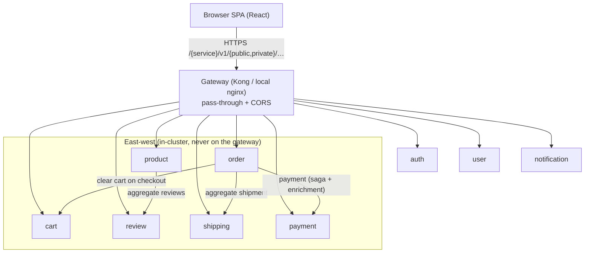
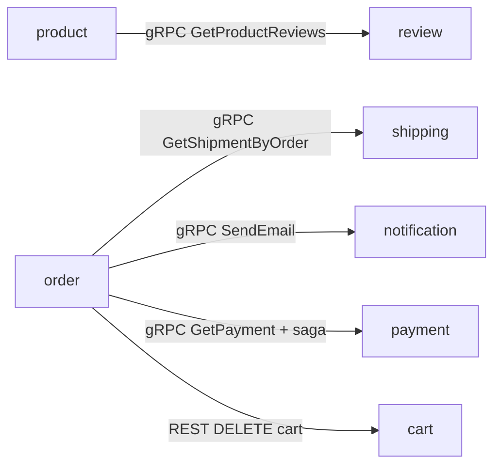

# Microservices Catalog

| | |
|---|---|
| **Status** | Living reference — the **understanding-the-system** catalog |
| **Covers** | Per-service responsibility, data ownership, inter-service call graph |
| **Related** | [api.md](api.md) (payloads) · [naming convention](api-naming-convention.md) (routes) · [gRPC east-west](grpc-internal-comms.md) · [local-stack](../../local-stack/) |
| **Area hub** | [docs/api/README.md](README.md) |

This document is the **understanding-the-system** reference. It does **not** restate every endpoint (see `api.md`); it focuses on per-service responsibility, data ownership, and inter-service dependencies. The per-service "gRPC candidacy" notes below are historical rationale — the east-west migration is now complete.

---

## 1. Platform shape

- **9 Go backend services** (Go 1.26, Gin), each in its own repo + namespace, all listening on **`:8080`**, all exposing `GET /health` + `GET /ready`.
- **1 React/Vite frontend** (SPA, served by nginx).
- **3-layer architecture** per service: `web` (HTTP/validation/aggregation) → `logic` (business rules, no SQL) → `core` (domain + repository + DB). Frontend may only call the `web` layer.
- **URL shape (Variant A):** `/{service}/v1/{audience}/{resource…}` with `audience ∈ public | private | internal`. The gateway (Kong in-cluster; nginx locally) is **pure pass-through** — no rewriting.
- **`notification-service`** (in the `comms` domain alongside shipping) handles user notifications: browser-facing private routes (list/count/get/mark-read, JWT) plus internal `notify/email`/`notify/sms` (service-to-service). It is deployed in-cluster **and** runs in the local stack — the frontend's notification badge resolves against it.

---

## 2. Deployment snapshot (local stack)

The local end-to-end stack (`local-stack/compose.yaml`) mirrors the platform with single shared infra. All containers are health-gated.

| Service | Port (internal) | Database (local) | Cache | Logger | Inter-service deps |
|---------|-----------------|------------------|-------|--------|--------------------|
| auth | 8080 | `auth` | — | zerolog | none (validated *by* everyone) |
| user | 8080 | `user` | — | zap | auth (JWT) |
| product | 8080 | `product` | Valkey/Redis | zap | review, cache |
| cart | 8080 | `cart` | — | clog | auth (JWT) |
| order | 8080 | `order` | — | zap | auth (JWT), shipping, cart |
| review | 8080 | `review` | — | zap | auth (JWT) |
| shipping | 8080 | `shipping` | — | zap | none |
| notification | 8080 | `notification` | — | zap | auth (JWT) |
| payment | 8080 | `payment` | — | zap | mockpay (provider); called by order (saga + enrichment) |
| frontend | 80 → host 3001 | — | — | — | gateway only |
| gateway | 80 → host 8080 | — | — | — | all 9 services |

> **In-cluster differences (production):** services connect to dedicated PostgreSQL clusters (auth-db/Zalando PG17 + PgBouncer; product/cart/order on CNPG PG18 with PgDog/PgCat; user/review/shipping on supporting/review clusters PG16). Locally these are collapsed into one Postgres with 9 databases. See [`../databases/`](../databases/).
> **Logging is not unified** — three loggers are in use (zerolog/clog/zap). Tracked as a `pkg` consolidation follow-up.

---

## 3. Service catalog

Each entry: **what it owns**, **what's implemented**, **what's mock/in-flight**, and **gRPC candidacy**. Endpoint contracts live in [`api.md`](api.md).

### auth — identity
- **Owns:** users (credentials), refresh-token families. Mints RS256 access tokens and serves the JWKS.
- **API:** `POST /auth/v1/public/{login,register,refresh,logout}`, `GET /auth/v1/public/jwks` (public-only — `/private/me` was removed in RFC-0009 Phase 5).
- **Implemented:** RS256 access tokens (1 h TTL, `kid`-published JWKS) + opaque **rotating refresh tokens** (sha256-hashed, family-tracked, reuse-detection revokes the family; logout revokes by presented refresh token); bcrypt password verification with a constant-time dummy-hash path on the user-not-found branch (no username enumeration); sentinel-error → HTTP-status mapping; generic binding-error messages (no internal leak). Unit/handler tests + fuzz + race-clean.
- **Notes:** HTTP-only since Phase 5 — the gRPC `GetMe` server was removed; services verify JWTs locally against the cached JWKS, so there is **no** per-request east-west hop to auth.

### user — profiles
- **Owns:** user profiles (name, phone, address).
- **API:** `GET /user/v1/public/users/:id`, `GET|PUT /user/v1/private/users/profile`, `POST /user/v1/internal/users`.
- **Implemented:** private profile read/update scoped to the JWT subject; public view returns a **minimal** projection (id + name, no email/PII); partial update preserves unspecified fields (`COALESCE`).
- **Mock / in-flight:** `GET /users/:id` and the `internal` create path are **partly placeholder** (not fully wired to real persistence); the internal create endpoint has **no in-cluster caller today** (auth-service does not call it).
- **gRPC candidacy:** Low/medium — only used browser-side today.

### product — catalog (+ cache)
- **Owns:** products, categories, stock. ~5k seeded catalog rows locally.
- **API:** `GET /product/v1/public/products`, `/products/:id`, `/products/:id/details` (aggregates reviews + related + stock), `POST /product/v1/internal/products`.
- **Implemented:** Cache-Aside over Valkey with **stampede prevention** (SETNX lock); case-insensitive sort/filter (whitelisted → injection-safe); SCAN-based list-cache invalidation; real `stock_quantity` surfaced (no longer mocked).
- **In-flight / notes:** the service **emits its own CORS headers** in addition to the gateway → duplicate `Access-Control-Allow-Origin` behind a gateway, which browsers reject. Worked around at the local gateway (single CORS authority); **recommended fix: remove the product-service CORS middleware** (Kong/gateway owns CORS). `/details` aggregation calls **review** and soft-fails to an empty review list.
- **gRPC candidacy:** Medium (Phase 2) — product→review aggregation is a good internal candidate; the public catalog stays REST (browser-facing).

### cart — shopping cart
- **Owns:** `cart_items` (per user, UPSERT on `(user_id, product_id)`).
- **API:** all `private` — `GET|POST|DELETE /cart/v1/private/cart`, `/cart/count`, `PATCH|DELETE /cart/v1/private/cart/items/:itemId`.
- **Implemented:** fail-closed JWT auth (401 on any auth failure — no silent `user_id=1` fallback); `user_id` taken from the validated token, never the body; correct subtotal/total math (empty cart = 0 shipping).
- **In-flight / notes:** also called by **order** to clear the cart after checkout (forwards the user's `Authorization`).
- **gRPC candidacy:** Medium — order→cart clear (carries JWT in metadata) is a Phase 2/3 candidate.

### order — orders (+ shipment aggregation)
- **Owns:** `orders`, `order_items`. Transactional order creation.
- **API:** `private` — `GET /order/v1/private/orders`, `/orders/:id`, `/orders/:id/details` (aggregates shipment), `POST /order/v1/private/orders`.
- **Implemented:** **ownership-scoped** reads (`WHERE id=$1 AND user_id=$2` → no IDOR); server-side order-math validation (rejects non-positive qty / negative price); atomic order+items insert; post-commit cart-clear on a **detached, cancellation-safe context**; shipment aggregation **soft-fails** if shipping is unavailable.
- **gRPC candidacy:** **Pilot target (Phase 1)** — see §5. order→shipping is internal-only, simple, no browser impact.

### review — product reviews
- **Owns:** `reviews` (rating 1–5, comment).
- **API:** `GET /review/v1/public/reviews?product_id=…` (required), `POST /review/v1/private/reviews`.
- **Implemented:** **JWT auth now enforced** on the write path; `user_id` taken from the token (not the body) → no impersonation; `UNIQUE (product_id, user_id)` constraint + `23505` → `409` (race-safe duplicate handling); required-field validation; invalid `product_id` → `400` (not 500).
- **In-flight / notes:** consumed by **product** for the product-details aggregation.
- **gRPC candidacy:** Medium (Phase 2) — product→review.

### shipping — tracking & estimates
- **Owns:** `shipments`.
- **API:** `GET /shipping/v1/public/{track,estimate}`, `GET /shipping/v1/internal/orders/:orderId`.
- **Implemented:** nullable-`carrier` scan fixed (no 500 on NULL); weight validation (rejects negative/NaN/Inf); empty `tracking_number` → 400; per-query DB timeout; `/ready` pings the DB.
- **In-flight / notes:** the `internal/orders/:orderId` route is **consumed only by order**; it has **no in-app caller auth** (relies on NetworkPolicy in-cluster — see [`../security/`](../security/)).
- **gRPC candidacy:** **Pilot target (Phase 1)** — order→shipping internal lookup.

### notification — user notifications
- **Owns:** `notifications`. Routes: PRIVATE (JWT, browser) `GET /notification/v1/private/notifications` (+ `/count`, `GET /:id`, `PATCH /:id` mark-read); INTERNAL (service-to-service) `POST /notification/v1/internal/notify/{email,sms}`.
- **Implemented:** parameterized pgx, `rows.Err()` checks, solid graceful shutdown. Deployed in-cluster (comms domain, shared supporting DB) **and** in the local stack.
- **In-flight / notes:** a code review found the recurring trio — auth **fail-open**, **IDOR** on `/:id`, and **seed sequence desync** — now fixed (PRs `fix/security-correctness-review` + `fix/seed-sequence-reset`), plus a hardcoded create-time `user_id`. The internal notify endpoints have **no caller wired yet**.
- **gRPC candidacy:** **Phase 2** — the internal `notify/email`/`notify/sms` are a natural east-west gRPC target (design `notification.v1` + wire a first caller, e.g. order→notification). Browser routes stay REST.

### payment — payments (+ saga, reconciliation)
- **Owns:** `payments`, refunds, the transactional outbox, and reconciliation runs. Deployed in-cluster (checkout domain, on `cnpg-db`) **and** in the local stack.
- **API:** PRIVATE (JWT, browser) `GET|POST /payment/v1/private/payments` (+ `GET /:id`); PUBLIC `POST /payment/v1/public/webhooks/mockpay` (HMAC-signed body is the credential); INTERNAL (in-cluster) `POST /payment/v1/internal/payments/:id/refunds`, `POST /payment/v1/internal/reconciliation/runs`, `GET /payment/v1/internal/reconciliation/runs/:id`.
- **Implemented (RFC-0010 P1–P6):** auth/capture flow against **mockpay** (the same image run as a second `mockpay` deployment); recovery-point idempotency; a single-writer outbox relay and a per-instance reconciliation ticker (single-replica by design — see the InputProvider notes). Connects to CNPG directly over TLS (`sslmode=require`).
- **gRPC:** serves an internal gRPC server (`:9090`, reflection off) — the order saga's money transport. `order` (API, `GetPayment` enrichment) and `order-worker` (saga steps) dial it via `PAYMENT_GRPC_ADDR`.

### frontend — React SPA
- Calls only the gateway at `/{service}/v1/{public,private}/…`; JWT stored in `localStorage.authToken` and sent as `Authorization: Bearer`. Uses server-side aggregation endpoints (`/products/:id/details`, `/orders/:id/details`) — no client-side orchestration. **gRPC is never browser-facing.**

---

## 4. Inter-service communication map

The east-west migration is **complete** — every service-to-service call below runs
over **gRPC** (`:9090`, gRPC-only) via the shared `pkg/grpcx` + `pkg/authmw`. See
[`grpc-internal-comms.md`](grpc-internal-comms.md). The browser/Kong edge and the
order→cart cart-read stay HTTP/JSON.

| Caller | Callee | Call | Transport | Failure mode |
|--------|--------|------|-----------|--------------|
| product | review | `ReviewService.GetProductReviews` | **gRPC** | soft-fail → `[]` |
| order | shipping | `ShippingService.GetShipmentByOrder` | **gRPC** | soft-fail → `null` shipment |
| order | notification | `NotificationService.SendEmail` (order-created) | **gRPC** | best-effort (detached ctx) |
| order | payment | `PaymentService.GetPayment` (order-details enrichment) + saga capture/refund | **gRPC** | soft-fail → no payment block; saga compensates |
| order | cart | `GET /cart` (server-side pricing) + `DELETE /cart` | REST | best-effort clear |

Service-to-service target addresses are injected as env vars — gRPC hops via `*_GRPC_ADDR` (`REVIEW_GRPC_ADDR`, `SHIPPING_GRPC_ADDR`, `NOTIFICATION_GRPC_ADDR`, `PAYMENT_GRPC_ADDR`) and the one remaining REST hop via `CART_SERVICE_URL` — see `local-stack/compose.yaml` and the cluster ResourceSet templates.

---

## 5. gRPC for east-west transport

The gRPC migration is **complete and gRPC-only** — the transport details for every east-west hop (addresses, ports, status) live in [`grpc-internal-comms.md`](grpc-internal-comms.md). The transport column in §4 above reflects the current state.

---

## 6. Known gaps & ongoing work

| Item | Service(s) | Status |
|------|------------|--------|
| Duplicate CORS headers (service emits CORS + gateway) | product | Worked around at gateway; service-side removal recommended |
| Logging not unified (zerolog/clog/zap) | all + `pkg` | Open — consolidate in `pkg` |
| `GetUser` / internal `CreateUser` placeholder | user | Mock; internal create has no caller |
| Internal routes rely on NetworkPolicy, no in-app caller auth | product, user, shipping, notification | NetworkPolicies authored (see `../security/`); enforced only with an enforcing CNI |
| Review findings (auth fail-open, IDOR, seed-seq desync, hardcoded user_id) | notification | Fixed in PRs (parity with sibling services) |
| Seed sequence resets (PK collisions on first INSERT) | auth, cart, review, shipping | Fixed via `V*__fix_sequences.sql` migrations |

---

*Run the whole platform locally for verification: `cd local-stack && DOCKER_BUILDKIT=0 docker compose up -d --build` → SPA at http://localhost:3001, gateway at http://localhost:8080 (demo login `alice` / `password123`).*

_Last updated: 2026-07-07 — status table + area-hub link (content unchanged since 2026-07-02)._
